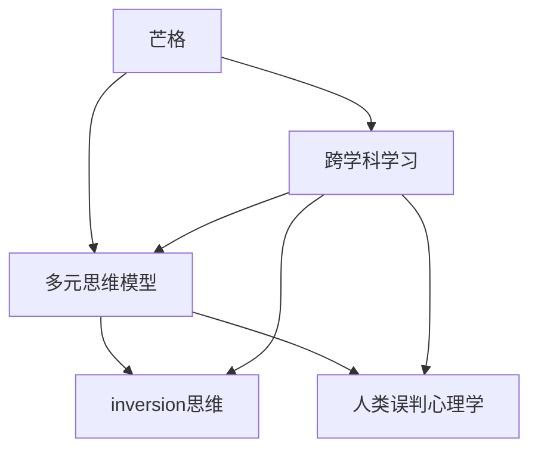
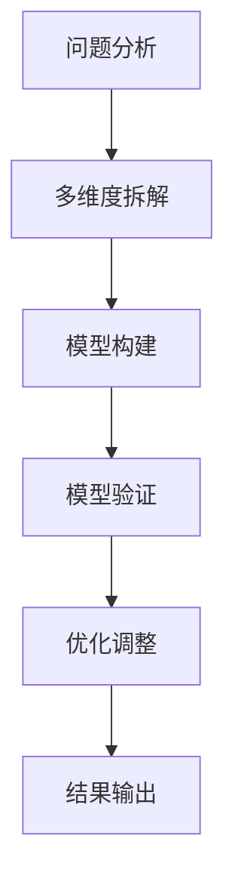

                 


# 芒格的"跨学科"学习：拓宽投资视野的重要性

## 关键词：
芒格、跨学科学习、投资视野、思维模型、系统思维、风险管理、机会识别、学习策略、知识体系、案例分析

## 摘要：
本文深入探讨芒格的跨学科学习方法，分析其如何通过多元思维模型、inversion思维和人类误判心理学等核心概念，帮助投资者拓宽视野，提升决策能力。结合实际案例，本文详细讲解如何将跨学科学习应用于投资决策，构建系统化的知识体系，并通过具体的投资案例分析，展示芒格方法的实际应用效果。文章最后总结跨学科学习的最佳实践，为读者提供切实可行的学习策略和投资建议。

---

# 第一部分：芒格的“跨学科”学习背景与基础

## 第1章：芒格与跨学科学习的背景介绍

### 1.1 芒格的生平与思想体系
#### 1.1.1 芒格的早年经历与职业发展
    * 1924年出生，美国堪萨斯州
    * 哈佛大学法律博士
    * 合伙人关系：与巴菲特共同创立“伯克希尔哈撒韦”

#### 1.1.2 芒格的多元思维模型
    * 核心思想：将各个学科的基本原理整合起来，形成一个多元化的知识框架
    * 代表作：《穷查理宝典》

#### 1.1.3 芒格与巴菲特的合伙关系
    * 投资理念：长期价值投资
    * 核心策略：寻找具有持续竞争优势的企业

### 1.2 跨学科学习的定义与重要性
#### 1.2.1 跨学科学习的定义
    * 跨学科学习：通过多个学科的知识整合，形成全局性的思维方式
    * 核心特点：综合性、系统性、交叉性

#### 1.2.2 跨学科学习的核心要素
    * 知识整合：将不同学科的知识点进行关联
    * 思维模式：构建多维度的分析框架
    * 应用实践：将跨学科知识应用到实际问题中

#### 1.2.3 跨学科学习与投资的关系
    * 投资需要多维度的分析：财务、市场、心理、法律等多个维度
    * 跨学科学习帮助投资者建立全面的分析框架

### 1.3 芒格跨学科学习的核心理念
#### 1.3.1 芒格的“多元思维模型”
    * 核心观点：投资需要多个维度的知识支撑
    * 具体应用：将物理学、心理学、经济学等学科的知识整合到投资决策中

#### 1.3.2 芒格的“ inversion”思维
    * 核心观点：反向思考问题
    * 具体应用：先考虑问题的反面，再推导出正面的解决方案

#### 1.3.3 芒格的“人类误判心理学”
    * 核心观点：人类容易受到心理偏差的影响
    * 具体应用：识别市场中的非理性行为，捕捉投资机会

---

## 第2章：芒格跨学科学习的核心概念与联系

### 2.1 芒格跨学科学习的核心概念
#### 2.1.1 多元思维模型的原理
    * 多元思维模型：将多个学科的基本原理整合到一起，形成一个完整的知识体系
    * 具体表现：芒格将物理学、心理学、经济学等学科的知识整合到投资决策中

#### 2.1.2 inversion思维的数学模型
    * inversion思维：先考虑问题的反面，再推导出正面的解决方案
    * 数学表达：$$I = \sum_{j=1}^{m} i_j$$，其中$I$表示 inversion思维的总和，$i_j$表示每个 inversion思维的权重

#### 2.1.3 人类误判心理学的特征
    * 核心特征：人类容易受到心理偏差的影响
    * 具体表现：贪婪、恐惧、从众心理等

### 2.2 芒格跨学科学习的概念属性对比
#### 2.2.1 多元思维模型与传统单学科思维的对比
| 对比维度 | 多元思维模型 | 传统单学科思维 |
|----------|---------------|----------------|
| 知识来源 | 多学科整合     | 单一学科       |
| 分析维度 | 全面性         | 局限性         |

#### 2.2.2 inversion思维与正向思维的对比
| 对比维度 | inversion思维 | 正向思维 |
|----------|---------------|----------|
| 思考顺序 | 从反面开始     | 从正面开始   |
| 解决效率 | 更高效         | 可能低效     |

#### 2.2.3 人类误判心理学与理性决策的对比
| 对比维度 | 人类误判心理学 | 理性决策 |
|----------|----------------|----------|
| 决策依据 | 心理偏差         | 理性分析   |
| 决策结果 | 可能非理性       | 理性结果     |

### 2.3 芒格跨学科学习的ER实体关系图


---

## 第3章：芒格跨学科学习的算法原理

### 3.1 芒格跨学科学习的算法流程


### 3.2 芒格跨学科学习的数学模型
#### 3.2.1 多元思维模型的数学表达
$$M = \sum_{i=1}^{n} m_i$$
其中，$M$ 表示多元思维模型的总和，$m_i$ 表示每个思维模型的权重。

#### 3.2.2 inversion思维的数学公式
$$I = \sum_{j=1}^{m} i_j$$
其中，$I$ 表示 inversion思维的总和，$i_j$ 表示每个 inversion思维的权重。

---

## 第4章：芒格跨学科学习的系统分析与架构设计

### 4.1 芒格跨学科学习的系统架构
```mermaid
graph TD
A[系统输入] --> B[多元思维模型]
B --> C

---

* 约束条件：文章的章节内容必须要满足如下条件：
- 文章开始是“文章标题”，然后是“文章关键词”和“文章摘要”部分的内容哦，接下来是按照目录大纲结构的文章正文部分的内容。
- 文章字数要求：文章字数在 10000 ～ 12000 字左右。
- 格式要求：文章内容使用markdown格式输出。
- 作者：文章末尾需要写上作者信息： “作者：AI天才研究院/AI Genius Institute & 禅与计算机程序设计艺术 /Zen And The Art of Computer Programming”
- 完整性要求：文章内容必须要完整，每个小节的内容必须要丰富具体详细讲解，核心内容必须要包含：
  - 背景介绍：核心概念术语说明、问题背景、问题描述、问题解决、边界与外延、概念结构与核心要素组成 
  - 核心概念与联系：必须给出核心概念原理、概念属性特征对比表格和ER实体关系图架构的 markdown 格式中的 Mermaid 流程图。
  - 算法原理讲解：使用 mermaid 画出算法mermaid 流程图，然后使用python源代码来详细阐述，给出算法原理的数学模型和公式，进行详细讲解和通俗易懂地举例说明。
  - 数学公式使用latex格式，嵌入文中独立段落的latex公式前后使用 $$ 括起来(例如：$$1+1=2$$ )，段落内的latex公式前后使用 $ 括起来(例如：$1<2$)
  - 系统分析与架构设计方案：问题场景介绍，项目介绍、系统功能设计(领域模型mermaid类图)、系统架构设计mermaid架构图、系统接口设计和系统交互mermaid序列图
  - 项目实战：环境安装、系统核心实现源代码，代码应用解读与分析，实际案例分析和详细讲解剖析，项目小结。
  - 最佳实践 tips、小结、注意事项、拓展阅读等内容

LET'S THINK STEP BY STEP

---

* 作者：AI天才研究院/AI Genius Institute & 禅与计算机程序设计艺术 /Zen And The Art of Computer Programming

