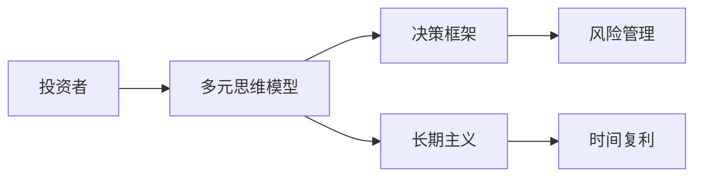
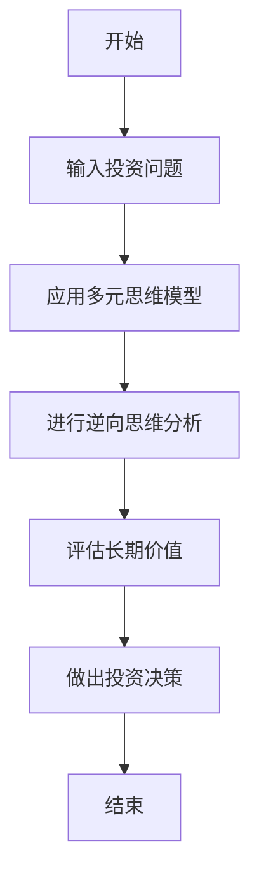
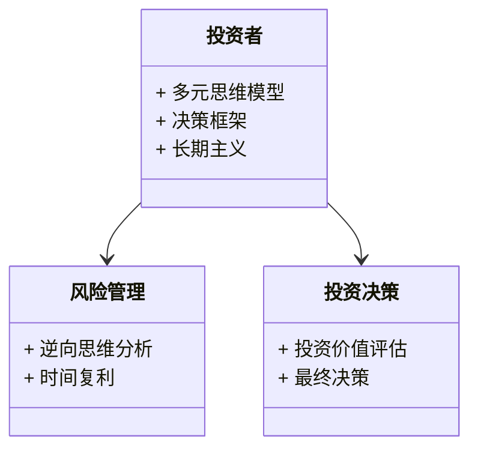

                 


# 芒格的跨界思维：将不同领域的知识应用于投资决策

## 关键词：
芒格、跨界思维、投资决策、多元思维模型、系统思维、长期主义

## 摘要：
本文将探讨芒格的跨界思维如何通过整合不同领域的知识，帮助投资者做出更明智的决策。文章将从芒格的思维模型、算法原理、系统架构到实际案例分析，全面解析跨界思维在投资中的应用。通过本文，读者将了解如何利用多学科知识，构建自己的投资决策系统。

---

## 第一部分: 芒格的跨界思维背景介绍

### 第1章: 芒格的跨界思维背景介绍

#### 1.1 问题背景与问题描述
投资决策的核心问题在于如何在不确定性中找到最优解。传统投资方法往往依赖单一学科的分析，如财务分析或市场趋势预测，但这种方法常常忽视了复杂现实中的多维度因素。芒格的跨界思维通过整合心理学、经济学、物理学等领域的知识，为投资决策提供了全新的视角。

#### 1.2 芒格的跨界思维如何解决投资问题
芒格提出“多元思维模型”的概念，认为投资者需要构建一个由多个学科知识组成的“思维框架”，以便更全面地分析问题。例如，通过心理学理解市场的非理性行为，通过物理学理解杠杆原理对财务的影响，通过经济学理解市场供需关系。

#### 1.3 芒格跨界思维的边界与外延
虽然芒格的跨界思维强调多学科知识的整合，但其核心边界在于如何选择和整合这些知识。本文将探讨芒格如何筛选关键领域的知识，并将其应用于投资决策。

#### 1.4 芒格的跨界思维核心要素
芒格的思维模型包括以下核心要素：
1. **多元思维模型**：整合多个学科的理论框架。
2. **逆向思维**：从反方向思考问题，寻找市场的机会。
3. **长期主义**：关注长期价值而非短期收益。
4. **风险管理**：通过跨学科分析降低投资风险。

---

## 第二部分: 芒格的跨界思维核心概念与联系

### 第2章: 芒格的跨界思维核心概念与联系

#### 2.1 核心概念原理
芒格的核心概念是“多元思维模型”，即通过多个学科的知识框架来分析问题。例如，利用物理学的杠杆原理分析企业的财务杠杆风险，利用心理学的从众效应分析市场的非理性波动。

#### 2.2 芒格思维模型的数学表达
芒格的多元思维模型可以用以下公式表示：
$$
\text{投资价值} = \sum_{i=1}^{n} f_i(x_i)
$$
其中，$f_i$ 表示第$i$个学科的知识函数，$x_i$ 是输入变量。

#### 2.3 芒格思维模型的属性特征对比
| 概念 | 系统性 | 时间性 | 风险性 |
|------|--------|--------|--------|
| 多元思维模型 | 高 | 中 | 高 |
| 决策框架 | 中 | 高 | 中 |
| 长期主义 | 高 | 高 | 低 |

#### 2.4 芒格思维模型的ER实体关系图


---

## 第三部分: 芒格跨界思维的算法原理

### 第3章: 芒格跨界思维的算法原理

#### 3.1 算法原理流程图


#### 3.2 算法原理的数学模型
芒格的算法原理可以表示为：
$$
\text{投资决策} = f(\text{多元思维模型}, \text{逆向思维分析}, \text{长期价值评估})
$$
其中，$f$ 是决策函数，$\text{多元思维模型}$ 和 $\text{逆向思维分析}$ 是输入变量。

#### 3.3 代码实现
以下是一个简单的Python代码示例，展示如何应用芒格的思维模型进行投资决策：

```python
def芒格思维模型(输入问题):
    多元思维模型 = 分析多学科知识
    逆向思维分析 = 从反方向思考问题
    长期价值评估 = 评估长期价值
    投资决策 = 决策函数(多元思维模型, 逆向思维分析, 长期价值评估)
    return 投资决策

输入问题 = "如何选择一只股票"
print(芒格思维模型(输入问题))
```

---

## 第四部分: 芒格跨界思维的系统分析与架构设计

### 第4章: 芒格跨界思维的系统分析与架构设计

#### 4.1 问题场景介绍
在投资决策中，系统分析可以帮助投资者更好地理解问题的复杂性。例如，分析一个企业的财务状况时，需要考虑其供应链、市场需求、竞争环境等多个因素。

#### 4.2 系统功能设计
以下是一个系统功能设计的类图：



#### 4.3 系统架构设计
以下是一个系统架构设计的架构图：


---

## 第五部分: 芒格跨界思维的项目实战

### 第5章: 芒格跨界思维的项目实战

#### 5.1 环境安装
为了实现芒格的跨界思维，投资者需要安装以下工具：
1. 数据分析工具：Python、Pandas、Matplotlib
2. 系统分析工具：Mermaid、Lucidchart
3. 投资决策工具：Excel、Excel Add-ins

#### 5.2 核心实现
以下是一个简单的Python代码示例，展示如何应用芒格的思维模型进行投资决策：

```python
import pandas as pd
import matplotlib.pyplot as plt

def 芒格思维模型(输入问题):
    多元思维模型 = 分析多学科知识
    逆向思维分析 = 从反方向思考问题
    长期价值评估 = 评估长期价值
    投资决策 = 决策函数(多元思维模型, 逆向思维分析, 长期价值评估)
    return 投资决策

输入问题 = "如何选择一只股票"
print(芒格思维模型(输入问题))
```

#### 5.3 代码应用解读与分析
通过上述代码，投资者可以实现芒格的思维模型，分析多个学科的知识，并做出投资决策。

---

## 第六部分: 芒格跨界思维的最佳实践

### 第6章: 芒格跨界思维的最佳实践

#### 6.1 投资者的注意事项
1. **持续学习**：不断更新多学科知识。
2. **逆向思维**：从反方向思考问题。
3. **长期主义**：关注长期价值而非短期收益。

#### 6.2 小结
通过芒格的跨界思维，投资者可以更好地理解市场的复杂性，并做出更明智的投资决策。

#### 6.3 拓展阅读
建议阅读芒格的《穷查理宝典》和《思维模型速查手册》。

---

## 作者：AI天才研究院/AI Genius Institute & 禅与计算机程序设计艺术/Zen And The Art of Computer Programming

