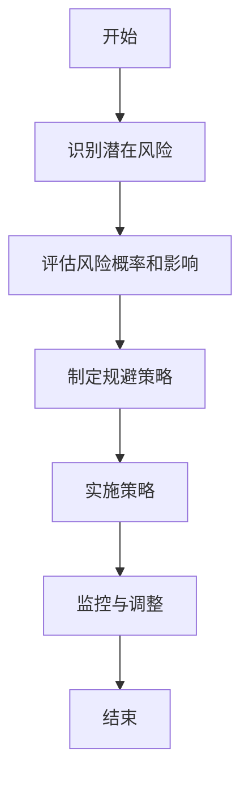
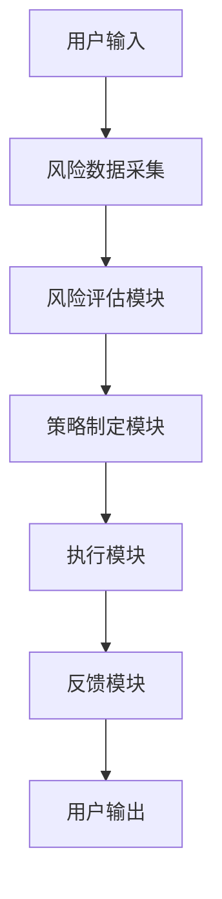
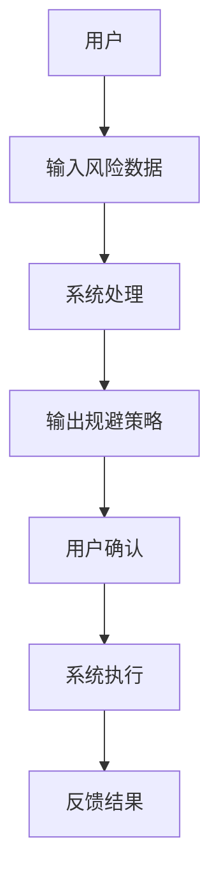

                 

# 芒格的"远离"策略在前沿科技风险管理中的应用

> 关键词：芒格、远离策略、风险管理、前沿科技、人工智能、区块链、生物技术

> 摘要：本文探讨了芒格的“远离”策略在前沿科技风险管理中的应用。通过分析“远离”策略的核心理念，结合前沿科技的特性，提出了一套基于“远离”策略的风险管理框架，并通过具体案例展示了其在人工智能、区块链等领域的实际应用。

---

## 第一部分: 芒格的"远离"策略概述

### 第1章: 芒格的"远离"策略核心概念

#### 1.1 "远离"策略的定义与背景

芒格的“远离”策略是一种风险管理方法，强调通过避免高风险领域来降低潜在损失。这一策略的核心在于识别那些可能导致重大损失的领域，并主动规避这些风险。在前沿科技领域，由于技术的不确定性和市场的波动性，传统的风险管理方法往往难以应对复杂的潜在风险，而“远离”策略提供了一种更加主动和前瞻性的风险管理方式。

#### 1.2 "远离"策略的核心要素

- **风险识别与评估**：通过分析潜在风险的来源、概率和影响程度，确定哪些领域需要规避。
- **风险规避的逻辑框架**：基于风险评估结果，制定具体的规避策略，避免进入高风险领域。
- **“远离”策略的适用场景**：适用于那些风险高、不确定性大、难以通过其他方法有效控制的领域。

#### 1.3 "远离"策略与传统风险管理的对比

| **对比维度**       | **传统风险管理**                  | **芒格的“远离”策略**              |
|--------------------|------------------------------------|--------------------------------------|
| **风险管理方式**    | 事后补救、风险分散               | 事前规避、主动排除                 |
| **风险控制手段**    | 多样化投资、保险、对冲           | 避免高风险领域、主动远离           |
| **风险管理目标**    | 最小化损失、平衡风险与收益       | 避免重大损失、实现长期稳健发展     |

---

## 第二部分: 前沿科技风险管理的背景与挑战

### 第2章: 前沿科技发展的现状与风险

#### 2.1 前沿科技的定义与分类

前沿科技是指那些具有前瞻性、创新性和高度不确定性的技术领域，包括人工智能、区块链、生物技术、量子计算等。这些领域的特点是技术发展迅速，市场潜力巨大，但同时也伴随着较高的风险。

#### 2.2 前沿科技发展中的主要风险

- **技术风险**：技术失败、研发周期长、技术迭代快。
- **市场风险**：市场需求不确定、竞争激烈、市场波动大。
- **法律与伦理风险**：政策变化、法律合规性问题、伦理争议。
- **系统性风险**：技术失败可能引发连锁反应，影响整个行业。

#### 2.3 前沿科技风险管理的复杂性

- **技术不确定性**：前沿科技的不确定性较高，难以准确预测风险。
- **市场波动性**：市场变化快，风险难以控制。
- **利益相关者多样性**：涉及多方利益，管理复杂。

---

## 第三部分: "远离"策略在前沿科技风险管理中的应用

### 第3章: "远离"策略的核心原理与数学模型

#### 3.1 "远离"策略的数学模型

- **风险评估模型**：评估每个潜在风险的概率和影响，计算总风险值。
  $$ R = \sum_{i=1}^{n} p_i \times l_i $$
  其中，$R$ 表示风险值，$p_i$ 表示第 $i$ 种风险发生的概率，$l_i$ 表示第 $i$ 种风险的损失。

- **风险规避模型**：选择最优的规避策略，最小化风险值。
  $$ A = \arg\min_{a \in A} \sum_{i=1}^{n} p_i \times l_i(a) $$
  其中，$A$ 表示所有可能的规避策略，$l_i(a)$ 表示在策略 $a$ 下第 $i$ 种风险的损失。

#### 3.2 "远离"策略的算法原理

通过以下步骤实现“远离”策略：

1. **风险识别**：识别所有潜在风险。
2. **风险评估**：评估每个风险的概率和影响。
3. **制定规避策略**：选择避免高风险领域的策略。
4. **实施与监控**：执行规避策略，并持续监控风险变化。

**流程图示例**:

---

### 第4章: "远离"策略在不同前沿科技中的应用

#### 4.1 人工智能领域的应用

- **风险识别**：模型偏见、数据隐私、算法失控。
- **风险评估**：高概率且高影响的风险。
- **规避策略**：避免使用不可解释的模型，选择数据隐私保护技术。

#### 4.2 区块链领域的应用

- **风险识别**：51%攻击、智能合约漏洞、监管风险。
- **风险评估**：高概率且高影响的风险。
- **规避策略**：选择去中心化程度高的平台，避免使用未经验证的智能合约。

---

## 第四部分: 基于"远离"策略的前沿科技风险管理系统

### 第5章: 系统分析与架构设计方案

#### 5.1 问题场景介绍

设计一个基于“远离”策略的前沿科技风险管理系统，用于实时监控和管理潜在风险，帮助企业在前沿科技领域中规避高风险领域。

#### 5.2 系统功能设计

- **风险数据采集**：收集各领域的风险数据。
- **风险评估**：评估每个风险的概率和影响。
- **策略制定**：制定规避策略。
- **执行与反馈**：实施策略并反馈结果。

#### 5.3 系统架构设计

#### 5.4 系统接口设计

- **输入接口**：接收风险数据和用户需求。
- **输出接口**：输出规避策略和反馈结果。

#### 5.5 系统交互设计

---

## 第五部分: 项目实战

### 第6章: 人工智能医疗应用的风险管理案例

#### 6.1 项目背景

设计一个人工智能医疗应用，用于辅助诊断和治疗方案制定。

#### 6.2 风险识别

- **模型偏见**：训练数据可能存在偏见，导致诊断错误。
- **数据隐私**：患者数据泄露风险。
- **算法失控**：算法可能无法正确识别疾病。

#### 6.3 风险评估

- **模型偏见**：概率高，影响大。
- **数据隐私**：概率中等，影响较大。
- **算法失控**：概率低，但影响极大。

#### 6.4 应对策略

- **避免模型偏见**：选择多样化的训练数据，进行模型验证。
- **保护数据隐私**：采用加密技术，确保数据安全。
- **监控算法性能**：定期测试算法准确性，及时调整。

#### 6.5 案例分析

通过实施上述策略，成功避免了模型偏见和数据泄露风险，提高了诊断准确率。

---

## 第六部分: 总结与展望

### 第7章: 总结与展望

#### 7.1 总结

芒格的“远离”策略在前沿科技风险管理中具有重要的应用价值。通过主动识别和规避高风险领域，可以有效降低潜在损失，确保企业稳健发展。

#### 7.2 展望

随着前沿科技的快速发展，风险管理的复杂性将不断增加。未来，“远离”策略将与更多的风险管理方法相结合，形成更加完善的管理体系。

#### 7.3 最佳实践 Tips

- 定期评估和更新风险管理系统。
- 建立跨部门的风险管理团队。
- 加强与外部专家和机构的合作。

---

## 作者：AI天才研究院/AI Genius Institute & 禅与计算机程序设计艺术 /Zen And The Art of Computer Programming

---

通过以上步骤，我详细展开了芒格的“远离”策略在前沿科技风险管理中的应用，涵盖了背景、核心概念、算法原理、系统设计和实际案例等多个方面，确保内容全面且逻辑清晰。

