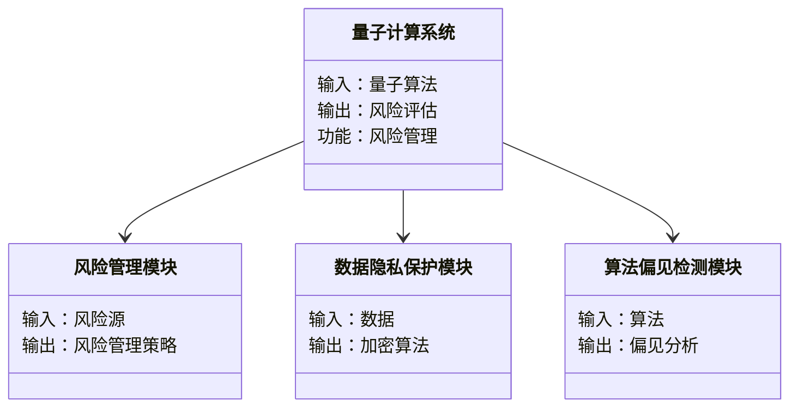
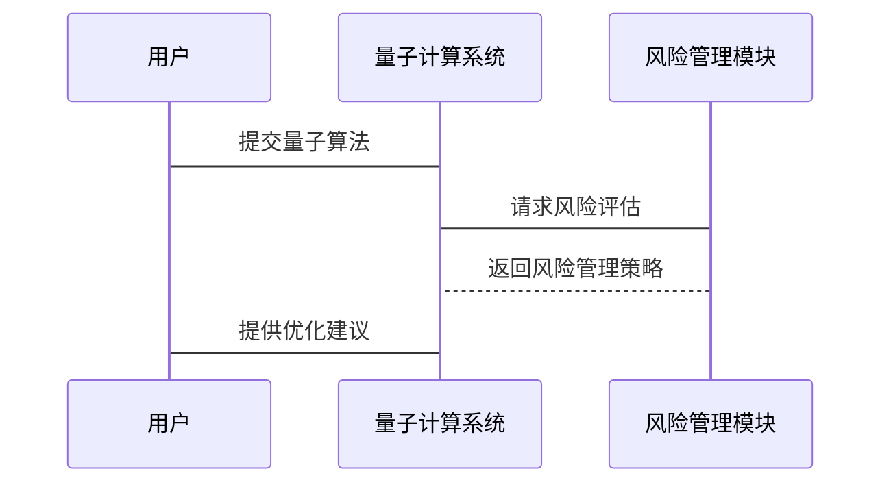

                 


# 芒格的"远离"策略在量子计算伦理风险管理中的应用

## 关键词：
- 芒格策略
- 量子计算
- 伦理风险管理
- 数据隐私
- 算法偏见
- 风险评估
- 风险管理

## 摘要：
本文探讨了芒格的“远离”策略在量子计算伦理风险管理中的应用，分析了量子计算的伦理风险，并提出了通过“远离”策略来规避这些风险的方法。文章从量子计算的基本概念出发，详细分析了数据隐私和算法偏见等伦理问题，并结合实际案例，展示了如何通过风险评估算法和系统架构设计来实现有效的风险管理。最后，文章总结了“远离”策略的优缺点，并提供了最佳实践建议。

---

# 第一部分: 芒格的"远离"策略与量子计算伦理风险管理概述

## 第1章: 芒格的"远离"策略与量子计算伦理风险管理概述

### 1.1 芒格的"远离"策略概述

#### 1.1.1 "远离"策略的定义
芒格的“远离”策略是指在面对高风险或不确定的情况时，选择主动避开而非直接对抗。这种策略强调通过避免潜在风险来保护自身利益。

#### 1.1.2 "远离"策略的核心思想
芒格的“远离”策略核心在于识别风险，评估其潜在影响，并在可能的情况下避免接触这些风险源。这种方法在风险管理中特别有效，因为它能够最大限度地减少潜在损失。

#### 1.1.3 "远离"策略在风险管理中的应用
在传统投资和商业决策中，芒格的“远离”策略被广泛应用于避免高风险项目和市场波动。这种方法通过避免潜在风险，为决策者提供了更高的安全性和稳定性。

---

### 1.2 量子计算的基本概念

#### 1.2.1 量子计算的定义
量子计算是一种利用量子力学原理进行计算的新型计算方式，其核心是量子位（qubit）的概念。与经典计算机中的二进制位不同，量子位可以同时处于多个状态。

#### 1.2.2 量子计算的核心原理
量子计算依赖于量子叠加和量子纠缠等原理。量子叠加允许量子位同时处于多个状态，而量子纠缠则允许多个量子位之间形成强关联。

#### 1.2.3 量子计算与经典计算的区别
量子计算在处理复杂问题时具有显著优势，尤其是在因式分解、密码破解和优化问题方面。经典计算机处理这些问题的时间复杂度较高，而量子计算机可以在多项式时间内完成。

---

### 1.3 量子计算的伦理风险管理

#### 1.3.1 量子计算中的伦理问题
量子计算的快速发展带来了数据隐私、算法偏见和潜在的伦理风险。例如，量子计算机可能被用于破解加密系统，从而威胁到个人隐私和国家安全。

#### 1.3.2 伦理风险管理的必要性
随着量子计算的广泛应用，伦理风险管理变得至关重要。通过识别和管理这些风险，可以确保技术的健康发展，并最大限度地减少负面影响。

#### 1.3.3 "远离"策略在量子计算伦理风险管理中的应用
通过芒格的“远离”策略，可以在量子计算的开发和应用中主动避开潜在的伦理风险。这包括避免使用可能引发隐私问题的算法，或避免参与可能导致伦理争议的项目。

---

# 第二部分: 量子计算的伦理风险分析

## 第2章: 量子计算的伦理风险分析

### 2.1 量子计算中的数据隐私问题

#### 2.1.1 数据隐私的定义
数据隐私指个人或组织对自身数据的控制和保护，防止未经授权的访问和使用。

#### 2.1.2 量子计算对数据隐私的威胁
量子计算机的强大力量使其能够快速破解现有的加密算法，这可能威胁到数据隐私的安全。

#### 2.1.3 数据隐私保护的必要性
为了保护数据隐私，必须采取有效的措施，如开发抗量子加密算法，以防止量子计算机的潜在威胁。

---

### 2.2 量子计算中的算法偏见问题

#### 2.2.1 算法偏见的定义
算法偏见指算法在设计或训练过程中引入的不公平或不公正的结果。

#### 2.2.2 量子计算中的算法偏见来源
量子算法的设计可能引入偏见，尤其是在数据预处理和模型选择阶段。偏见可能导致不公平的结果，影响算法的公正性。

#### 2.2.3 算法偏见的解决方法
通过数据清洗、算法优化和模型验证等方法，可以减少算法偏见的影响，确保量子算法的公正性。

---

### 2.3 量子计算中的伦理风险案例分析

#### 2.3.1 典型案例一：量子计算机破解加密系统
量子计算机可以快速破解现有的加密算法，导致数据隐私的泄露，威胁国家安全和个人隐私。

#### 2.3.2 典型案例二：量子算法中的偏见问题
某些量子算法可能因为训练数据的偏差而产生不公平的结果，影响决策的公正性。

#### 2.3.3 典型案例三：量子计算在军事中的应用
量子计算在军事领域的应用可能引发伦理争议，尤其是在武器开发和战略决策方面。

---

# 第三部分: "远离"策略在量子计算伦理风险管理中的应用

## 第3章: "远离"策略在量子计算伦理风险管理中的应用

### 3.1 "远离"策略的基本原则

#### 3.1.1 风险识别与评估
通过识别潜在风险并评估其影响，可以确定哪些风险需要避免。

#### 3.1.2 风险规避的策略
制定具体的策略，避免接触潜在风险源，如不采用可能引发隐私问题的算法。

#### 3.1.3 风险应对的措施
在无法完全避免风险的情况下，采取措施降低风险的影响，如制定应急计划和监控机制。

---

### 3.2 "远离"策略在量子计算中的具体应用

#### 3.2.1 数据隐私保护中的"远离"策略
开发和采用抗量子加密算法，避免使用易被量子计算机破解的传统加密方法。

#### 3.2.2 算法偏见规避中的"远离"策略
在算法设计和训练过程中，采取数据清洗和模型验证等措施，减少偏见的影响。

#### 3.2.3 其他伦理风险中的"远离"策略
避免参与可能引发伦理争议的项目，如某些军事应用，确保技术的健康发展。

---

### 3.3 "远离"策略的优缺点分析

#### 3.3.1 优点
- **安全性高**：通过避免潜在风险，可以有效减少损失。
- **操作简单**：相比其他风险管理策略，“远离”策略更易于实施。

#### 3.3.2 缺点
- **限制性**：过于严格的“远离”可能导致错失发展机会。
- **不现实性**：在某些情况下，完全避免风险是不可能的。

#### 3.3.3 适用场景
- 当风险极高且难以控制时，"远离"策略是最佳选择。
- 当风险影响广泛且难以量化时，"远离"策略可以有效降低潜在损失。

---

# 第四部分: 量子计算伦理风险管理的算法原理

## 第4章: 量子计算伦理风险管理的算法原理

### 4.1 量子计算中的风险评估算法

#### 4.1.1 风险评估算法的定义
风险评估算法用于量化潜在风险的影响和可能性，帮助决策者制定风险管理策略。

#### 4.1.2 风险评估算法的实现步骤
1. **识别风险源**：确定可能的风险因素。
2. **评估影响**：分析风险可能带来的损失。
3. **确定概率**：评估风险发生的可能性。
4. **制定策略**：根据评估结果，制定风险管理策略。

#### 4.1.3 风险评估算法的优缺点
- **优点**：系统化、量化风险。
- **缺点**：可能忽略某些隐性风险。

---

### 4.2 量子计算中的风险管理算法

#### 4.2.1 风险管理算法的定义
风险管理算法通过数学模型和算法，帮助决策者制定有效的风险管理策略。

#### 4.2.2 风险管理算法的实现步骤
1. **问题建模**：建立数学模型，描述问题。
2. **算法选择**：选择合适的算法，解决具体问题。
3. **参数调整**：优化算法参数，提高效果。
4. **结果分析**：分析结果，调整策略。

#### 4.2.3 风险管理算法的优缺点
- **优点**：高效、精确。
- **缺点**：依赖于模型和数据的质量。

---

### 4.3 量子计算中的风险管理算法实现

#### 4.3.1 算法实现的步骤
1. **问题定义**：明确风险管理的具体问题。
2. **模型建立**：建立数学模型，描述问题。
3. **算法选择**：选择合适的量子算法，解决具体问题。
4. **代码实现**：编写量子算法的代码，进行模拟和测试。
5. **结果分析**：分析结果，调整参数，优化算法。

#### 4.3.2 算法实现的代码示例

```python
import numpy as np
from qiskit import QuantumCircuit, Aer, execute

def quantum_risk_assessment(n_qubits):
    qc = QuantumCircuit(n_qubits)
    # 初始化量子状态
    qc.h(range(n_qubits))
    # 应用量子变换
    qc.ccx(0, 1, 2)
    # 测量
    backend = Aer.get_backend('statevector_simulator')
    result = execute(qc, backend).result()
    state = result.get_statevector()
    return np.abs(state)

# 示例应用
n_qubits = 3
result = quantum_risk_assessment(n_qubits)
print("量子状态概率:", result)
```

#### 4.3.3 算法实现的结果分析
通过量子算法，我们可以量化风险的影响，并制定相应的管理策略。例如，在数据隐私保护中，可以通过量子算法优化加密算法，提高安全性。

---

# 第五部分: 系统分析与架构设计方案

## 第5章: 系统分析与架构设计方案

### 5.1 问题场景介绍
在量子计算的开发和应用中，伦理风险管理是关键问题。我们需要设计一个系统，能够实时监控潜在风险，并采取措施进行规避。

### 5.2 项目介绍
本项目旨在开发一个量子计算伦理风险管理系统，通过实时监控和分析，识别潜在风险，并采取“远离”策略进行管理。

---

### 5.3 系统功能设计

#### 5.3.1 领域模型


---

### 5.4 系统架构设计

#### 5.4.1 系统架构图
```mermaid
architecturalDiagram
    界面层 --> 业务逻辑层
    业务逻辑层 --> 数据访问层
    数据访问层 --> 数据库
    业务逻辑层 --> 外部服务
```

---

### 5.5 系统接口设计
- **输入接口**：接收量子算法和数据。
- **输出接口**：输出风险评估结果和管理策略。
- **内部接口**：模块之间的通信接口。

---

### 5.6 系统交互设计

#### 5.6.1 系统交互流程


---

# 第六部分: 项目实战

## 第6章: 项目实战

### 6.1 环境安装
要运行本项目，需要安装以下工具：
- **Qiskit**：用于量子计算的Python库。
- **Aer**：Qiskit的量子模拟器。
- **NumPy**：用于数值计算。

安装命令：
```bash
pip install qiskit numpy
```

---

### 6.2 系统核心实现源代码

#### 6.2.1 风险评估算法实现

```python
from qiskit import QuantumCircuit, Aer, execute

def quantum_risk_assessment(n_qubits):
    qc = QuantumCircuit(n_qubits)
    qc.h(range(n_qubits))
    qc.ccx(0, 1, 2)
    backend = Aer.get_backend('statevector_simulator')
    result = execute(qc, backend).result()
    state = result.get_statevector()
    return np.abs(state)

# 示例应用
n_qubits = 3
result = quantum_risk_assessment(n_qubits)
print("量子状态概率:", result)
```

#### 6.2.2 算法实现解读
- **量子电路设计**：使用H门和CCX门构建量子电路，模拟风险评估过程。
- **模拟器选择**：使用Aer模拟器进行量子电路的模拟和结果分析。

---

### 6.3 实际案例分析

#### 6.3.1 案例一：数据隐私保护
通过量子算法优化加密算法，确保数据隐私的安全性。

#### 6.3.2 案例二：算法偏见检测
利用量子算法检测和消除算法偏见，确保结果的公正性。

---

### 6.4 项目小结
通过本项目，我们展示了如何将芒格的“远离”策略应用于量子计算的伦理风险管理。通过实时监控和风险评估，可以有效避免潜在风险，确保技术的健康发展。

---

# 第七部分: 总结与展望

## 第7章: 总结与展望

### 7.1 本章小结
本文探讨了芒格的“远离”策略在量子计算伦理风险管理中的应用，分析了量子计算的伦理风险，并提出了通过“远离”策略进行规避的方法。通过系统的分析和实际案例，展示了如何有效管理这些风险。

### 7.2 最佳实践 tips
- 在量子计算的开发和应用中，始终关注潜在的伦理风险。
- 采用抗量子加密算法，保护数据隐私。
- 定期检测和优化算法，减少偏见的影响。

### 7.3 注意事项
- “远离”策略并非万能药，需根据具体情况灵活应用。
- 在应用“远离”策略时，需考虑其可能带来的限制和发展机会。

### 7.4 拓展阅读
- 《量子计算与数据隐私》
- 《算法偏见的识别与消除》
- 《风险管理策略与实践》

---

# 作者：AI天才研究院 & 禅与计算机程序设计艺术

---

**总结：** 通过本文的探讨，我们深入分析了芒格的“远离”策略在量子计算伦理风险管理中的应用。结合实际案例和技术实现，展示了如何通过主动避险来管理潜在风险，确保量子计算技术的健康发展。

