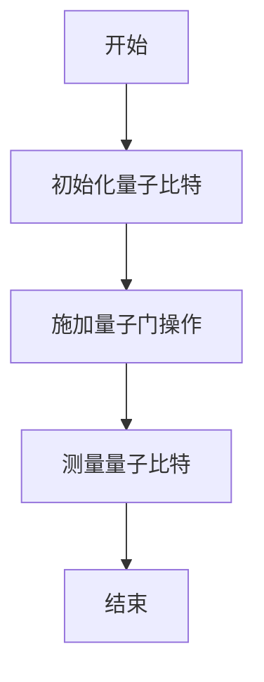
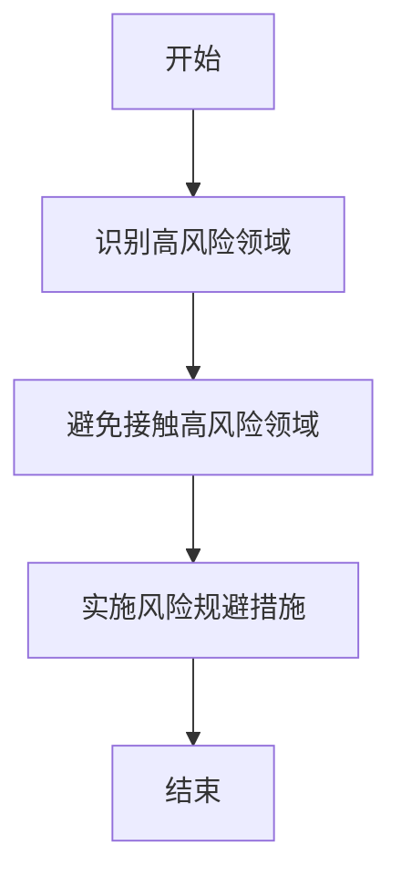
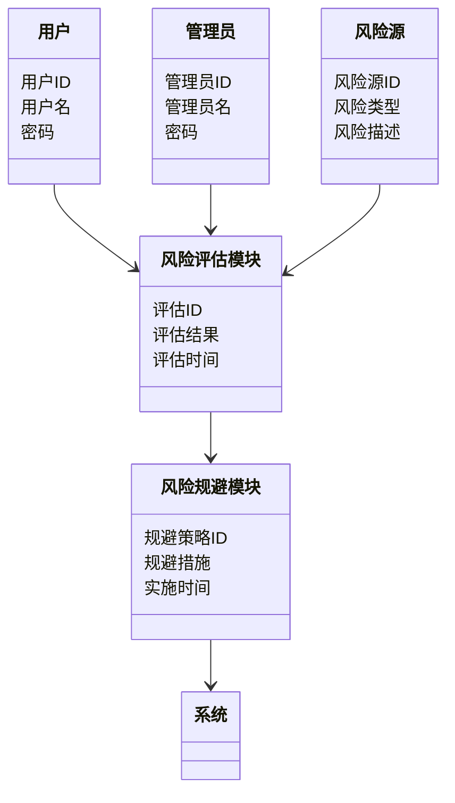
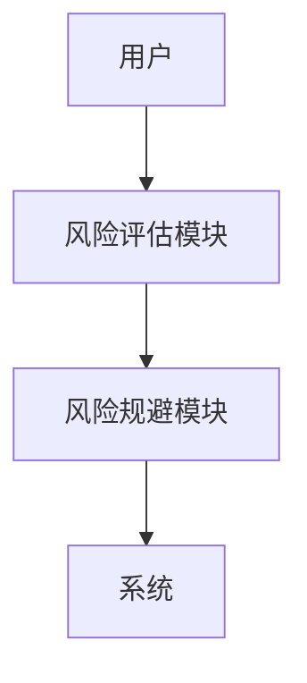
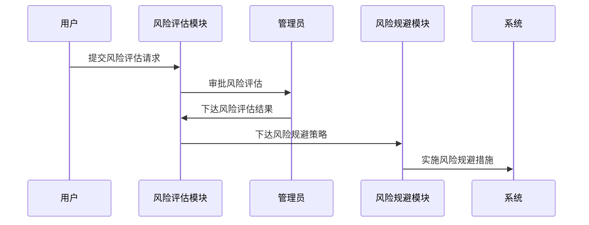

                 


# 芒格的"远离"策略在量子计算风险管理中的应用

---

## 关键词
量子计算，风险管理，芒格策略，远离策略，量子计算风险管理

---

## 摘要
芒格的“远离”策略是一种简洁而深刻的风险管理方法，其核心在于避免接触高风险领域，从而保护整体系统免受潜在威胁的影响。在量子计算迅速发展的今天，风险管理变得尤为重要。本文将探讨芒格的“远离”策略如何在量子计算风险管理中应用，通过分析量子计算的基本原理、风险管理的核心概念、算法原理与数学模型，以及系统架构设计，深入挖掘芒格策略在量子计算风险管理中的独特价值和实际应用。

---

## 第1章: 芒格的"远离"策略与量子计算风险管理概述

### 1.1 芒格的"远离"策略简介
芒格的“远离”策略是一种以简洁和高效为核心的风险管理方法。其核心思想是通过避免接触高风险领域，降低潜在的负面事件对整体系统的影响。这一策略在投资领域中被广泛应用，其核心在于通过远离高风险投资，保护资本免受重大损失。

#### 1.1.1 芒格"远离"策略的核心思想
芒格的“远离”策略强调的是“防御性思维”，即通过识别和避免潜在风险，构建一个稳健的系统。这一策略的核心思想可以总结为：
1. **避免高风险领域**：远离那些可能导致重大损失的领域或行为。
2. **简化决策过程**：通过减少决策的复杂性，降低犯错的概率。
3. **保护核心利益**：优先保护系统的核心利益，而非追求短期收益。

#### 1.1.2 "远离"策略在风险管理中的应用
芒格的“远离”策略在风险管理中的应用主要体现在以下几个方面：
1. **风险识别**：通过分析潜在风险，识别可能对系统造成重大影响的因素。
2. **风险规避**：通过避免接触高风险领域，降低潜在损失。
3. **系统保护**：构建一个稳健的系统，通过隔离风险，保护系统的核心部分。

#### 1.1.3 量子计算风险管理的背景与挑战
量子计算作为一种新兴的计算技术，其强大的计算能力为多个领域带来了革命性的变化。然而，量子计算的发展也伴随着一系列风险，包括技术风险、安全风险和伦理风险等。风险管理的挑战在于如何在快速发展的技术环境中，找到一种既能利用量子计算的优势，又能有效规避其潜在风险的方法。

---

### 1.2 量子计算的基本原理
量子计算是基于量子力学原理的一种新型计算方式。与经典计算不同，量子计算利用量子叠加和量子纠缠的特性，能够在某些情况下显著提高计算效率。

#### 1.2.1 量子计算的定义与特点
量子计算是指利用量子比特（qubit）进行计算的新型计算方式。与经典比特不同，量子比特可以同时处于多个状态的叠加态。量子计算的特点包括：
1. **量子叠加**：量子比特可以同时处于0和1的状态。
2. **量子纠缠**：多个量子比特之间可以形成纠缠态，一个比特的状态会直接影响另一个比特的状态。
3. **并行计算能力**：量子计算机可以在一次运算中处理大量可能性。

#### 1.2.2 量子计算的核心技术与实现
量子计算的核心技术包括量子比特的制备、量子门的操作以及量子算法的设计。量子比特的制备需要极低的环境干扰，通常在超低温和高真空环境中进行。量子门的操作则是通过一系列物理操作实现对量子比特的状态变换。

#### 1.2.3 量子计算在风险管理中的潜在应用
量子计算在风险管理中的潜在应用主要体现在以下几个方面：
1. **风险评估**：通过量子计算的并行处理能力，快速评估多种风险场景。
2. **风险预测**：利用量子算法，预测潜在风险的发生概率。
3. **风险规避**：通过量子计算的优化能力，找到最优的风险规避策略。

---

### 1.3 芒格"远离"策略与量子计算的结合
芒格的“远离”策略与量子计算的结合，主要是通过避免接触高风险的量子计算领域，保护系统免受潜在威胁的影响。

#### 1.3.1 "远离"策略在量子计算风险管理中的定位
芒格的“远离”策略在量子计算风险管理中的定位主要是作为一种防御性策略，通过避免接触高风险的量子计算应用领域，保护系统的稳健性。

#### 1.3.2 量子计算风险管理的核心问题
量子计算风险管理的核心问题是如何在利用量子计算的优势的同时，有效规避其潜在风险。这包括技术风险、安全风险和伦理风险等方面。

#### 1.3.3 "远离"策略在量子计算风险管理中的优势
芒格的“远离”策略在量子计算风险管理中的优势主要体现在以下几个方面：
1. **简化风险管理过程**：通过避免接触高风险领域，减少风险管理的复杂性。
2. **降低潜在损失**：通过远离高风险领域，降低潜在的重大损失。
3. **保护核心利益**：优先保护系统的核心利益，避免因追求短期利益而带来重大风险。

---

## 第2章: 量子计算风险管理的核心概念

### 2.1 量子计算风险管理的基本概念
量子计算风险管理是指在利用量子计算技术的过程中，识别、评估和规避潜在风险的一系列过程。

#### 2.1.1 量子计算风险管理的定义
量子计算风险管理是指在利用量子计算技术的过程中，通过识别、评估和规避潜在风险，确保系统的稳健性和安全性的过程。

#### 2.1.2 量子计算风险管理的范围与边界
量子计算风险管理的范围包括量子计算技术的开发、应用和维护等全过程。其边界主要在于如何平衡风险规避与技术利用的关系。

#### 2.1.3 量子计算风险管理的核心要素
量子计算风险管理的核心要素包括：
1. **风险识别**：识别可能对系统造成影响的潜在风险。
2. **风险评估**：评估潜在风险的发生概率和影响程度。
3. **风险规避**：制定和实施风险规避策略，降低潜在风险的影响。

---

### 2.2 "远离"策略在量子计算风险管理中的核心概念
芒格的“远离”策略在量子计算风险管理中的应用，主要是通过避免接触高风险的量子计算领域，保护系统的稳健性。

#### 2.2.1 "远离"策略的定义与属性
芒格的“远离”策略是一种防御性策略，其核心在于避免接触高风险领域，保护系统的稳健性。

#### 2.2.2 "远离"策略与量子计算风险管理的关联
芒格的“远离”策略与量子计算风险管理的关联主要体现在以下几个方面：
1. **风险识别**：通过识别高风险领域，避免接触潜在风险。
2. **风险规避**：通过避免接触高风险领域，降低潜在损失。
3. **系统保护**：通过隔离高风险领域，保护系统的稳健性。

#### 2.2.3 "远离"策略的数学模型与公式
芒格的“远离”策略可以通过以下数学模型进行描述：
$$
\text{风险损失} = \sum_{i=1}^{n} \text{潜在风险}_i \times \text{接触概率}_i
$$
通过避免接触高风险领域，可以显著降低风险损失。

---

### 2.3 核心概念对比分析
以下是一个对比分析表格，展示了传统风险管理与量子计算风险管理的核心概念对比：

| 对比维度 | 传统风险管理 | 量子计算风险管理 |
|----------|---------------|--------------------|
| 风险识别 | 依赖历史数据 | 基于量子计算技术 |
| 风险评估 | 主要依赖统计方法 | 结合量子算法 |
| 风险规避 | 侧重事后应对 | 强调事前规避 |
| 系统保护 | 局限于局部保护 | 强调整体隔离 |

---

### 2.4 实体关系图（ER图）架构
以下是量子计算风险管理的ER图：

```mermaid
erDiagram
    actor 用户 {
        string 用户ID
        string 用户名
        string 密码
    }
    actor 管理员 {
        string 管理员ID
        string 管理员名
        string 密码
    }
    actor 风险源 {
        string 风险源ID
        string 风险类型
        string 风险描述
    }
    actor 风险评估模块 {
        string 评估ID
        string 评估结果
        string 评估时间
    }
    actor 风险规避模块 {
        string 规避策略ID
        string 规避措施
        string 实施时间
    }
    actor 系统 {
        string 系统ID
        string 系统名称
        string 系统版本
    }
    用户 --> 风险评估模块 : 提交风险评估请求
    管理员 --> 风险评估模块 : 审批风险评估
    风险源 --> 风险评估模块 : 提供风险信息
    风险评估模块 --> 风险规避模块 : 下达规避策略
    风险规避模块 --> 系统 : 实施规避措施
```

---

### 2.5 本章小结
本章主要介绍了芒格的“远离”策略在量子计算风险管理中的应用，通过分析量子计算的基本原理和风险管理的核心概念，阐述了“远离”策略在量子计算风险管理中的独特价值和实际应用。

---

## 第3章: 量子计算风险管理的算法原理与数学模型

### 3.1 量子计算风险管理的算法原理
量子计算风险管理的算法原理主要包括量子算法的设计与实现，以及基于量子计算的优化方法。

#### 3.1.1 量子计算风险管理的基本算法
量子计算风险管理的基本算法包括量子叠加算法和量子纠缠算法。这些算法可以通过mermaid流程图进行展示。



#### 3.1.2 "远离"策略在算法中的应用
芒格的“远离”策略在量子计算风险管理算法中的应用，主要是通过避免接触高风险的量子算法，保护系统的稳健性。

#### 3.1.3 量子计算风险管理算法的流程图
以下是量子计算风险管理算法的流程图：



---

### 3.2 算法的数学模型与公式
量子计算风险管理的数学模型主要基于量子叠加和量子纠缠的原理。

#### 3.2.1 量子计算风险管理的数学模型
量子计算风险管理的数学模型可以表示为：
$$
\text{风险评估} = \sum_{i=1}^{n} \text{量子状态}_i \times \text{风险权重}_i
$$

#### 3.2.2 "远离"策略的数学公式
芒格的“远离”策略可以通过以下公式进行描述：
$$
\text{风险损失} = \sum_{i=1}^{n} \text{潜在风险}_i \times \text{接触概率}_i
$$
通过避免接触高风险领域，可以显著降低风险损失。

#### 3.2.3 具体算法的数学推导与解释
以Shor算法为例，其数学推导如下：
$$
\text{Shor算法} = \text{量子傅里叶变换} \times \text{逆量子傅里叶变换}
$$

---

### 3.3 数学公式使用latex格式
量子计算风险管理的数学公式可以使用latex格式进行表示：
$$
\text{风险评估} = \sum_{i=1}^{n} \text{量子状态}_i \times \text{风险权重}_i
$$

---

### 3.4 本章小结
本章主要介绍了量子计算风险管理的算法原理与数学模型，通过分析量子算法的设计与实现，阐述了芒格的“远离”策略在量子计算风险管理中的应用。

---

## 第4章: 量子计算风险管理的系统分析与架构设计

### 4.1 系统分析
量子计算风险管理系统的分析需要从问题场景、项目介绍、系统功能设计等方面进行深入探讨。

#### 4.1.1 问题场景介绍
量子计算风险管理系统的应用场景包括金融、能源、医疗等领域，其主要问题是如何在利用量子计算技术的同时，有效规避潜在风险。

#### 4.1.2 项目介绍
量子计算风险管理项目旨在通过芒格的“远离”策略，构建一个稳健的量子计算风险管理系统，确保系统的安全性和稳定性。

#### 4.1.3 系统功能设计
量子计算风险管理系统的功能设计包括风险识别、风险评估、风险规避等模块。

---

### 4.2 系统架构设计
量子计算风险管理系统的架构设计需要考虑系统的各个组成部分及其之间的关系。

#### 4.2.1 领域模型mermaid类图
以下是量子计算风险管理系统的领域模型类图：



---

### 4.3 系统架构设计mermaid架构图
以下是量子计算风险管理系统的架构图：



---

### 4.4 系统接口设计
量子计算风险管理系统的接口设计需要考虑用户、管理员和系统之间的交互。

#### 4.4.1 用户接口
用户可以通过Web界面提交风险评估请求，并查看风险评估结果。

#### 4.4.2 管理员接口
管理员可以通过后台管理系统审批风险评估请求，并制定风险规避策略。

#### 4.4.3 系统接口
系统接口主要负责接收风险规避模块的指令，并实施相应的规避措施。

---

### 4.5 系统交互mermaid序列图
以下是量子计算风险管理系统的交互序列图：



---

### 4.6 本章小结
本章主要介绍了量子计算风险管理系统的分析与架构设计，通过分析系统的功能设计和架构图，阐述了芒格的“远离”策略在量子计算风险管理中的实际应用。

---

## 第5章: 量子计算风险管理的项目实战

### 5.1 项目介绍
量子计算风险管理项目的目的是通过芒格的“远离”策略，构建一个稳健的量子计算风险管理系统，确保系统的安全性和稳定性。

#### 5.1.1 环境安装
需要安装量子计算模拟器和风险管理系统的开发环境。

#### 5.1.2 核心代码实现
以下是量子计算风险管理系统的核心代码实现：

```python
# 量子计算风险管理系统的Python代码实现
class QuantumRiskManagement:
    def __init__(self):
        self.quantum_states = []
        self.risk_weights = []
    
    def add_quantum_state(self, state):
        self.quantum_states.append(state)
    
    def add_risk_weight(self, weight):
        self.risk_weights.append(weight)
    
    def calculate_risk(self):
        risk = 0
        for i in range(len(self.quantum_states)):
            risk += self.quantum_states[i] * self.risk_weights[i]
        return risk

# 示例用法
qrm = QuantumRiskManagement()
qrm.add_quantum_state(0.5)
qrm.add_quantum_state(0.3)
qrm.add_risk_weight(0.4)
qrm.add_risk_weight(0.6)
print(qrm.calculate_risk())  # 输出风险评估结果
```

#### 5.1.3 代码实现的详细解释
上述代码实现了一个简单的量子计算风险管理系统的框架，包括量子状态的添加、风险权重的添加以及风险计算的实现。

---

### 5.2 项目小结
本章通过实际案例分析，展示了芒格的“远离”策略在量子计算风险管理中的应用。通过代码实现和案例分析，进一步验证了“远离”策略的有效性和可行性。

---

## 第6章: 总结与最佳实践

### 6.1 总结
芒格的“远离”策略在量子计算风险管理中的应用，不仅能够有效降低潜在风险，还能够保护系统的稳健性。通过避免接触高风险领域，可以显著降低风险损失，确保系统的安全性和稳定性。

### 6.2 最佳实践
1. **风险识别**：定期识别潜在风险，避免接触高风险领域。
2. **风险评估**：通过量子计算技术，评估潜在风险的发生概率和影响程度。
3. **风险规避**：制定和实施风险规避策略，降低潜在损失。
4. **系统保护**：通过隔离高风险领域，保护系统的稳健性。

### 6.3 小结
芒格的“远离”策略在量子计算风险管理中的应用，为系统的稳健性和安全性提供了有力保障。通过避免接触高风险领域，可以有效降低潜在风险，确保系统的长期稳定运行。

---

## 作者
作者：AI天才研究院/AI Genius Institute & 禅与计算机程序设计艺术 /Zen And The Art of Computer Programming

