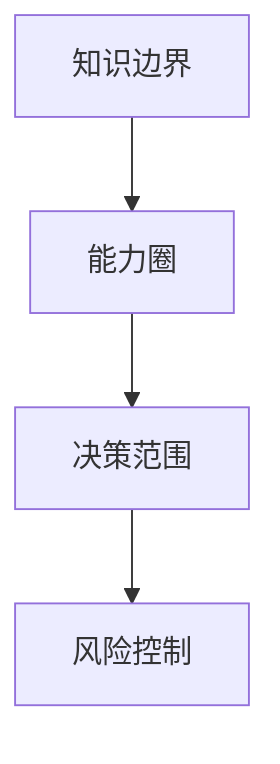
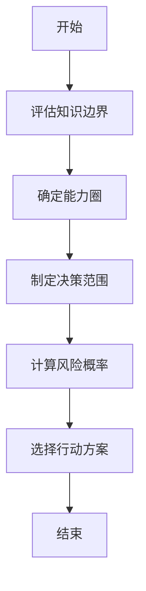
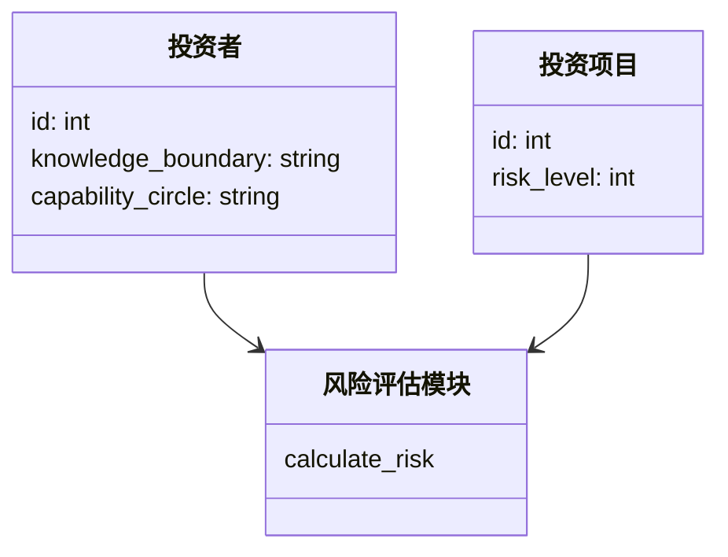
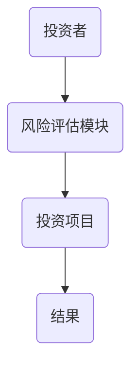
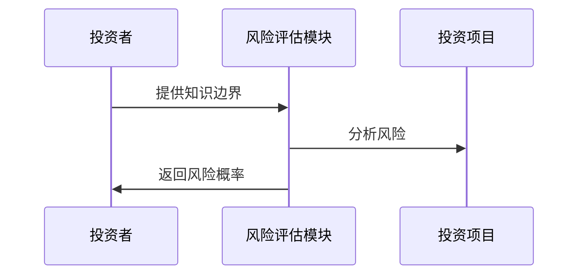

                 


# 芒格的"远离"策略：知道自己不懂什么的重要性

## 关键词：芒格的"远离"策略、能力圈、风险管理、认知边界、决策模型

## 摘要：芒格的"远离"策略强调知道自己知识的边界，避免涉足不了解的领域，从而降低决策风险。本文通过背景介绍、核心概念分析、算法原理、系统设计和项目实战，详细阐述了这一策略在投资和决策中的重要性，帮助读者理解和应用这一策略。

---

## 正文

### 第一部分：芒格的"远离"策略概述

#### 第1章：芒格"远离"策略的背景与核心理念

##### 1.1 问题背景：为什么知道自己不懂什么很重要？

在投资和决策领域，知识的边界是一个关键因素。芒格的“远离”策略强调识别自己的知识盲区，避免在不了解的领域进行决策。这种策略的重要性在于，错误的决策往往源于对未知领域的过度自信。

- **1.1.1 投资与决策中的知识边界问题**  
  投资者常常倾向于超出自己的知识范围进行决策，这可能导致重大损失。芒格强调，识别能力圈的边界是成功的基石。

- **1.1.2 知识的局限性与决策风险**  
  人的知识是有限的，超出能力范围的决策往往伴随着高风险。芒格通过“远离”策略，帮助投资者避免这些风险。

- **1.1.3 芒格策略的哲学基础**  
  芒格的策略基于对人类认知局限性的深刻理解，强调谦逊和谨慎。

##### 1.2 问题描述：芒格"远离"策略的核心要素

芒格的策略不仅仅是避免错误，还包括构建一个稳健的知识框架。

- **1.2.1 知识的边界与能力圈的定义**  
  能力圈是指个人在知识和经验上的优势领域，超出这个范围的决策应尽量避免。

- **1.2.2 避免决策中的认知偏差**  
  认知偏差如过度自信会导致错误决策，芒格策略通过限制决策范围减少这种偏差。

- **1.2.3 谨慎与风险控制的内在联系**  
  谨慎是风险控制的核心，芒格策略通过谨慎避免重大风险。

##### 1.3 问题解决：芒格策略的实际应用

芒格策略在投资和其他决策中的应用实例。

- **1.3.1 投资中的"远离"策略**  
  避免投资于看不懂的公司或行业，专注于熟悉领域。

- **1.3.2 日常决策中的"远离"策略**  
  在生活中，避免做出超出知识范围的决策。

- **1.3.3 芒格策略与其他决策模型的对比**  
  对比传统投资模型，芒格策略更注重风险控制。

##### 1.4 边界与外延：芒格策略的适用范围

芒格策略的应用场景和局限性。

- **1.4.1 芒格策略的适用场景**  
  适用于投资、决策等领域，帮助降低风险。

- **1.4.2 知识边界与能力圈的动态变化**  
  随着知识增长，能力圈会扩展，但需要不断评估。

- **1.4.3 芒格策略的局限性与改进空间**  
  策略本身无法完全消除风险，但能显著降低。

##### 1.5 概念结构与核心要素

构建芒格策略的逻辑框架。

- **1.5.1 "远离"策略的逻辑框架**  
  知识边界→能力圈→决策范围。

- **1.5.2 能力圈与知识边界的实体关系图**  
  使用Mermaid图展示能力圈与知识边界的互动。



- **1.5.3 芒格策略的核心要素对比表**  
  下表对比了“知识边界”、“能力圈”和“决策范围”的关键属性。

| 概念 | 属性 | 描述 |
|------|------|------|
| 知识边界 | 明确性 | 可以通过学习和经验明确的部分 |
| 能力圈 | 稳定性 | 随时间和经验变化而调整 |
| 决策范围 | 风险 | 超出能力圈的决策风险较高 |

---

#### 第2章：核心概念原理与联系

##### 2.1 芒格策略的核心原理

芒格策略基于以下核心原理：

- **2.1.1 知识边界与决策风险的关系**  
  知识边界越模糊，决策风险越高。

- **2.1.2 能力圈的构建与扩展**  
  通过学习和经验扩展能力圈，但需谨慎评估。

- **2.1.3 谨慎决策的数学模型**  
  使用概率论评估决策的可行性。

##### 2.2 核心概念属性对比表

| 概念 | 属性 | 描述 |
|------|------|------|
| 知识边界 | 明确性 | 可以通过学习和经验明确的部分 |
| 能力圈 | 稳定性 | 随时间和经验变化而调整 |
| 决策范围 | 风险 | 超出能力圈的决策风险较高 |

##### 2.3 ER实体关系图

```mermaid
erd
    投资者 [Investor] {
        id: int
        knowledge_boundary: string
        capability_circle: string
        decision_scope: string
    }
    投资项目 [InvestmentProject] {
        id: int
        risk_level: int
        knowledge_requirement: string
    }
    R1: 投资者 --> 投资项目 (风险评估)
```

---

#### 第3章：算法原理讲解

##### 3.1 算法原理

芒格策略的数学模型基于概率论。

- **3.1.1 概率模型**  
  计算决策的风险概率。

- **3.1.2 决策树模型**  
  分析不同决策路径的风险和收益。

##### 3.2 算法流程图



##### 3.3 Python代码实现

```python
def calculate_risk_probability(knowledge_boundary):
    if knowledge_boundary == "明确":
        return 0.1
    elif knowledge_boundary == "部分明确":
        return 0.3
    else:
        return 0.8

# 示例应用
knowledge_boundary = "明确"
risk_prob = calculate_risk_probability(knowledge_boundary)
print(f"风险概率为：{risk_prob}")
```

##### 3.4 代码解读

上述代码计算了在不同知识边界情况下的风险概率，帮助投资者评估决策风险。

---

#### 第4章：系统分析与架构设计

##### 4.1 问题场景介绍

设计一个基于芒格策略的投资决策系统，帮助投资者评估风险。

##### 4.2 系统功能设计

- **领域模型**：使用Mermaid类图展示系统模块。



##### 4.3 系统架构设计

- **架构图**：展示系统各部分的交互。



##### 4.4 系统接口设计

- **接口**：定义投资者与系统之间的交互接口。

##### 4.5 系统交互流程图



---

#### 第5章：项目实战

##### 5.1 环境安装

安装必要的库，如Mermaid和Python。

##### 5.2 核心代码实现

实现风险评估模块的代码。

```python
def calculate_risk_probability(knowledge_boundary):
    if knowledge_boundary == "明确":
        return 0.1
    elif knowledge_boundary == "部分明确":
        return 0.3
    else:
        return 0.8

# 示例应用
knowledge_boundary = "明确"
risk_prob = calculate_risk_probability(knowledge_boundary)
print(f"风险概率为：{risk_prob}")
```

##### 5.3 案例分析

分析一个具体的投资项目，评估其风险。

##### 5.4 小结

总结项目实战的经验和教训。

---

#### 第6章：最佳实践

##### 6.1 小结

芒格的“远离”策略通过识别知识边界，避免决策风险，是投资和决策的重要工具。

##### 6.2 注意事项

- 定期评估和调整能力圈。
- 避免过度自信，谨慎决策。
- 结合其他策略优化投资组合。

##### 6.3 拓展阅读

推荐相关书籍和资源，进一步学习芒格的策略。

---

## 作者：AI天才研究院 & 禅与计算机程序设计艺术

---

这篇文章通过详细阐述芒格的“远离”策略，帮助读者理解其重要性，并提供了实际应用的方法和案例。通过系统化的分析和代码示例，读者可以更好地掌握这一策略在投资和决策中的应用。

