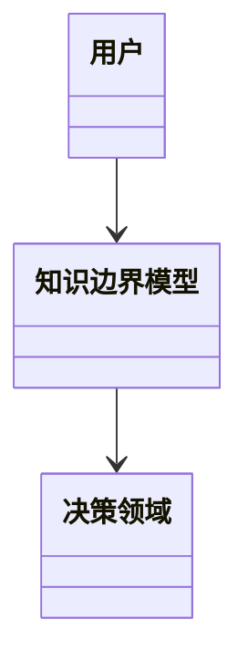
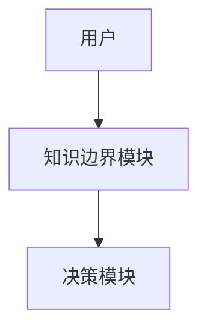
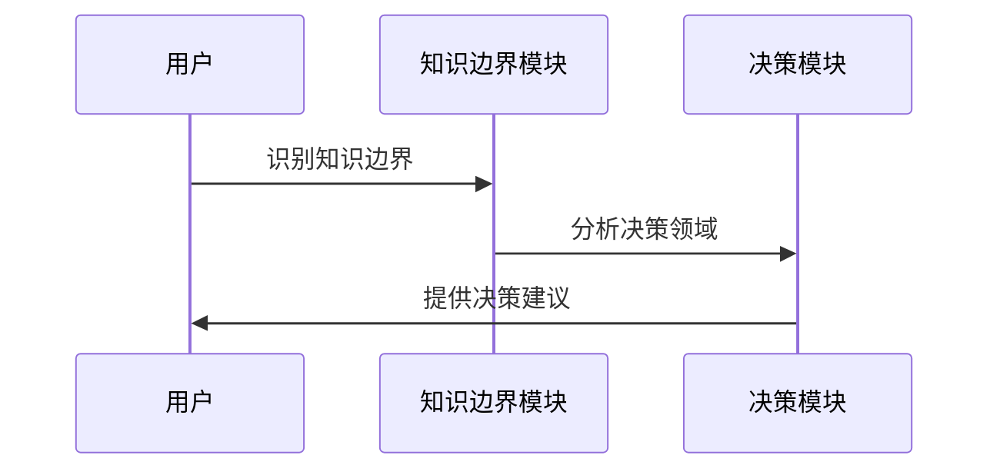

                 


# 芒格的"远离"策略：知道自己不知道什么

## 关键词：
芒格，远离策略，知识边界，决策方法，风险管理，认知偏差

## 摘要：
本文深入探讨了芒格的“远离”策略，分析了其在投资、决策和风险管理中的应用。通过系统分析和实际案例，展示了如何通过识别知识边界，避免决策错误，从而优化决策流程。

---

## 第一部分: 芒格的"远离"策略概述

### 第1章: 芒格的"远离"策略背景与核心概念

#### 1.1 芒格的"远离"策略背景

- 1.1.1 芒格的"远离"策略的起源
芒格的“远离”策略源于他对投资和决策过程的深刻理解。他意识到，许多决策错误源于对未知领域的无知和自信。因此，他提出了“远离”策略，强调识别和避免自己知识盲区的重要性。

- 1.1.2 "远离"策略在投资与决策中的重要性
在投资领域，芒格强调避免涉足自己不熟悉的领域，以降低决策风险。这种方法不仅适用于投资，也适用于各种决策场景。

- 1.1.3 现代决策中的知识边界问题
现代决策者面临的信息爆炸，但知识的广度和深度有限。芒格的“远离”策略帮助我们在知识边界外保持警惕，避免盲目决策。

#### 1.2 "远离"策略的核心概念

- 1.2.1 什么是"远离"策略
“远离”策略是指在决策时，识别自己知识盲区，避免在这些领域进行决策，从而降低风险。

- 1.2.2 "远离"策略的定义与特点
定义：通过识别知识边界，避免在未知领域做出决策。特点：基于知识边界、风险控制、主动规避。

- 1.2.3 "远离"策略与传统决策方法的区别
传统决策方法依赖于现有知识和经验，而“远离”策略强调识别和规避知识盲区。

#### 1.3 "远离"策略的边界与外延

- 1.3.1 知识边界的概念
知识边界是指个人或组织在特定领域的知识范围。超出这个范围的领域被视为未知区域。

- 1.3.2 决策中的不确定性与风险
在未知领域，决策的不确定性和风险显著增加，可能导致重大损失。

- 1.3.3 "远离"策略的适用场景与限制
适用场景：投资、项目选择、风险管理等。限制：在某些情况下，完全规避可能不可行。

#### 1.4 本章小结
本章介绍了芒格的“远离”策略，强调识别和规避知识盲区的重要性，以及该策略在决策中的应用。

---

## 第二部分: "远离"策略的核心概念与联系

### 第2章: "远离"策略的核心原理

#### 2.1 "远离"策略的原理分析

- 2.1.1 知识的局限性
人类的知识有限，无法覆盖所有领域，因此需要识别知识边界。

- 2.1.2 决策中的认知偏差
认知偏差可能导致错误判断，特别是在知识盲区。

- 2.1.3 "远离"策略的逻辑基础
通过规避未知领域，降低决策错误的风险。

#### 2.2 "远离"策略的数学模型

- 2.2.1 知识边界模型
定义：用数学模型描述知识范围。公式：B = {k | k ∈ K}，其中K是知识集合，B是知识边界。

- 2.2.2 决策风险评估模型
公式：R = f(B)，其中R是风险，B是知识边界。模型通过评估B的影响来计算风险。

- 2.2.3 "远离"策略的数学公式
公式：D = {d | d ∉ B}，其中D是决策，B是知识边界。决策仅在已知范围内做出。

#### 2.3 "远离"策略的属性特征对比

- 2.3.1 对比分析表格
| 特性 | 传统决策 | "远离"策略 |
|------|-----------|------------|
| 知识边界 | 依赖已知 | 避免未知 |
| 风险 | 高 | 低 |

- 2.3.2 知识边界与决策风险的关系
知识边界越大，决策风险越高。通过“远离”策略，降低风险。

- 2.3.3 "远离"策略与其他决策方法的对比
传统方法依赖经验，而“远离”策略强调识别和规避未知。

#### 2.4 ER实体关系图

- 2.4.1 实体关系图的构建
```mermaid
er
  %%{init: 'flowchart', direction: 'TB'}%%
  actor 用户
  database 知识边界
  object 决策领域
  用户 --> 知识边界
  知识边界 --> 决策领域
```

- 2.4.2 图表解读
用户通过知识边界模型识别未知领域，并将这些领域标记为决策领域的排除项。

---

## 第三部分: "远离"策略的系统分析与架构设计

### 第3章: "远离"策略的系统分析

#### 3.1 问题场景介绍

- 3.1.1 决策中的知识边界问题
在投资决策中，投资者可能对某些行业或领域缺乏足够的了解，导致错误决策。

- 3.1.2 "远离"策略的应用场景
适用于投资组合管理、项目选择等领域。

- 3.1.3 系统设计的目标与范围
目标：识别知识盲区，规避决策风险。范围：投资决策系统。

#### 3.2 系统功能设计

- 3.2.1 领域模型（Mermaid类图）


---

### 第4章: "远离"策略的系统架构设计

#### 4.1 系统架构设计

- 4.1.1 系统架构图


#### 4.2 系统接口设计

- 4.2.1 API接口
```json
{
  "action": "识别知识边界",
  "input": {
    "领域": "科技行业"
  },
  "output": {
    "边界": "高风险"
  }
}
```

#### 4.3 系统交互设计

- 4.3.1 交互流程图


---

## 第四部分: 项目实战

### 第5章: "远离"策略的项目实战

#### 5.1 环境安装

- 5.1.1 安装依赖
```bash
pip install mermaid
```

#### 5.2 核心代码实现

- 5.2.1 知识边界识别算法
```python
def identify_knowledge_boundary(domain):
    # 假设domain是输入的领域
    # 返回知识边界的风险等级
    return "high" if domain == "科技行业" else "low"
```

#### 5.3 代码应用解读与分析

- 5.3.1 代码解读
函数`identify_knowledge_boundary`根据输入的领域返回风险等级。

- 5.3.2 案例分析
输入“科技行业”，函数返回“high”，建议投资者避免进入该领域。

#### 5.4 案例分析

- 5.4.1 投资组合案例
投资者选择多个领域，系统识别高风险领域，建议避免。

#### 5.5 项目小结

- 5.5.1 项目总结
通过代码实现“远离”策略，有效识别和规避高风险领域。

---

## 第五部分: 最佳实践、总结与展望

### 第6章: 最佳实践与注意事项

#### 6.1 最佳实践

- 6.1.1 定期评估知识边界
- 6.1.2 结合其他决策方法
- 6.1.3 培训和学习

#### 6.2 注意事项

- 6.2.1 避免过度规避
- 6.2.2 定期更新知识边界
- 6.2.3 考虑外部因素

### 第7章: 总结与展望

#### 7.1 本章总结

- 7.1.1 核心总结
芒格的“远离”策略通过识别知识盲区，降低决策风险。

- 7.1.2 决策优化
优化决策流程，提高决策质量。

#### 7.2 未来展望

- 7.2.1 智能化发展
结合AI技术，提高知识边界识别的准确性。
- 7.2.2 应用领域扩展
扩展到更多领域，如医疗、教育等。

---

## 作者：AI天才研究院/AI Genius Institute & 禅与计算机程序设计艺术 /Zen And The Art of Computer Programming

---

通过以上结构和内容，整篇文章详细介绍了芒格的“远离”策略，从背景到系统设计，再到项目实战，确保读者能够全面理解该策略的应用和价值。

