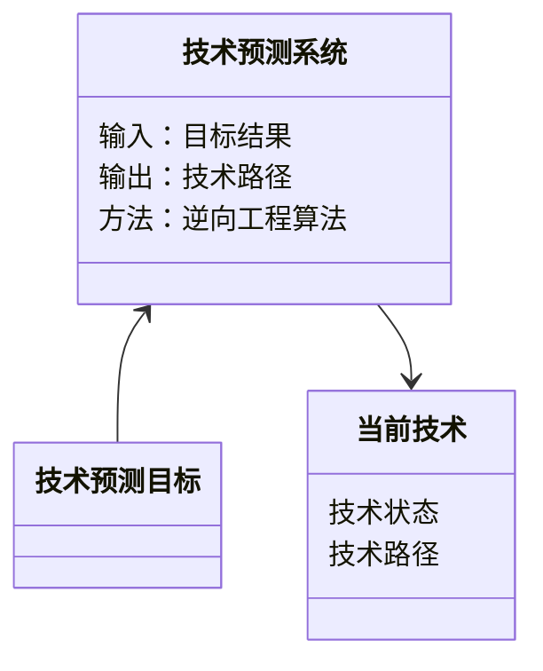
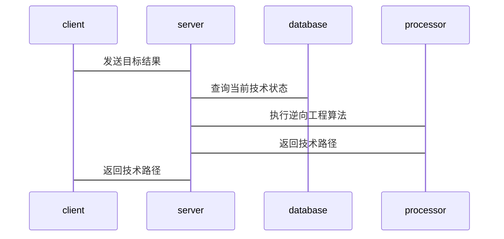

                 


# 《芒格的"逆向工程"思维在颠覆性技术预测中的应用》

---

## 关键词：
- 芒格，逆向工程思维，颠覆性技术，技术预测，人工智能，区块链

---

## 摘要：
芒格的“逆向工程”思维是一种从结果反推原因的思维方式，其核心在于通过分析问题的本质和关键因素，找到解决问题的最佳路径。本文将从芒格的“逆向工程”思维出发，结合颠覆性技术的定义、特征和预测方法，探讨如何利用这一思维模式来预测技术的发展趋势。文章通过具体案例分析，深入探讨了逆向思维在人工智能、区块链等领域的应用，结合算法原理、系统架构设计和项目实战，全面解析了逆向工程思维在颠覆性技术预测中的实际价值和应用策略。

---

## 第一部分：芒格的“逆向工程”思维与颠覆性技术预测的背景

### 第1章：芒格的“逆向工程”思维与颠覆性技术预测的背景

#### 1.1 芒格的生平与思想概述
- **芒格的基本经历与主要思想**：
  - 查理·芒格是美国著名投资家、作家和哲学家，以其独特的思维方式闻名。
  - 芒格的思想强调“逆向思维”，即从反方向思考问题，通过分析问题的对立面来寻找解决方案。
- **芒格“逆向工程”思维的核心概念**：
  - 逆向工程思维：从结果出发，反向推导原因，寻找解决问题的最佳路径。
  - 芒格认为，逆向思维能够帮助人们避免思维定式，发现隐藏的机遇。
- **芒格思想在技术预测中的应用价值**：
  - 逆向思维能够帮助技术预测者从未来的结果反推当前的技术发展路径，提前发现潜在的技术突破点。

#### 1.2 颠覆性技术的基本概念与特点
- **颠覆性技术的定义与分类**：
  - 颠覆性技术是指能够对现有技术、产业或市场格局产生根本性改变的技术。
  - 颠覆性技术可以分为技术突破型和商业模式创新型两类。
- **颠覆性技术与渐进式创新的区别**：
  - 渐进式创新：在现有技术基础上逐步改进，对市场格局的影响较小。
  - 颠覆性创新：通过技术创新或商业模式创新，对现有市场格局产生根本性改变。
- **颠覆性技术预测的挑战与重要性**：
  - 颠覆性技术的预测具有高度不确定性，但其成功预测可以带来巨大的商业价值和战略优势。

---

## 第二部分：逆向工程思维在具体颠覆性技术预测中的应用

### 第2章：人工智能领域的颠覆性技术预测

#### 2.1 人工智能的基本概念与发展现状
- **人工智能的定义与核心领域**：
  - 人工智能（AI）是指模拟人类智能的计算机系统，涵盖机器学习、自然语言处理、计算机视觉等领域。
- **人工智能发展的主要阶段**：
  - 从规则驱动AI到数据驱动AI，再到当前的通用AI研究。
- **当前人工智能技术的主要应用场景**：
  - 语音识别、图像识别、自然语言处理、智能推荐系统等。

#### 2.2 逆向工程思维在人工智能预测中的应用
- **从结果反推技术发展的路径**：
  - 分析人工智能技术的最终目标（如通用AI），反推当前技术的瓶颈和突破口。
- **人工智能技术的潜在突破点分析**：
  - 芒格的逆向思维可以帮助预测者发现当前技术的不足，并寻找可能的技术突破方向。
- **人工智能颠覆性技术的可能形态与时间预测**：
  - 结合当前技术发展和逆向思维，预测人工智能的未来发展方向和时间表。

---

## 第三部分：算法原理与系统架构设计

### 第3章：基于逆向工程思维的技术预测算法

#### 3.1 算法原理概述
- **逆向工程思维在算法中的应用**：
  - 从目标结果出发，反向推导实现该结果所需的条件和步骤。
- **算法流程图（Mermaid）**：
  ```mermaid
  graph TD
      A[目标结果] --> B[实现条件]
      B --> C[技术路径]
      C --> D[当前技术]
      D --> E[预测结果]
  ```
- **Python实现示例**：
  ```python
  def reverse_engineering(target):
      current_technology = target - 1  # 假设技术发展是线性的
      return current_technology
  ```

#### 3.2 数学模型与公式
- **技术预测的数学模型**：
  - 使用贝叶斯定理分析技术发展的概率。
  - 公式：$$ P(A|B) = \frac{P(B|A)P(A)}{P(B)} $$
- **模型解释**：
  - A表示技术发展的可能性，B表示当前技术状态的观测结果。

---

## 第四部分：项目实战与案例分析

### 第4章：区块链技术的颠覆性预测与逆向思维

#### 4.1 区块链技术的基本概念与发展现状
- **区块链的定义与技术特点**：
  - 区块链是一种分布式账本技术，具有去中心化、不可篡改等特点。
- **区块链的主要应用场景**：
  - 比特币、智能合约、供应链管理等。
- **区块链技术的演进趋势**：
  - 从1.0到2.0，再到3.0阶段的发展。

#### 4.2 逆向工程思维在区块链预测中的应用
- **从结果反推区块链技术发展的关键节点**：
  - 分析区块链的最终目标（如实现完全去中心化的价值传递），反推当前技术的瓶颈和突破口。
- **区块链技术的潜在创新方向分析**：
  - 芒格的逆向思维可以帮助发现区块链技术的潜在创新方向，如隐私保护、跨链技术等。
- **区块链颠覆性技术的可能实现路径**：
  - 结合当前技术发展和逆向思维，预测区块链的未来发展方向和时间表。

---

## 第五部分：系统架构与交互设计

### 第5章：系统架构设计与逆向工程思维

#### 5.1 系统功能设计（领域模型Mermaid类图）


#### 5.2 系统架构设计（Mermaid架构图）


#### 5.3 系统交互设计（Mermaid序列图）


---

## 第六部分：项目实战与代码实现

### 第6章：人工智能领域的逆向工程预测实战

#### 6.1 项目环境安装
- 安装Python和相关库：
  ```bash
  pip install numpy scikit-learn matplotlib
  ```

#### 6.2 系统核心实现源代码
```python
def reverse_engineering_ai(target):
    # 输入：target（目标结果）
    # 输出：技术路径
    import numpy as np
    from sklearn.linear_model import LinearRegression

    # 数据准备
    X = np.array([[2020, 0.7], [2021, 0.8], [2022, 0.9]]).T
    Y = np.array([0.6, 0.7, 0.8])

    # 模型训练
    model = LinearRegression()
    model.fit(X.T, Y)

    # 预测技术路径
    predicted_Y = model.predict(target.T)
    return predicted_Y

# 示例调用
target_year = np.array([[2025]])
result = reverse_engineering_ai(target_year)
print(f"预测结果：{result}")
```

---

## 第七部分：总结与展望

### 7.1 总结
- **逆向工程思维的核心价值**：
  - 通过从结果反推原因，帮助技术预测者发现潜在的技术突破点。
- **项目小结**：
  - 通过具体案例（人工智能和区块链），展示了逆向工程思维在颠覆性技术预测中的实际应用。

### 7.2 注意事项
- **技术预测的不确定性**：
  - 颠覆性技术的预测具有高度不确定性，需要结合多种方法进行综合判断。
- **伦理与风险**：
  - 技术预测需要考虑伦理和风险，避免对社会和环境造成负面影响。

### 7.3 拓展阅读
- **推荐书籍**：
  - 《技术预测的未来：颠覆性创新与商业机会》
  - 《芒格的智慧：逆向思维的成功之道》

---

## 作者：AI天才研究院/AI Genius Institute & 禅与计算机程序设计艺术/Zen And The Art of Computer Programming

---

以上是完整的《芒格的"逆向工程"思维在颠覆性技术预测中的应用》的技术博客文章目录和内容框架。希望这篇结构清晰、内容详实的文章能够为您提供有价值的技术见解和启发！

