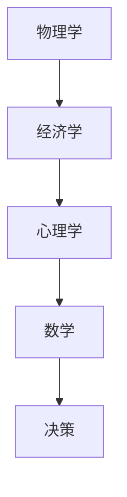
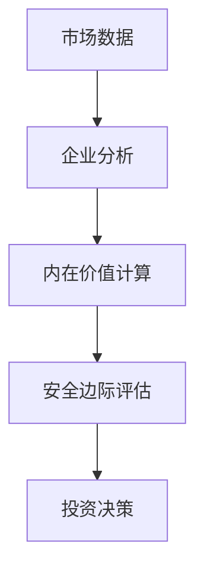

                 


# 《芒格的"逆向工程"思维：从成功投资中提取核心原则》

## 关键词：芒格、逆向工程、投资原则、多元思维模型、安全边际

## 摘要：本文深入探讨了芒格的逆向工程思维，分析其在投资决策中的应用。通过芒格的多元思维模型和成功案例，揭示其核心投资原则，并提供系统化的方法，帮助读者在实际投资中应用这些原则。

---

## 第一部分：芒格的逆向工程思维概述

### 第1章：芒格的生平与投资理念

#### 1.1 芒格的生平简介
格雷厄姆·芒格（Charlie Munger）是伯克希尔·哈撒韦公司的重要合伙人，沃伦·巴菲特的长期合作伙伴。芒格的教育背景深厚，毕业于芝加哥大学，主修数学和心理学，这为他后来的投资哲学奠定了基础。芒格的投资理念以逆向思维著称，他强调通过分析企业内在价值，寻找市场低估的机会。

#### 1.2 逆向工程思维的定义与特点
逆向工程思维是一种从结果出发，反向推导原因的思维方式。与传统正向思维不同，逆向思维强调从失败中学习，寻找市场的非共识机会。芒格的逆向思维在投资中体现为寻找市场低估的优质企业，而非追逐市场热点。

---

## 第二部分：芒格的决策框架

### 第2章：芒格的多元思维模型

#### 2.1 多元思维模型的概念
多元思维模型是芒格提出的核心概念，指将多个学科的知识交叉应用，构建决策框架。通过整合物理学、心理学、经济学等学科的原理，芒格能够更全面地评估企业的内在价值和市场风险。

#### 2.2 多元思维模型的数学模型
$$ 思维模型 = \sum_{i=1}^{n} 知识领域_i $$
$$ 决策 = f(思维模型) $$

以下是多元思维模型的交互关系图：



---

## 第三部分：芒格的核心投资原则

### 第3章：芒格的选股标准

#### 3.1 高质量企业的定义
芒格强调投资于具有持续竞争优势的企业，这些企业应具备高ROE（净资产收益率）、高ROA（资产回报率）和高ROCE（资本回报率）。

#### 3.2 安全边际的计算
安全边际是芒格投资策略中的关键原则，通过计算企业内在价值与市场价格的差异，确保投资的安全性。

$$ 安全边际 = 价值 - 市场价格 $$
$$ 价值 = 现金流折现率 \times 现金流 $$

---

## 第四部分：芒格投资策略的应用案例

### 第4章：可口可乐的投资分析

#### 4.1 可口可乐的基本面分析
可口可乐具备强大的品牌影响力和持续的现金流，符合芒格的选股标准。

$$ 现金流折现率 = \frac{现金流}{价值} $$
$$ 现金流 = 价值 \times 现金流折现率 $$

---

## 第五部分：系统分析与架构设计

### 第5章：基于逆向思维的投资系统

#### 5.1 系统架构设计
以下是基于逆向思维的投资系统的架构图：



---

## 第六部分：项目实战

### 第6章：基于芒格原则的投资分析

#### 6.1 环境配置与工具选择
使用Python进行数据分析，安装必要的库如Pandas和NumPy。

#### 6.2 核心实现源代码
以下是计算内在价值的Python代码：

```python
import pandas as pd
import numpy as np

def calculate_intrinsic_value(cash_flows, discount_rate):
    return sum(cash_flows / (1 + discount_rate)**i for i, cash_flow in enumerate(cash_flows))

cash_flows = [100, 120, 150, 200]
discount_rate = 0.08

intrinsic_value = calculate_intrinsic_value(cash_flows, discount_rate)
print(f"内在价值：{intrinsic_value:.2f}")
```

---

## 第七部分：总结与最佳实践

### 第7章：芒格逆向思维的总结

#### 7.1 小结
芒格的逆向思维强调从市场低估和非共识中寻找机会，通过多元思维模型和安全边际原则，构建稳健的投资决策框架。

#### 7.2 注意事项
投资者需结合实际情况调整模型，避免机械套用。

#### 7.3 未来趋势
随着人工智能的发展，逆向思维的应用将更加广泛，投资者需持续学习和进化。

#### 7.4 拓展阅读
推荐阅读芒格的《穷查理宝典》和巴菲特的《巴菲特致股东的信》。

---

## 作者：AI天才研究院 & 禅与计算机程序设计艺术

---

这篇文章系统地介绍了芒格的逆向工程思维，结合理论与实践，帮助读者理解并应用其投资原则。通过详细分析和实际案例，文章为投资者提供了宝贵的指导。

