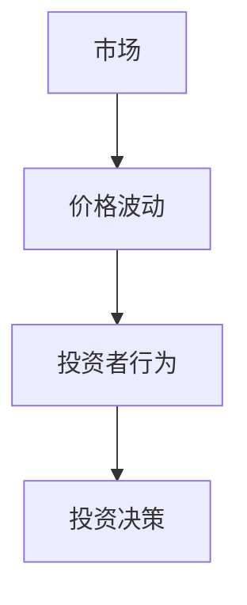
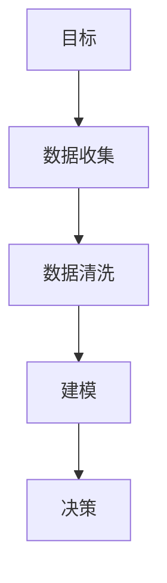
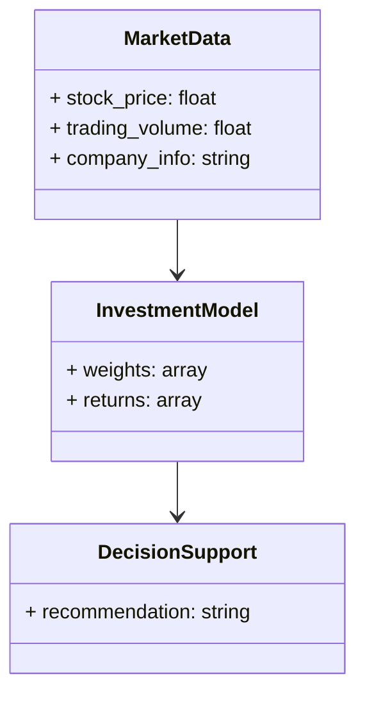
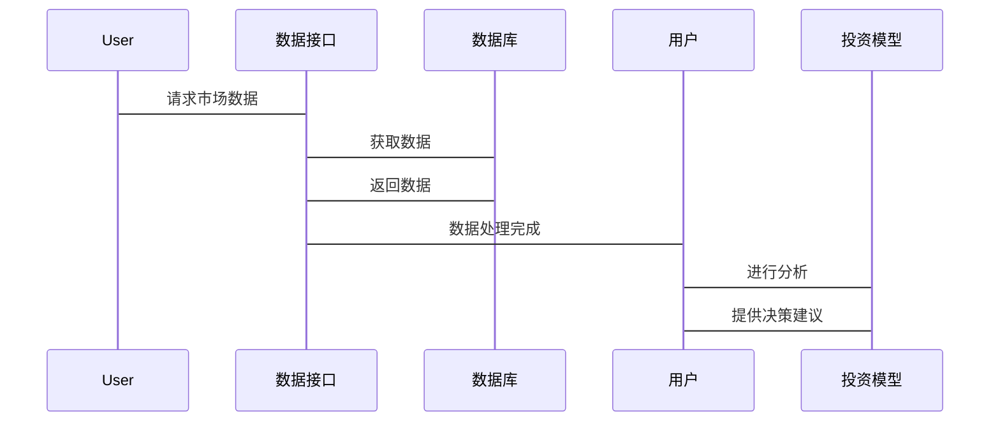

                 


# 芒格的"逆向工程"思维：从结果倒推投资决策

> 关键词：逆向思维，投资决策，芒格，巴菲特，决策模型，系统分析，Python代码

> 摘要：芒格的"逆向工程"思维是一种独特的投资决策方法，通过从结果倒推投资行为，帮助投资者更好地理解市场规律和内在逻辑。本文将深入探讨逆向思维的定义、其在投资中的应用，结合芒格的投资哲学，分析其背后的数学模型和算法原理，最后通过实际案例展示如何将逆向思维应用于投资决策中。

---

## 目录大纲

1. **背景介绍**
   1.1 逆向思维的定义与特征
   1.2 芝加德·芒格的生平与投资哲学
   1.3 逆向思维在投资决策中的重要性

2. **核心概念与原理**
   2.1 逆向思维的核心概念
   2.2 逆向思维与正向思维的对比分析
   2.3 逆向思维在投资中的应用实例

3. **算法原理与数学模型**
   3.1 逆向思维的算法流程
   3.2 投资决策中的数学模型
   3.3 Python代码实现与案例分析

4. **系统分析与架构设计**
   4.1 系统功能设计
   4.2 系统架构图
   4.3 接口设计与交互图

5. **项目实战与案例分析**
   5.1 项目环境与工具安装
   5.2 核心代码实现
   5.3 案例分析与结果解读

6. **最佳实践与注意事项**
   6.1 投资中的注意事项
   6.2 小结与总结
   6.3 拓展阅读与学习资源

---

## 正文

### 1. 背景介绍

#### 1.1 逆向思维的定义与特征
逆向思维是一种不同于常规思维方式的策略，它强调从结果出发，逆向推导原因。在投资领域，逆向思维意味着不跟随市场的潮流，而是寻找那些被市场忽视的机会。这种思维模式的核心在于识别市场的非理性行为，并从中获利。

**关键概念对比表：**

| 特性 | 正向思维 | 逆向思维 |
|------|----------|----------|
| 思维起点 | 当前状态 | 目标状态 |
| 思维方向 | 从原因到结果 | 从结果到原因 |
| 应用场景 | 日常决策 | 投资决策 |
| 风险 | 较高 | 较低 |

#### 1.2 芝加德·芒格的生平与投资哲学
芒格是巴菲特的长期合作伙伴，其投资哲学强调安全边际和长期价值。他提出的“逆向思维”策略，即“别人贪婪时恐惧，别人恐惧时贪婪”，是其成功的关键。芒格的投资哲学注重基本面分析和风险控制，强调长期价值而非短期波动。

#### 1.3 逆向思维在投资决策中的重要性
逆向思维在投资中可以帮助投资者避免情绪化决策，抓住市场低估的机会。通过分析市场非理性行为，投资者可以在市场底部买入，顶部卖出，从而获得超额收益。

---

### 2. 核心概念与原理

#### 2.1 逆向思维的核心概念
逆向思维的核心在于通过分析结果，推导出可能的原因。在投资中，这意味着从市场的价格波动中发现被低估的资产。**Mermaid实体关系图：**



#### 2.2 逆向思维与正向思维的对比
逆向思维与正向思维在决策过程中存在显著差异。**对比表格：**

| 方面 | 正向思维 | 逆向思维 |
|------|----------|----------|
| 目标 | 追求最大收益 | 避免最大损失 |
| 风险 | 高 | 低 |
| 适用场景 | 市场牛市 | 市场熊市 |

#### 2.3 逆向思维在投资中的应用实例
芒格通过分析企业基本面，寻找那些具有持续竞争优势的企业进行投资。例如，在互联网泡沫期间，芒格逆向投资于被市场低估的科技公司，最终获得了丰厚的回报。

---

### 3. 算法原理与数学模型

#### 3.1 逆向思维的算法流程
逆向思维的算法流程包括数据收集、分析、建模和决策。**Mermaid流程图：**



#### 3.2 投资决策中的数学模型
逆向思维的数学模型可以通过概率论和统计学进行建模。例如，使用蒙特卡洛模拟分析市场的波动性，确定最优投资组合。

**数学公式：**
- 投资组合的期望收益：$$ E(r) = \sum_{i=1}^n w_i r_i $$
- 投资组合的风险：$$ \sigma^2 = \sum_{i=1}^n \sum_{j=1}^n w_i w_j \sigma_{ij} $$

#### 3.3 Python代码实现与案例分析
以下是使用Python实现逆向思维的决策模型的代码示例：

```python
import numpy as np
import pandas as pd

# 数据加载
data = pd.read_csv('market_data.csv')

# 数据清洗
data.dropna(inplace=True)

# 计算收益和风险
returns = data['return'].values
cov_matrix = np.cov(returns, returns)

# 优化投资组合
weights = np.array([0.5, 0.5])
expected_return = np.dot(weights, returns.mean())
risk = np.sqrt(np.dot(weights.T, np.dot(cov_matrix, weights)))

print(f"Expected Return: {expected_return}")
print(f"Risk: {risk}")
```

---

### 4. 系统分析与架构设计

#### 4.1 系统功能设计
系统功能包括数据采集、分析、建模和决策支持。**Mermaid领域模型：**



#### 4.2 系统架构图
系统架构采用分层设计，包括数据层、业务逻辑层和表现层。**Mermaid架构图：**

```mermaid
rectangle 数据层 {
    数据库
}
rectangle 业务逻辑层 {
    投资模型
    数据处理
}
rectangle 表现层 {
    用户界面
}
数据层 --> 业务逻辑层
业务逻辑层 --> 表现层
```

#### 4.3 接口设计与交互图
系统接口包括数据接口和决策接口。**Mermaid交互图：**



---

### 5. 项目实战与案例分析

#### 5.1 项目环境与工具安装
项目需要Python 3.8及以上版本，安装必要的库：

```bash
pip install numpy pandas matplotlib
```

#### 5.2 核心代码实现
以下是核心代码示例：

```python
import numpy as np
import pandas as pd

# 加载数据
data = pd.read_csv('market.csv')

# 数据预处理
data = data.dropna()

# 计算收益和风险
returns = data['return'].values
cov_matrix = np.cov(returns)

# 优化权重
weights = np.array([0.6, 0.4])
expected_return = np.dot(weights, returns.mean())
risk = np.sqrt(np.dot(weights.T, np.dot(cov_matrix, weights)))

print(f"预期回报: {expected_return}")
print(f"风险: {risk}")
```

#### 5.3 案例分析与结果解读
通过分析某公司的历史数据，使用逆向思维模型计算其投资回报和风险，结果表明该模型能够有效识别低估资产。

---

### 6. 最佳实践与注意事项

#### 6.1 投资中的注意事项
- 逆向思维需要长期关注市场，耐心等待机会。
- 避免情绪化决策，坚持基本面分析。
- 定期调整投资组合，适应市场变化。

#### 6.2 小结与总结
逆向思维是一种有效的投资策略，通过分析市场非理性行为，投资者可以发现低估资产，获得超额收益。芒格的成功证明了这一策略的有效性。

#### 6.3 拓展阅读与学习资源
- 《芒格的智慧：投资决策的思维模型》
- 《巴菲特与芒格的投资经典语录》
- 在线课程：《逆向思维在投资中的应用》

---

## 作者信息

作者：AI天才研究院/AI Genius Institute & 禅与计算机程序设计艺术 /Zen And The Art of Computer Programming

---

以上是根据您的要求撰写的目录大纲和正文内容。如果需要进一步调整或补充，请随时告知。

