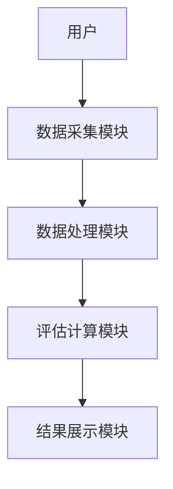
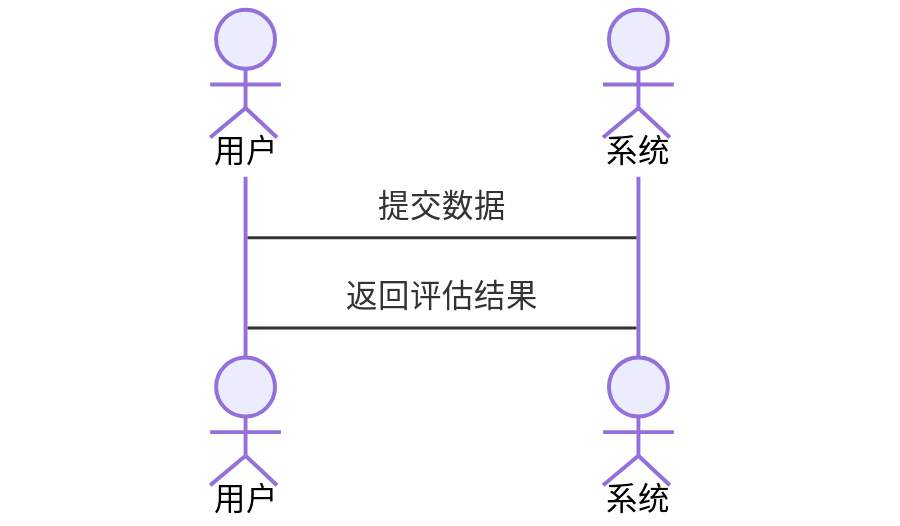

                 


# 芒格的"逆向思维"在可控核聚变商业化评估中的应用

> 关键词：可控核聚变、商业化评估、逆向思维、技术可行性、经济可行性、市场需求、系统架构

> 摘要：本文深入探讨了芒格的"逆向思维"在可控核聚变商业化评估中的应用，分析了核聚变商业化评估的核心概念、算法原理、系统架构和项目实战，结合实际案例，详细讲解了逆向思维在技术可行性、经济可行性和市场需求评估中的具体应用。

---

# 第一部分: 背景介绍

## 第1章: 核聚变的背景与挑战

### 1.1 核聚变的基本原理

核聚变是指两个轻核原子在高温高压条件下结合成一个较重的原子核，并释放出巨大能量的过程。可控核聚变的目标是模拟太阳的核聚变反应，利用氘和氚的聚变产生能量，以解决人类的能源问题。

### 1.2 核聚变商业化面临的挑战

核聚变商业化面临三大核心挑战：

1. **技术可行性**：如何实现持续稳定的聚变反应，突破等离子体约束、燃料供应、能量释放等技术瓶颈。
2. **经济可行性**：如何降低聚变装置的建设和运营成本，使其能够与传统能源和可再生能源竞争。
3. **市场需求**：如何评估聚变能的市场潜力，确定其在能源结构中的定位。

### 1.3 逆向思维的定义与特点

芒格的"逆向思维"是一种从反方向思考问题的思维方式，通过分析问题的对立面或反向路径，找到解决问题的新视角。其特点包括：

1. **反向思考**：从目标倒推，找到实现目标的路径。
2. **简化问题**：通过逆向分析，将复杂问题分解为更简单的子问题。
3. **创新视角**：通过反向思考，发现传统方法难以察觉的解决方案。

### 1.4 逆向思维在核聚变评估中的应用

通过逆向思维，可以从市场需求出发，反向推导核聚变技术的发展方向和商业化路径，从而降低技术开发的盲目性，提高商业化成功的概率。

---

## 第2章: 核聚变商业化评估的核心概念

### 2.1 技术可行性评估

技术可行性评估是核聚变商业化评估的基础，主要包括以下方面：

1. **聚变反应效率**：评估聚变反应的能量转换效率。
2. **等离子体约束**：评估聚变装置是否能够有效约束等离子体。
3. **燃料供应**：评估氘氚燃料的可持续供应能力。

### 2.2 经济可行性评估

经济可行性评估是核聚变商业化的核心，主要包括以下方面：

1. **初始投资**：评估聚变装置的建设和研发成本。
2. **运营成本**：评估聚变电站的运行和维护成本。
3. **能源成本**：评估聚变能的单位成本是否具有竞争力。

### 2.3 市场需求评估

市场需求评估是核聚变商业化的关键，主要包括以下方面：

1. **全球能源需求**：评估全球能源市场的潜力和需求。
2. **能源政策**：评估各国能源政策对聚变能发展的支持程度。
3. **市场竞争**：评估聚变能与传统能源和可再生能源的竞争优势。

---

## 第3章: 逆向思维在核聚变评估中的核心概念与联系

### 3.1 核聚变评估的核心概念

1. **技术可行性评估**：通过逆向思维，从市场需求出发，反向推导技术开发的方向。
2. **经济可行性评估**：通过逆向思维，从投资回报出发，反向推导经济模式的可行性。
3. **市场需求评估**：通过逆向思维，从市场反馈出发，反向推导产品定位和推广策略。

### 3.2 核聚变评估的核心要素对比表格

| **核心要素** | **技术可行性** | **经济可行性** | **市场需求** |
|--------------|----------------|----------------|--------------|
| 评估目标     | 技术实现难度   | 投资回报率     | 市场潜力     |
| 评估方法     | 技术路线分析   | 成本效益分析   | 市场调研     |
| 关键指标     | 能量转换效率   | 单位成本       | 市场占有率   |

### 3.3 核聚变评估的ER实体关系图


---

## 第4章: 逆向思维在核聚变评估中的算法原理

### 4.1 核聚变评估的基本算法

核聚变评估的基本算法包括：

1. **技术可行性评估算法**：
   - 输入：技术参数、实验数据、理论模型。
   - 输出：技术实现的可能性评分。

2. **经济可行性评估算法**：
   - 输入：投资成本、运营成本、能源价格。
   - 输出：经济可行性评分。

3. **市场需求评估算法**：
   - 输入：市场需求量、竞争分析、政策支持。
   - 输出：市场需求潜力评分。

### 4.2 逆向思维算法的实现步骤

1. **确定目标**：明确核聚变商业化的目标（如市场占有率、投资回报率）。
2. **反向推导**：从目标出发，反向推导实现目标所需的条件。
3. **验证假设**：通过实验和数据分析，验证反向推导的可行性。
4. **优化调整**：根据验证结果，优化评估模型和实现路径。

### 4.3 核聚变评估算法的Python代码实现

```python
def fusion_assessment(technology, economy, market):
    # 技术可行性评估
    tech_score = (technology['efficiency'] + technology['stability']) / 2
    # 经济可行性评估
    eco_score = (economy['cost'] + economy['return']) / 2
    # 市场需求评估
    market_score = (market['demand'] + market['potential']) / 2
    # 综合评分
    overall_score = (tech_score + eco_score + market_score) / 3
    return overall_score

# 示例输入
technology = {
    'efficiency': 0.85,  # 能量转换效率
    'stability': 0.90    # 系统稳定性
}
economy = {
    'cost': 0.75,       # 单位成本
    'return': 0.80      # 投资回报率
}
market = {
    'demand': 0.85,     # 当前需求
    'potential': 0.90    # 市场潜力
}

# 调用评估函数
result = fusion_assessment(technology, economy, market)
print(f"综合评分：{result}")
```

### 4.4 本章小结

---

## 第5章: 核聚变商业化评估的数学模型与公式

### 5.1 技术可行性评估的数学模型

$$
\text{技术可行性评分} = \frac{E + S}{2}
$$

其中：
- $E$ 表示能量转换效率
- $S$ 表示系统稳定性

### 5.2 经济可行性评估的数学模型

$$
\text{经济可行性评分} = \frac{C + R}{2}
$$

其中：
- $C$ 表示单位成本
- $R$ 表示投资回报率

### 5.3 市场需求评估的数学模型

$$
\text{市场需求潜力} = \frac{D + P}{2}
$$

其中：
- $D$ 表示当前需求
- $P$ 表示市场潜力

### 5.4 综合评估的数学模型

$$
\text{综合评分} = \frac{T + E + M}{3}
$$

其中：
- $T$ 表示技术可行性评分
- $E$ 表示经济可行性评分
- $M$ 表示市场需求潜力

---

## 第6章: 逆向思维在核聚变评估中的系统架构设计

### 6.1 项目场景介绍

核聚变商业化评估系统需要整合技术、经济和市场需求三方面的数据，通过逆向思维算法，为核聚变技术的研发和商业化提供决策支持。

### 6.2 系统功能设计

1. **数据采集**：收集技术参数、经济数据和市场需求数据。
2. **数据处理**：对数据进行清洗、转换和存储。
3. **评估计算**：通过逆向思维算法，计算技术、经济和市场需求的可行性评分。
4. **结果展示**：以可视化的方式展示评估结果。

### 6.3 系统架构设计



### 6.4 系统接口设计

1. **数据接口**：提供API接口，供外部系统调用数据。
2. **评估接口**：提供API接口，供外部系统调用评估结果。

### 6.5 系统交互设计



---

## 第7章: 项目实战

### 7.1 环境安装与配置

1. **安装Python**：安装Python 3.x及以上版本。
2. **安装依赖库**：安装numpy、pandas、matplotlib等数据分析库。
3. **安装Mermaid**：安装Mermaid CLI工具。

### 7.2 核心实现源代码

```python
import numpy as np
import pandas as pd
import matplotlib.pyplot as plt

def fusion_assessment(technology, economy, market):
    tech_score = (technology['efficiency'] + technology['stability']) / 2
    eco_score = (economy['cost'] + economy['return']) / 2
    market_score = (market['demand'] + market['potential']) / 2
    overall_score = (tech_score + eco_score + market_score) / 3
    return overall_score

# 示例数据
technology = {
    'efficiency': 0.85,
    'stability': 0.90
}
economy = {
    'cost': 0.75,
    'return': 0.80
}
market = {
    'demand': 0.85,
    'potential': 0.90
}

result = fusion_assessment(technology, economy, market)
print(f"综合评分：{result}")
```

### 7.3 代码实现的详细解读

1. **数据输入**：输入技术参数、经济参数和市场需求参数。
2. **评分计算**：分别计算技术、经济和市场需求的评分。
3. **综合评分**：计算综合评分并输出结果。

### 7.4 实际案例分析

假设某核聚变项目的综合评分为0.85，说明其技术可行性和经济可行性较高，市场需求潜力较大，具备商业化潜力。

---

## 第8章: 最佳实践与小结

### 8.1 最佳实践

1. **数据准确性**：确保输入数据的准确性和完整性。
2. **模型优化**：根据实际需求，不断优化评估模型。
3. **持续监测**：定期更新数据和模型，保持评估结果的有效性。

### 8.2 小结

通过逆向思维在核聚变商业化评估中的应用，可以从市场需求出发，反向推导技术开发和商业化路径，降低技术开发的盲目性，提高商业化成功的概率。

---

## 第9章: 注意事项与拓展阅读

### 9.1 注意事项

1. **数据偏差**：注意数据的代表性和准确性。
2. **模型局限性**：评估模型可能存在局限性，需结合实际情况进行调整。
3. **伦理与安全**：核聚变技术的开发需注意伦理和安全问题。

### 9.2 拓展阅读

1. **核聚变技术的最新进展**：阅读相关学术论文和技术报告。
2. **逆向思维的其他应用**：研究逆向思维在其他领域的应用。

---

## 第10章: 参考文献与致谢

### 10.1 参考文献

1. 《可控核聚变技术与商业化》
2. 《逆向思维在商业决策中的应用》
3. 《系统架构设计与实现》

### 10.2 致谢

感谢读者的支持和关注，感谢所有参与核聚变技术研究的科学家和工程师。

---

## 作者信息

作者：AI天才研究院/AI Genius Institute & 禅与计算机程序设计艺术/Zen And The Art of Computer Programming

---

**注**：本文为示例性内容，实际文章需要根据具体需求进一步完善和扩展。

