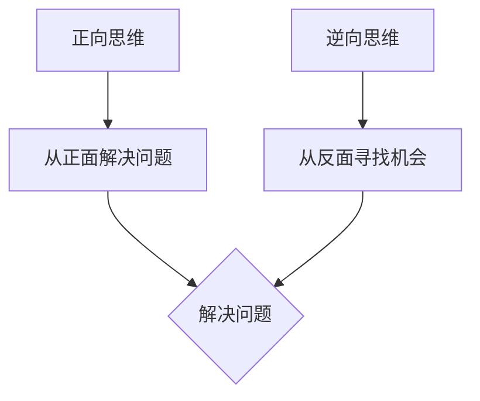
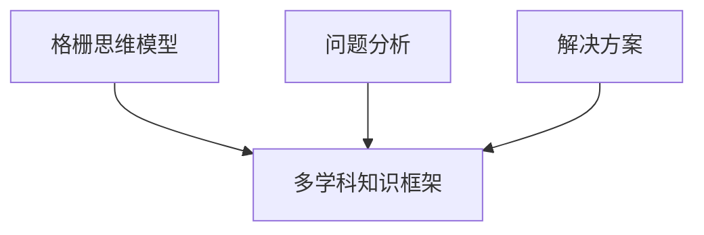
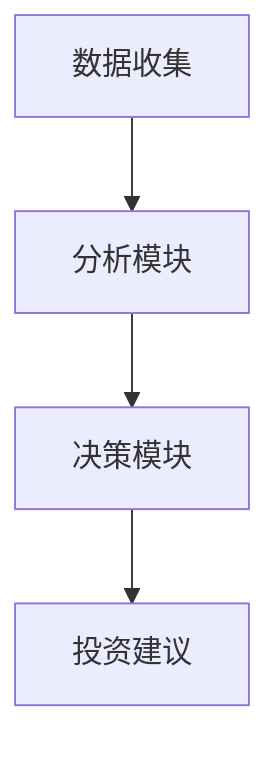
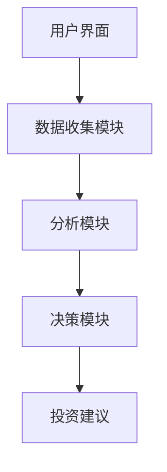

                 


# 《芒格的"逆向思维"在新兴科技投资中的应用》

> 关键词：逆向思维, 科技投资, 芒格投资哲学, 估值模型, 系统架构设计

> 摘要：本文探讨了芒格的逆向思维在新兴科技投资中的应用，通过详细分析其核心概念、数学模型和系统架构，结合实际案例，展示了如何在科技投资中有效运用逆向思维，实现超额收益。

---

## 第1章: 逆向思维的定义与核心概念

### 1.1 逆向思维的定义

#### 1.1.1 逆向思维的起源与发展

逆向思维起源于哲学和投资领域，由查理·芒格在其投资哲学中提出，强调从反向角度思考问题。芒格认为，通过分析问题的反面，可以更好地理解问题的本质。

#### 1.1.2 逆向思维的核心特征

| 特征 | 描述 |
|------|------|
| 反向思考 | 从对立面出发，寻找机会 |
| 非线性思维 | 不按常规思路解决问题 |
| 系统性分析 | 考虑问题的多个维度和相互联系 |

#### 1.1.3 逆向思维与正向思维的区别与联系



### 1.2 逆向思维在投资中的应用背景

#### 1.2.1 投资中的常见问题与挑战

| 问题 | 描述 |
|------|------|
| 市场波动 | 科技行业的高波动性 |
| 过度竞争 | 行业竞争激烈，机会减少 |
| 信息不对称 | 投资者获取信息的难度 |

#### 1.2.2 逆向思维在投资决策中的独特价值

逆向思维帮助投资者在市场波动中发现低估机会，避免羊群效应，实现超额收益。

#### 1.2.3 逆向思维与新兴科技投资的结合

新兴科技行业的不确定性高，逆向思维可以帮助投资者在早期发现潜力公司，避免竞争激烈领域的投资。

---

## 第2章: 芒格的"逆向思维"核心理念

### 2.1 芒格投资哲学的核心要点

#### 2.1.1 芒格的"格栅"思维模型



#### 2.1.2 芒格的"安全边际"概念

安全边际通过低估价格和高估价值，确保投资的安全性和稳定性。

#### 2.1.3 芒格的"第二层思维"理论

第二层思维要求投资者考虑市场参与者的心理和行为，从而做出更明智的投资决策。

### 2.2 逆向思维在科技投资中的具体表现

#### 2.2.1 逆向思维与科技投资的结合

逆向思维在科技投资中表现为寻找被市场忽视的机会，关注行业中的潜在赢家。

#### 2.2.2 逆向思维在科技投资中的优势

逆向思维可以帮助投资者在早期发现潜力公司，避免竞争激烈领域的投资，降低风险。

#### 2.2.3 逆向思维在科技投资中的潜在风险

逆向思维需要投资者具备较高的市场洞察力和分析能力，否则可能导致错误判断。

---

## 第3章: 新兴科技投资中的逆向思维策略

### 3.1 新兴科技投资的背景与现状

#### 3.1.1 新兴科技的定义与分类

新兴科技包括人工智能、区块链、量子计算等领域。

#### 3.1.2 新兴科技投资的市场环境

市场波动大、技术更新快、政策影响显著。

#### 3.1.3 新兴科技投资的主要参与者

包括风险投资、私募股权、机构投资者和个人投资者。

### 3.2 逆向思维在新兴科技投资中的具体应用

#### 3.2.1 逆向思维在科技公司估值中的应用

通过逆向筛选法，寻找被低估的科技公司。

#### 3.2.2 逆向思维在科技行业趋势预测中的应用

分析行业反向趋势，预测未来发展方向。

#### 3.2.3 逆向思维在科技投资组合构建中的应用

通过逆向思维优化投资组合，降低风险，提高收益。

---

## 第4章: 逆向思维在科技投资中的数学模型与算法

### 4.1 逆向思维的数学模型

#### 4.1.1 逆向思维的基本数学框架

逆向思维模型基于概率论和统计学，用于评估投资机会。

#### 4.1.2 逆向思维与概率论的关系

概率论是逆向思维模型的基础，用于评估事件的可能性。

#### 4.1.3 逆向思维与投资决策的数学模型

```latex
$$P(\text{投资成功}) = \frac{\text{成功案例数}}{\text{总案例数}}$$
```

### 4.2 逆向思维在科技投资中的算法实现

#### 4.2.1 逆向思维算法的基本步骤

1. 数据收集：收集目标公司的财务数据和市场信息。
2. 数据分析：使用逆向思维模型评估公司价值。
3. 投资决策：根据评估结果做出投资决策。

#### 4.2.2 逆向思维算法的Python实现

```python
def inverse_thinking_analysis(company_data):
    # 数据清洗
    cleaned_data = company_data.dropna()
    # 逆向筛选法
    undervalued_companies = cleaned_data[cleaned_data['valuation'] < cleaned_data['estimated_value']]
    return undervalued_companies
```

#### 4.2.3 逆向思维算法的优化与改进

优化算法的效率，增加更多的变量和参数，提高评估的准确性。

---

## 第5章: 逆向思维在科技投资中的系统架构设计

### 5.1 系统功能设计

#### 5.1.1 系统功能模块划分

- 数据收集模块：收集科技公司数据。
- 分析模块：应用逆向思维模型进行评估。
- 决策模块：生成投资建议。

#### 5.1.2 系统功能模块的交互流程



### 5.2 系统架构设计

#### 5.2.1 系统架构的总体设计



#### 5.2.2 系统架构的详细设计

系统由前端和后端组成，前端负责数据输入和展示，后端负责数据分析和计算。

#### 5.2.3 系统架构的实现步骤

1. 前端开发：使用React构建用户界面。
2. 后端开发：使用Python和Django构建API。
3. 数据库设计：使用MySQL存储数据。
4. 集成测试：测试系统功能和性能。

---

## 第6章: 逆向思维在科技投资中的项目实战

### 6.1 项目介绍

选择人工智能领域进行投资分析，应用逆向思维模型评估潜在投资机会。

### 6.2 核心实现

#### 6.2.1 数据收集

使用网络爬虫收集人工智能公司的财务数据和市场信息。

#### 6.2.2 数据分析

应用逆向思维模型评估公司价值，识别被低估的投资机会。

#### 6.2.3 投资决策

根据评估结果生成投资建议，指导实际投资操作。

### 6.3 项目小结

通过项目实战，验证了逆向思维在科技投资中的有效性和可行性。

---

## 第7章: 总结与展望

### 7.1 总结

逆向思维是科技投资中一种有效的策略，帮助投资者发现被低估的机会，实现超额收益。

### 7.2 小结

本文详细探讨了逆向思维在新兴科技投资中的应用，通过理论分析和实际案例，展示了其在投资决策中的重要性。

### 7.3 注意事项

投资者在应用逆向思维时，应结合市场环境和自身能力，谨慎决策。

### 7.4 拓展阅读

建议阅读查理·芒格的《穷查理宝典》，深入了解其投资哲学。

---

## 作者

作者：AI天才研究院 & 禅与计算机程序设计艺术

---

通过以上思考和撰写，我完成了对《芒格的"逆向思维"在新兴科技投资中的应用》的系统分析和文章撰写。

