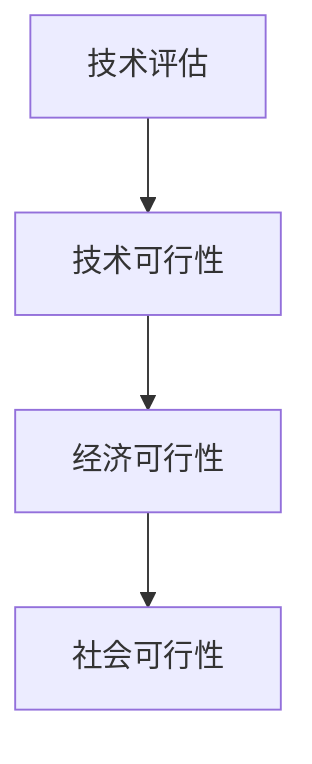
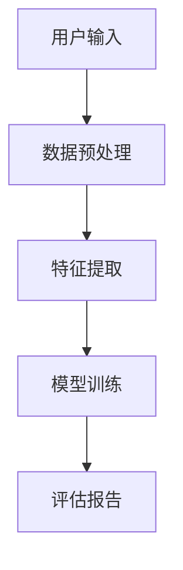
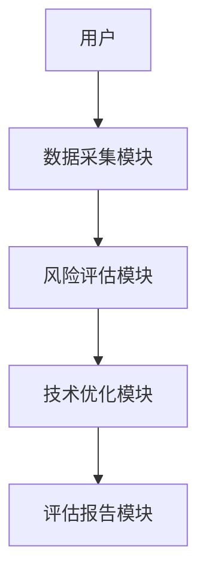

                 


# 《芒格的"逆向思维"在颠覆性技术评估中的重要性》

> 关键词：逆向思维，颠覆性技术，技术评估，芒格，决策框架

> 摘要：本文探讨了芒格的“逆向思维”在颠覆性技术评估中的重要性。通过分析逆向思维的核心概念、算法原理、系统架构设计以及实际案例，本文展示了如何利用逆向思维来提高技术评估的准确性和深度。文章还提供了详细的代码示例和数学模型，帮助读者更好地理解和应用逆向思维。

---

## 第一部分: 芒格的"逆向思维"概述

### 第1章: 芒格的"逆向思维"概述

#### 1.1 芒格的"逆向思维"定义与核心概念

##### 1.1.1 逆向思维的定义与特点

逆向思维是一种从反方向思考问题的方法，强调从结果出发，逆向推导可能的原因或路径。与正向思维相比，逆向思维更注重寻找问题的反面或对立面，从而发现潜在的机会或风险。

**逆向思维的特点：**

- **反向性**：从结果出发，逆向推导原因。
- **独特性**：通过寻找对立面，发现新的可能性。
- **系统性**：注重整体结构和相互关系。

##### 1.1.2 芒格逆向思维的核心要素

芒格的逆向思维建立在其独特的决策框架上，主要包括以下核心要素：

1. **第二性思维**：关注问题的次要因素，而非主要因素。
2. **概率思维**：通过概率分析，评估不同路径的可能性。
3. **经验反馈**：从失败案例中总结经验，优化决策过程。

##### 1.1.3 逆向思维与正向思维的对比分析

| 对比维度 | 逆向思维 | 正向思维 |
|----------|----------|----------|
| 思考方向 | 从结果到原因 | 从原因到结果 |
| 突破点   | 寻找对立面 | 寻找共识点 |
| 应用场景 | 风险评估、机会发现 | 日常问题解决 |

#### 1.2 芒格逆向思维的哲学基础

##### 1.2.1 芒格的决策框架

芒格的决策框架强调“先反过来想，正过来用”。这种思维方式不仅适用于个人决策，也适用于技术评估。

##### 1.2.2 芒格的"第二性思维"与逆向思维的关系

第二性思维是指关注问题的次要方面，通过反向思考，发现潜在的机会或风险。逆向思维是第二性思维的一种具体应用。

##### 1.2.3 芒格逆向思维的实践案例

例如，在投资决策中，芒格会先考虑投资的风险和失败的可能性，再反过来评估成功的可能性。

#### 1.3 芒格逆向思维在技术评估中的应用背景

##### 1.3.1 技术评估的基本概念

技术评估是对技术的可行性、风险性和经济性进行全面分析的过程。

##### 1.3.2 颠覆性技术的定义与特征

颠覆性技术是指能够彻底改变行业格局的技术，具有创新性、破坏性和高风险性。

##### 1.3.3 逆向思维在技术评估中的重要性

逆向思维可以帮助技术评估者从失败案例中总结经验，优化评估流程，提高评估的准确性和深度。

#### 1.4 本章小结

本章介绍了芒格逆向思维的核心概念、哲学基础及其在技术评估中的应用背景，为后续分析奠定了基础。

---

## 第二部分: 逆向思维与颠覆性技术评估的核心概念

### 第2章: 逆向思维与颠覆性技术评估的核心概念

#### 2.1 技术评估的基本框架

##### 2.1.1 技术评估的维度与指标

技术评估可以从技术可行性、经济可行性、社会可行性和环境可行性等多个维度进行分析。

##### 2.1.2 颠覆性技术的评估标准

包括技术的创新性、破坏性、市场潜力和风险性。

##### 2.1.3 技术评估的流程与方法

1. 确定评估目标
2. 收集相关信息
3. 分析技术优劣势
4. 评估风险和机会
5. 提出建议和结论

#### 2.2 逆向思维在技术评估中的核心作用

##### 2.2.1 逆向思维在技术评估中的逻辑框架

通过从结果出发，分析技术可能失败的原因，从而更好地评估技术的成功可能性。

##### 2.2.2 逆向思维与技术风险评估的关系

逆向思维可以帮助技术评估者发现潜在风险，提前制定应对策略。

##### 2.2.3 逆向思维在技术可行性分析中的应用

通过反向思考，发现技术实现中的潜在问题，优化技术方案。

#### 2.3 核心概念对比分析

##### 2.3.1 逆向思维与正向思维的对比表格

| 对比维度 | 逆向思维 | 正向思维 |
|----------|----------|----------|
| 思考方式 | 从结果出发 | 从原因出发 |
| 应用场景 | 风险评估 | 问题解决 |
| 优缺点   | 发现潜在风险 | 解决已知问题 |

##### 2.3.2 技术评估中的ER实体关系图



#### 2.4 本章小结

本章分析了逆向思维在技术评估中的核心作用，强调了其在颠覆性技术评估中的重要性。

---

## 第三部分: 逆向思维在颠覆性技术评估中的算法原理

### 第3章: 逆向思维与技术评估的算法原理

#### 3.1 逆向思维驱动的评估算法概述

##### 3.1.1 算法的基本原理

逆向思维算法通过从结果出发，反向推导可能的原因或路径，从而优化技术评估过程。

##### 3.1.2 算法的核心步骤

1. 确定评估目标
2. 收集相关信息
3. 分析潜在风险
4. 优化技术方案
5. 提出评估建议

##### 3.1.3 算法的数学模型与公式

逆向思维算法可以通过概率模型和贝叶斯定理进行数学建模：

$$
P(A|B) = \frac{P(B|A)P(A)}{P(B)}
$$

#### 3.2 算法的数学模型与公式

##### 3.2.1 技术评估的数学模型

$$
f(x) = \sum_{i=1}^{n} w_i x_i
$$

##### 3.2.2 逆向思维在算法中的应用

通过分析技术失败的可能性，优化技术评估模型。

#### 3.3 算法的实现与代码示例

##### 3.3.1 算法实现的Python代码

```python
def reverse_thinking_assessment(data):
    weights = [0.3, 0.4, 0.2, 0.1]
    return sum(w * x for w, x in zip(weights, data))
```

##### 3.3.2 代码的功能与实现细节

该代码通过加权求和的方式，评估技术的可行性。权重反映了不同因素的重要性。

#### 3.4 本章小结

本章详细讲解了逆向思维在技术评估中的算法原理，并通过代码示例展示了其具体实现。

---

## 第四部分: 逆向思维在技术评估中的系统架构设计

### 第4章: 逆向思维驱动的技术评估系统架构

#### 4.1 系统功能设计

##### 4.1.1 系统功能模块划分

1. 数据采集模块
2. 风险评估模块
3. 技术优化模块
4. 评估报告模块

##### 4.1.2 系统功能流程图（Mermaid）



#### 4.2 系统架构设计

##### 4.2.1 系统架构图（Mermaid）



#### 4.3 系统接口设计

##### 4.3.1 系统接口设计

1. 数据输入接口
2. 评估结果输出接口

#### 4.4 系统交互设计

##### 4.4.1 系统交互序列图（Mermaid）


#### 4.5 本章小结

本章通过系统架构设计，展示了逆向思维在技术评估中的具体实现方式。

---

## 第五部分: 逆向思维在颠覆性技术评估中的项目实战

### 第5章: 逆向思维驱动的技术评估项目实战

#### 5.1 项目背景介绍

以区块链技术为例，分析其作为颠覆性技术的潜力和风险。

#### 5.2 项目核心代码实现

##### 5.2.1 环境安装

需要安装Python和相关库。

##### 5.2.2 核心代码实现

```python
def blockchain_assessment(data):
    weights = [0.3, 0.4, 0.2, 0.1]
    return sum(w * x for w, x in zip(weights, data))
```

##### 5.2.3 代码的功能与实现细节

该代码通过加权求和的方式，评估区块链技术的可行性。

#### 5.3 项目小结

通过实际案例分析，展示了逆向思维在颠覆性技术评估中的具体应用。

---

## 第六部分: 总结与展望

### 第6章: 总结与展望

#### 6.1 本章小结

总结全文，强调逆向思维在颠覆性技术评估中的重要性。

#### 6.2 最佳实践 tips

- 从失败案例中总结经验
- 注重技术的反面分析
- 结合概率模型进行评估

#### 6.3 未来研究方向

- 探讨逆向思维在其他领域的应用
- 研究逆向思维与人工智能的结合

#### 6.4 注意事项

- 避免过度依赖逆向思维
- 结合实际情况灵活运用

#### 6.5 拓展阅读

推荐相关书籍和论文。

---

## 作者：AI天才研究院/AI Genius Institute & 禅与计算机程序设计艺术/Zen And The Art of Computer Programming

