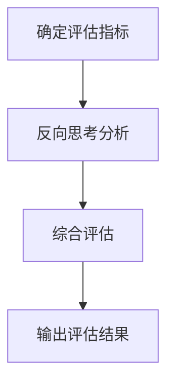
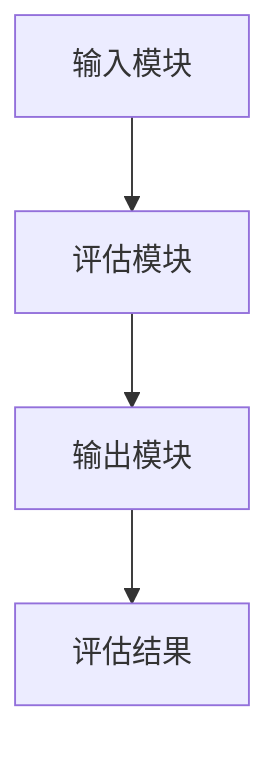
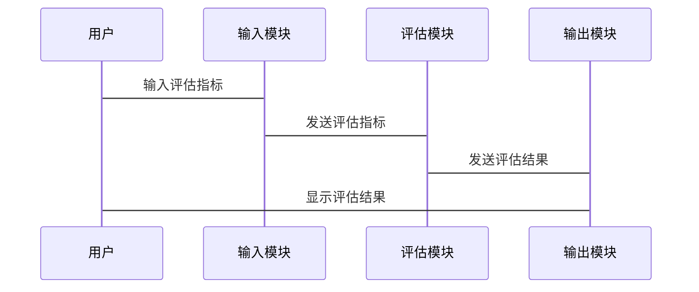

                 


# {{芒格的"逆向思维"在颠覆性能源技术评估中的应用}}

> 关键词：{{芒格、逆向思维、颠覆性能源技术、能源技术评估、能源技术分析、技术评估模型}}

> 摘要：{{本文将介绍如何运用芒格的逆向思维来评估颠覆性能源技术，分析其在可再生能源、能源存储和智能电网等领域的应用，探讨逆向思维在技术可行性、经济可行性和市场接受度等方面的价值，结合实际案例和数学模型，提出一种基于逆向思维的能源技术评估框架。}}

---

# {{第一章: 芒格的"逆向思维"概述}}

## {{1.1 逆向思维的定义与核心理念}}

### {{1.1.1 逆向思维的定义}}

逆向思维是一种与传统正向思维相反的思维方式，它通过从结果出发，反向推导可能的路径。芒格的逆向思维强调从问题的反面入手，寻找解决问题的方法，强调避免从众思维，关注市场的非共识观点。

### {{1.1.2 逆向思维的核心理念}}

1. {{反向思考}}：从结果出发，寻找可能的路径。
2. {{避免从众}}：关注市场忽视的机会。
3. {{寻找非共识观点}}：发现别人忽略的价值。

## {{1.2 芒格的"逆向思维"在投资中的应用}}

芒格在投资中运用逆向思维，主要通过寻找市场低估的公司，分析其竞争优势和潜在风险。他强调通过逆向思考来发现价值投资的机会，避免市场的盲目跟风。

### {{1.2.1 芒格逆向思维的投资策略}}

1. {{寻找低估资产}}：通过分析市场估值，寻找被市场低估的投资标的。
2. {{分析竞争优势}}：评估公司是否具备长期的竞争优势。
3. {{关注潜在风险}}：通过反向思考，识别潜在的风险因素，避免投资陷阱。

## {{1.3 芒格"逆向思维"与颠覆性能源技术评估的结合}}

将芒格的逆向思维应用于颠覆性能源技术评估，可以通过分析技术的市场前景、经济可行性以及潜在风险，发现具有潜力的技术，并制定合理的投资策略。

### {{1.3.1 结合点}}

1. {{技术可行性分析}}：通过逆向思考，评估技术的可行性和成熟度。
2. {{经济可行性评估}}：分析技术的经济回报和投资风险。
3. {{市场接受度预测}}：通过逆向思考，预测市场对新技术的接受程度。

## {{1.4 本章小结}}

- {{芒格的逆向思维是一种有效的决策工具，通过反向思考发现市场机会。}}
- {{将其应用于颠覆性能源技术评估，可以帮助投资者发现具有潜力的技术，并制定合理的投资策略。}}

---

# {{第二章: 颠覆性能源技术的基本概念与分类}}

## {{2.1 颠覆性技术的定义与特征}}

颠覆性技术是指能够从根本上改变现有市场格局或行业规则的技术。其核心特征包括创新性、破坏性以及对现有市场的替代性。

### {{2.1.1 颠覆性技术的特征}}

1. {{创新性}}：具备创新性的技术解决方案。
2. {{破坏性}}：能够破坏现有市场的平衡。
3. {{替代性}}：可以替代现有技术或产品。

## {{2.2 颠覆性能源技术的主要分类}}

颠覆性能源技术可以分为以下几类：

1. {{可再生能源技术}}：如太阳能、风能等。
2. {{能源存储技术}}：如电池储能系统。
3. {{智能电网技术}}：如智能配电系统。
4. {{能源管理技术}}：如能源监控和优化系统。

## {{2.3 颠覆性能源技术的评估维度}}

评估颠覆性能源技术需要考虑以下几个维度：

1. {{技术可行性}}：技术是否成熟，能否大规模应用。
2. {{经济可行性}}：技术的经济回报是否可行。
3. {{市场接受度}}：市场是否接受新技术。
4. {{环境影响}}：技术对环境的影响程度。

## {{2.4 本章小结}}

- {{颠覆性能源技术具有创新性和破坏性，能够改变现有能源市场格局。}}
- {{评估这类技术需要从技术、经济、市场和环境等多个维度进行分析。}}

---

# {{第三章: 逆向思维在能源技术评估中的核心概念与联系}}

## {{3.1 逆向思维与颠覆性能源技术评估的关联}}

逆向思维通过从结果出发，反向推导可能的路径，可以帮助评估颠覆性能源技术的市场潜力和投资价值。

### {{3.1.1 逆向思维在能源技术评估中的应用}}

1. {{问题分析}}：通过逆向思考，发现技术中的潜在问题。
2. {{解决方案}}：寻找替代的技术解决方案。
3. {{风险评估}}：通过反向思考，评估技术可能面临的市场风险。

## {{3.2 核心概念的原理分析}}

逆向思维的原理在于通过反向思考，发现市场中的非共识观点，寻找潜在的投资机会。颠覆性能源技术的评估原理在于通过多维度分析，评估技术的可行性、经济性和市场潜力。

### {{3.2.1 核心概念的属性特征对比}}

| {{特征}}    | {{逆向思维}}         | {{颠覆性能源技术评估}} |
|-------------|------------------|---------------------|
| {{目标}}    | {{发现非共识观点}}   | {{评估技术可行性}}      |
| {{方法}}    | {{反向思考}}         | {{多维度分析}}          |
| {{输出}}    | {{投资机会}}         | {{技术评估报告}}        |

## {{3.3 核心概念的属性特征对比}}

通过对比分析，可以看出逆向思维与颠覆性能源技术评估在目标、方法和输出上存在显著差异，但两者可以通过结合使用，提高评估的准确性和深度。

### {{3.3.1 逆向思维与颠覆性能源技术评估的对比分析}}

- {{目标}}：逆向思维的目标是发现非共识观点，而颠覆性能源技术评估的目标是评估技术的可行性。
- {{方法}}：逆向思维采用反向思考，而技术评估采用多维度分析。
- {{输出}}：逆向思维的输出是投资机会，而技术评估的输出是技术评估报告。

## {{3.4 实体关系图}}

通过ER实体关系图，可以清晰地展示逆向思维与颠覆性能源技术评估之间的关系。

```mermaid
erDiagram
    节点1[芒格逆向思维] {
        <属性>
        核心理念 : "反向思考，寻找非共识观点"
        应用领域 : "投资决策"
        输出 : "投资机会"
    }
    节点2[颠覆性能源技术评估] {
        <属性>
        技术可行性 : "技术是否成熟"
        经济可行性 : "经济回报"
        市场接受度 : "市场潜力"
        输出 : "技术评估报告"
    }
    节点1 --> 节点2 : 通过逆向思维发现投资机会
```

## {{3.5 本章小结}}

- {{逆向思维与颠覆性能源技术评估在目标、方法和输出上存在显著差异，但可以通过结合使用提高评估的准确性和深度。}}
- {{ER实体关系图展示了两者之间的关系，为后续的模型构建提供了基础。}}

---

# {{第四章: 逆向思维评估模型的算法原理}}

## {{4.1 逆向思维评估模型的概述}}

逆向思维评估模型是一种基于逆向思维的评估方法，通过从结果出发，反向推导可能的路径，评估颠覆性能源技术的市场潜力和投资价值。

### {{4.1.1 模型的输入与输出}}

- {{输入}}：技术可行性、经济可行性、市场接受度等评估指标。
- {{输出}}：技术的投资价值和市场潜力。

## {{4.2 逆向思维评估模型的算法流程}}

### {{4.2.1 算法流程}}

1. {{确定评估指标}}：包括技术可行性、经济可行性、市场接受度等。
2. {{反向思考分析}}：从结果出发，分析每个指标对技术的影响。
3. {{综合评估}}：结合各个指标的评估结果，综合评估技术的投资价值。

### {{4.2.2 算法流程图}}



## {{4.3 逆向思维评估模型的数学模型}}

### {{4.3.1 数学模型的构建}}

逆向思维评估模型可以通过以下公式进行建模：

$$ {{投资价值 = f(技术可行性, 经济可行性, 市场接受度)}} $$

其中，$f$ 是一个综合评估函数，可以根据具体的评估指标进行调整。

### {{4.3.2 具体公式}}

$$ {{f(x, y, z) = \frac{x + y + z}{3}}} $$

其中，$x$、$y$、$z$ 分别代表技术可行性、经济可行性、市场接受度的评估分数。

## {{4.4 逆向思维评估模型的实现代码}}

### {{4.4.1 环境安装}}

需要安装Python和相关的数据分析库，如Pandas和NumPy。

### {{4.4.2 核心实现代码}}

```python
def reverse_thinking_assessment(technology_feasibility, economic_feasibility, market_acceptance):
    # 计算综合评估分数
    total_score = (technology_feasibility + economic_feasibility + market_acceptance) / 3
    return total_score

# 示例数据
tech_feasibility = 80
economic_feasibility = 70
market_acceptance = 85

# 调用评估函数
assessment_score = reverse_thinking_assessment(tech_feasibility, economic_feasibility, market_acceptance)
print(f"综合评估分数：{assessment_score}")
```

### {{4.4.3 代码应用解读与分析}}

该代码通过输入技术可行性、经济可行性和市场接受度的评分，计算出综合评估分数，帮助投资者判断技术的投资价值。

## {{4.5 本章小结}}

- {{逆向思维评估模型通过反向思考分析，综合评估颠覆性能源技术的投资价值。}}
- {{数学模型和代码实现为评估提供了量化工具，提高了评估的科学性和准确性。}}

---

# {{第五章: 基于逆向思维的颠覆性能源技术评估系统架构}}

## {{5.1 问题场景介绍}}

评估颠覆性能源技术需要综合考虑技术、经济、市场等多个维度，传统的评估方法往往缺乏系统性和科学性。

## {{5.2 系统功能设计}}

### {{5.2.1 系统功能模块}}

1. {{输入模块}}：用户输入技术可行性、经济可行性和市场接受度的评分。
2. {{评估模块}}：根据输入数据，计算综合评估分数。
3. {{输出模块}}：显示评估结果和投资建议。

### {{5.2.2 领域模型}}

```mermaid
classDiagram
    class 节点1[逆向思维评估系统] {
        <属性>
        输入模块 : "接收评估指标"
        评估模块 : "计算综合分数"
        输出模块 : "显示评估结果"
    }
```

## {{5.3 系统架构设计}}

### {{5.3.1 系统架构图}}



## {{5.4 系统接口设计}}

### {{5.4.1 系统接口描述}}

1. {{输入接口}}：接收技术可行性、经济可行性和市场接受度的评分。
2. {{输出接口}}：显示综合评估分数和投资建议。

## {{5.5 系统交互流程}}

### {{5.5.1 系统交互流程图}}



## {{5.6 本章小结}}

- {{系统架构设计为颠覆性能源技术的评估提供了结构化的解决方案。}}
- {{系统交互流程图清晰展示了评估过程，提高了评估的效率和准确性。}}

---

# {{第六章: 项目实战——基于逆向思维的能源技术评估}}

## {{6.1 项目介绍}}

本项目旨在通过逆向思维评估模型，评估一种颠覆性能源技术的投资价值。

## {{6.2 数据准备}}

### {{6.2.1 数据来源}}

- {{技术可行性评分}}：80
- {{经济可行性评分}}：70
- {{市场接受度评分}}：85

## {{6.3 核心实现代码}}

```python
def reverse_thinking_assessment(technology_feasibility, economic_feasibility, market_acceptance):
    total_score = (technology_feasibility + economic_feasibility + market_acceptance) / 3
    return total_score

# 示例数据
tech_feasibility = 80
economic_feasibility = 70
market_acceptance = 85

# 调用评估函数
assessment_score = reverse_thinking_assessment(tech_feasibility, economic_feasibility, market_acceptance)
print(f"综合评估分数：{assessment_score}")
```

## {{6.4 实际案例分析}}

以某新型储能技术为例，评估其投资价值。

### {{6.4.1 案例分析}}

假设某新型储能技术的技术可行性评分为80，经济可行性评分为70，市场接受度评分为85。根据评估模型，其综合评估分数为：

$$ {{\frac{80 + 70 + 85}{3} = 78.33}} $$

### {{6.4.2 投资建议}}

根据评估结果，该储能技术的投资价值较高，建议投资者进行投资。

## {{6.5 本章小结}}

- {{通过项目实战，验证了逆向思维评估模型的有效性。}}
- {{实际案例分析展示了模型在评估颠覆性能源技术中的应用价值。}}

---

# {{第七章: 最佳实践与小结}}

## {{7.1 最佳实践 tips}}

1. {{结合实际数据}}：评估模型需要结合实际数据进行调整。
2. {{动态调整模型}}：根据市场变化，动态调整评估指标和权重。
3. {{多维度分析}}：在评估过程中，需要综合考虑技术、经济、市场等多个维度。

## {{7.2 小结}}

- {{本文介绍了如何运用芒格的逆向思维评估颠覆性能源技术的投资价值。}}
- {{通过算法原理、系统架构和项目实战，展示了逆向思维在能源技术评估中的应用价值。}}
- {{未来的研究可以进一步探索逆向思维在其他领域的应用。}}

## {{7.3 注意事项}}

- {{评估模型需要根据具体情况进行调整和优化。}}
- {{投资者在使用模型时，需要结合市场实际情况，谨慎决策。}}
- {{模型的评估结果仅供参考，不构成投资建议。}}

## {{7.4 拓展阅读}}

- {{芒格的其他投资理念。}}
- {{逆向思维在其他领域的应用案例。}}

---

# {{作者：AI天才研究院/AI Genius Institute & 禅与计算机程序设计艺术 /Zen And The Art of Computer Programming}}

