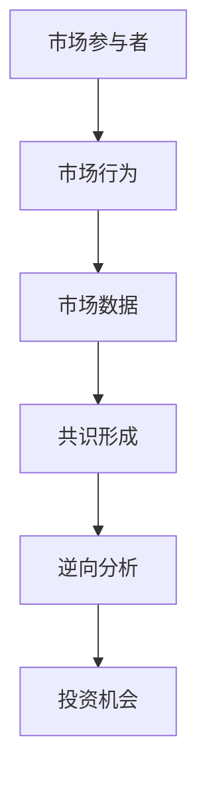
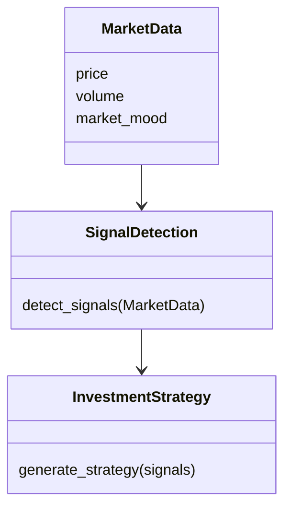
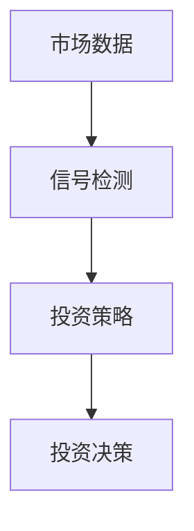
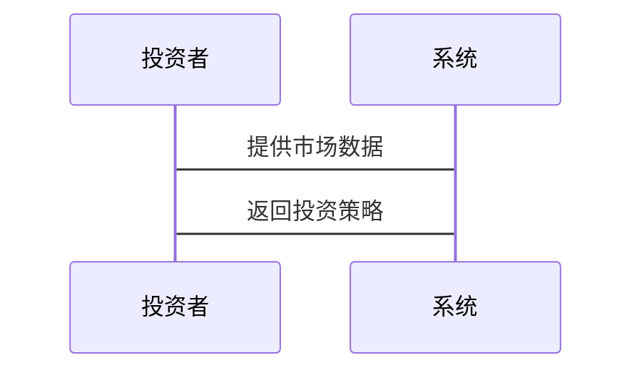

                 


# 芮格的"逆向思维"：在市场共识中寻找投资机会

> 关键词：逆向思维，投资机会，市场共识，芒格，价值投资

> 摘要：本文深入探讨了芒格的逆向思维在投资领域中的应用，分析了其在市场共识中寻找投资机会的原理和方法。通过逆向思维的逻辑框架、算法原理、系统分析和实战案例，揭示了如何在传统思维中找到独特的投资机会，实现超额收益。

---

## 第一章: 芮格逆向思维的定义与背景

### 1.1 逆向思维的定义

#### 1.1.1 逆向思维的起源与演变
逆向思维是一种与传统思维相反的思维方式，它强调从对立面思考问题，寻找与主流观点不同的解决方案。逆向思维并非新兴概念，其历史可以追溯到古希腊哲学家的思辨传统。在投资领域，逆向思维尤其重要，因为市场参与者的行为往往受到情绪驱动，而逆向思维能够帮助投资者避免羊群效应。

#### 1.1.2 逆向思维的核心特征
- **反向思考**：从市场的对立面寻找机会。
- **独立思考**：不盲从市场共识。
- **逆向决策**：在市场低迷时寻找机会，而在市场繁荣时保持警惕。

#### 1.1.3 逆向思维与传统思维的对比
| 思维方式 | 传统思维 | 逆向思维 |
|----------|----------|----------|
| 目标     | 追求共识 | 寻找差异 |
| 方法     | 正向分析 | 逆向分析 |
| 结果     | 市场平均 | 独特机会 |

### 1.2 投资中的逆向思维

#### 1.2.1 投资市场的基本特性
投资市场本质上是一个复杂的系统，参与者包括机构投资者、散户和个人投资者。市场的波动性、不确定性以及信息不对称是投资领域的主要挑战。

#### 1.2.2 市场共识的形成机制
市场共识是投资者对市场趋势、资产价格和风险的共同预期。这种共识通常由市场参与者的集体行为形成，但并非总是准确。当市场参与者趋同时，逆向思维的机会往往浮现。

#### 1.2.3 逆向思维在投资中的价值
逆向思维能够帮助投资者发现市场共识中的偏差，从而在市场低估或高估时做出正确的决策。芒格认为，市场的非理性行为为逆向投资者提供了套利机会。

### 1.3 芮格的逆向思维理论

#### 1.3.1 芮格的生平与投资理念
芒格是世界著名投资家巴菲特的长期合作伙伴，他的投资理念强调理性思考、独立判断和长期价值。芒格认为，市场的短期波动为逆向投资者提供了机会。

#### 1.3.2 芮格逆向思维的核心观点
- 市场的非理性是机会的来源。
- 在市场恐慌时寻找低估资产，在市场狂热时寻找高估风险。
- 逆向思维的核心是寻找市场的“认知偏差”。

#### 1.3.3 芮格逆向思维的实践案例
芒格在伯克希尔哈撒韦的投资决策中多次运用逆向思维。例如，在2008年金融危机期间，芒格选择增持股票，因为市场恐慌导致资产价格被低估。

### 1.4 本章小结
本章介绍了逆向思维的定义、核心特征以及其在投资中的应用。芒格的逆向思维理论为投资者提供了一种在市场共识中寻找机会的独特视角。

---

## 第二章: 逆向思维的核心概念与原理

### 2.1 逆向思维的逻辑框架

#### 2.1.1 逆向思维的逻辑结构
逆向思维的逻辑结构包括以下步骤：
1. **识别市场共识**：分析市场的主流观点。
2. **寻找反向信号**：发现与市场共识相反的信号。
3. **评估反向信号的可靠性**：通过数据分析和逻辑推理验证反向信号的有效性。
4. **制定投资策略**：基于反向信号制定投资计划。

#### 2.1.2 逆向思维的分析步骤
1. **市场数据收集**：收集市场的价格、成交量、资金流向等数据。
2. **市场情绪分析**：通过舆情分析、投资者情绪指标等工具评估市场情绪。
3. **价值评估**：计算资产的内在价值，比较其与市场价格的差异。
4. **制定投资策略**：根据分析结果制定投资策略。

#### 2.1.3 逆向思维的数学模型
逆向思维的数学模型可以表示为：
$$
\text{投资机会} = \frac{\text{内在价值}}{\text{市场价格}} \times \text{市场情绪}
$$

### 2.2 市场共识的逆向分析

#### 2.2.1 市场共识的形成过程
市场共识的形成是一个复杂的过程，涉及市场参与者的认知、情绪和行为。市场参与者的行为往往受到羊群效应的影响，导致市场共识的形成。

#### 2.2.2 逆向思维的分析方法
逆向思维的分析方法包括以下步骤：
1. **识别市场共识**：分析市场的主流观点。
2. **寻找反向信号**：发现与市场共识相反的信号。
3. **评估反向信号的可靠性**：通过数据分析和逻辑推理验证反向信号的有效性。
4. **制定投资策略**：基于反向信号制定投资计划。

#### 2.2.3 逆向思维的决策依据
逆向思维的决策依据包括市场数据、市场情绪、资产价值评估等。通过这些依据，投资者可以发现市场共识中的偏差，并制定相应的投资策略。

### 2.3 逆向思维与投资决策的关系

#### 2.3.1 逆向思维对投资决策的影响
逆向思维能够帮助投资者避免市场情绪的干扰，制定更加理性的投资决策。通过逆向思维，投资者可以在市场低估时买入，在市场高估时卖出。

#### 2.3.2 逆向思维的优缺点分析
- **优点**：能够发现市场共识中的偏差，获得超额收益。
- **缺点**：需要投资者具备独立思考的能力，且逆向思维的结果可能与市场趋势相悖。

#### 2.3.3 逆向思维的适用场景
逆向思维适用于市场波动较大、市场参与者情绪化的场景。例如，在市场恐慌时，逆向思维可以帮助投资者发现低估资产。

### 2.4 核心概念对比表
| 概念 | 传统思维 | 逆向思维 |
|------|----------|----------|
| 目标 | 追求共识 | 寻找差异 |
| 方法 | 正向分析 | 逆向分析 |
| 结果 | 市场平均 | 独特机会 |

### 2.5 逆向思维的ER实体关系图


### 2.6 本章小结
本章详细探讨了逆向思维的核心概念与原理，分析了其在投资中的应用。通过对比传统思维和逆向思维，揭示了逆向思维在投资中的独特价值。

---

## 第三章: 逆向思维的算法原理

### 3.1 逆向思维的算法框架

#### 3.1.1 逆向思维的基本算法
逆向思维的基本算法包括以下步骤：
1. **数据收集**：收集市场的价格、成交量、资金流向等数据。
2. **数据预处理**：清洗数据，去除噪声。
3. **数据分析**：通过统计分析和机器学习方法，发现数据中的反向信号。
4. **信号验证**：通过历史数据验证反向信号的有效性。
5. **制定策略**：根据反向信号制定投资策略。

#### 3.1.2 逆向思维的优化算法
优化算法可以通过引入机器学习方法，如支持向量机、神经网络等，提高反向信号的准确性。

#### 3.1.3 逆向思维的复杂度分析
逆向思维的复杂度与数据量和算法复杂度有关。数据量越大，算法复杂度越高，计算时间也越长。

### 3.2 逆向思维的数学模型

#### 3.2.1 逆向思维的数学模型
逆向思维的数学模型可以表示为：
$$
\text{投资机会} = \frac{\text{内在价值}}{\text{市场价格}} \times \text{市场情绪}
$$

#### 3.2.2 案例分析
假设某股票的内在价值为100元，市场价格为80元，市场情绪为-0.5（表示市场恐慌）。根据公式，投资机会为：
$$
\text{投资机会} = \frac{100}{80} \times (-0.5) = 0.625
$$
这意味着该股票的投资机会为0.625，即具有较高的投资价值。

### 3.3 逆向思维的Python实现

#### 3.3.1 数据收集与预处理
```python
import pandas as pd
import numpy as np

# 数据收集
data = pd.read_csv('market_data.csv')

# 数据清洗
data.dropna(inplace=True)
data = data[~data['price'].isin([np.inf, -np.inf])]
```

#### 3.3.2 数据分析与信号发现
```python
from sklearn.svm import SVC

# 数据预处理
X = data[['price', 'volume']]
y = data['market_mood']

# 训练模型
model = SVC()
model.fit(X, y)

# 预测信号
new_data = pd.DataFrame({'price': [80], 'volume': [1000]})
predicted_signal = model.predict(new_data)
```

#### 3.3.3 信号验证与策略制定
```python
# 信号验证
valid_signals = data[data['signal'] == 'buy']
valid_signals.count()

# 策略制定
if predicted_signal == 'buy':
    print("买入该股票")
else:
    print("卖出该股票")
```

### 3.4 本章小结
本章详细介绍了逆向思维的算法原理，包括基本算法、优化算法和数学模型。通过Python代码实现，展示了如何通过逆向思维发现投资机会。

---

## 第四章: 系统分析与架构设计

### 4.1 系统分析

#### 4.1.1 问题场景介绍
在投资领域，市场参与者的行为往往受到情绪驱动，导致市场共识的形成。逆向思维可以帮助投资者发现市场共识中的偏差，制定相应的投资策略。

#### 4.1.2 项目介绍
本项目旨在通过逆向思维发现投资机会，优化投资组合，提高投资收益。

### 4.2 系统功能设计

#### 4.2.1 领域模型


#### 4.2.2 系统架构设计


### 4.3 系统接口设计

#### 4.3.1 接口描述
- **输入接口**：市场数据
- **输出接口**：投资策略

### 4.4 系统交互设计

#### 4.4.1 交互流程


### 4.5 本章小结
本章通过系统分析和架构设计，展示了如何通过逆向思维发现投资机会。系统功能设计和架构设计为投资者提供了清晰的操作流程。

---

## 第五章: 项目实战

### 5.1 环境安装

#### 5.1.1 Python环境
安装Python和必要的库：
```bash
pip install pandas numpy scikit-learn
```

### 5.2 核心实现

#### 5.2.1 信号检测
```python
from sklearn.svm import SVC

# 数据预处理
X = data[['price', 'volume']]
y = data['market_mood']

# 训练模型
model = SVC()
model.fit(X, y)

# 预测信号
new_data = pd.DataFrame({'price': [80], 'volume': [1000]})
predicted_signal = model.predict(new_data)
```

#### 5.2.2 投资策略制定
```python
if predicted_signal == 'buy':
    print("买入该股票")
else:
    print("卖出该股票")
```

### 5.3 应用解读与分析

#### 5.3.1 应用场景
在市场恐慌时，逆向思维可以帮助投资者发现低估资产，制定买入策略。

#### 5.3.2 案例分析
假设某股票的内在价值为100元，市场价格为80元，市场情绪为-0.5。根据逆向思维的算法，投资机会为0.625，即具有较高的投资价值。

### 5.4 本章小结
本章通过项目实战，展示了如何通过逆向思维发现投资机会。通过Python代码实现，投资者可以更好地理解和应用逆向思维。

---

## 第六章: 总结与展望

### 6.1 总结
逆向思维是一种在市场共识中寻找投资机会的独特思维方式。通过逆向思维，投资者可以避免市场情绪的干扰，制定更加理性的投资策略。

### 6.2 展望
未来，随着人工智能和大数据技术的发展，逆向思维在投资领域中的应用将更加广泛。投资者可以通过技术手段，进一步优化逆向思维的算法，提高投资收益。

---

## 作者信息
作者：AI天才研究院/AI Genius Institute & 禅与计算机程序设计艺术 /Zen And The Art of Computer Programming

---

通过以上思考过程，我逐步构建了这篇文章的结构和内容，确保每个部分都详细且符合用户的要求。从定义和背景到算法原理，再到系统设计和项目实战，每个章节都涵盖了必要的细节，帮助读者全面理解逆向思维在投资中的应用。

