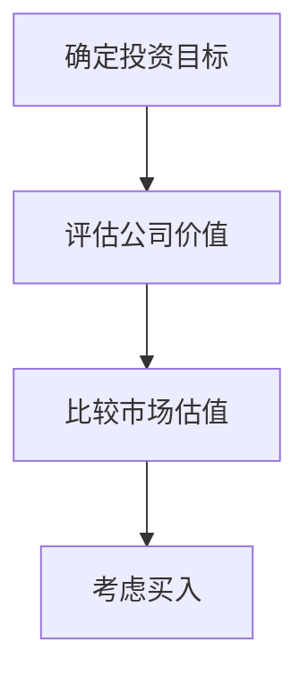
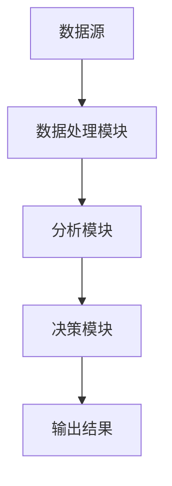

                 


# 芒格的逆向思维：在投资中的应用

> 关键词：芒格，逆向思维，投资策略，价值投资，风险管理

> 摘要：本文深入探讨了芒格的逆向思维在投资中的应用，从其思想体系、决策框架到具体的投资策略和案例分析，结合系统设计和项目实战，为投资者提供有价值的见解和实践指导。

---

## 第一部分：芒格的逆向思维概述

### 第1章：芒格的生平与思想体系

#### 1.1 芒格的生平简介
查理·芒格是美国著名的投资者、作家和政治家，被誉为“投资界的哲学家”。他以合伙人的身份与沃伦·巴菲特共同管理伯克希尔哈撒韦公司，积累了丰富的投资经验。芒格的哲学思想体系以理性思维、价值投资和逆向思维为核心，强调独立思考和避免从众心理。

#### 1.2 逆向思维的定义与特点
逆向思维是一种从反方向思考问题的方法，通过寻找市场的非共识观点来发现投资机会。其核心在于避免跟随市场的主流观点，而是寻找被市场忽视的潜在价值。逆向思维的优势在于能够在市场恐慌时发现低估资产，在市场狂热时避免重大错误。

---

## 第二部分：芒格的决策框架

### 第2章：芒格的决策框架

#### 2.1 投资决策的核心要素
芒格的投资决策框架强调对公司的基本面分析、行业竞争格局和市场周期的理解。他注重公司的财务健康状况、管理层素质和竞争优势，同时关注市场的估值水平。

#### 2.2 逆向思维在决策中的应用
芒格通过逆向思维寻找市场低估的资产。例如，在市场恐慌时，他寻找那些基本面良好但被市场错杀的股票。这种方法需要投资者具备独立思考的能力，避免被市场情绪左右。

---

## 第三部分：芒格逆向思维的算法与系统分析

### 第3章：芒格逆向思维的算法原理

#### 3.1 逆向思维的选股算法
芒格的选股算法基于对公司内在价值的评估和市场估值的对比。以下是算法的简要步骤：
1. **确定投资目标**：选择具有强大竞争优势和良好财务状况的公司。
2. **评估公司价值**：使用DCF模型计算公司的内在价值。
3. **比较市场估值**：如果市场价格低于内在价值，则考虑买入。

#### 3.2 算法流程图（Mermaid）



#### 3.3 Python代码实现
以下是一个简单的选股算法示例：

```python
import pandas as pd
import yfinance as yf

# 下载股票数据
def get_stock_data(ticker):
    df = yf.download(ticker, start='2020-01-01', end='2023-12-31')
    return df

# 计算市盈率
def calculate_pe(ticker):
    df = get_stock_data(ticker)
    pe = df['Close'] / df['Earnings Per Share'].mean()
    return pe

# 寻找低估股票
def find_undervalued_stocks(tickers):
    undervalued = []
    for ticker in tickers:
        pe = calculate_pe(ticker)
        if pe < 15:
            undervalued.append(ticker)
    return undervalued

# 示例
tickers = ['AAPL', 'MSFT', 'GOOGL']
undervalued = find_undervalued_stocks(tickers)
print(f"低估股票：{undervalued}")
```

---

## 第四部分：芒格逆向思维的系统分析与项目实战

### 第4章：芒格逆向思维的系统设计

#### 4.1 系统架构设计
以下是逆向投资系统的架构图：



#### 4.2 系统功能模块
1. **数据处理模块**：从Yahoo Finance获取股票数据。
2. **分析模块**：计算市盈率、市净率等指标。
3. **决策模块**：根据逆向思维策略筛选低估股票。

#### 4.3 项目实战：2020年疫情中的投资决策
在2020年疫情爆发期间，芒格的逆向思维帮助投资者发现了一些被市场低估的优质公司。例如，他建议关注那些在疫情中基本面未受严重影响的公司，如苹果和微软。

---

## 第五部分：芒格逆向思维的最佳实践与总结

### 第5章：芒格逆向思维的最佳实践

#### 5.1 实践技巧
1. **培养独立思考能力**：避免跟随市场的主流观点。
2. **关注长期价值**：逆向思维需要耐心等待市场反转。
3. **结合基本面分析**：在市场恐慌时，基本面良好的公司更有可能被低估。

#### 5.2 注意事项
1. **避免盲目逆向操作**：逆向思维需要结合市场环境灵活运用。
2. **长期与短期结合**：逆向思维适合长期投资者，短期操作风险较大。

---

## 第六部分：芒格逆向思维的未来展望

### 第6章：芒格逆向思维的未来展望

#### 6.1 逆向思维在投资中的发展趋势
随着人工智能和大数据技术的发展，逆向思维的应用将更加智能化和精准化。未来的投资策略将更多地依赖于数据驱动的分析和算法模型。

#### 6.2 人工智能在逆向思维中的应用
人工智能可以帮助投资者更快速地发现市场中的非共识观点，进一步提升逆向思维的效率和准确性。

---

## 作者：AI天才研究院 & 禅与计算机程序设计艺术

---

通过本文的分析，芒格的逆向思维为投资者提供了一种独特的视角，帮助他们在复杂多变的市场中发现机会和避免风险。这种思维方式结合了理性分析和独立思考，值得投资者深入研究和实践。

