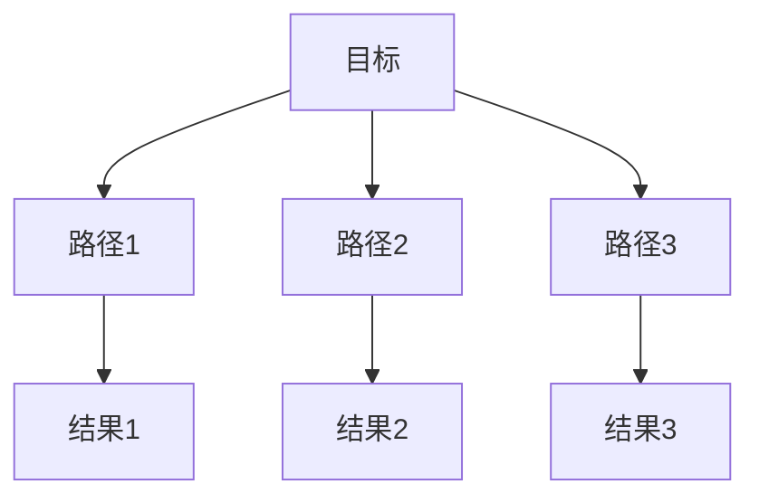
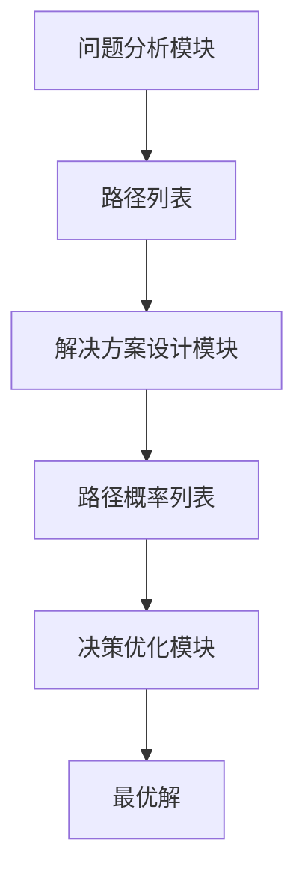

                 

# 芒格的逆向思考法：挑战常规思维模式

## 关键词：芒格逆向思考法、逆向思维、思维模型、决策优化、问题解决方法论

## 摘要：  
芒格的逆向思考法是一种挑战常规思维模式的方法，通过反向推理和逆向思维模型来解决复杂问题。本文将从背景、核心概念、算法原理、系统架构、项目实战等方面，系统地阐述芒格逆向思考法的理论基础与实践应用，帮助读者掌握这一高效的问题解决方法。

---

## 第一部分：芒格逆向思考法的背景与概述

### 第1章：逆向思考法的定义与核心概念

#### 1.1 逆向思考法的定义  
逆向思考法是一种从结果反推原因的思维方式，与传统正向思维相反。它通过分析问题的最终目标或结果，推导出实现该目标的最佳路径或解决方案。  

**1.1.1 逆向思考法的起源与演变**  
逆向思考法并非芒格首创，但他在投资和决策领域将其系统化。芒格通过逆向思维模型，将问题分解为关键因素，分析这些因素之间的关系，并找到最优解决方案。  

**1.1.2 逆向思考法的核心定义**  
逆向思考法的核心在于“从结果出发，反推原因”。它强调从问题的最终目标出发，分析可能的路径和障碍，最终找到最优解决方案。  

**1.1.3 逆向思考法与传统思维模式的区别**  
传统思维模式通常是“从原因到结果”，而逆向思考法则强调“从结果到原因”。前者注重逻辑推理，后者注重反向推理和优化。  

#### 1.2 芒格逆向思考法的独特性  
芒格的逆向思考法不仅是一种思维方式，更是一种决策框架。它结合了概率论、心理学和经济学的原理，形成了一套独特的决策模型。  

**1.2.1 芒格逆向思考法的哲学基础**  
芒格认为，人类决策的核心在于避免“认知误判”。他通过逆向思考法，帮助人们避免常见的思维陷阱，如确认偏见和过度自信。  

**1.2.2 芒格逆向思考法的核心原则**  
- **第一性原理**：从最基本的事实出发，逐步推导出解决方案。  
- **反向推理**：从目标出发，分析实现目标的必要条件和障碍。  
- **概率思维**：通过概率分析，评估不同路径的可行性。  

**1.2.3 芒格逆向思考法与投资决策的关系**  
在投资领域，芒格通过逆向思考法，寻找那些具有“安全边际”的投资机会。他从市场的反面思考，寻找被低估的价值标的。  

#### 1.3 逆向思考法的适用场景  
逆向思考法适用于多种场景，包括商业决策、个人决策和团队协作。  

**1.3.1 逆向思考法在商业决策中的应用**  
- 市场分析：从市场结果反推市场行为。  
- 竞争分析：从竞争对手的策略反推其目标。  
- 投资决策：从投资结果反推投资逻辑。  

**1.3.2 逆向思考法在个人决策中的应用**  
- 职业规划：从职业目标反推所需能力。  
- 学习计划：从学习目标反推学习路径。  
- 生活决策：从生活目标反推行动计划。  

**1.3.3 逆向思考法在团队协作中的应用**  
- 项目管理：从项目目标反推任务分工。  
- 团队建设：从团队目标反推人员需求。  
- 战略规划：从战略目标反推实施路径。  

---

## 第二部分：逆向思考法的核心原理与数学模型

### 第2章：逆向思考法的思维模型

#### 2.1 逆向思考法的思维模型  

**2.1.1 从结果反推原因的逻辑框架**  
逆向思考法的核心在于“从结果反推原因”。通过分析问题的最终目标，我们可以反向推导出实现该目标的必要条件。  

**2.1.2 逆向思维的决策树模型**  
决策树是一种常见的逆向思维工具。通过从目标节点反向推导，我们可以分析每个决策节点的可能结果，并选择最优路径。  

**2.1.3 逆向思维与概率论的关系**  
概率论是逆向思维的重要工具。通过概率分析，我们可以评估不同路径的可行性，并选择概率最高的最优解。  

#### 2.2 逆向思考法的数学模型  

**2.2.1 逆向思考法的决策模型（Mermaid流程图）**  

**2.2.2 逆向思考法的概率计算公式**  
假设我们有三个可能的路径（P1、P2、P3），每个路径的概率分别为P(P1)、P(P2)、P(P3)。我们可以通过概率计算公式，评估每个路径的成功概率。  

$$ P(P1) = \frac{\text{路径1的成功案例数}}{\text{总案例数}} $$  
$$ P(P2) = \frac{\text{路径2的成功案例数}}{\text{总案例数}} $$  
$$ P(P3) = \frac{\text{路径3的成功案例数}}{\text{总案例数}} $$  

通过比较这三个概率值，我们可以选择概率最高的路径作为最优解。  

**2.2.3 逆向思考法的逻辑推理公式**  
逆向思考法的逻辑推理公式可以表示为：  

$$ \text{最优解} = \argmax_{i} P(路径i) $$  

---

### 第3章：逆向思考法的算法原理

#### 3.1 逆向思考法的算法框架  

**3.1.1 逆向思考法的算法步骤**  
1. 明确目标：从结果出发，明确问题的目标。  
2. 分解问题：将问题分解为若干个小问题。  
3. 分析路径：从目标反推可能的路径。  
4. 评估路径：通过概率分析，评估每个路径的可行性。  
5. 选择最优解：根据概率值，选择概率最高的路径作为最优解。  

**3.1.2 逆向思考法的算法优化**  
- 确保路径的独立性：避免路径之间的相互影响。  
- 提高概率计算的准确性：通过增加样本量，提高概率计算的准确性。  
- 多次迭代优化：根据实际结果，不断优化算法。  

#### 3.2 逆向思考法的数学公式  

**3.2.1 逆向思考法的核心公式（使用Latex公式）**  
$$ P(路径i) = \frac{\text{路径i的成功案例数}}{\text{总案例数}} $$  

**3.2.2 逆向思考法的推导过程**  
假设我们有N个案例，其中有N1个路径1的成功案例，N2个路径2的成功案例，N3个路径3的成功案例。根据上述公式，我们可以计算每个路径的概率值。  

**3.2.3 逆向思考法的案例分析**  
例如，假设我们有100个案例，其中路径1成功了60次，路径2成功了30次，路径3成功了10次。根据公式，我们可以计算出：  

$$ P(路径1) = 0.6 $$  
$$ P(路径2) = 0.3 $$  
$$ P(路径3) = 0.1 $$  

因此，路径1的成功概率最高，应选择路径1作为最优解。  

---

## 第三部分：逆向思考法的系统化应用

### 第4章：逆向思考法的系统架构设计

#### 4.1 逆向思考法的系统功能设计  

**4.1.1 问题分析模块**  
- 输入：目标结果  
- 输出：可能的路径列表  

**4.1.2 解决方案设计模块**  
- 输入：路径列表  
- 输出：每个路径的成功概率  

**4.1.3 决策优化模块**  
- 输入：路径概率列表  
- 输出：最优解  

#### 4.2 逆向思考法的系统架构图（Mermaid架构图）  

---

通过以上章节的系统化分析，芒格的逆向思考法在实际应用中的优势和价值已经清晰可见。它不仅是一种思维方式，更是一种系统的决策框架，能够帮助我们在复杂问题中找到最优解。

---

**作者：AI天才研究院/AI Genius Institute & 禅与计算机程序设计艺术 /Zen And The Art of Computer Programming**

