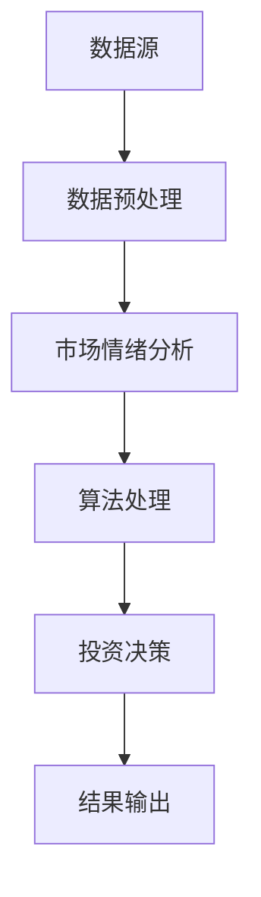
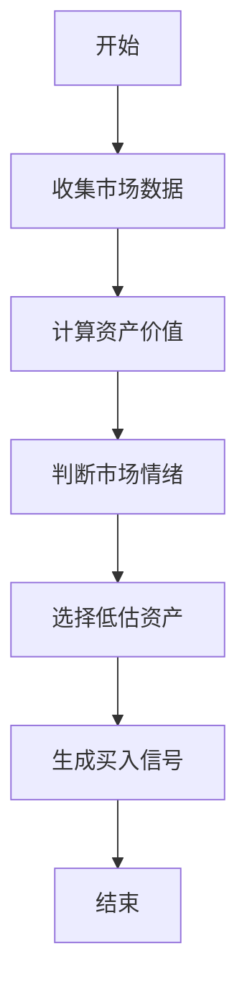
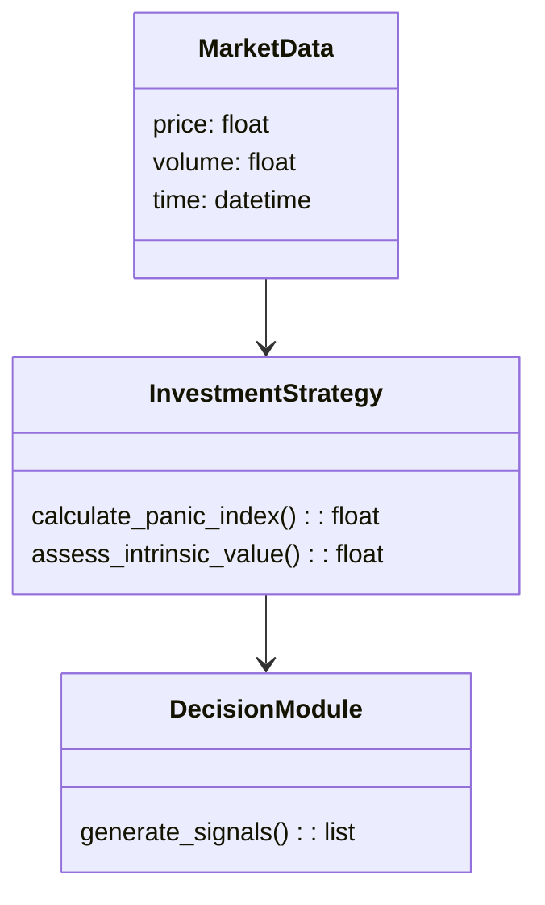
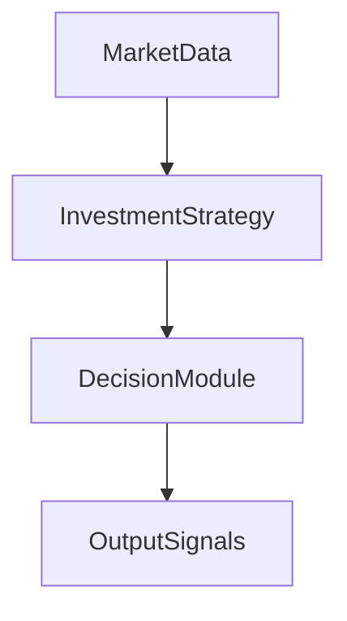
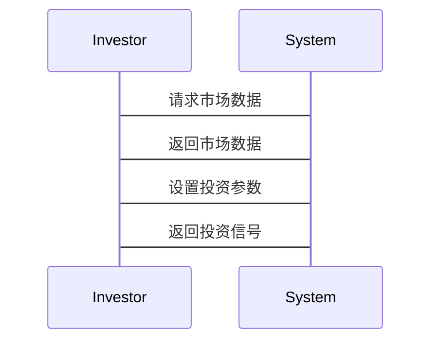

                 


# 芒格的逆向投资思维：如何在市场恐慌中获利

> 关键词：逆向投资，芒格，市场恐慌，投资策略，价值投资，风险管理

> 摘要：芒格的逆向投资思维是一种在市场恐慌中获利的投资策略，它通过反向思考市场行为，寻找被低估的投资机会。本文详细分析了逆向投资的背景、核心概念、算法原理、系统架构，并结合实际案例进行深入解读，帮助读者在市场波动中做出明智的投资决策。

---

## 第1章: 逆向投资的基本概念

### 1.1 逆向投资的定义与背景

#### 1.1.1 投资的基本概念
投资是指将资金投入到某个资产或项目中，期望在未来获得收益或资本增值的行为。投资的核心在于识别价值，抓住市场波动中的机会。

#### 1.1.2 逆向投资的定义
逆向投资是一种反向市场趋势的投资策略，即在市场恐慌时买入，在市场狂热时卖出。它与传统的顺势投资相反，强调在非理性市场中寻找低估资产。

#### 1.1.3 逆向投资的哲学基础
芒格的逆向思维来源于他对人类心理和市场行为的深刻理解。他认为市场情绪往往是非理性的，而逆向投资的核心在于利用这种非理性获利。

### 1.2 芒格的逆向思维特点

#### 1.2.1 芒格的生平简介
查理·芒格是沃伦·巴菲特的长期合作伙伴，以其独特的逆向思维和价值投资理念闻名。他不仅是成功的投资者，也是认知心理学家，强调理性思考和避免认知偏差。

#### 1.2.2 芒格的逆向思维核心理念
芒格认为，市场的情绪波动创造了投资机会。当市场恐慌时，投资者往往忽视了资产的真正价值，从而提供了低价买入的机会。

#### 1.2.3 芒格与巴菲特的搭档关系
芒格与巴菲特的合作基于互补性：芒格提供逆向思维，巴菲特提供长期价值视角。他们的合作证明了逆向投资的有效性。

---

## 第2章: 逆向投资的核心原则

### 2.1 投资中的常见误区

#### 2.1.1 追涨杀跌的误区
投资者常常在市场上涨时买入，下跌时卖出，这种行为往往导致亏损。逆向投资提醒我们要做相反的决策。

#### 2.1.2 情绪化决策的危害
市场恐慌时，投资者容易受情绪影响做出错误决策。逆向投资要求投资者保持理性，避免被情绪左右。

#### 2.1.3 过度关注短期波动的错误
短期波动往往掩盖长期价值。逆向投资强调长期价值，而非短期波动。

### 2.2 逆向投资的核心策略

#### 2.2.1 买入恐慌，卖出乐观
在市场恐慌时，资产价格被低估，此时买入；在市场乐观时，资产价格被高估，此时卖出。

#### 2.2.2 寻找市场非理性机会
通过分析市场情绪和资产价格偏离度，寻找被市场忽视的低估资产。

#### 2.2.3 长期价值导向的决策
逆向投资并非盲目跟随市场，而是基于资产的长期价值进行判断，选择在市场恐慌时买入。

### 2.3 逆向思维与价值投资的结合

#### 2.3.1 价值投资的基本原理
价值投资强调购买那些市场价格低于其内在价值的资产，长期持有，等待市场重新评估其价值。

#### 2.3.2 逆向思维如何优化价值投资
逆向投资通过在市场恐慌时买入，优化了价值投资的买入时机，降低了买入成本。

#### 2.3.3 芒格对价值投资的独特贡献
芒格将认知心理学引入价值投资，强调避免认知偏差，理性分析市场，从而优化投资决策。

---

## 第3章: 市场恐慌的成因与识别

### 3.1 市场恐慌的定义与表现

#### 3.1.1 市场恐慌的多维分析
市场恐慌是指投资者因害怕损失而大量抛售资产，导致资产价格急剧下降的现象。

#### 3.1.2 投资者情绪的波动周期
市场情绪通常呈现周期性波动，从乐观到恐慌，再从恐慌到乐观，形成一个循环。

#### 3.1.3 市场恐慌的量化指标
通过分析市场指数波动率、成交量变化、投资者情绪指数等指标，可以量化市场恐慌程度。

### 3.2 市场恐慌的驱动因素

#### 3.2.1 经济基本面因素
经济数据如GDP增长率、就业数据等不佳，可能导致市场恐慌。

#### 3.2.2 市场参与者的心理因素
投资者的心理预期和行为习惯是市场恐慌的重要驱动因素。

#### 3.2.3 媒体传播的影响
负面新闻和恐慌性报道会加剧市场恐慌，放大市场波动。

### 3.3 识别市场恐慌的技巧

#### 3.3.1 通过历史数据分析市场恐慌
利用历史市场数据，识别恐慌时期的模式和特征。

#### 3.3.2 利用技术指标预测市场情绪
通过技术指标如RSI（相对强弱指数）判断市场超卖或超买状态，预测市场情绪。

#### 3.3.3 结合新闻事件判断市场恐慌
分析重大新闻事件对市场情绪的影响，判断市场是否处于恐慌状态。

---

## 第4章: 逆向投资的具体策略

### 4.1 逆向投资的选股标准

#### 4.1.1 评估企业的内在价值
通过基本面分析，评估企业的盈利能力、成长潜力和财务健康状况。

#### 4.1.2 寻找被市场低估的资产
比较市场价格与内在价值，选择价格低于价值的资产。

#### 4.1.3 确保安全边际
在买入时，留有一定的安全边际，以应对市场波动和不确定性。

### 4.2 逆向投资的执行步骤

#### 4.2.1 确定投资目标
明确投资目标，选择适合自己的投资策略和资产配置。

#### 4.2.2 分批买入策略
在市场恐慌时，分批买入，逐步建仓，分散风险。

#### 4.2.3 长期持有策略
逆向投资强调长期持有，避免频繁交易，耐心等待市场回归合理估值。

### 4.3 逆向投资的风险管理

#### 4.3.1 设置止损点
在市场恐慌时，设置止损点以控制潜在损失。

#### 4.3.2 分散投资组合
通过分散投资降低风险，避免过度集中于某一资产或行业。

#### 4.3.3 定期评估投资组合
定期评估投资组合的表现，调整策略以适应市场变化。

---

## 第5章: 逆向投资的系统架构与算法原理

### 5.1 系统架构设计

#### 5.1.1 问题场景介绍
市场恐慌时，投资者需要快速识别低估资产，制定买入策略。

#### 5.1.2 系统功能设计
- 数据收集模块：收集市场数据，分析市场情绪。
- 算法处理模块：应用逆向投资算法，筛选低估资产。
- 决策支持模块：生成买入信号，指导投资决策。

#### 5.1.3 系统架构图


### 5.2 逆向投资算法原理

#### 5.2.1 算法流程图


#### 5.2.2 数学模型与公式
市场恐慌程度可以用恐慌指数（VIX）表示：
$$ \text{恐慌指数} = \sqrt{\sum_{i=1}^{n} (p_i - \mu)^2} $$
其中，\( p_i \) 是资产价格，\( \mu \) 是平均价格。

资产价值评估公式：
$$ \text{内在价值} = \frac{\text{现金流}}{\text{折现率}} $$

### 5.3 算法实现代码

```python
import pandas as pd
import numpy as np

def calculate_market_panic(assets):
    # 计算市场恐慌指数
    average_price = np.mean(assets)
    variance = np.sum((asset - average_price) ** 2 for asset in assets)
    panic_index = np.sqrt(variance)
    return panic_index

def assess_value(asset_price, cash_flow, discount_rate):
    # 评估资产的内在价值
    intrinsic_value = cash_flow / discount_rate
    if asset_price < intrinsic_value:
        return "买入"
    else:
        return "观望"

assets = [100, 90, 80, 70, 60]
panic_index = calculate_market_panic(assets)
print(f"恐慌指数: {panic_index}")

cash_flow = 1000
discount_rate = 0.05
decision = assess_value(assets[0], cash_flow, discount_rate)
print(f"投资决策: {decision}")
```

---

## 第6章: 逆向投资的项目实战

### 6.1 环境安装与数据准备

#### 6.1.1 环境安装
- 安装Python和必要的库（pandas、numpy、matplotlib）。
- 数据来源：历史市场数据，如股票价格、指数等。

#### 6.1.2 数据预处理
清洗数据，填充缺失值，处理异常值。

### 6.2 核心实现代码

```python
import pandas as pd
import numpy as np
import matplotlib.pyplot as plt

# 加载数据
data = pd.read_csv("market_data.csv")

# 计算恐慌指数
def calculate_panic_index(data):
    return data['price'].std()

panic_index = calculate_panic_index(data)
print(f"恐慌指数: {panic_index}")

# 逆向投资策略实现
def reverse_investment_strategy(data, threshold=0.2):
    buy_signals = []
    for price in data['price']:
        if price < data['intrinsic_value'].mean() * (1 - threshold):
            buy_signals.append(True)
        else:
            buy_signals.append(False)
    return buy_signals

# 生成决策信号
buy_signals = reverse_investment_strategy(data)
data['signal'] = buy_signals

# 可视化
plt.figure(figsize=(10, 6))
plt.plot(data['price'], label='Price')
plt.plot(data['intrinsic_value'], label='Intrinsic Value')
plt.scatter(data.index, data['price'][data['signal']], color='red', label='Buy Signal')
plt.legend()
plt.show()
```

### 6.3 案例分析与解读

#### 6.3.1 案例背景
假设2020年新冠疫情爆发期间，市场恐慌导致股票价格大幅下跌，许多优质资产被低估。

#### 6.3.2 数据分析
分析历史数据，识别恐慌时期的资产价格波动，计算恐慌指数，评估资产的内在价值。

#### 6.3.3 投资决策
在恐慌期间，识别低估资产，生成买入信号，分批买入，逐步建仓。

### 6.4 项目小结

通过实际案例分析，验证逆向投资策略的有效性，总结经验教训，优化投资模型。

---

## 第7章: 逆向投资的系统分析与优化

### 7.1 系统功能设计

#### 7.1.1 领域模型设计


#### 7.1.2 系统架构设计


### 7.2 系统接口设计

#### 7.2.1 输入接口
- 市场数据接口：接收实时市场数据。
- 参数设置接口：设置恐慌阈值、安全边际等参数。

#### 7.2.2 输出接口
- 信号输出接口：生成买入或卖出信号。
- 报告输出接口：生成投资报告和分析结果。

### 7.3 系统交互设计

#### 7.3.1 交互流程图


---

## 第8章: 逆向投资的最佳实践与注意事项

### 8.1 投资策略优化

#### 8.1.1 定期评估策略
定期回顾投资表现，根据市场变化调整策略。

#### 8.1.2 组合优化
通过分散投资降低风险，避免过度集中。

#### 8.1.3 持续学习
关注市场动态，学习新的投资知识，优化投资策略。

### 8.2 风险管理技巧

#### 8.2.1 设置止损点
在市场恐慌时，设置止损点以控制风险。

#### 8.2.2 管理情绪
避免情绪化决策，保持理性思考。

#### 8.2.3 多策略结合
结合多种投资策略，灵活应对市场变化。

### 8.3 拓展阅读

推荐书籍和资源，帮助读者深入理解逆向投资。

---

## 第9章: 总结与未来展望

### 9.1 本章总结
总结全文内容，重申逆向投资的核心理念和实际应用。

### 9.2 未来展望
展望逆向投资的发展趋势，探讨新技术在投资中的应用。

---

## 作者信息

作者：AI天才研究院/AI Genius Institute & 禅与计算机程序设计艺术 /Zen And The Art of Computer Programming

---

以上是《芒格的逆向投资思维：如何在市场恐慌中获利》的完整目录大纲及文章内容，涵盖了逆向投资的背景、核心概念、算法原理、系统架构和项目实战等多个方面，详细解读了如何在市场恐慌中利用逆向思维获利，并提供了具体的实现代码和案例分析。

