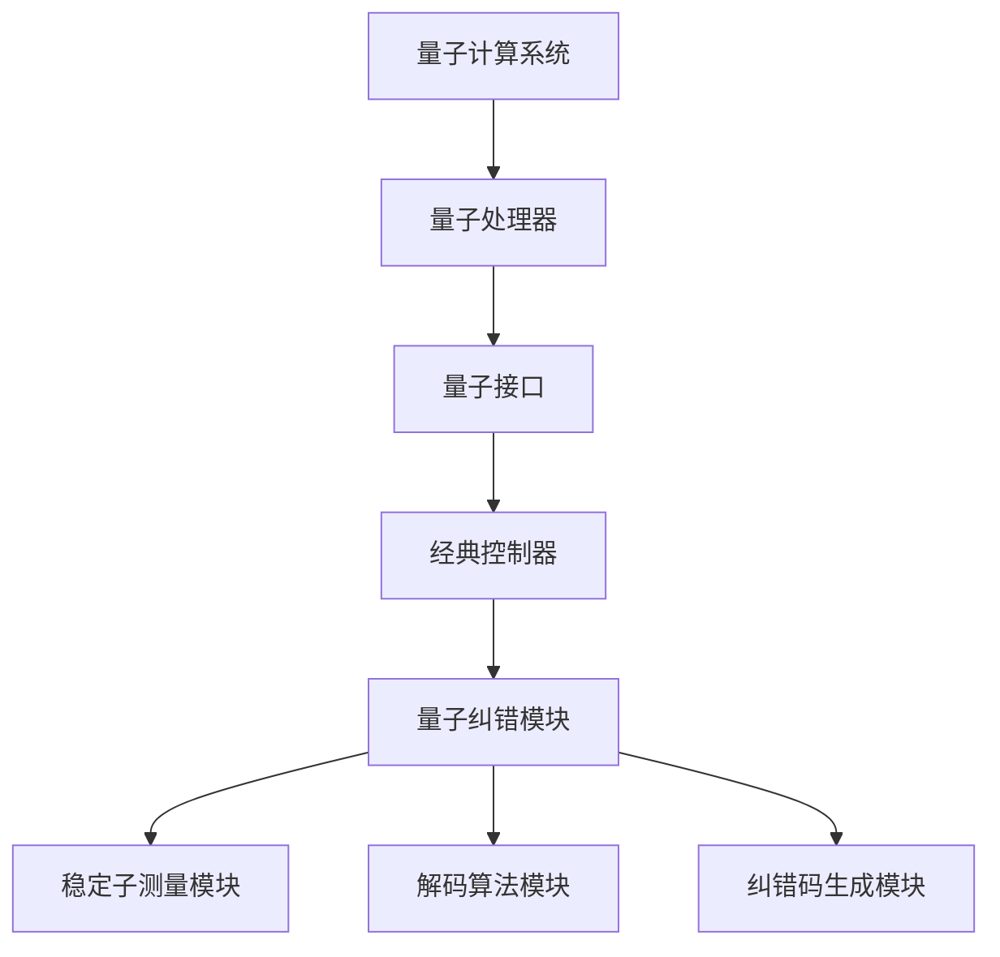

                 


# 《芒格的"避免失败"原则在量子纠错技术商业化中的应用》

## 关键词：
- 芒格原则
- 量子纠错技术
- 商业化应用
- 系统设计
- 量子计算

## 摘要：
芒格的“避免失败”原则是一种以系统性思维和长期主义为核心的决策方法，强调通过避免重大错误来实现成功。本文将探讨这一原则在量子纠错技术商业化中的应用。量子纠错技术是量子计算中确保信息准确性的关键手段，其商业化需要克服技术复杂性和市场接受度等多重挑战。通过分析芒格原则与量子纠错技术的内在联系，本文旨在为量子计算的商业化提供一种新的视角和策略。文章将从背景介绍、核心概念、算法原理、系统架构、项目实战等多维度展开，结合实际案例，详细阐述芒格原则在量子纠错技术中的应用，为量子计算的商业化提供有价值的参考。

---

## 第一部分：芒格的“避免失败”原则与量子纠错技术概述

### 第1章：芒格的“避免失败”原则

#### 1.1 芒格“避免失败”原则的核心理念

##### 1.1.1 复利思维与长期主义
芒格的复利思维强调通过积累小的成功，逐步实现质的飞跃。在量子纠错技术的商业化过程中，这种思维可以帮助企业在技术研发和市场推广中逐步优化，避免因急于求成而犯下不可挽回的错误。

##### 1.1.2 避免“钝剑”决策的智慧
芒格认为，许多错误决策源于“钝剑”思维，即在错误的方向上加倍努力。在量子纠错技术的商业化中，这种原则可以帮助企业避免盲目追求技术复杂性，而是选择更稳健的技术路线。

##### 1.1.3 芒格原则在商业中的应用
芒格的决策原则广泛应用于投资、管理等领域。在量子纠错技术的商业化中，这些原则可以帮助企业避免技术路径错误、市场定位不清等常见问题。

#### 1.2 量子纠错技术的基本概念

##### 1.2.1 量子计算的基本原理
量子计算利用量子叠加和量子纠缠的特性，能够在某些情况下显著提高计算速度。然而，量子计算的脆弱性使其容易受到环境干扰和错误的影响，因此需要纠错技术来保证计算的准确性。

##### 1.2.2 量子纠错技术的定义与作用
量子纠错技术通过引入冗余信息，检测和纠正量子信息中的错误。它是量子计算系统中不可或缺的一部分，能够显著提高系统的可靠性和实用性。

##### 1.2.3 量子纠错技术的发展历程
量子纠错技术的发展始于20世纪90年代，随着量子计算的快速发展，其重要性日益凸显。目前，量子纠错技术已在多个领域取得重要进展，但仍面临诸多挑战。

### 第2章：芒格原则与量子纠错技术的结合

#### 2.1 芒格原则在量子纠错中的应用背景

##### 2.1.1 量子计算商业化的核心挑战
量子计算的商业化面临技术复杂性高、成本高昂、市场认知度低等多重挑战。芒格的“避免失败”原则可以帮助企业在这些挑战中找到突破口。

##### 2.1.2 芒格原则的系统性思维与量子纠错的系统性设计
芒格的系统性思维强调从整体出发，避免局部最优导致全局次优。在量子纠错技术的设计中，这种思维方式可以帮助企业避免技术路径错误，优化系统架构。

##### 2.1.3 芒格原则的长期主义与量子纠错技术的持续优化
量子纠错技术的优化是一个长期的过程，需要持续的技术投入和市场验证。芒格的长期主义观为这一过程提供了理论支持。

#### 2.2 芒格原则与量子纠错技术的内在联系

##### 2.2.1 芒格原则的系统性思维与量子纠错的系统性设计
芒格的系统性思维强调从整体出发，避免局部最优导致全局次优。在量子纠错技术的设计中，这种思维方式可以帮助企业避免技术路径错误，优化系统架构。

##### 2.2.2 避免失败的策略与量子纠错的纠错机制
芒格的“避免失败”策略强调通过预防和早期预警来避免重大错误。在量子纠错技术中，这种策略可以通过提前检测和纠正错误来实现。

##### 2.2.3 芒格原则的长期主义与量子纠错技术的持续优化
量子纠错技术的优化是一个长期的过程，需要持续的技术投入和市场验证。芒格的长期主义观为这一过程提供了理论支持。

---

## 第二部分：量子纠错技术的核心原理与算法

### 第3章：量子纠错技术的数学模型

#### 3.1 量子纠错的理论基础

##### 3.1.1 量子信息的基本概念
量子信息是量子计算的核心，包括量子态、量子叠加和量子纠缠等基本概念。

##### 3.1.2 量子纠错码的定义与分类
量子纠错码是量子纠错技术的核心，包括稳定子码、单错误纠正码和多错误纠正码等分类。

##### 3.1.3 量子纠错码的纠错能力
量子纠错码的纠错能力取决于其码长、信息位数和稳定子生成器的数量。

#### 3.2 量子纠错码的数学模型

##### 3.2.1 稳定子码的数学表达
稳定子码是量子纠错码的核心，通过稳定子生成器的线性组合来描述码的性质。

##### 3.2.2 稳定子生成器的构造
稳定子生成器的构造是量子纠错码设计的关键，可以通过线性代数的方法来实现。

##### 3.2.3 量子纠错码的解码算法
解码算法是量子纠错码实现的关键，包括稳定子测量、误差校正等步骤。

---

### 第4章：量子纠错码的纠错算法

#### 4.1 稳定子测量与纠错算法

##### 4.1.1 稳定子测量的步骤
稳定子测量是量子纠错码实现的第一步，包括选择合适的测量基和进行测量操作。

##### 4.1.2 纠错码的解码过程
解码过程是量子纠错码实现的核心，包括误差校正、信息恢复等步骤。

##### 4.1.3 解码算法的复杂度分析
解码算法的复杂度分析是量子纠错码优化的重要部分，可以通过数学方法来实现。

#### 4.2 常见量子纠错码的实现

##### 4.2.1 Steane码的实现
Steane码是一种常用的量子纠错码，通过在信息位中添加冗余位来实现纠错。

##### 4.2.2 Shor码的实现
Shor码是另一种常用的量子纠错码，通过在信息位中添加更多的冗余位来实现纠错。

##### 4.2.3 任意量子纠错码的设计方法
任意量子纠错码的设计方法是量子纠错技术的核心，可以通过数学方法和实验验证来实现。

---

### 第5章：量子纠错技术的系统架构设计

#### 5.1 量子纠错系统的整体架构

##### 5.1.1 量子计算系统的组成
量子计算系统包括量子处理器、量子接口、经典控制器等组成部分。

##### 5.1.2 量子纠错模块的功能设计
量子纠错模块是量子计算系统的核心，负责检测和纠正量子信息中的错误。

##### 5.1.3 系统的模块化设计
系统的模块化设计是量子纠错技术实现的重要部分，可以通过模块化设计来优化系统的可靠性和可扩展性。

#### 5.2 量子纠错系统的功能设计

##### 5.2.1 稳定子测量模块
稳定子测量模块是量子纠错系统的核心，负责检测和纠正量子信息中的错误。

##### 5.2.2 解码算法模块
解码算法模块是量子纠错系统的核心，负责通过解码算法来纠正错误。

##### 5.2.3 纠错码生成模块
纠错码生成模块是量子纠错系统的重要部分，负责生成和维护量子纠错码。

#### 5.3 量子纠错系统的架构图

##### 5.3.1 系统架构的Mermaid流程图


##### 5.3.2 模块之间的交互关系
模块之间的交互关系是量子纠错系统实现的重要部分，可以通过Mermaid流程图来描述。

---

### 第6章：量子纠错技术的项目实战

#### 6.1 量子纠错技术的环境搭建

##### 6.1.1 量子计算开发环境的安装
量子计算开发环境的安装是量子纠错技术实现的第一步，可以通过安装量子计算开发框架来实现。

##### 6.1.2 量子纠错码实现的工具选择
量子纠错码实现的工具选择是量子纠错技术实现的重要部分，可以通过选择合适的开发工具和库来实现。

##### 6.1.3 环境配置与验证
环境配置与验证是量子纠错技术实现的关键步骤，可以通过配置环境变量和验证工具来实现。

#### 6.2 量子纠错技术的核心实现

##### 6.2.1 稳定子测量的Python实现
```python
import numpy as np

def stabilizer_measure(stabilizers, state):
    # 稳定子测量的实现
    pass
```

##### 6.2.2 解码算法的实现
```python
def decode(stabilizers, error Syndrome):
    # 解码算法的实现
    pass
```

##### 6.2.3 纠错码生成的实现
```python
def generate_code(n, k):
    # 纠错码生成的实现
    pass
```

#### 6.3 量子纠错技术的代码应用

##### 6.3.1 代码实现的详细解读
量子纠错技术的代码实现是量子纠错技术实现的重要部分，可以通过Python代码来实现。

##### 6.3.2 代码的功能分析
代码的功能分析是量子纠错技术实现的关键步骤，可以通过分析代码的功能来实现。

##### 6.3.3 代码的优化与改进
代码的优化与改进是量子纠错技术实现的重要部分，可以通过优化代码性能和改进算法来实现。

#### 6.4 量子纠错技术的实际案例分析

##### 6.4.1 案例背景介绍
量子纠错技术的实际案例分析是量子纠错技术实现的重要部分，可以通过实际案例分析来实现。

##### 6.4.2 案例分析与解读
案例分析与解读是量子纠错技术实现的关键步骤，可以通过分析实际案例来实现。

##### 6.4.3 案例总结与经验分享
案例总结与经验分享是量子纠错技术实现的重要部分，可以通过总结案例经验来实现。

---

## 第三部分：量子纠错技术的未来展望与最佳实践

### 第7章：量子纠错技术的未来展望

#### 7.1 量子纠错技术的发展趋势
量子纠错技术的发展趋势是量子计算领域的重要研究方向，未来将更加注重技术的实用性和可扩展性。

#### 7.2 量子纠错技术的商业化前景
量子纠错技术的商业化前景广阔，随着量子计算技术的不断发展，其应用领域将更加广泛。

#### 7.3 量子纠错技术的未来挑战
量子纠错技术的未来挑战包括技术复杂性、市场接受度、成本等问题，需要持续的技术创新和市场推广。

### 第8章：量子纠错技术的最佳实践

#### 8.1 量子纠错技术的最佳实践Tips
量子纠错技术的最佳实践包括选择合适的量子纠错码、优化系统架构、加强技术研发和市场推广等。

#### 8.2 量子纠错技术的注意事项
量子纠错技术的注意事项包括技术路径的选择、系统架构的优化、市场推广的策略等。

#### 8.3 量子纠错技术的拓展阅读
量子纠错技术的拓展阅读包括相关书籍、论文、技术报告等，可以通过阅读这些资料来深入理解量子纠错技术的核心原理和应用。

---

## 作者：AI天才研究院/AI Genius Institute & 禅与计算机程序设计艺术 /Zen And The Art of Computer Programming

---

通过以上思考过程，我可以逐步完成这篇文章的撰写，确保每个部分都详细且有条理，同时将芒格的“避免失败”原则与量子纠错技术紧密结合，为量子计算的商业化提供有价值的参考。

