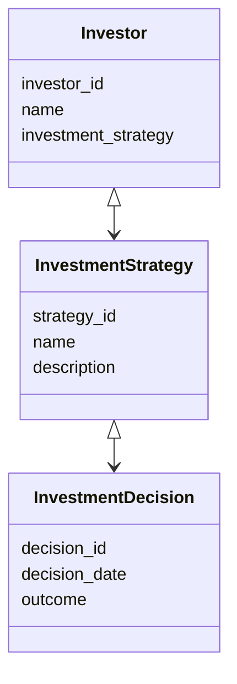

                 


# 芒格的"避免失败"原则：投资成功的另一面

---

## 关键词

- 芒格
- 投资成功
- 避免失败
- 安全边际
- 逆向思维

---

## 摘要

芒格的“避免失败”原则是投资领域中一个极具启发性的理念。它强调通过避免重大错误来确保投资成功，而非仅仅追求高收益。本文将从芒格的投资哲学出发，深入分析其“避免失败”原则的核心概念，包括安全边际、逆向思维和风险管理，并结合实际案例，探讨这些原则在投资决策中的应用。通过系统分析和数学模型，我们将揭示如何通过避免失败来构建稳健的投资策略。

---

## 正文

### 第一部分：芒格“避免失败”原则的背景与基础

#### 第1章：芒格“避免失败”原则概述

##### 1.1 芒格的生平与投资理念

**1.1.1 芒格的生平简介**

查理·芒格（Charlie Munger）是美国著名投资者、伯克希尔哈撒韦公司副董事长，被誉为“巴菲特的导师”。芒格的投资理念深受价值投资理论的影响，但他在实践中发展出一套独特的“避免失败”原则。他强调投资中的安全边际和风险管理，主张通过逆向思维来寻找低估的投资机会。

**1.1.2 芒格的投资哲学与“避免失败”原则**

芒格认为，投资成功的关键不在于追求高收益，而在于避免重大损失。他提出“避免失败”原则，强调通过谨慎的投资决策来降低风险，从而实现稳健的长期收益。这种方法与传统的投资策略有所不同，它更注重防御性投资，而非进攻性投机。

##### 1.2 “避免失败”原则的背景与重要性

**1.2.1 投资中的常见失败原因**

在投资领域，失败通常源于过度乐观、信息不对称、情绪化决策以及对风险的忽视。许多投资者在追求高收益的过程中，忽略了潜在的风险，最终导致重大损失。芒格的“避免失败”原则正是针对这些常见失败原因，提供了一种防御性的投资策略。

**1.2.2 为什么“避免失败”是成功的另一面**

芒格认为，成功的投资并不需要每次都做出正确的决策，而是要避免重大错误。通过“避免失败”，投资者可以在长期中积累稳定的收益，而不会因为一次重大失误而导致资产的巨大损失。这种稳健的投资策略尤其适合那些希望长期保值的投资者。

---

#### 第2章：芒格的“避免失败”原则的核心概念

##### 2.1 安全边际

**2.1.1 安全边际的定义与作用**

安全边际是指投资标的的实际价值与其市场价格之间的差额。当市场价格低于实际价值时，投资标的具有安全边际，这意味着即使未来出现不利情况，投资者也能获得一定的保护。

**2.1.2 安全边际在投资中的应用**

在实践中，芒格通过分析公司的财务状况、行业地位和竞争优势来评估其实际价值。他建议投资者选择具有显著安全边际的投资标的，从而降低投资风险。

##### 2.2 逆向思维

**2.2.1 逆向思维的定义与特点**

逆向思维是指在投资决策中，反向思考市场主流观点，寻找被市场低估的机会。芒格认为，市场通常会对短期波动过度反应，因此逆向思维可以帮助投资者发现潜在的投资机会。

**2.2.2 逆向思维在投资决策中的应用**

通过逆向思维，芒格建议投资者在市场恐慌时寻找低估的投资标的，在市场狂热时保持冷静。这种方法可以帮助投资者在市场周期中做出更为理性的决策。

##### 2.3 风险管理

**2.3.1 风险管理的基本概念**

风险管理是指通过识别、评估和控制潜在风险，来降低投资损失的过程。芒格认为，风险管理是“避免失败”原则的核心，它可以帮助投资者在面对不确定性时做出更为稳健的决策。

**2.3.2 芒格的“避免失败”原则中的风险管理策略**

芒格强调分散投资、避免过度集中风险，并通过长期持有优质资产来降低短期波动的影响。他建议投资者在选择投资标的时，充分考虑其抗风险能力，从而在市场波动中保持稳定收益。

---

### 第二部分：芒格“避免失败”原则的核心概念与联系

#### 第3章：核心概念与联系

##### 3.1 核心概念原理

**3.1.1 安全边际的数学模型**

安全边际可以通过以下公式计算：

$$ \text{安全边际} = \text{内在价值} - \text{市场价格} $$

其中，内在价值是通过基本面分析得出的公司实际价值，市场价格是当前市场上的交易价格。

**3.1.2 逆向思维的逻辑结构**

逆向思维的逻辑结构可以用以下步骤表示：

1. 分析市场主流观点。
2. 反思主流观点的合理性。
3. 寻找与主流观点相反的投资机会。

##### 3.2 核心概念对比表格

**3.2.1 安全边际与传统投资策略的对比**

| 对比维度 | 安全边际 | 传统投资策略 |
|----------|----------|--------------|
| 核心目标 | 避免损失 | 追求收益     |
| 适用场景 | 市场低估时 | 市场正常时    |
| 风险控制 | 强调安全边际 | 依赖市场趋势  |

**3.2.2 逆向思维与其他投资策略的对比**

| 对比维度 | 逆向思维 | 顺势投资 |
|----------|----------|----------|
| 投资时机 | 市场恐慌时 | 市场上涨时 |
| 投资目标 | 寻找低估机会 | 追逐高收益 |
| 风险控制 | 强调防御性 | 依赖市场趋势 |

##### 3.3 ER实体关系图

**3.3.1 投资决策中的实体关系图**

```mermaid
erDiagram
    investor(investor_id, name, investment_strategy) {
        investment_strategy
    }
    investment_strategy(strategy_id, name, description) {
        strategy_id
    }
    investment_decision(decision_id, decision_date, outcome) {
        decision_id
    }
    investor <o- investment_strategy : "使用策略"
    investment_strategy <o- investment_decision : "生成决策"
```

**3.3.2 安全边际与风险管理的ER图**

```mermaid
erDiagram
    investment_object(object_id, name, market_price) {
        object_id
    }
    risk_management(risk_id, strategy) {
        risk_id
    }
    safety_margin(safety_margin_id, value, threshold) {
        safety_margin_id
    }
    investment_object <o- risk_management : "涉及风险"
    investment_object <o- safety_margin : "具有安全边际"
```

---

### 第三部分：芒格“避免失败”原则的算法原理

#### 第4章：算法原理讲解

##### 4.1 价值评估模型

**4.1.1 DCF模型的原理与应用**

DCF（Discounted Cash Flow）模型是一种常用的估值方法，通过预测公司未来现金流并将其折现为现值，来评估公司的内在价值。

**DCF模型的公式为：**

$$ \text{内在价值} = \sum_{t=1}^{n} \frac{\text{现金流}_t}{(1 + r)^t} + \frac{\text{终值}}{(1 + r)^n} $$

其中，r是折现率，n是预测期数。

##### 4.2 逆向思维算法

**4.2.1 逆向思维的步骤与流程**

1. 分析市场趋势和主流观点。
2. 识别市场过度反应的情况。
3. 寻找与主流观点相反的投资机会。
4. 进行基本面分析，验证投资机会的可行性。

---

### 第四部分：数学模型与公式

#### 第5章：数学模型与公式

##### 5.1 安全边际的计算公式

$$ \text{安全边际} = \text{内在价值} - \text{市场价格} $$

##### 5.2 逆向思维的数学模型

逆向思维的数学模型可以表示为：

$$ \text{投资机会} = \text{市场低估} \times \text{基本面良好} $$

---

### 第五部分：系统分析与架构设计方案

#### 第6章：系统分析与架构设计方案

##### 6.1 问题场景介绍

在投资决策系统中，我们需要通过芒格的“避免失败”原则来构建一个稳健的投资策略。系统需要能够对市场趋势、公司基本面和风险进行实时分析，帮助投资者做出明智的决策。

##### 6.2 系统功能设计

**6.2.1 领域模型（mermaid类图）**



##### 6.3 系统架构设计

**6.3.1 系统架构图**


##### 6.4 系统接口设计

系统接口设计包括数据输入、数据处理和结果输出三个部分。

---

### 第六部分：项目实战

#### 第7章：项目实战

##### 7.1 环境安装

为了实现芒格的“避免失败”原则，我们需要安装以下工具：

- Python编程语言
- 数据分析库（如Pandas、NumPy）
- 图形化工具（如Matplotlib、Seaborn）

##### 7.2 核心实现源代码

以下是一个简单的价值评估模型的Python代码：

```python
def calculate_intrinsic_value(cash_flows, discount_rate, terminal_value):
    intrinsic_value = 0
    for t in range(len(cash_flows)):
        if t == 0:
            continue
        else:
            intrinsic_value += cash_flows[t] / (1 + discount_rate)**t
    intrinsic_value += terminal_value / (1 + discount_rate)**len(cash_flows)
    return intrinsic_value

# 示例数据
cash_flows = [100, 150, 200, 250]
discount_rate = 0.1
terminal_value = 1000

intrinsic_value = calculate_intrinsic_value(cash_flows, discount_rate, terminal_value)
print("内在价值：", intrinsic_value)
```

##### 7.3 案例分析与解读

假设我们投资一家公司，其未来五年的现金流分别为100、150、200、250和300万元，折现率为10%，终值为1000万元。根据上述代码，我们可以计算出该公司的内在价值为：

$$ \text{内在价值} = \frac{100}{1.1} + \frac{150}{1.1^2} + \frac{200}{1.1^3} + \frac{250}{1.1^4} + \frac{300}{1.1^5} + \frac{1000}{1.1^5} $$

通过计算，我们可以得出该公司的内在价值，从而确定其市场价格的安全边际。

##### 7.4 项目小结

通过实际案例分析，我们可以看到芒格的“避免失败”原则在投资决策中的实际应用。通过计算安全边际和评估内在价值，投资者可以在市场低估时做出明智的投资决策。

---

### 第七部分：最佳实践

#### 第8章：最佳实践、小结、注意事项与拓展阅读

##### 8.1 最佳实践

- **分散投资**：避免过度集中风险。
- **长期持有**：通过长期持有优质资产来降低短期波动的影响。
- **逆向思维**：在市场恐慌时寻找低估的投资机会。

##### 8.2 小结

芒格的“避免失败”原则为我们提供了一种稳健的投资策略，强调通过避免重大错误来实现长期收益。本文通过背景介绍、核心概念、算法原理和实际案例分析，全面揭示了这一原则在投资中的应用。

##### 8.3 注意事项

- **风险提示**：投资有风险，需谨慎决策。
- **持续学习**：投资领域变化多端，需持续学习和调整策略。

##### 8.4 拓展阅读

- 《巴菲特的“彼得林奇”投资策略》
- 《价值投资：从入门到精通》
- 《查理·芒格的智慧：投资哲学与人生策略》

---

## 作者

作者：AI天才研究院/AI Genius Institute & 禅与计算机程序设计艺术/Zen And The Art of Computer Programming

