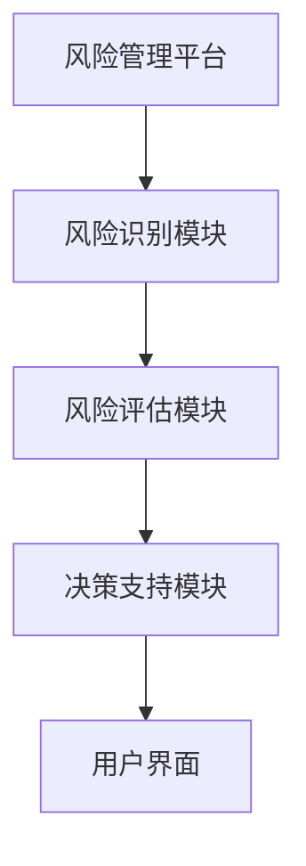
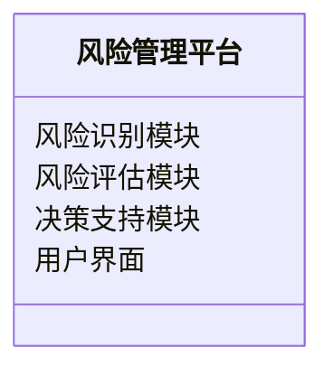
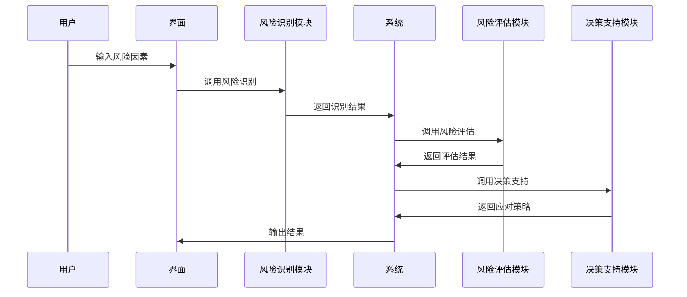

                 


---

# 芒格的"避免愚蠢"原则在风险管理中的应用

> 关键词：风险管理、决策科学、芒格原则、心理偏差、逆向思维、贝叶斯定理、决策框架

> 摘要：本文探讨了芒格的“避免愚蠢”原则在风险管理中的应用，结合心理学和数学模型，分析了如何通过避免认知偏差和情绪化决策来优化风险管理过程。文章从心理偏差对决策的影响、风险管理的数学模型、系统架构设计、项目实战案例等方面，详细阐述了芒格原则在实际风险管理中的具体应用和实现。

---

## 第一部分: 芒格的"避免愚蠢"原则概述

### 第1章: 芒格的"避免愚蠢"原则概述

#### 1.1 芒格的"避免愚蠢"原则的背景

芒格（Charlie Munger）作为巴菲特的合伙人，以其独特的思维方式闻名。他的“避免愚蠢”原则强调在决策过程中避免情绪化、认知偏差和非理性行为。这一原则不仅在投资领域，还在风险管理中具有重要的应用价值。

**1.1.1 芒格的生平与思想体系**

芒格出生于1924年，是一位美国投资家、作家和思想家。他不仅是巴菲特的合伙人，还以其深刻的心理学洞察力著称。芒格的思想体系强调理性决策、逆向思维和长期投资。

**1.1.2 "避免愚蠢"原则的核心理念**

芒格的“避免愚蠢”原则强调：

1. 避免情绪化决策。
2. 识别和克服认知偏差。
3. 培养逆向思维。
4. 专注于长期目标。

**1.1.3 该原则在投资与决策中的应用**

芒格的“避免愚蠢”原则在投资决策中被广泛应用，尤其是在避免过度乐观和从众心理方面。这一原则提醒投资者要冷静分析，避免盲目跟风。

---

#### 1.2 风险管理的基本概念

**1.2.1 风险管理的定义与分类**

风险管理是指通过识别、评估和应对潜在风险，以最小化其对目标的影响。常见的风险管理方法包括风险规避、降低、转移和接受。

**1.2.2 风险管理的核心原则与框架**

风险管理的核心原则包括：

1. 系统性：全面识别潜在风险。
2. 量化：评估风险的概率和影响。
3. 灵活性：根据情况调整应对策略。

**1.2.3 风险管理与决策科学的关系**

风险管理是决策科学的重要组成部分，涉及概率论、统计学和心理学等多个领域。通过科学的决策框架，可以有效减少认知偏差对决策的影响。

---

#### 1.3 本章小结

本章介绍了芒格的“避免愚蠢”原则及其在投资和决策中的应用，同时阐述了风险管理的基本概念和核心原则。下一章将深入探讨心理偏差对决策的影响，以及如何通过芒格的原则克服这些偏差。

---

## 第二部分: 心理偏差与决策错误

### 第2章: 心理偏差与决策错误

#### 2.1 心理偏差对决策的影响

**2.1.1 常见的心理偏差类型**

- **过度自信偏差**：高估自己判断的准确性。
- **从众效应**：跟随大多数人决策，忽视独立思考。
- **忽略小概率事件**：忽视低概率但高影响的风险。

**2.1.2 心理偏差对风险管理的具体影响**

心理偏差可能导致以下问题：

1. 高估潜在收益，低估潜在风险。
2. 忽视低概率但高影响的“黑天鹅”事件。
3. 从众决策，错失独立判断的机会。

**2.1.3 如何识别和克服这些偏差**

- 通过教育和训练提高自我认知。
- 建立科学的决策框架，减少主观判断。
- 引入客观数据和模型进行验证。

#### 2.2 决策中的常见错误

**2.2.1 过度乐观偏差**

过度乐观偏差导致低估风险，过高估计成功的概率。例如，在投资中，投资者可能高估项目的回报率，忽视潜在风险。

**2.2.2 羊群效应与从众心理**

从众心理可能导致决策趋同，忽视独特的机会和风险。例如，在股票市场中，大量投资者跟随市场趋势，可能导致价格泡沫。

**2.2.3 忽视小概率事件的倾向**

忽视小概率事件可能导致准备不足，例如在风险管理中，忽视自然灾害的可能性。

#### 2.3 芒格的"避免愚蠢"原则与心理偏差的关系

**2.3.1 如何通过"避免愚蠢"原则克服心理偏差**

芒格强调：

1. 培养理性思维，避免情绪化决策。
2. 识别和克服认知偏差。
3. 采用逆向思维，从反方向思考问题。

**2.3.2 培养理性思维的具体方法**

- 通过阅读和学习提高决策能力。
- 建立决策 checklist，确保决策的系统性和全面性。
- 与他人讨论和验证决策，避免独断专行。

#### 2.4 本章小结

本章分析了心理偏差对决策的影响，并探讨了如何通过芒格的“避免愚蠢”原则克服这些偏差。下一章将探讨风险评估与决策框架的构建。

---

## 第三部分: "避免愚蠢"原则在风险管理中的具体应用

### 第3章: 风险评估与决策框架

#### 3.1 风险评估的基本步骤

**3.1.1 确定风险来源**

风险来源包括市场风险、操作风险、信用风险等。例如，在金融投资中，市场波动和政策变化是主要风险来源。

**3.1.2 量化风险概率与影响**

使用概率论和统计学方法量化风险。例如，使用贝叶斯定理评估风险概率。

**3.1.3 风险评估的工具与方法**

常用的工具包括决策树、风险矩阵和蒙特卡洛模拟。

#### 3.2 构建风险管理框架

**3.2.1 风险管理的4个核心步骤**

1. 识别风险。
2. 评估风险。
3. 制定应对策略。
4. 监控和调整。

**3.2.2 风险管理框架的设计原则**

- 全面性：覆盖所有潜在风险。
- 灵活性：根据情况调整应对策略。
- 可操作性：框架应易于实施和监控。

**3.2.3 芒格原则在框架中的应用**

- 强调理性分析，避免情绪化决策。
- 采用逆向思维，从反方向思考问题。

#### 3.3 决策中的逆向思维

**3.3.1 逆向思维的定义与特点**

逆向思维是指从反方向思考问题，寻找不同的解决方案。例如，在风险管理中，通过分析失败案例，找到潜在风险点。

**3.3.2 逆向思维在风险管理中的应用**

- 识别潜在风险：通过分析失败案例，找到可能的风险因素。
- 制定应对策略：根据风险点，制定预防措施。

**3.3.3 逆向思维的具体案例分析**

例如，在投资决策中，分析失败的案例，识别潜在风险，制定应对策略。

#### 3.4 本章小结

本章探讨了风险评估与决策框架的构建，并强调了逆向思维在风险管理中的应用。下一章将深入探讨数学模型与风险管理算法。

---

## 第四部分: 数学模型与风险管理算法

### 第4章: 风险评估的数学模型

#### 4.1 风险概率计算模型

**4.1.1 贝叶斯定理在风险评估中的应用**

贝叶斯定理用于更新基于新证据的概率。例如，在金融投资中，可以通过贝叶斯定理更新某个项目的违约概率。

**4.1.2 风险概率的加权计算**

通过加权计算，综合考虑不同风险因素的影响。例如，使用加权平均法计算整体风险概率。

#### 4.2 风险影响的量化模型

**4.2.1 风险影响的层次分析法（AHP）**

层次分析法用于量化多个因素的影响程度。例如，在项目风险管理中，使用AHP确定各个风险因素的权重。

**4.2.2 风险影响的模糊综合评价法**

模糊综合评价法用于处理模糊和不确定的评价因素。例如，在评估项目风险时，考虑专家意见的模糊性。

#### 4.3 本章小结

本章介绍了数学模型在风险评估中的应用，特别是贝叶斯定理和层次分析法。这些模型为风险管理提供了科学的工具。

---

## 第五部分: 系统分析与架构设计

### 第5章: 系统分析与架构设计

#### 5.1 项目背景与目标

本项目旨在开发一个基于芒格原则的风险管理系统，帮助用户识别和应对潜在风险。

#### 5.2 系统功能设计

**5.2.1 风险识别模块**

- 输入潜在风险因素。
- 输出风险识别结果。

**5.2.2 风险评估模块**

- 输入风险因素。
- 输出风险概率和影响。

**5.2.3 决策支持模块**

- 输入风险评估结果。
- 输出应对策略。

**5.2.4 系统架构设计**

使用 Mermaid 绘制系统架构图：



#### 5.3 系统架构设计

**5.3.1 系统架构图**



#### 5.4 系统接口设计

- API 接口：提供风险识别、评估和决策支持的 API。
- 数据接口：连接数据库，存储风险数据。

#### 5.5 系统交互设计

**5.5.1 交互流程**

1. 用户通过界面输入风险因素。
2. 系统调用风险识别模块，识别潜在风险。
3. 风险评估模块评估风险概率和影响。
4. 决策支持模块提供应对策略。
5. 系统输出结果到界面。

**5.5.2 交互流程图**



---

## 第六部分: 项目实战

### 第6章: 项目实战

#### 6.1 环境安装与配置

- 安装 Python 和必要的库（如 NumPy、Pandas、Scikit-learn）。
- 配置开发环境（如 Jupyter Notebook）。

#### 6.2 核心代码实现

**6.2.1 风险识别模块**

```python
def risk_identification(factors):
    # 输入：风险因素列表
    # 输出：识别出的潜在风险
    pass
```

**6.2.2 风险评估模块**

```python
def risk_assessment(factors):
    # 使用贝叶斯定理计算风险概率
    pass
```

**6.2.3 决策支持模块**

```python
def decision_support(probability, impact):
    # 输入：风险概率和影响
    # 输出：应对策略
    pass
```

#### 6.3 案例分析与代码解读

**6.3.1 案例分析**

假设一个投资项目的潜在风险包括市场波动、政策变化和管理问题。通过风险识别模块，识别出这些风险因素。然后，使用贝叶斯定理评估每个风险的概率和影响，最后制定应对策略。

**6.3.2 代码实现**

```python
import numpy as np
from sklearn.metrics import confusion_matrix

def bayesian_risk_assessment(prior_prob, likelihood_ratio):
    posterior_prob = prior_prob * likelihood_ratio
    return posterior_prob

prior_prob = 0.1
likelihood_ratio = 5
posterior_prob = bayesian_risk_assessment(prior_prob, likelihood_ratio)
print("后验概率:", posterior_prob)
```

#### 6.4 项目小结

本章通过具体案例展示了如何将芒格的“避免愚蠢”原则应用于风险管理系统的开发。代码实现部分详细讲解了风险识别、评估和决策支持模块的实现。

---

## 第七部分: 总结与展望

### 第7章: 总结与展望

#### 7.1 总结

本文系统地探讨了芒格的“避免愚蠢”原则在风险管理中的应用，结合心理学和数学模型，提出了科学的决策框架和系统架构设计。通过具体案例和代码实现，展示了如何将这些原则应用于实际风险管理中。

#### 7.2 未来研究方向

- 进一步研究人工智能在风险管理中的应用。
- 探讨区块链技术在风险管理中的潜在应用。
- 研究更多心理偏差对决策的影响，提出更完善的决策框架。

#### 7.3 最佳实践 tips

- 培养理性思维，避免情绪化决策。
- 建立科学的决策框架，减少认知偏差的影响。
- 定期回顾和调整风险管理策略。

#### 7.4 本章小结

本文总结了芒格原则在风险管理中的应用，并展望了未来的研究方向。芒格的“避免愚蠢”原则为风险管理提供了重要的理论和实践指导。

---

## 作者：AI天才研究院/AI Genius Institute & 禅与计算机程序设计艺术 /Zen And The Art of Computer Programming

---

**注意**：以上内容为示例性的文章大纲和部分章节内容，实际撰写时需要根据具体情况进行调整和补充。

