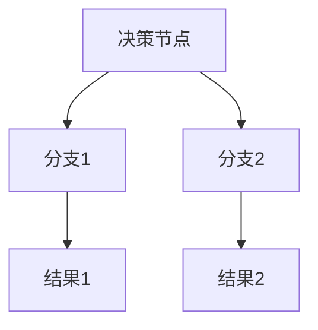
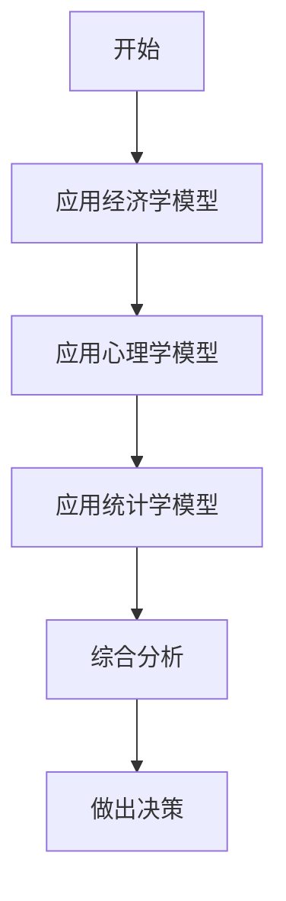
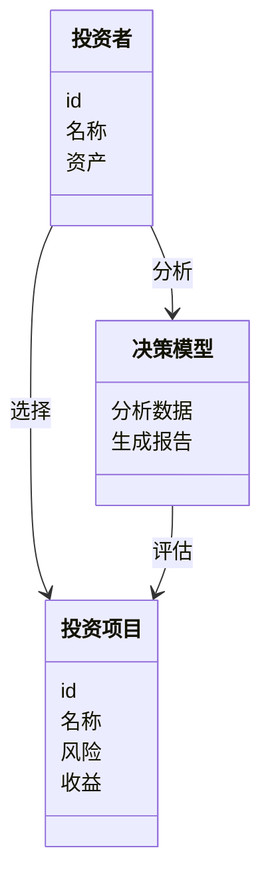
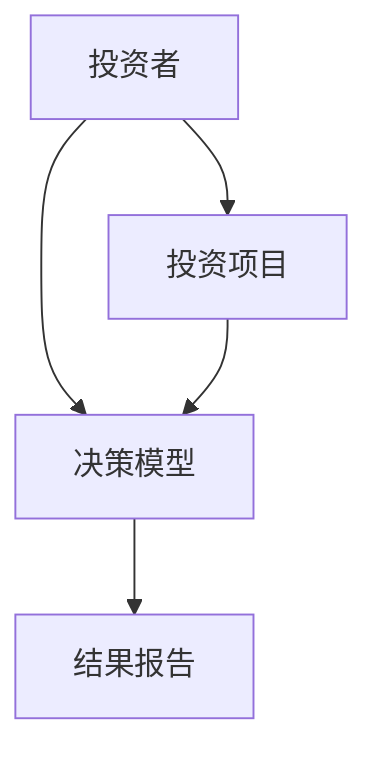

                 


# 芒格的"避免愚蠢"原则：明智投资的基础

> 关键词：芒格，避免愚蠢，投资原则，多元思维模型，心理学，决策科学

> 摘要：芒格的“避免愚蠢”原则是投资成功的关键之一，本文通过详细分析该原则的核心概念、数学模型、系统架构以及实际应用，帮助读者理解如何在投资中避免愚蠢决策。

---

## 第一部分：芒格的“避免愚蠢”原则概述

### 第1章：芒格“避免愚蠢”原则的背景与意义

#### 1.1 芒格“避免愚蠢”原则的起源

芒格是巴菲特的长期合作伙伴，以智慧的投资理念闻名。他提出的“避免愚蠢”原则强调在投资中避免因情绪或认知偏差导致的错误决策。这一原则的核心在于通过多元思维模型和逆向思维来优化投资策略。

#### 1.2 什么是“避免愚蠢”原则

“避免愚蠢”原则的核心在于认识到自己的局限性，通过多学科的视角来分析问题，避免单一思维导致的错误。芒格强调，投资者应避免过度自信和从众心理，而是通过系统化的分析来做出明智决策。

#### 1.3 该原则在投资中的作用

在投资中，避免愚蠢意味着投资者需要识别和避免常见的认知偏差，如过度自信、从众心理和确认偏见。通过芒格的多元思维模型，投资者能够更全面地评估投资项目，减少决策失误。

---

### 第2章：芒格“避免愚蠢”原则的核心概念

#### 2.1 多元思维模型

多元思维模型是芒格投资理念的核心，它强调从多个学科的角度分析问题。例如，经济学中的供需理论、心理学中的行为理论等。通过整合这些知识，投资者可以更全面地评估投资项目的风险和机会。

#### 2.2 心理学与决策科学

芒格指出，人类的决策过程受心理偏差影响，如过度自信和从众心理。通过理解这些心理因素，投资者可以更好地控制情绪，避免愚蠢的决策。

#### 2.3 逆向思维

逆向思维是指从反方向思考问题，寻找市场的空白点。芒格建议投资者寻找市场中被忽视的机会，而不是跟随市场的主流趋势。

---

## 第二部分：芒格“避免愚蠢”原则的数学模型与算法

### 第3章：芒格决策模型的数学解析

#### 3.1 决策树分析

决策树是一种用于分析投资决策的工具，通过构建树状图来分析不同决策路径的概率和结果。以下是决策树分析的mermaid流程图：



每个决策节点代表一个决策点，分支代表可能的选择，结果节点代表最终结果。通过计算每个结果的概率和收益，投资者可以评估不同决策的期望值。

#### 3.2 多元思维模型算法

多元思维模型算法通过整合多个学科的视角来评估投资项目。以下是算法的mermaid流程图：



每个步骤代表从不同学科的角度分析问题，综合结果用于做出最终决策。

---

## 第三部分：系统分析与架构设计

### 第4章：投资决策的系统架构

#### 4.1 投资决策系统介绍

投资决策系统是一个用于辅助投资者做出决策的工具，它整合了多元思维模型和决策树分析。系统的主要功能包括数据收集、模型分析和结果展示。

#### 4.2 领域模型设计

领域模型设计展示了系统中各组件之间的关系。以下是领域模型的mermaid类图：



#### 4.3 系统架构设计

系统架构设计展示了系统的整体结构。以下是系统架构的mermaid架构图：



---

## 第四部分：项目实战与案例分析

### 第5章：实际投资中的应用案例

#### 5.1 环境安装

为了实现投资决策系统，需要安装以下工具：

- Python编程环境（如Anaconda）
- Mermaid图表工具
- 数据分析库（如Pandas、NumPy）

#### 5.2 核心实现源代码

以下是多元思维模型算法的Python代码示例：

```python
import pandas as pd

def multi_disciplinary_analysis(data, models):
    results = []
    for model in models:
        result = model.predict(data)
        results.append(result)
    return results

# 示例数据
data = pd.DataFrame({'特征1': [1, 2, 3], '特征2': [4, 5, 6]})

# 示例模型列表
models = [model1, model2, model3]

# 调用函数
results = multi_disciplinary_analysis(data, models)
```

#### 5.3 案例分析

以某公司为例，分析其投资价值。通过多元思维模型，评估公司的财务状况、市场前景和管理团队。结合决策树分析，评估不同决策路径的概率和收益，最终做出投资决策。

---

## 第五部分：总结与展望

### 第6章：最佳实践与小结

#### 6.1 小结

芒格的“避免愚蠢”原则通过多元思维模型和逆向思维帮助投资者做出明智决策。通过系统化的分析和数学模型的支持，投资者可以有效避免愚蠢的决策。

#### 6.2 注意事项

投资者应避免过度依赖模型，需结合实际情况进行调整。同时，持续学习和更新知识，以应对市场变化。

#### 6.3 拓展阅读

建议阅读芒格的《穷查理宝典》及相关心理学书籍，以深入理解“避免愚蠢”原则。

---

## 作者

作者：AI天才研究院 & 禅与计算机程序设计艺术

---

以上是文章的完整结构，涵盖了芒格的“避免愚蠢”原则的各个方面，从理论到实践，帮助读者全面理解并应用这一原则。

