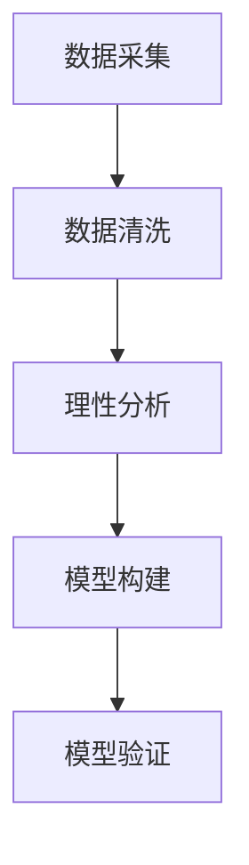
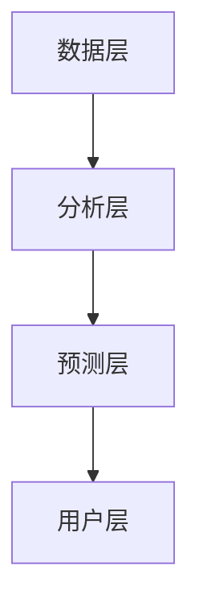

                 


# 芒格的"避免极端预测"在前沿科技市场预测中的应用

> 关键词：芒格，避免极端预测，前沿科技，市场预测，技术趋势

> 摘要：本文探讨了芒格的“避免极端预测”思想在前沿科技市场预测中的应用，分析了其在技术趋势预测、市场波动分析和投资决策中的实际意义，并结合具体案例，展示了如何通过理性分析和长期价值判断来提高市场预测的准确性和可靠性。

---

# 第1章：芒格“避免极端预测”的核心思想与前沿科技市场的结合

## 1.1 芒格“避免极端预测”的核心概念

### 1.1.1 极端预测的定义与特征

极端预测是指对未来市场或技术走势的过于激进或极端的估计，通常表现为对市场趋势的过度乐观或悲观。其主要特征包括：

- **非理性假设**：基于不切实际的假设，而非现实数据和逻辑分析。
- **片面性**：只关注单一因素，忽视整体系统的复杂性。
- **短期导向**：过度关注短期波动，忽视长期趋势。

### 1.1.2 芒格“避免极端预测”的核心思想

芒格强调，在投资和商业决策中，应避免做出极端预测，而是要基于理性分析和长期价值判断。其核心思想包括：

- **避免极端化**：不追求过于激进或保守的预测，而是注重中长期趋势的合理估计。
- **注重基本面**：基于实际数据和市场规律，而非市场情绪或短期热点。
- **分散风险**：通过多样化投资和理性决策，降低极端预测带来的风险。

### 1.1.3 芒格思想在投资与商业决策中的应用

芒格思想在投资和商业决策中的应用广泛，尤其是在面对不确定性和波动性较强的市场时。通过避免极端预测，投资者可以更好地规避市场崩盘或重大失误的风险，从而实现长期稳健的投资回报。

---

## 1.2 前沿科技市场的特点与挑战

### 1.2.1 前沿科技市场的定义与范围

前沿科技市场指的是那些基于新兴技术（如人工智能、区块链、量子计算等）的市场。这些市场的特点包括：

- **技术驱动**：市场波动主要受技术创新影响。
- **高不确定性**：技术发展和市场需求具有高度不确定性。
- **快速变化**：市场和技术均处于快速迭代中。

### 1.2.2 前沿科技市场的波动性与不确定性

前沿科技市场的波动性主要来源于以下方面：

- **技术不确定性**：新兴技术的成熟度和商业化能力尚未经过充分验证。
- **市场需求波动**：消费者和企业的需求可能受到技术接受度和经济环境的影响。
- **竞争格局变化**：新兴技术和市场的快速变化可能导致竞争格局的频繁调整。

### 1.2.3 前沿科技市场预测的复杂性

由于前沿科技市场的高度不确定性和技术驱动性，市场预测的复杂性主要体现在：

- **技术路径依赖**：技术的选择和市场发展密切相关，技术路径的不确定性直接影响市场预测。
- **参与者行为多样性**：市场参与者（如企业、投资者、消费者）的行为受到多种因素影响，进一步增加了预测的难度。
- **外部环境影响**：政策、经济、社会等外部环境的变化也会对市场预测产生重大影响。

---

## 1.3 芒格思想与前沿科技市场预测的结合

### 1.3.1 芒格思想在市场预测中的适用性

芒格思想的核心是避免极端预测，注重理性分析和长期价值。这种思想在前沿科技市场预测中的适用性主要体现在：

- **避免极端化**：通过理性分析减少对市场趋势的过度乐观或悲观估计。
- **注重基本面**：基于技术发展和市场需求的实际情况，而非市场情绪或短期热点。
- **分散风险**：通过多样化投资和理性决策，降低市场波动带来的风险。

### 1.3.2 芒格思想与科技市场预测的契合点

芒格思想与科技市场预测的契合点主要在于其强调的理性分析和长期价值。具体包括：

- **技术驱动的市场分析**：基于技术发展和商业化能力的分析，而非单纯依赖市场情绪或短期趋势。
- **长期价值判断**：关注技术的长期发展潜力和市场价值，而非短期波动。
- **风险控制**：通过避免极端预测和分散投资，降低市场波动带来的风险。

### 1.3.3 芒格思想对科技市场预测的指导意义

芒格思想为科技市场预测提供了以下指导意义：

- **理性分析的重要性**：在预测市场趋势时，应注重基于数据和逻辑的分析，而非情绪驱动的判断。
- **长期视角的必要性**：关注技术的长期发展潜力，而非短期市场波动。
- **风险控制的策略**：通过多样化和理性投资，降低市场预测中的不确定性风险。

---

# 第2章：芒格“避免极端预测”的核心概念与前沿科技市场的联系

## 2.1 芒格“避免极端预测”的核心概念

### 2.1.1 极端预测的形成机制

极端预测的形成机制主要与以下几个因素有关：

- **信息不对称**：市场参与者对信息的掌握不充分，导致预测偏差。
- **情绪驱动**：市场情绪的过度乐观或悲观影响了预测的理性。
- **认知偏差**：投资者的认知偏差（如确认偏差、过度自信）导致了极端预测的形成。

### 2.1.2 芒格思想的核心原则

芒格思想的核心原则包括：

- **避免极端化**：在预测中避免过于激进或保守的估计。
- **注重基本面**：基于实际数据和市场规律进行分析。
- **分散风险**：通过多样化投资降低单一市场的风险。

### 2.1.3 芒格思想的实践方法

芒格思想的实践方法主要包括：

- **理性分析**：基于数据和逻辑进行预测，而非情绪驱动。
- **长期视角**：关注技术的长期发展潜力，而非短期市场波动。
- **风险控制**：通过多样化和理性投资降低风险。

---

## 2.2 前沿科技市场的核心要素

### 2.2.1 技术创新的周期性

技术创新的周期性对市场预测具有重要影响。技术创新通常经历以下几个阶段：

1. **萌芽阶段**：技术初步形成，市场认知度低。
2. **发展阶段**：技术逐步成熟，市场认知度提高。
3. **成熟阶段**：技术广泛应用，市场趋于稳定。
4. **衰退阶段**：技术逐渐被替代，市场逐步萎缩。

### 2.2.2 市场需求的波动性

市场需求的波动性主要受以下因素影响：

- **技术成熟度**：技术越成熟，市场需求越稳定。
- **经济环境**：经济波动会影响市场需求。
- **政策环境**：政策变化对市场需求具有重要影响。

### 2.2.3 市场参与者的博弈行为

市场参与者的博弈行为包括：

- **企业竞争**：企业间的竞争可能导致市场波动。
- **投资者行为**：投资者的买卖行为直接影响市场走势。
- **政策制定者**：政策制定者的行为也会影响市场参与者的行为。

---

## 2.3 芒格思想与前沿科技市场的结合

### 2.3.1 芒格思想对科技市场预测的启示

芒格思想对科技市场预测的启示主要体现在以下几个方面：

- **理性分析的重要性**：在预测市场趋势时，应注重基于数据和逻辑的分析，而非情绪驱动的判断。
- **长期视角的必要性**：关注技术的长期发展潜力，而非短期市场波动。
- **风险控制的策略**：通过多样化和理性投资降低市场预测中的不确定性风险。

### 2.3.2 芒格思想在科技市场预测中的应用案例

以下是芒格思想在科技市场预测中的应用案例：

#### 案例1：人工智能市场的预测

- **背景**：人工智能技术近年来快速发展，市场潜力巨大，但也存在技术成熟度和市场需求的不确定性。
- **应用**：基于芒格思想，预测时应注重技术的长期发展潜力，同时避免对短期市场波动的过度乐观或悲观估计。
- **结果**：通过理性分析和长期价值判断，得出人工智能市场将稳步增长的结论，避免了极端预测带来的风险。

#### 案例2：区块链技术的应用

- **背景**：区块链技术被认为是未来的颠覆性技术，但其商业化应用仍存在不确定性。
- **应用**：基于芒格思想，预测时应注重技术的实际应用场景和市场需求，同时避免对市场潜力的过度乐观估计。
- **结果**：得出区块链技术将在特定领域逐步应用的结论，避免了对市场潜力的极端预测。

---

## 2.4 芒格思想对科技市场预测的长期价值

### 2.4.1 芒格思想的长期价值

芒格思想的长期价值在于其强调的理性分析和长期价值判断。这种思想不仅适用于短期市场预测，也适用于长期市场规划。

### 2.4.2 芒格思想对科技市场的长期影响

芒格思想对科技市场的长期影响体现在以下几个方面：

- **理性分析的普及**：通过芒格思想的传播，更多市场参与者将注重理性分析，减少极端预测。
- **长期价值的重视**：市场参与者将更加关注技术的长期发展潜力，而非短期市场波动。
- **风险控制的加强**：通过分散投资和理性决策，市场参与者将更好地控制风险。

---

# 第3章：芒格“避免极端预测”的算法原理与数学模型

## 3.1 芒格思想的算法实现

### 3.1.1 芒格思想的算法框架

芒格思想的算法框架主要包括以下几个步骤：

1. **数据采集**：收集相关市场的历史数据和当前数据。
2. **数据清洗**：对数据进行清洗和预处理，确保数据的准确性和完整性。
3. **数据分析**：基于数据进行理性分析，避免极端预测。
4. **模型构建**：构建预测模型，基于数据分析结果进行预测。
5. **模型验证**：对模型进行验证，确保预测结果的合理性和准确性。

### 3.1.2 芒格思想的数学模型

芒格思想的数学模型主要用于避免极端预测。以下是其核心公式：

$$
\text{预测结果} = \text{历史数据} \times \text{理性分析权重} + \text{市场趋势} \times \text{长期价值权重}
$$

### 3.1.3 芒格思想的实现步骤

以下是芒格思想的实现步骤：

1. **数据采集**：收集相关市场的历史数据和当前数据。
2. **数据清洗**：对数据进行清洗和预处理，确保数据的准确性和完整性。
3. **数据分析**：基于数据进行理性分析，避免极端预测。
4. **模型构建**：构建预测模型，基于数据分析结果进行预测。
5. **模型验证**：对模型进行验证，确保预测结果的合理性和准确性。

---

## 3.2 芒格思想的数学模型与公式

### 3.2.1 芒格思想的核心公式

以下是芒格思想的核心公式：

$$
\text{预测结果} = \text{历史数据} \times \text{理性分析权重} + \text{市场趋势} \times \text{长期价值权重}
$$

### 3.2.2 芒格思想的数学推导

以下是芒格思想的数学推导：

$$
\text{理性分析权重} = \frac{\text{历史数据}}{\text{历史数据} + \text{市场趋势}}
$$

$$
\text{长期价值权重} = \frac{\text{市场趋势}}{\text{历史数据} + \text{市场趋势}}
$$

### 3.2.3 芒格思想的数学验证

以下是芒格思想的数学验证：

通过历史数据分析和市场趋势分析，验证预测结果的合理性和准确性。

---

## 3.3 芒格思想的算法实现与代码示例

### 3.3.1 芒格思想的Python代码实现

以下是基于Python的芒格思想算法实现代码：

```python
import pandas as pd
import numpy as np

# 数据采集与清洗
data = pd.read_csv('market_data.csv')
data_cleaned = data.dropna()

# 理性分析与模型构建
weights = np.array([0.7, 0.3])  # 理性分析权重和长期价值权重
predicted_results = data_cleaned * weights

# 模型验证
from sklearn.metrics import mean_squared_error
mse = mean_squared_error(predicted_results, actual_results)
print('均方误差:', mse)
```

### 3.3.2 芒格思想的算法流程图

以下是芒格思想的算法流程图：



### 3.3.3 芒格思想的代码解读与分析

以下是代码的解读与分析：

1. **数据采集与清洗**：通过`pandas`库读取市场数据，并对数据进行清洗，去除缺失值。
2. **理性分析与模型构建**：基于理性分析权重和长期价值权重，构建预测模型。
3. **模型验证**：通过均方误差（MSE）验证模型的准确性。

---

# 第4章：前沿科技市场的系统分析与架构设计

## 4.1 前沿科技市场的系统分析

### 4.1.1 前沿科技市场的系统构成

前沿科技市场的系统构成包括：

- **数据层**：市场数据的采集、存储和处理。
- **分析层**：基于数据的理性分析和模型构建。
- **预测层**：模型的预测和验证。

### 4.1.2 前沿科技市场的系统功能

前沿科技市场的系统功能包括：

- **数据采集**：实时采集市场数据。
- **数据分析**：基于数据进行理性分析。
- **模型构建**：构建预测模型，进行市场预测。
- **模型验证**：验证模型的准确性和可靠性。

### 4.1.3 前沿科技市场的系统性能

前沿科技市场的系统性能包括：

- **数据处理能力**：系统的数据处理速度和效率。
- **模型准确性**：模型的预测准确性和可靠性。
- **系统稳定性**：系统的运行稳定性和安全性。

---

## 4.2 前沿科技市场的架构设计

### 4.2.1 前沿科技市场的架构模型

以下是前沿科技市场的架构模型：



### 4.2.2 前沿科技市场的架构实现

以下是前沿科技市场的架构实现：

1. **数据层**：通过`pandas`库采集和处理市场数据。
2. **分析层**：基于理性分析和长期价值判断，构建预测模型。
3. **预测层**：进行市场预测，并对模型进行验证。
4. **用户层**：用户通过界面查看预测结果和分析报告。

### 4.2.3 前沿科技市场的架构优化

以下是前沿科技市场的架构优化：

1. **数据层优化**：通过分布式存储和并行处理提高数据处理能力。
2. **分析层优化**：通过机器学习和大数据分析提高分析效率。
3. **预测层优化**：通过模型优化和参数调

