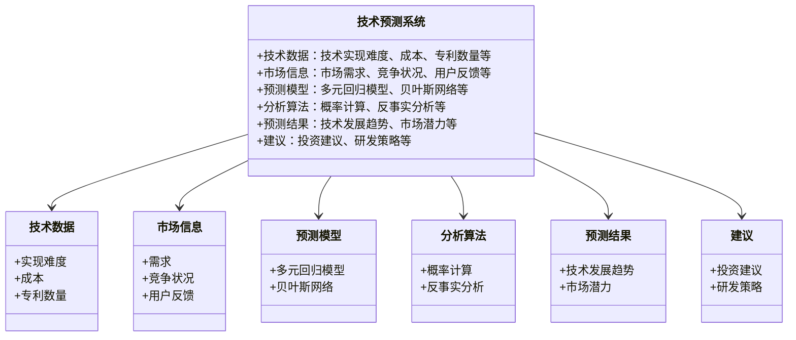

                 


# 芒格的"避免极端预测"在新兴技术市场预测中的应用

> 关键词：芒格思维模型、技术预测、极端预测、多元思维、反事实分析

> 摘要：本文从芒格的思维模型出发，探讨了在新兴技术市场预测中如何避免极端预测，分析了极端预测的常见偏差及其对技术发展的影响，提出了通过多元思维模型和反事实分析降低预测偏差的方法，并结合实际案例进行了详细阐述。最后，本文总结了芒格方法在技术预测中的应用价值，并提出了未来研究的方向。

---

## 第1章: 芒格的思维模型与极端预测

### 1.1 芒格的思维模型简介

芒格的多元思维模型是一种将多个学科的核心原则整合起来进行分析的思维方式。这种模型强调通过多个维度的交叉验证来降低预测的偏差。芒格认为，单一的思维方式容易导致极端预测，而多元思维模型则可以通过多维度的交叉验证，减少预测的不确定性。

#### 1.1.1 多元思维模型的核心概念

- **多维度分析**：通过整合多个学科的原理，从不同的角度观察问题。
- **交叉验证**：通过多个维度的数据和理论验证，降低预测偏差。
- **动态调整**：根据实际情况的变化，动态调整预测模型。

#### 1.1.2 避免极端预测的原则与方法

- **避免单一维度分析**：单一维度的分析容易导致极端预测。
- **注重概率思维**：通过概率分布来评估预测的可能范围。
- **动态调整预测模型**：根据新的数据和信息，不断调整预测模型。

#### 1.1.3 极端预测的定义与特征

- **极端预测**：指对未来技术发展过于乐观或悲观的预测。
- **特征**：单一维度分析、忽略反事实情况、缺乏动态调整。

---

### 1.2 极端预测在技术预测中的问题

#### 1.2.1 技术预测的常见偏差

- **乐观偏差**：对未来技术发展过于乐观，导致预测过于激进。
- **悲观偏差**：对未来技术发展过于悲观，导致预测过于保守。
- **确认偏差**：倾向于寻找支持自己观点的证据，忽略反面信息。

#### 1.2.2 极端预测对决策的影响

- **决策失误**：极端预测可能导致投资决策失误。
- **技术创新受阻**：过于乐观的预测可能导致资源浪费，而过于悲观的预测可能导致技术开发停滞。
- **市场波动**：极端预测可能引发市场的过度波动。

#### 1.2.3 如何识别和避免极端预测

- **多维度分析**：通过多元思维模型识别极端预测。
- **概率评估**：通过概率分布评估预测的可能范围。
- **动态调整**：根据实际情况动态调整预测模型。

---

## 第2章: 芒格方法论在技术预测中的应用

### 2.1 多元思维模型在技术预测中的作用

#### 2.1.1 多元思维模型的构成要素

- **技术发展趋势**：分析技术的演进路径和市场接受度。
- **市场反馈机制**：通过市场数据和用户反馈调整预测模型。
- **政策法规影响**：考虑政策法规对技术发展的影响。

#### 2.1.2 如何通过多元思维模型分析技术趋势

- **技术可行性分析**：评估技术的实现难度和成本。
- **市场接受度评估**：通过用户调研和市场分析预测市场反应。
- **政策风险评估**：分析政策法规对技术发展的潜在影响。

---

### 2.2 避免极端预测的策略与技巧

#### 2.2.1 预测中的概率思维

- **概率分布**：通过概率分布评估预测的可能范围。
- **贝叶斯推理**：通过贝叶斯推理动态调整预测概率。

#### 2.2.2 如何通过反事实分析降低预测偏差

- **反事实场景构建**：构建与现实相似但假设不同的场景。
- **反事实概率计算**：通过反事实分析评估不同场景的概率。

#### 2.2.3 预测中的平衡与稳健性

- **平衡预测范围**：通过多元思维模型平衡预测的乐观和悲观倾向。
- **稳健性评估**：评估预测模型的稳健性，确保预测的可靠性。

---

## 第3章: 极端预测的识别与分析

### 3.1 技术预测中的极端预测案例分析

#### 3.1.1 过于乐观的预测偏差

- **案例分析**：某新兴技术被预测为将在未来几年内取代现有技术。
- **问题分析**：忽略了技术实现的难度和市场接受度。

#### 3.1.2 过于悲观的预测偏差

- **案例分析**：某技术被预测为永远无法商业化。
- **问题分析**：忽略了技术进步的潜力和市场反馈。

#### 3.1.3 如何通过案例识别极端预测

- **历史数据分析**：通过历史数据识别极端预测的特征。
- **市场反馈机制**：通过市场反馈机制识别极端预测。

---

### 3.2 极端预测对技术发展的影响

#### 3.2.1 技术发展的非线性特征

- **技术进步的不确定性**：技术进步的速度和方向具有不确定性。
- **市场接受度的影响**：市场接受度对技术发展的影响不可忽视。

#### 3.2.2 极端预测对技术创新的阻碍

- **资源浪费**：极端预测可能导致资源浪费。
- **技术创新受阻**：极端预测可能导致技术创新受阻。

#### 3.2.3 如何通过芒格方法调整预测偏差

- **多维度分析**：通过多元思维模型调整预测偏差。
- **反事实分析**：通过反事实分析降低预测偏差。

---

## 第4章: 芒格方法论的数学模型与分析

### 4.1 多元思维模型的数学表达

#### 4.1.1 多元思维模型的构建过程

- **数据收集**：收集多个维度的数据。
- **模型构建**：通过多元回归分析构建预测模型。

#### 4.1.2 概率权重的计算公式

$$ P = \frac{w_i}{\sum w_j} $$

其中，\( w_i \) 是第i个维度的权重，\( \sum w_j \) 是所有权重的总和。

---

### 4.2 反事实分析的算法实现

#### 4.2.1 反事实分析的步骤

1. 确定预测目标。
2. 构建反事实场景。
3. 计算反事实概率。
4. 分析对预测结果的影响。

#### 4.2.2 反事实分析的数学模型

$$ P_{fact} = P_{base} \times \prod_{i=1}^{n} (1 + \delta_i) $$

其中，\( P_{base} \) 是基准概率，\( \delta_i \) 是第i个反事实因素的影响系数。

---

## 第5章: 技术预测中的系统分析与架构设计

### 5.1 技术预测系统的构成

#### 5.1.1 系统输入：技术数据与市场信息

- **技术数据**：技术实现难度、成本、专利数量等。
- **市场信息**：市场需求、竞争状况、用户反馈等。

#### 5.1.2 系统处理：预测模型与分析算法

- **预测模型**：多元回归模型、贝叶斯网络等。
- **分析算法**：概率计算、反事实分析等。

#### 5.1.3 系统输出：预测结果与建议

- **预测结果**：技术发展趋势、市场潜力等。
- **建议**：投资建议、研发策略等。

---

### 5.2 系统功能设计

#### 5.2.1 领域模型（mermaid 类图）



---

### 5.3 系统架构设计（mermaid 架构图）


---

### 5.4 系统接口设计

- **输入接口**：接收技术数据和市场信息。
- **输出接口**：输出预测结果和建议。
- **数据接口**：与数据库进行数据交互。

---

### 5.5 系统交互（mermaid 序列图）

```mermaid
sequenceDiagram

    用户 --> 技术预测系统：输入技术数据和市场信息
    技术预测系统 -> 数据库：存储技术数据和市场信息
    技术预测系统 -> 预测模型：构建预测模型
    预测模型 -> 分析算法：进行反事实分析
    分析算法 -> 技术预测系统：返回预测结果和建议
    技术预测系统 -> 用户：输出预测结果和建议
```

---

## 第6章: 项目实战

### 6.1 项目环境安装

#### 6.1.1 安装必要的库和工具

- Python 3.8+
- Pandas、NumPy、Scikit-learn
- Mermaid CLI 或支持 Mermaid 的工具

#### 6.1.2 代码实现

```python
import pandas as pd
import numpy as np
from sklearn.linear_model import LinearRegression
from sklearn.metrics import mean_squared_error

# 示例数据
data = {
    '技术特征': [1, 2, 3, 4, 5],
    '市场特征': [5, 4, 3, 2, 1],
    '预测结果': [2, 3, 4, 5, 6]
}

df = pd.DataFrame(data)

# 构建预测模型
model = LinearRegression()
model.fit(df[['技术特征', '市场特征']], df['预测结果'])

# 进行预测
new_data = pd.DataFrame({
    '技术特征': [6],
    '市场特征': [0]
})
predicted = model.predict(new_data)
print(f'预测结果：{predicted[0]}')
```

---

### 6.2 算法原理解读

#### 6.2.1 线性回归模型

- **模型假设**：因变量与自变量之间存在线性关系。
- **损失函数**：最小二乘法。
- **优化算法**：梯度下降。

#### 6.2.2 反事实分析实现

```python
def calculate_counterfactual(P_base, deltas):
    P_fact = P_base
    for delta in deltas:
        P_fact *= (1 + delta)
    return P_fact

# 示例
P_base = 0.5
deltas = [0.2, -0.1, 0.3]
P_fact = calculate_counterfactual(P_base, deltas)
print(f'反事实概率：{P_fact}')
```

---

## 第7章: 总结与展望

### 7.1 总结

芒格的思维模型在新兴技术市场预测中具有重要的应用价值。通过多元思维模型和反事实分析，可以有效降低预测偏差，提高预测的准确性。本文通过理论分析和实际案例，展示了芒格方法在技术预测中的具体应用。

### 7.2 展望

未来的研究可以进一步探讨芒格方法在其他领域中的应用，同时结合更多的实际案例，不断完善预测模型。此外，还可以探索将芒格方法与机器学习、人工智能等技术相结合，进一步提高预测的准确性。

---

## 附录

### 附录A: 工具与资源

- **Python库**：Pandas、NumPy、Scikit-learn。
- **可视化工具**：Matplotlib、Seaborn。
- **流程图工具**：Mermaid CLI、PlantUML。

### 附录B: 进一步阅读

- 《芒格的多元思维模型》
- 《技术预测的数学方法》
- 《反事实分析的理论与应用》

---

## 作者

作者：AI天才研究院/AI Genius Institute & 禅与计算机程序设计艺术 /Zen And The Art of Computer Programming

---

以上是基于用户需求和思考过程的完整目录结构和文章内容。

