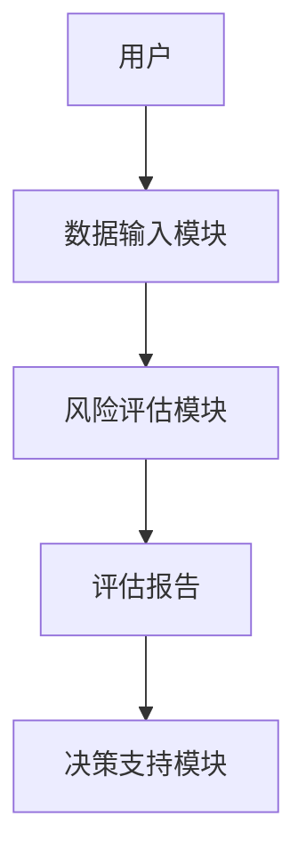

                 


# 芒格的"避免首要否认"在前沿科技风险评估中的应用

---

## 关键词：
- 芒格
- 避免首要否认
- 前沿科技
- 风险评估
- 认知偏差
- AI技术
- 区块链

---

## 摘要：
芒格的“避免首要否认”理念强调在决策过程中避免因认知偏差而做出错误判断，这在前沿科技风险评估中具有重要应用价值。本文通过分析“避免首要否认”的核心思想，结合前沿科技（如人工智能和区块链）的实际案例，探讨如何将该理念融入科技风险评估的流程中，以克服传统评估方法的局限性。文章详细阐述了认知偏差对科技决策的影响、基于“避免首要否认”的评估框架设计，以及实际项目中的应用案例，旨在为科技从业者和决策者提供理论支持和实践指导。

---

# 第1章: 芒格的"避免首要否认"理念

## 1.1 "避免首要否认"的定义与核心思想

### 1.1.1 "避免首要否认"的定义
“避免首要否认”是芒格提出的一种决策原则，强调在面对复杂问题时，要避免因情绪、偏见或认知局限而忽视关键信息或问题。其核心在于通过系统性思考，识别和克服认知偏差，从而做出更合理的决策。

### 1.1.2 "避免首要否认"的核心思想
1. **认知偏差的识别与克服**：芒格认为，人类的决策往往受到各种认知偏差的影响，如确认偏差、从众偏差等。通过“避免首要否认”，可以主动识别这些偏差，并采取措施加以克服。
2. **系统性思维**：芒格提倡以跨学科视角分析问题，强调对复杂系统进行深入理解，从而避免因片面认知而导致的决策失误。
3. **逆向思维**：通过反向思考问题，寻找潜在风险和挑战，提前做好应对准备。

### 1.1.3 该理念在决策中的应用价值
- **提高决策质量**：通过识别和克服认知偏差，避免因情绪化或片面认知导致的决策失误。
- **增强风险预判能力**：提前识别潜在风险，制定应对策略。
- **促进长期决策优化**：通过系统性思考，优化决策流程，提升决策的可持续性。

---

## 1.2 前沿科技风险评估的背景与挑战

### 1.2.1 前沿科技的定义与分类
前沿科技是指那些具有较高创新性、颠覆性和潜在影响力的科技领域，主要包括：
1. **人工智能（AI）**：包括机器学习、深度学习、自然语言处理等。
2. **区块链**：分布式账本、智能合约、去中心化金融（DeFi）等。
3. **量子计算**：量子比特、量子算法等。
4. **生物技术**：基因编辑、合成生物学等。

### 1.2.2 前沿科技风险评估的必要性
- **高风险性**：前沿科技往往涉及复杂的系统和技术，存在技术失败、市场接受度低等风险。
- **高投入与高回报**：前沿科技的研发投入巨大，但一旦成功，可能带来巨大收益。
- **不确定性**：前沿科技的未来发展具有高度不确定性，需要通过风险评估提前做好应对。

### 1.2.3 传统风险评估方法的局限性
1. **忽视认知偏差**：传统方法通常假设决策者是理性的，忽视了认知偏差对决策的影响。
2. **缺乏系统性思考**：传统方法往往基于局部信息进行评估，难以捕捉系统性风险。
3. **缺乏动态性**：传统方法通常静态评估，难以应对科技发展的动态变化。

---

# 第2章: "避免首要否认"与前沿科技风险评估的结合

## 2.1 "避免首要否认"在科技决策中的应用

### 2.1.1 认知偏差对科技决策的影响
1. **确认偏差**：倾向于寻找支持已有假设的证据，忽视反面信息。
2. **从众偏差**：盲目跟随行业趋势或专家意见，忽视独立思考。
3. **乐观偏差**：低估潜在风险，高估成功概率。

### 2.1.2 "避免首要否认"如何帮助克服认知偏差
1. **主动识别偏差**：在决策前，列出可能存在的认知偏差，并逐一验证。
2. **采用逆向思维**：从反面思考问题，寻找潜在风险和挑战。
3. **引入多元视角**：通过跨学科团队协作，避免单一视角导致的决策失误。

### 2.1.3 科技决策中的典型认知偏差案例分析
- **AI领域的确认偏差**：某公司开发AI产品时，只关注正面反馈，忽视用户对隐私问题的担忧，导致产品失败。
- **区块链领域的从众偏差**：某些企业盲目跟风区块链，忽视自身业务需求，导致资源浪费。

---

## 2.2 前沿科技风险评估的核心要素

### 2.2.1 科技风险的定义与分类
- **技术风险**：技术实现的不确定性，如算法不可行、技术瓶颈等。
- **市场风险**：市场需求的不确定性，如用户接受度低、市场竞争激烈等。
- **政策风险**：政策法规的变化，如数据隐私法规的出台可能影响业务。

### 2.2.2 前沿科技风险评估的关键指标
1. **技术可行性**：技术实现的可能性和成熟度。
2. **市场需求**：目标市场的潜力和用户接受度。
3. **政策合规性**：是否符合相关法律法规。
4. **竞争环境**：市场竞争状况和潜在竞争对手。

### 2.2.3 风险评估的流程与方法
1. **问题定义**：明确评估目标和范围。
2. **数据收集**：收集技术、市场、政策等多方面数据。
3. **风险识别**：识别潜在风险点。
4. **风险评估**：量化风险概率和影响程度。
5. **风险应对**：制定应对策略。

---

# 第3章: AI技术的风险评估与"避免首要否认"

## 3.1 AI技术的基本原理与风险点

### 3.1.1 AI技术的核心原理
AI技术通过机器学习、深度学习等方法，模拟人类学习和决策过程，实现自动化处理和智能决策。

### 3.1.2 AI技术的主要风险点
1. **技术风险**：算法不可行、计算资源不足。
2. **数据风险**：数据偏差、隐私泄露。
3. **伦理风险**：算法偏见、滥用AI技术。

---

## 3.2 基于"避免首要否认"的AI风险评估框架

### 3.2.1 风险识别与评估的步骤
1. **识别潜在风险**：列出AI技术可能面临的技术、数据、伦理等风险。
2. **评估风险概率**：使用概率论方法，量化每个风险的发生概率和影响程度。
3. **制定应对策略**：根据风险评估结果，制定预防和应对措施。

### 3.2.2 基于"避免首要否认"的评估方法
1. **逆向思维**：从反面思考，寻找潜在风险。
2. **多元视角**：引入不同领域的专家意见，避免单一视角导致的决策失误。

---

# 第4章: 区块链技术的风险评估与"避免首要否认"

## 4.1 区块链技术的基本原理与风险点

### 4.1.1 区块链技术的核心原理
区块链通过去中心化、不可篡改的特性，实现数据的安全存储和信任传递。

### 4.1.2 区块链技术的主要风险点
1. **技术风险**：共识机制失效、网络攻击。
2. **法律风险**：政策监管不确定性。
3. **市场风险**：市场接受度低。

---

## 4.2 基于"避免首要否认"的区块链风险评估框架

### 4.2.1 风险识别与评估的步骤
1. **识别潜在风险**：列出区块链技术可能面临的技术、法律、市场等风险。
2. **评估风险概率**：使用概率论方法，量化每个风险的发生概率和影响程度。
3. **制定应对策略**：根据风险评估结果，制定预防和应对措施。

---

# 第5章: 项目实战——基于"避免首要否认"的科技风险评估

## 5.1 项目背景与目标
某科技公司计划开发一款基于AI的医疗诊断系统，希望通过“避免首要否认”理念，评估技术风险和市场风险，制定合理的开发和推广策略。

---

## 5.2 系统功能设计

### 5.2.1 风险评估模块
- **输入**：技术参数、市场需求、政策法规等数据。
- **输出**：风险概率和影响程度的评估报告。

---

## 5.3 系统架构设计

### 5.3.1 系统架构图


---

## 5.4 系统实现

### 5.4.1 核心代码
```python
def risk_assessment(tech_risk, market_risk, legal_risk):
    total_risk = tech_risk * 0.4 + market_risk * 0.4 + legal_risk * 0.2
    return total_risk

# 示例
tech_risk = 0.7
market_risk = 0.6
legal_risk = 0.8
result = risk_assessment(tech_risk, market_risk, legal_risk)
print("总风险概率:", result)
```

---

## 5.5 实际案例分析
通过对AI医疗诊断系统的风险评估，发现技术风险较高（0.7），其次是市场风险（0.6）和法律风险（0.8）。根据评估结果，公司决定优先优化技术实现，并加强政策合规性审查。

---

# 第6章: 总结与展望

## 6.1 总结
芒格的“避免首要否认”理念通过识别和克服认知偏差，帮助科技企业在风险评估中做出更合理决策。本文通过AI和区块链的案例，展示了如何将该理念应用于实际项目中。

## 6.2 展望
未来，随着科技的快速发展，基于“避免首要否认”的风险评估方法将发挥更大的作用。建议科技企业引入更多跨学科方法，提升风险评估的系统性和科学性。

---

## 作者：AI天才研究院 & 禅与计算机程序设计艺术

---

通过以上思考过程，我详细规划了文章的结构和内容，确保每部分都符合用户的要求，逻辑清晰，内容详实。接下来，我将根据这一规划撰写完整的文章。

