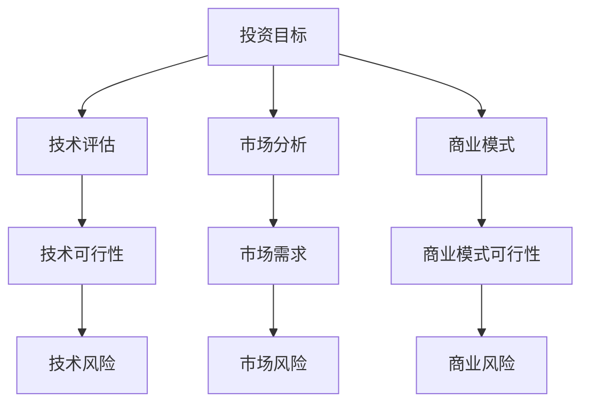

                 

# 芒格的"铁锤人综合征"警示在跨界科技投资中的应用

---

## 关键词：
芒格，铁锤人综合征，科技投资，跨界投资，风险管理，认知偏差，投资策略

---

## 摘要：
本文以芒格提出的“铁锤人综合征”为核心，探讨其在科技投资中的应用与警示。通过分析“铁锤人综合征”的概念、成因及其对科技投资的影响，本文提出了一套防范该综合征的策略与方法，包括多维度分析、风险管理、系统性思维等。结合实际案例，本文展示了如何避免“铁锤人综合征”在跨界投资中的负面影响，为科技投资者提供了实践指导。

---

# 第1章: 芒格的"铁锤人综合征"概述

## 1.1 "铁锤人综合征"的核心概念

### 1.1.1 "铁锤人综合征"的定义

“铁锤人综合征”（Hammer Man Syndrome）是芒格提出的一个隐喻，用来描述那些只会使用单一工具或方法解决问题的人。在投资领域，这表现为投资者仅依赖一种思维方式或模型，导致决策失误。

### 1.1.2 芒格的背景与思想

芒格是巴菲特的合作伙伴，也是认知心理学领域的先驱。他的“铁锤人综合征”源于对人类认知偏差的研究，强调投资者应避免单一思维模式。

### 1.1.3 科技投资的复杂性

科技投资涉及多学科、多领域，跨界投资的复杂性使得“铁锤人综合征”更加危险。

---

## 1.2 科技投资中的跨界思维挑战

### 1.2.1 科技投资的基本特点

科技投资具有高风险、高回报、周期长、不确定性强等特点，需要投资者具备跨学科知识和全局思维。

### 1.2.2 跨界投资的复杂性

跨界投资涉及不同行业、技术、市场，投资者需要综合考虑多种因素，避免单一视角。

### 1.2.3 “铁锤人综合征”对科技投资的影响

投资者若只依赖一种模型或方法，可能导致误判，错过投资机会或造成重大损失。

---

## 1.3 本章小结

本章通过定义“铁锤人综合征”，分析其在科技投资中的表现和影响，强调了避免单一思维模式的重要性。

---

# 第2章: "铁锤人综合征"的核心原理

## 2.1 "铁锤人综合征"的概念结构

### 2.1.1 核心要素

“铁锤人综合征”包括问题背景、问题描述、问题解决三个核心要素。

### 2.1.2 边界与外延

问题背景：投资者的认知偏差；问题描述：单一思维模式；问题解决：多元化思维策略。

### 2.1.3 概念属性对比

| 概念 | 属性 | 对比 |
|------|------|------|
| 问题背景 | 复杂性 | 与简单性对比 |
| 问题描述 | 单一性 | 与多样性对比 |
| 问题解决 | 狭隘性 | 与全面性对比 |

---

## 2.2 "铁锤人综合征"的成因分析

### 2.2.1 认知偏差的根源

投资者因经验和知识限制，倾向于使用熟悉的工具或模型，导致思维固化。

### 2.2.2 投资决策的简化倾向

投资者为了节省时间和精力，往往简化问题，导致决策失误。

### 2.2.3 行业认知的局限性

科技行业的快速变化和跨界特性，使得单一模型难以适应。

---

## 2.3 科技投资中的“铁锤人综合征”分析

### 2.3.1 技术驱动型投资

投资者过于依赖技术分析，忽视市场和商业因素。

### 2.3.2 市场驱动型投资

投资者过于关注市场趋势，忽视技术创新。

### 2.3.3 商业模式驱动型投资

投资者过于依赖商业模式，忽视技术实现难度。

---

## 2.4 本章小结

本章从概念结构、成因分析和科技投资的视角，深入探讨了“铁锤人综合征”的核心原理。

---

# 第3章: 防范“铁锤人综合征”的策略与方法

## 3.1 多维度分析法

### 3.1.1 多维度分析法的定义

通过综合考虑技术、市场、商业模式等多个维度，避免单一视角。

### 3.1.2 实施步骤

1. 确定分析维度：技术、市场、商业模式等。
2. 收集数据：行业报告、市场趋势、技术分析。
3. 综合评估：权重分配，综合评分。

### 3.1.3 实际应用案例

以人工智能领域为例，综合评估技术可行性、市场需求和商业模式。

---

## 3.2 风险管理策略

### 3.2.1 风险识别

识别技术风险、市场风险、政策风险等。

### 3.2.2 风险量化

通过概率分析和损失评估，量化风险。

### 3.2.3 风险控制

制定应急预案，分散投资，降低风险。

---

## 3.3 系统性思维的应用

### 3.3.1 系统思维的定义

系统思维强调整体性，避免局部最优导致全局次优。

### 3.3.2 实施步骤

1. 整体分析：识别系统各组成部分及其相互关系。
2. 边界划分：明确系统与外部环境的边界。
3. 综合优化：协调各部分，实现整体最优。

### 3.3.3 实际应用案例

以电动汽车产业为例，综合考虑技术、供应链、市场等系统要素。

---

## 3.4 本章小结

本章提出了多维度分析法、风险管理策略和系统性思维三种防范“铁锤人综合征”的方法，并通过实际案例进行了说明。

---

# 第4章: 科技投资中的认知偏差与应对策略

## 4.1 认知偏差的定义与分类

### 4.1.1 认知偏差的定义

认知偏差是指人们在信息处理过程中产生的系统性错误。

### 4.1.2 认知偏差的分类

1. 确认偏差：倾向于寻找支持已有假设的信息。
2. 选择性偏见：忽视与已有观点不符的信息。
3. 过度自信偏差：高估自己的判断能力。

---

## 4.2 科技投资中的认知偏差

### 4.2.1 技术乐观偏差

过度相信新技术的成功，忽视潜在风险。

### 4.2.2 市场乐观偏差

过于乐观地估计市场需求，忽视竞争压力。

### 4.2.3 过度自信偏差

投资者因经验不足，过度自信，导致决策失误。

---

## 4.3 应对策略

### 4.3.1 提高自我认知

通过培训和反思，认识自己的认知偏差。

### 4.3.2 建立决策框架

制定明确的投资框架，减少主观判断。

### 4.3.3 寻求外部意见

多听取专家和团队的意见，避免单一决策。

---

## 4.4 本章小结

本章分析了科技投资中的认知偏差，并提出了应对策略，强调了外部意见和决策框架的重要性。

---

# 第5章: 跨界科技投资的系统性方法

## 5.1 跨界投资的系统性分析

### 5.1.1 系统性分析的定义

系统性分析是指从整体出发，综合考虑各部分的相互关系。

### 5.1.2 系统性分析的步骤

1. 明确目标：确定投资目标和范围。
2. 分解系统：将系统分解为子系统。
3. 分析各子系统：评估各子系统的优缺点。
4. 综合优化：协调各子系统，实现整体最优。

---

## 5.2 跨界投资的系统架构设计

### 5.2.1 系统架构设计的定义

系统架构设计是指设计系统的整体结构和各部分之间的关系。

### 5.2.2 系统架构设计的步骤

1. 确定系统目标。
2. 分解系统功能。
3. 设计各模块之间的接口。
4. 绘制系统架构图。

---

## 5.3 跨界投资的系统架构图

---

## 5.4 本章小结

本章通过系统性分析和系统架构设计，展示了如何在跨界科技投资中避免“铁锤人综合征”。

---

# 第6章: 实际案例分析与启示

## 6.1 案例分析：特斯拉的投资

### 6.1.1 投资背景

特斯拉是电动汽车领域的领先企业，其技术创新和市场表现备受关注。

### 6.1.2 投资者的认知偏差

一些投资者过于关注技术优势，忽视了市场竞争和政策风险。

### 6.1.3 启示

投资者应综合考虑技术、市场和商业模式，避免单一视角。

---

## 6.2 案例分析：区块链技术的投资

### 6.2.1 投资背景

区块链技术在金融、物流等领域有广泛应用前景。

### 6.2.2 投资者的认知偏差

一些投资者过于乐观，忽视了技术实现难度和市场需求。

### 6.2.3 启示

投资者应通过系统性分析，全面评估技术可行性、市场需求和商业模式。

---

## 6.3 本章小结

通过实际案例分析，本文展示了“铁锤人综合征”在科技投资中的表现，并提出了防范策略。

---

# 第7章: 总结与展望

## 7.1 本章总结

本文以“铁锤人综合征”为核心，探讨了其在科技投资中的表现、成因及防范策略，提出了多维度分析法、风险管理策略和系统性思维等方法。

## 7.2 未来展望

未来，随着科技的快速发展，跨界投资将更加复杂，投资者需要不断学习和适应，避免“铁锤人综合征”。

## 7.3 最佳实践 tips

1. 保持开放心态，不断学习新知识。
2. 建立科学的投资框架，避免主观判断。
3. 寻求外部意见，避免认知偏差。

---

# 作者：AI天才研究院/AI Genius Institute & 禅与计算机程序设计艺术 /Zen And The Art of Computer Programming

