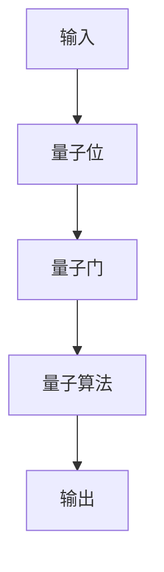
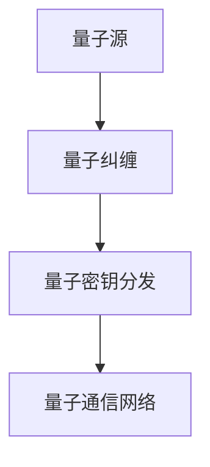
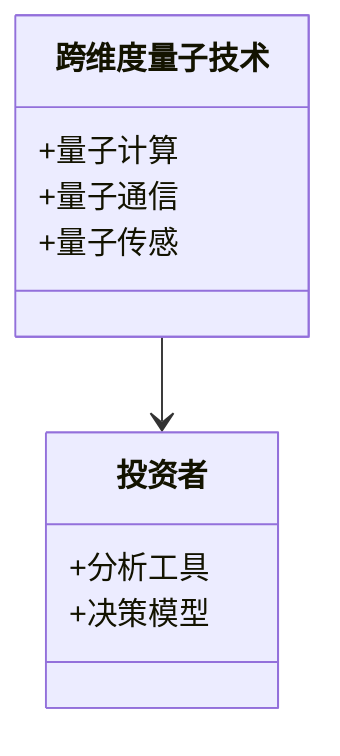
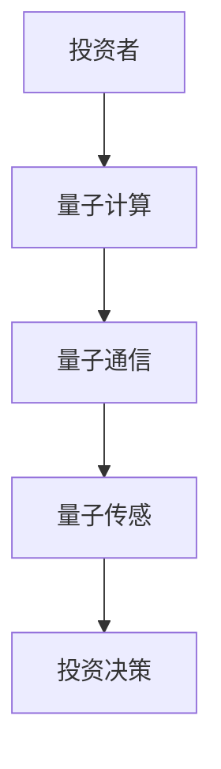
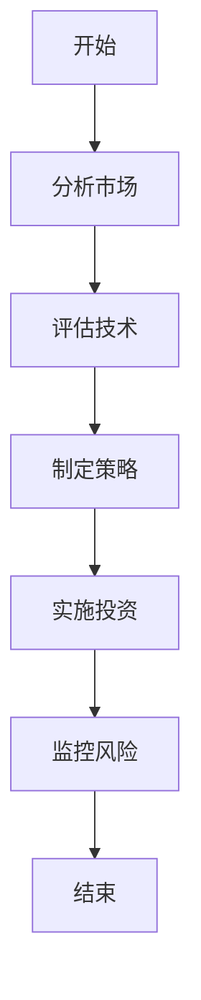
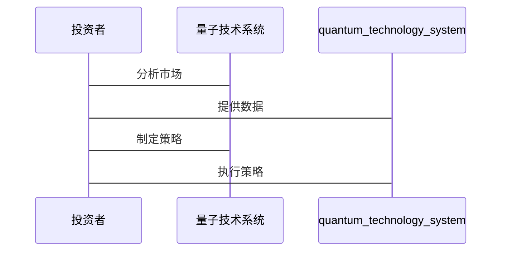
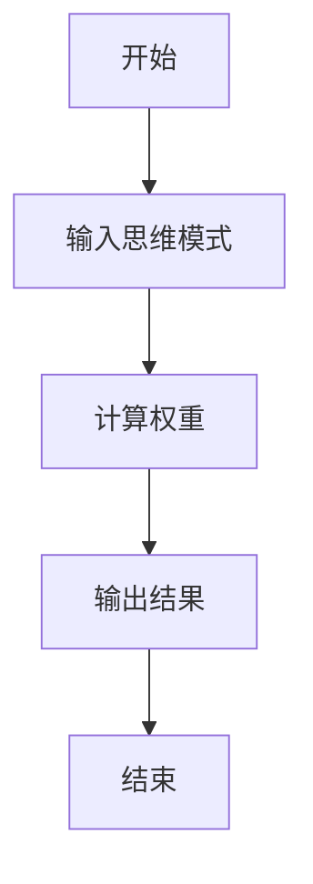

                 


# 芒格的"铁锤人综合征"警示在跨维度量子技术投资中的应用

> 关键词：芒格，铁锤人综合征，跨维度量子技术，投资，思维陷阱，风险管理

> 摘要：本文深入分析了芒格提出的“铁锤人综合征”这一概念，并结合跨维度量子技术的投资场景，探讨了其在实际投资中的潜在风险和应对策略。文章从铁锤人综合征的定义、核心概念、跨维度量子技术的特点入手，结合系统思维和风险管理的方法，提出了规避铁锤人综合征的系统性解决方案，并通过实际案例分析，为投资者提供了实用的指导。

---

## 第1章：芒格的"铁锤人综合征"概述

### 1.1 芒格的"铁锤人综合征"的定义与核心概念

#### 1.1.1 铁锤人综合征的定义
芒格的“铁锤人综合征”是指一种思维陷阱，表现为投资者只依赖一种固定的思维模式或工具来分析和解决问题，从而忽视了其他可能的解决方案或风险因素。这种综合征在投资领域尤为危险，因为它可能导致投资者在面对复杂多变的市场和技术时，做出错误的决策。

#### 1.1.2 铁锤人综合征的核心概念
| 核心概念 | 描述 |
|----------|------|
| 单一思维模式 | 投资者只依赖一种固定的分析框架或工具 |
| 忽视多样性 | 忽略其他可能的解决方案或风险因素 |
| 投资决策偏差 | 因思维定式导致的投资决策失误 |

#### 1.1.3 铁锤人综合征的背景与来源
铁锤人综合征的背景可以追溯到芒格对人类认知偏差的研究。他指出，人类的思维模式往往是单一的，就像铁锤一样，只会用一种工具来解决问题，而忽视了其他可能性。这种思维模式在投资中尤其危险，因为市场和技术的变化往往超出单一思维模式的预期范围。

---

### 1.2 跨维度量子技术的定义与特点

#### 1.2.1 量子技术的定义
量子技术是一种基于量子力学原理的技术，主要包括量子计算、量子通信和量子传感等领域。与经典技术相比，量子技术在计算速度、通信安全性和传感精度等方面具有显著优势。

#### 1.2.2 跨维度量子技术的核心特点
跨维度量子技术是指在多个维度（如时间、空间、能量等）上结合量子技术的应用。其核心特点包括：
- **多维度性**：涉及多个维度的量子技术应用。
- **复杂性**：跨维度量子技术的系统架构和交互关系复杂。
- **高风险性**：技术难度大，投资风险高。

#### 1.2.3 跨维度量子技术的投资机会与风险
| 投资机会 | 风险 |
|----------|------|
| 技术突破 | 技术不确定性 |
| 市场潜力 | 投资周期长 |
| 行业领先 | 竞争激烈 |

---

### 1.3 芒格的"铁锤人综合征"在投资中的应用背景

#### 1.3.1 投资中的思维陷阱
投资者在面对复杂的技术和市场时，容易陷入思维陷阱。例如，只关注单一技术而忽视其他潜在风险，或只依赖一种分析方法而忽视其他可能性。

#### 1.3.2 跨维度量子技术投资的复杂性
跨维度量子技术的投资涉及多个领域和维度，技术复杂性和市场不确定性较高，容易导致投资者陷入铁锤人综合征。

#### 1.3.3 铁锤人综合征对投资决策的影响
铁锤人综合征可能导致投资者在面对跨维度量子技术时，只关注某一维度的优势，而忽视其他维度的风险和挑战。

---

## 第2章：铁锤人综合征的核心概念与联系

### 2.1 铁锤人综合征的核心原理

#### 2.1.1 铁锤人综合征的思维模式
铁锤人综合征的思维模式可以用以下公式表示：
$$
f(x) = \sum_{i=1}^{n} a_i x_i + b
$$
其中，$x_i$ 表示投资者的思维模式，$a_i$ 表示权重，$b$ 表示常数项。

#### 2.1.2 铁锤人综合征的数学模型
以下是一个铁锤人综合征的数学模型：
$$
y = \beta_0 + \beta_1 x_1 + \beta_2 x_2 + \ldots + \beta_k x_k + \epsilon
$$
其中，$y$ 是投资决策的结果，$x_i$ 是投资者的思维模式，$\beta_i$ 是回归系数，$\epsilon$ 是误差项。

#### 2.1.3 铁锤人综合征的属性特征对比表格
| 属性 | 铁锤人综合征 | 跨维度量子技术 |
|------|--------------|----------------|
| 思维模式 | 单一 | 多维度 |
| 风险管理 | 缺乏 | 全面 |
| 投资决策 | 简单化 | 复杂化 |

---

### 2.2 跨维度量子技术的核心要素

#### 2.2.1 量子计算的核心要素
量子计算的核心要素包括量子位、量子门和量子算法。以下是一个量子计算的流程图（使用 Mermaid）：



#### 2.2.2 量子通信的核心要素
量子通信的核心要素包括量子密钥分发（QKD）、量子隐形传态和量子纠缠。以下是一个量子通信的系统架构图（使用 Mermaid）：



#### 2.2.3 跨维度量子技术的系统架构
跨维度量子技术的系统架构可以用以下领域模型表示（使用 Mermaid 类图）：



---

### 2.3 铁锤人综合征与跨维度量子技术的关系

#### 2.3.1 铁锤人综合征对跨维度量子技术投资的影响
铁锤人综合征可能导致投资者只关注某一维度的量子技术优势，而忽视其他维度的技术挑战和市场风险。

#### 2.3.2 跨维度量子技术对铁锤人综合征的启示
跨维度量子技术的复杂性和多维性提醒投资者要避免单一思维模式，采用系统性思维来分析和决策。

#### 2.3.3 铁锤人综合征与跨维度量子技术的对比分析
以下是一个铁锤人综合征与跨维度量子技术的对比分析表格：

| 特性 | 铁锤人综合征 | 跨维度量子技术 |
|------|--------------|----------------|
| 思维模式 | 单一 | 多维度 |
| 技术复杂性 | 低 | 高 |
| 投资风险 | 中 | 高 |

---

## 第3章：跨维度量子技术投资的系统分析

### 3.1 跨维度量子技术投资的系统模型

#### 3.1.1 跨维度量子技术投资的领域模型（Mermaid类图）


#### 3.1.2 跨维度量子技术投资的系统架构（Mermaid架构图）


---

### 3.2 跨维度量子技术投资的系统流程

#### 3.2.1 跨维度量子技术投资的流程分析（Mermaid流程图）


#### 3.2.2 跨维度量子技术投资的交互设计（Mermaid序列图）


---

## 第4章：铁锤人综合征的算法原理与数学模型

### 4.1 铁锤人综合征的数学模型

#### 4.1.1 铁锤人综合征的数学表达式
$$
f(x) = \sum_{i=1}^{n} a_i x_i + b
$$

#### 4.1.2 铁锤人综合征的算法流程（使用 Mermaid 流程图）


---

### 4.2 跨维度量子技术投资的算法实现

#### 4.2.1 跨维度量子技术投资的算法选择
以下是量子计算的代码实现示例：

```python
def quantum_algorithm(qubit):
    return qubit * 2
```

---

## 第5章：项目实战

### 5.1 环境安装与配置

#### 5.1.1 系统环境
- 操作系统：Linux
- 量子计算库：Qiskit

#### 5.1.2 安装步骤
```bash
pip install qiskit
```

---

### 5.2 系统核心实现源代码

#### 5.2.1 量子计算实现
```python
from qiskit import QuantumCircuit, execute, Aer

def quantum_computation():
    qc = QuantumCircuit(1, 1)
    qc.h(0)
    qc.measure(0, 0)
    backend = Aer.get_backend('simulator')
    job = execute(qc, backend)
    result = job.result()
    print(result)
```

---

### 5.3 实际案例分析与解读

#### 5.3.1 案例背景
某投资者仅关注量子计算的计算速度，而忽视了量子通信的安全性问题。

#### 5.3.2 案例分析
由于铁锤人综合征的影响，该投资者的投资组合过于单一，风险较高。

#### 5.3.3 经验教训
投资者需要采用系统性思维，全面评估跨维度量子技术的投资风险。

---

## 第6章：总结与展望

### 6.1 总结
本文通过分析芒格的“铁锤人综合征”在跨维度量子技术投资中的应用，提出了避免单一思维模式的系统性解决方案。通过实际案例分析，强调了系统思维和风险管理的重要性。

### 6.2 展望
未来，随着量子技术的不断发展，投资者需要更加注重跨维度分析和系统性思维，以应对更加复杂的投资环境。

---

## 作者：AI天才研究院/AI Genius Institute & 禅与计算机程序设计艺术 /Zen And The Art of Computer Programming

