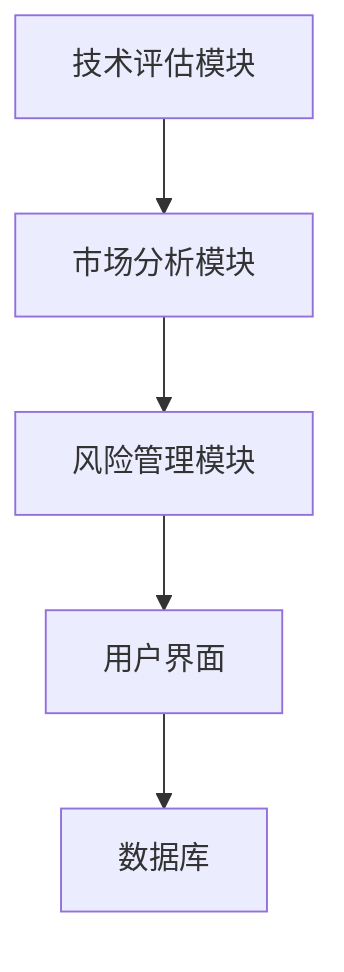

                 


# 芒格的"铁锤人综合征"警示在量子技术商业化中的应用

> 关键词：量子技术，铁锤人综合征，芒格，技术商业化，决策风险

> 摘要：本文探讨芒格提出的“铁锤人综合征”这一概念在量子技术商业化中的应用，分析该综合征如何导致技术商业化中的决策失误，提出如何通过认知升级和风险管理来避免这类问题，帮助量子技术企业在商业化过程中做出更明智的决策。

---

# 第一部分: 芒格的"铁锤人综合征"与量子技术商业化概述

## 第1章: 芒格的"铁锤人综合征"概述

### 1.1 铁锤人综合征的定义与核心概念

#### 1.1.1 铁锤人综合征的定义
芒格的“铁锤人综合征”描述了人类的一种认知偏差，即人们倾向于用自己最熟悉的方式（“铁锤”）解决所有问题，就像只能用锤子敲击一切的人。这种思维模式导致人们在面对复杂问题时，忽视其他可能更有效的解决方案。

#### 1.1.2 铁锤人综合征的核心概念
- **单一思维模式**：过度依赖单一的思维框架或工具。
- **认知局限性**：无法跳出既有的知识框架，忽视其他可能性。
- **决策风险**：可能导致次优或错误的决策，尤其是在技术商业化领域。

#### 1.1.3 铁锤人综合征与量子技术的关联
量子技术的商业化涉及复杂的技术和市场挑战，铁锤人综合征可能导致技术开发者过度依赖传统方法，忽视量子技术的独特优势和潜在应用场景。

---

## 第2章: 量子技术商业化中的挑战

### 2.1 量子技术商业化的核心问题

#### 2.1.1 技术成熟度的评估
量子技术仍处于快速发展阶段，技术成熟度不一，商业化过程中需要对技术可行性进行全面评估。

#### 2.1.2 市场认知的偏差
市场对量子技术的认知可能不准确，导致投资者和企业决策者过于乐观或悲观。

#### 2.1.3 商业化中的风险与不确定性
量子技术的商业化涉及高昂的研发成本和较长的回报周期，存在技术失败和市场接受度不高等风险。

### 2.2 铁锤人综合征在量子技术商业化中的表现

#### 2.2.1 技术误区的形成
技术开发者可能过度依赖传统技术路径，忽视量子技术的独特优势。

#### 2.2.2 市场认知偏差的影响
市场参与者可能因为认知偏差而低估或高估量子技术的商业化潜力。

#### 2.2.3 决策失误的典型案例
分析一些量子技术商业化失败的案例，探讨铁锤人综合征在其中的作用。

---

# 第二部分: 量子技术商业化的核心概念与联系

## 第3章: 量子技术的核心原理

### 3.1 量子力学基础

#### 3.1.1 量子叠加原理
量子系统可以同时处于多个状态，这是量子计算的核心原理之一。

#### 3.1.2 量子纠缠原理
纠缠的量子系统之间存在强关联，测量其中一个会影响另一个的状态。

#### 3.1.3 量子测量原理
测量会破坏量子系统的叠加态，这是量子信息处理的关键特性。

### 3.2 量子计算的基本原理

#### 3.2.1 量子比特的概念
量子比特（qubit）是量子计算的基本单位，与经典比特不同，它可以同时表示0和1的叠加态。

#### 3.2.2 量子门操作
量子门操作是量子计算的基本逻辑操作，如Hadamard门和CNOT门。

#### 3.2.3 量子算法的运行机制
量子算法（如Shor算法）利用量子叠加和纠缠特性，能够在某些问题上远超经典算法的效率。

---

## 第4章: 量子技术与商业化的联系

### 4.1 量子技术在商业中的应用场景

#### 4.1.1 金融领域的量子计算应用
量子计算可以用于优化投资组合、风险评估和高频交易等。

#### 4.1.2 医药研发中的量子技术应用
量子计算可以加速药物分子的模拟和优化。

#### 4.1.3 物流优化中的量子技术应用
量子计算可以优化物流路径和资源分配。

### 4.2 铁锤人综合征对量子技术商业化的影响

#### 4.2.1 技术单一化的问题
过度依赖单一技术路径可能导致量子技术商业化失败。

#### 4.2.2 市场认知偏差的影响
市场参与者对量子技术的误解可能导致投资决策失误。

#### 4.2.3 决策失误的典型案例
通过具体案例分析，探讨铁锤人综合征在量子技术商业化中的实际影响。

---

# 第三部分: 量子技术商业化中的系统分析与架构设计

## 第5章: 量子技术商业化系统的功能设计

### 5.1 量子技术商业化系统的功能模块

#### 5.1.1 技术评估模块
评估量子技术的成熟度和商业化潜力。

#### 5.1.2 市场分析模块
分析市场需求和竞争环境。

#### 5.1.3 风险管理模块
识别和评估商业化过程中的各种风险。

### 5.2 量子技术商业化系统的交互流程

#### 5.2.1 技术评估流程
从技术可行性、市场潜力和经济回报三个维度对量子技术进行评估。

#### 5.2.2 市场分析流程
通过市场调研、竞争对手分析和用户需求分析，确定量子技术的商业化路径。

#### 5.2.3 风险管理流程
制定风险管理策略，包括风险规避、减轻、转移和接受。

---

## 第6章: 量子技术商业化系统的架构设计

### 6.1 领域模型设计

#### 6.1.1 领域模型的类图
使用Mermaid绘制领域模型的类图，展示量子技术商业化系统的主要组件和交互关系。

```mermaid
classDiagram
    class 技术评估模块 {
        - 技术可行性
        - 商业化潜力
    }
    class 市场分析模块 {
        - 市场需求
        - 竞争分析
    }
    class 风险管理模块 {
        - 风险评估
        - 管理策略
    }
   抽屉关系：抽屉关系是指一个模块内部的详细实现不对外公开，只通过接口与外界交互。
   抽屉关系：抽屉关系是指一个模块内部的详细实现不对外公开，只通过接口与外界交互。
```

### 6.2 系统架构设计

#### 6.2.1 系统架构图
使用Mermaid绘制系统架构图，展示量子技术商业化系统的整体架构和各模块的交互关系。



---

# 第四部分: 量子技术商业化中的项目实战

## 第7章: 量子技术商业化项目实战

### 7.1 项目背景

#### 7.1.1 项目目标
通过量子计算技术优化某行业的业务流程。

#### 7.1.2 项目需求
明确项目的具体需求和目标。

### 7.2 项目实施

#### 7.2.1 系统设计
设计系统的功能模块和交互流程。

#### 7.2.2 系统实现
使用Python编写系统的核心功能模块。

#### 7.2.3 系统测试
对系统进行全面的功能测试和性能测试。

### 7.3 项目小结

#### 7.3.1 项目成果
总结项目实施的成果和经验。

#### 7.3.2 项目启示
总结项目中关于铁锤人综合征的启示和教训。

---

# 第五部分: 避免铁锤人综合征的最佳实践

## 第8章: 避免铁锤人综合征的最佳实践

### 8.1 认知升级

#### 8.1.1 拓展知识边界
通过学习和实践拓展知识边界，避免单一思维模式。

#### 8.1.2 多角度思考问题
培养多角度思考问题的能力，避免过度依赖单一解决方案。

### 8.2 风险管理

#### 8.2.1 建立风险管理机制
制定全面的风险管理策略，降低商业化过程中的不确定性。

#### 8.2.2 定期评估和调整
定期评估商业化策略，根据实际情况进行调整。

### 8.3 团队协作

#### 8.3.1 引入多元化的团队成员
通过引入不同背景和技能的团队成员，避免认知单一化。

#### 8.3.2 鼓励创新思维
鼓励团队成员提出创新想法，避免过度依赖传统方法。

---

## 第9章: 总结与展望

### 9.1 总结

#### 9.1.1 核心观点回顾
回顾本文的核心观点，强调铁锤人综合征在量子技术商业化中的潜在风险。

#### 9.1.2 实践意义
总结本文对量子技术商业化实践的指导意义。

### 9.2 展望

#### 9.2.1 未来挑战
展望量子技术商业化面临的未来挑战。

#### 9.2.2 未来发展
探讨量子技术商业化未来的发展方向和潜力。

---

# 作者

作者：AI天才研究院/AI Genius Institute & 禅与计算机程序设计艺术 /Zen And The Art of Computer Programming

---

**摘要：**  
本文通过分析芒格提出的“铁锤人综合征”这一认知偏差，揭示其在量子技术商业化中的潜在风险。通过详细探讨量子技术的核心原理、商业化挑战以及系统设计，本文提出了避免铁锤人综合征的最佳实践策略，为量子技术企业在商业化过程中做出更明智的决策提供了重要参考。

