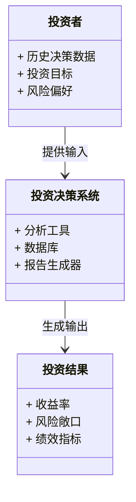

                 


# 芒格的"铁锤人综合征"警示：避免投资思维定式

> 关键词：芒格、铁锤人综合征、投资思维定式、认知偏差、行为经济学、决策模型

> 摘要：本文通过分析芒格提出的“铁锤人综合征”这一投资思维定式的概念、成因及其对投资决策的影响，结合心理学、行为经济学和计算机科学的理论与方法，详细阐述了如何识别和避免投资思维定式。文章从背景介绍、铁锤人综合征的核心概念、思维定式的成因分析、算法原理、数学模型、系统设计、项目实战以及最佳实践等多个维度展开讨论，旨在为投资者提供一套科学的方法论，以帮助其在复杂多变的市场环境中做出更明智的投资决策。

---

## 第一章：芒格的生平与投资理念

### 1.1 芒格的生平与成就

#### 1.1.1 芝加格大学与律师事务所的经历

查理·芒格（Charlie Munger）是世界著名投资者，沃伦·巴菲特（Warren Buffett）的长期合作伙伴。芒格于1924年出生于美国密苏里州，曾在密苏里大学学习法律，并在哈佛法学院获得法律学位。毕业后，他在洛杉矶开设了一家律师事务所，专注于公司法和证券法。

#### 1.1.2 与巴菲特的合作历程

1957年，芒格与巴菲特合作创建了伯克希尔·哈撒韦公司（Berkshire Hathaway），并成为该公司的重要合伙人。芒格以其卓越的选股能力和对价值投资的深刻理解，帮助伯克希尔实现了从一家纺织公司向多元化金融帝国的转型。

#### 1.1.3 芒格的多元思维模型

芒格提出“多元思维模型”的概念，强调投资者需要从多个学科的角度去理解问题，避免单一的思维方式。他认为，投资不仅仅是对一家公司的分析，而是对整个商业生态系统的理解。

---

### 1.2 芒格的投资理念

#### 1.2.1 投资的四项标准

芒格提出，投资需要遵循四项标准：

1. ** understandable**: 投资的业务必须简单易懂。
2. **持续的复利效应**: 公司必须具有持续的盈利能力。
3. **经济护城河**: 公司必须有强大的竞争优势。
4. **管理层的诚信**: 公司管理层必须诚实可靠。

#### 1.2.2 资本市场的效率与非理性

芒格认为，资本市场是有效的，但同时也是非理性的。市场的非理性来源于投资者的心理偏差和行为偏差，这些偏差可能导致市场出现短期波动。

#### 1.2.3 避免“铁锤人综合征”的核心思想

芒格多次强调，投资者容易陷入“铁锤人综合征”，即用单一的思维方式去看待和解决所有问题。这种思维定式会导致投资者忽视市场的变化和公司的实际情况，从而做出错误的投资决策。

---

## 第二章：铁锤人综合征的概念与表现

### 2.1 铁锤人综合征的定义

“铁锤人综合征”是指投资者在投资过程中，由于心理偏差和行为偏差，导致其只关注某一特定的思维方式或模式，忽视其他可能性。这种思维定式使得投资者在面对复杂问题时，无法灵活调整策略，最终导致投资失败。

### 2.2 铁锤人综合征的表现形式

#### 2.2.1 过度依赖单一思维模式

投资者容易陷入某种固定的思维模式，例如只关注公司的财务指标，而忽视公司的市场地位和竞争优势。

#### 2.2.2 忽视反向思维的重要性

芒格强调，投资者需要具备逆向思维的能力，即从反方向思考问题，避免陷入“大家都这样做”的误区。

#### 2.2.3 投资决策中的路径依赖

投资者往往过于依赖过去的决策模式，忽视市场变化和新的信息，导致投资决策失误。

### 2.3 铁锤人综合征的形成原因

#### 2.3.1 心理学角度的分析

认知偏差是导致“铁锤人综合征”的主要心理因素。常见的认知偏差包括：

- **确认偏误**：投资者倾向于寻找与自己已有观点一致的信息，忽视相反的证据。
- **过度自信**：投资者过于相信自己的判断能力，忽视市场的复杂性。
- **框架效应**：投资者对问题的判断受到问题描述方式的影响。

#### 2.3.2 行为经济学视角的解释

行为经济学认为，投资者的决策受到情感和认知偏差的影响，而非完全理性。这种非理性行为在市场中表现为“羊群效应”和“从众心理”。

#### 2.3.3 投资环境的影响

市场的不确定性和信息过载也加剧了投资者的思维定式。投资者在面对大量信息时，容易陷入信息过载的困境，导致决策失误。

---

## 第三章：投资思维定式的成因分析

### 3.1 认知偏差与行为经济学

#### 3.1.1 认知偏差的种类与影响

- **确认偏误**：导致投资者只关注支持自己观点的信息。
- **过度自信**：导致投资者低估市场的风险。
- **框架效应**：影响投资者对风险和收益的判断。

#### 3.1.2 行为经济学视角下的投资决策

- **有限理性理论**：投资者在决策时受到认知能力和信息处理能力的限制。
- **羊群效应**：投资者跟随市场的潮流，而非独立思考。
- **损失厌恶**：投资者对损失的厌恶导致其在亏损时做出冲动决策。

#### 3.1.3 投资思维定式与认知偏差的关系

认知偏差是导致投资思维定式的根本原因。投资者的思维定式使他们无法全面分析问题，从而做出错误的投资决策。

---

## 第四章：算法原理与数学模型

### 4.1 思维定式的识别算法

#### 4.1.1 算法原理

为了识别投资思维定式，我们可以使用基于概率的思维模式识别算法。该算法通过分析投资者的历史决策数据，识别其是否存在固定的思维模式。

#### 4.1.2 机器学习视角下的思维定式识别

我们可以使用决策树算法来识别投资者的思维定式。决策树通过分析投资者的决策路径，识别其是否存在固定的思维模式。

---

## 第五章：数学模型与公式

### 5.1 贝叶斯定理的应用

贝叶斯定理可以帮助我们更新和调整概率，避免过度依赖单一信息。其公式为：

$$ P(A|B) = \frac{P(B|A) \cdot P(A)}{P(B)} $$

其中，$P(A|B)$ 是在已知$B$发生的条件下，$A$发生的概率。

### 5.2 假设检验的应用

我们可以通过假设检验来验证不同的投资策略。假设检验的步骤如下：

1. 建立原假设和备择假设。
2. 确定显著性水平。
3. 计算检验统计量。
4. 做出结论。

---

## 第六章：系统分析与架构设计

### 6.1 系统功能设计

#### 6.1.1 领域模型（Mermaid类图）



#### 6.1.2 系统架构设计（Mermaid架构图）


---

## 第七章：项目实战

### 7.1 环境安装

#### 7.1.1 安装Python环境

```bash
python --version
pip install numpy
pip install pandas
pip install scikit-learn
```

### 7.2 核心实现源代码

#### 7.2.1 决策树实现代码

```python
from sklearn.tree import DecisionTreeClassifier
from sklearn.model_selection import train_test_split
import pandas as pd

# 加载数据
data = pd.read_csv('investment_data.csv')

# 分割特征与标签
X = data.drop('target', axis=1)
y = data['target']

# 划分训练集和测试集
X_train, X_test, y_train, y_test = train_test_split(X, y, test_size=0.2, random_state=42)

# 训练决策树模型
model = DecisionTreeClassifier()
model.fit(X_train, y_train)

# 预测测试集
y_pred = model.predict(X_test)

# 输出准确率
print('Accuracy:', model.score(X_test, y_test))
```

---

## 第八章：最佳实践与小结

### 8.1 最佳实践

1. **多元化思考**：投资者需要从多个角度分析问题，避免单一的思维方式。
2. **定期复盘**：投资者需要定期回顾自己的投资决策，识别和纠正思维定式。
3. **持续学习**：投资者需要不断学习新的知识和技能，保持对市场的敏感性。

### 8.2 小结

芒格的“铁锤人综合征”提醒我们，投资不仅仅是对市场的分析，更是对自身思维模式的反思。通过识别和克服思维定式，投资者可以做出更明智的投资决策。

---

## 作者

作者：AI天才研究院/AI Genius Institute & 禅与计算机程序设计艺术 /Zen And The Art of Computer Programming

---

通过以上分析，我们可以看到，芒格的“铁锤人综合征”是一个值得深入探讨的投资心理学问题。通过结合心理学、行为经济学和计算机科学的理论与方法，我们可以更好地识别和避免投资思维定式，从而做出更明智的投资决策。

