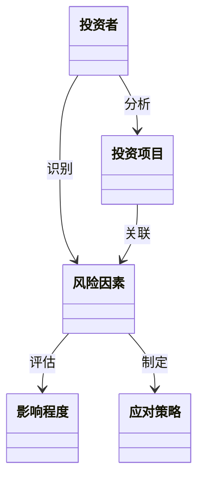

                 


# 芒格的"颠倒思考"在投资分析中的应用

## 关键词：芒格，颠倒思考，投资分析，逆向思维，风险管理

## 摘要：芒格的“颠倒思考”是一种逆向思维方法，用于投资分析中的风险管理和决策优化。通过分析问题的反面，识别潜在风险，避免常见错误，提升投资决策的准确性和可靠性。

---

## 第1章：芒格的“颠倒思考”概述

### 1.1 芒格的“颠倒思考”简介

#### 1.1.1 “颠倒思考”的定义
“颠倒思考”是一种逆向思维方法，强调从问题的反面出发，分析潜在风险和问题，从而优化决策。其核心在于通过反向分析，避免常见错误。

#### 1.1.2 “颠倒思考”的核心思想
1. 识别潜在风险：通过分析问题的反面，识别可能的风险因素。
2. 避免常见错误：避免决策中的认知偏差，提升决策质量。
3. 优化决策过程：通过反向分析，优化决策步骤，提升效率。

#### 1.1.3 “颠倒思考”在投资分析中的应用
- 风险管理：识别投资中的潜在风险，提前制定应对策略。
- 决策优化：通过反向分析，优化投资决策，避免盲目跟风。

### 1.2 投资分析的基本概念

#### 1.2.1 投资分析的定义
投资分析是对投资项目进行评估和预测，以确定其可行性和盈利能力。

#### 1.2.2 投资分析的主要方法
- 基本面分析：分析公司的财务状况、行业地位等。
- 技术分析：通过价格和成交量预测未来走势。
- 风险管理：评估和控制投资风险。

#### 1.2.3 “颠倒思考”与传统投资分析的对比
- 传统分析：从正面出发，分析项目的优势。
- 颠倒思考：从反面出发，分析潜在风险和问题。

### 1.3 芒格的“颠倒思考”与投资分析的结合

#### 1.3.1 “颠倒思考”在投资决策中的作用
- 提供新的视角：通过反向分析，发现潜在问题。
- 优化决策：避免常见错误，提升决策质量。

#### 1.3.2 “颠倒思考”如何帮助投资者避免常见错误
- 避免过度自信：通过反向分析，降低过度自信的风险。
- 识别潜在风险：提前发现可能的问题，制定应对策略。

#### 1.3.3 “颠倒思考”在实际投资案例中的应用
- 案例分析：某公司的投资决策中，通过“颠倒思考”识别潜在风险，避免重大损失。

## 1.4 本章小结
本章介绍了芒格的“颠倒思考”及其在投资分析中的应用，强调了其在风险管理和决策优化中的重要性。

---

## 第2章：芒格“颠倒思考”的核心概念与联系

### 2.1 核心概念的定义与属性

#### 2.1.1 核心概念的定义
“颠倒思考”是一种通过分析问题的反面来优化决策的思维方法。

#### 2.1.2 核心概念的属性特征对比表格

| 属性        | 正面分析       | 颠倒思考         |
|-------------|----------------|------------------|
| 分析角度     | 从正面出发     | 从反面出发       |
| 分析重点     | 发现优势       | 发现潜在风险     |
| 决策优化     | 提升效率       | 避免错误决策     |

#### 2.1.3 核心概念的ER实体关系图
```mermaid
erd
    左右对齐
    投资者 -> 投资项目: 进行分析
    投资者 -> 风险因素: 识别潜在风险
    投资项目 -> 风险因素: 存在关联
```

### 2.2 核心概念的原理分析

#### 2.2.1 核心原理的详细阐述
“颠倒思考”通过分析问题的反面，识别潜在风险，从而优化决策过程。

#### 2.2.2 核心原理的数学模型与公式
$$
\text{风险管理} = \sum (\text{潜在风险} \times \text{影响程度})
$$

#### 2.2.3 核心原理的mermaid流程图
```mermaid
graph TD
    A[开始] -> B[识别潜在风险]
    B -> C[评估风险影响]
    C -> D[制定应对策略]
    D -> E[优化决策]
    E -> F[结束]
```

### 2.3 核心概念的联系与应用

#### 2.3.1 核心概念之间的联系
- 风险管理与决策优化的紧密关系。

#### 2.3.2 核心概念在投资分析中的应用
- 通过反向分析，识别潜在风险，优化投资决策。

#### 2.3.3 核心概念的案例分析
- 案例分析：某公司的投资决策中，通过“颠倒思考”识别潜在风险，避免重大损失。

## 2.4 本章小结
本章详细阐述了芒格“颠倒思考”的核心概念及其在投资分析中的应用，强调了其在风险管理中的重要性。

---

## 第3章：芒格“颠倒思考”的算法原理讲解

### 3.1 算法原理概述

#### 3.1.1 算法的基本概念
“颠倒思考”是一种通过反向分析优化决策的算法。

#### 3.1.2 算法的核心步骤
1. 识别潜在风险。
2. 评估风险影响。
3. 制定应对策略。
4. 优化决策过程。

#### 3.1.3 算法的数学模型与公式
$$
\text{风险管理} = \sum (\text{潜在风险} \times \text{影响程度})
$$

### 3.2 算法的详细步骤

#### 3.2.1 算法的输入与输出
- 输入：投资项目的潜在风险因素。
- 输出：优化后的投资决策。

#### 3.2.2 算法的流程图
```mermaid
graph TD
    A[开始] -> B[识别潜在风险]
    B -> C[评估风险影响]
    C -> D[制定应对策略]
    D -> E[优化决策]
    E -> F[结束]
```

#### 3.2.3 算法的Python实现代码
```python
def invert_thinking(investment_project):
    risks = identify_risks(investment_project)
    impacts = assess_impact(risks)
    strategies = develop_strategies(risks, impacts)
    return optimize_decision(investment_project, strategies)

def identify_risks(project):
    # 识别潜在风险
    return project.risks

def assess_impact(risks):
    # 评估风险影响
    return {risk: risk.impact for risk in risks}

def develop_strategies(risks, impacts):
    # 制定应对策略
    return {risk: risk.strategy for risk in risks}

def optimize_decision(project, strategies):
    # 优化决策
    return project.optimize(strategies)
```

### 3.3 算法的数学模型与公式

#### 3.3.1 算法的数学模型
$$
\text{风险管理} = \sum (\text{潜在风险} \times \text{影响程度})
$$

#### 3.3.2 算法的数学公式
$$
\text{优化决策} = \argmin_{d} \sum (\text{潜在风险}_d \times \text{影响程度}_d)
$$

#### 3.3.3 算法的数学推导
通过反向分析，计算每个风险的影响程度，选择最优决策。

### 3.4 算法的案例分析

#### 3.4.1 案例背景介绍
某公司计划投资一个新项目，通过“颠倒思考”识别潜在风险。

#### 3.4.2 算法在案例中的应用
识别潜在风险，评估其影响，制定应对策略，优化决策。

#### 3.4.3 算法的应用效果分析
通过“颠倒思考”，识别了潜在风险，避免了可能的损失，优化了投资决策。

## 3.5 本章小结
本章详细讲解了芒格“颠倒思考”的算法原理，并通过案例分析展示了其应用效果。

---

## 第4章：芒格“颠倒思考”的系统分析与架构设计方案

### 4.1 系统分析

#### 4.1.1 问题场景介绍
投资者需要通过“颠倒思考”进行投资分析。

#### 4.1.2 系统功能需求
- 识别潜在风险。
- 评估风险影响。
- 制定应对策略。
- 优化投资决策。

#### 4.1.3 系统功能设计的领域模型


### 4.2 系统架构设计

#### 4.2.1 系统架构的总体设计
- 输入层：识别潜在风险。
- 处理层：评估影响，制定策略。
- 输出层：优化决策。

#### 4.2.2 系统架构的mermaid架构图
```mermaid
graph TD
    A[投资者] -> B[投资项目]: 分析
    B -> C[风险因素]: 识别
    C -> D[影响程度]: 评估
    C -> E[应对策略]: 制定
    D, E --> F[优化决策]: 输出
```

#### 4.2.3 系统架构的实现细节
- 输入层：接收投资项目的潜在风险。
- 处理层：评估影响，制定策略。
- 输出层：输出优化后的投资决策。

### 4.3 系统接口设计

#### 4.3.1 系统接口的定义
- 输入接口：接收投资项目的潜在风险。
- 输出接口：输出优化后的投资决策。

#### 4.3.2 系统接口的交互图
```mermaid
graph TD
    A[投资者] --> B[系统]: 输入投资项目的潜在风险
    B --> C[系统]: 识别潜在风险
    C --> D[系统]: 评估影响
    D --> E[系统]: 制定应对策略
    E --> F[系统]: 输出优化决策
    F --> A[投资者]: 输出优化决策
```

### 4.4 本章小结
本章详细描述了芒格“颠倒思考”的系统分析与架构设计方案，展示了其在投资分析中的应用。

---

## 第5章：芒格“颠倒思考”的项目实战

### 5.1 项目实战概述

#### 5.1.1 环境安装
- 安装Python和相关库。

#### 5.1.2 核心代码实现

```python
def invert_thinking_analysis(project):
    risks = identify_risks(project)
    impacts = assess_impact(risks)
    strategies = develop_strategies(risks, impacts)
    optimized_decision = optimize_decision(project, strategies)
    return optimized_decision

def identify_risks(project):
    # 识别潜在风险
    return project.risks

def assess_impact(risks):
    # 评估风险影响
    return {risk: risk.impact for risk in risks}

def develop_strategies(risks, impacts):
    # 制定应对策略
    return {risk: risk.strategy for risk in risks}

def optimize_decision(project, strategies):
    # 优化决策
    return project.optimize(strategies)
```

#### 5.1.3 代码应用解读与分析
- 识别潜在风险：分析投资项目的潜在风险。
- 评估影响：评估每个风险的影响程度。
- 制定策略：制定应对策略。
- 优化决策：优化投资决策。

#### 5.1.4 案例分析与详细讲解剖析
- 案例分析：某公司的投资决策中，通过“颠倒思考”识别潜在风险，避免重大损失。

### 5.2 本章小结
本章通过项目实战，详细讲解了芒格“颠倒思考”的应用过程，展示了其在实际投资中的效果。

---

## 第6章：芒格“颠倒思考”的最佳实践与注意事项

### 6.1 最佳实践 tips

#### 6.1.1 分步骤进行
- 识别潜在风险。
- 评估影响。
- 制定策略。
- 优化决策。

#### 6.1.2 定期回顾
定期回顾投资决策，确保其优化。

### 6.2 小结
芒格“颠倒思考”是一种有效的投资分析方法，通过反向思维优化决策。

### 6.3 注意事项

#### 6.3.1 避免过度简化
- 不要忽视细节，确保全面分析。

#### 6.3.2 定期回顾与调整
- 定期回顾投资决策，确保其优化。

### 6.4 拓展阅读
- 推荐书籍：《巴菲特的思考》。

## 6.5 本章小结
本章总结了芒格“颠倒思考”的最佳实践，强调了注意事项和拓展阅读的重要性。

---

## 第7章：总结与展望

### 7.1 全文总结
芒格的“颠倒思考”是一种有效的投资分析方法，通过反向思维优化决策，避免潜在风险。

### 7.2 未来展望
随着投资环境的复杂化，“颠倒思考”将发挥越来越重要的作用，未来可能在更多领域得到应用。

---

## 作者：AI天才研究院/AI Genius Institute & 禅与计算机程序设计艺术 /Zen And The Art of Computer Programming

---

通过以上目录和内容，您可以根据需要进一步扩展和撰写每章的具体内容。每一章都需要详细展开，确保内容丰富且逻辑清晰。

