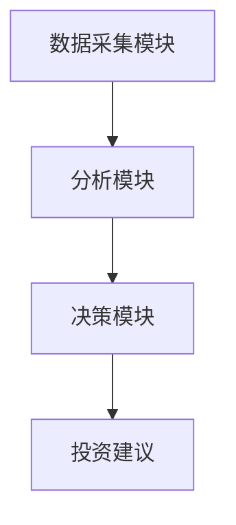

                 

# 菲利普·费雪的产业链投资策略

> 关键词：菲利普·费雪，投资策略，产业链分析，成长股，烟蒂股，投资系统

> 摘要：本文详细探讨了菲利普·费雪的产业链投资策略，从其背景、核心概念到实际应用，结合技术语言和逻辑分析，深入剖析了其投资理念和方法，为读者提供了系统的指导和实践指南。

---

## 第一部分: 菲利普·费雪投资策略的背景与概述

### 第1章: 菲利普·费雪投资策略的起源与发展

#### 1.1 菲利普·费雪的生平与投资理念

菲利普·费雪（Philip Fisher）是20世纪著名的投资专家，被誉为“成长股之父”。他出生于1903年，去世于2004年，是投资界的重要人物之一。费雪的投资理念强调长期成长和管理层质量，其核心思想是寻找那些具有强大竞争优势和持续增长潜力的公司。

#### 1.2 费雪投资理念的核心思想

费雪的投资策略基于以下几个核心思想：
- **成长股投资**：投资那些具有持续增长潜力的公司，而非仅仅关注当前的盈利能力。
- **管理层评估**：管理层的质量和决策能力是公司成功的关键因素。
- **深入研究**：通过深入研究公司基本面，识别出那些被市场低估的“烟蒂股”。

#### 1.3 费雪投资策略的历史影响

费雪的投资策略对现代投资理论产生了深远的影响，尤其是在成长股投资领域。他的思想启发了后来的投资者，如彼得·林奇和沃伦·巴菲特，将成长股投资推向了更广泛的实践。

---

### 第2章: 费雪投资策略的核心观点

#### 2.1 什么是成长股投资

成长股是指那些收入和利润持续增长的公司股票。这类公司通常处于快速发展的行业，具有较高的增长潜力。与价值股不同，成长股的投资重点在于公司的未来增长潜力，而非当前的估值。

#### 2.2 费雪的"烟蒂股"概念

“烟蒂股”是指那些被市场忽视或低估的公司股票。这类股票通常具有较低的市盈率和较高的股息率，但可能因为市场情绪或行业波动而被低估。费雪认为，投资烟蒂股可以在市场复苏时获得超额收益。

---

## 第二部分: 菲利普·费雪投资策略的核心概念与联系

### 第3章: 产业链分析与投资策略

#### 3.1 产业链分析的基本概念

产业链分析是指对某一行业或领域的价值链进行详细研究，包括上游、中游和下游企业。通过分析产业链的结构和竞争格局，可以识别出具有竞争优势的企业。

#### 3.2 产业链分析与投资策略的关系

产业链分析为投资策略提供了重要的信息，帮助投资者识别出那些在产业链中占据优势地位的企业。例如，在半导体行业中，上游的晶圆厂和下游的封装测试企业可能具有不同的投资价值。

---

## 第三部分: 菲利普·费雪投资策略的算法与系统分析

### 第4章: 投资决策的算法原理

#### 4.1 投资决策的流程

1. **数据收集**：收集目标公司的财务数据、行业分析和管理层信息。
2. **筛选与分析**：通过财务指标（如ROE、净利润增长率）筛选出潜在的成长股。
3. **评估与决策**：结合管理层质量和行业前景，评估公司的投资价值。

#### 4.2 投资算法的数学模型

以下是一个简单的投资评估模型：

$$
\text{投资价值} = \text{成长潜力} \times \text{管理层质量} \times \text{行业前景}
$$

---

## 第四部分: 项目实战与系统架构设计

### 第5章: 投资系统架构设计

#### 5.1 系统功能设计

- **数据采集模块**：负责收集公司基本面数据。
- **分析模块**：基于财务指标和管理层评估进行分析。
- **决策模块**：生成投资建议。

#### 5.2 系统架构图

---

## 第五部分: 实际案例分析与项目小结

### 第6章: 实际案例分析

#### 6.1 案例背景

假设我们分析一家科技公司，通过产业链分析和财务指标筛选，评估其投资价值。

#### 6.2 数据分析

- 净利润增长率：15%
- ROE：20%
- 管理层稳定性：高

---

## 第六部分: 最佳实践与总结

### 第7章: 最佳实践与小结

#### 7.1 小结

菲利普·费雪的投资策略强调长期成长和深入研究，通过产业链分析和管理层评估，可以帮助投资者识别出具有潜力的成长股。

#### 7.2 注意事项

- **风险控制**：投资需谨慎，避免过度集中。
- **持续学习**：市场变化快，需不断更新知识。

#### 7.3 拓展阅读

推荐阅读菲利普·费雪的经典著作《成长股投资策略》。

---

## 作者信息

作者：AI天才研究院/AI Genius Institute & 禅与计算机程序设计艺术 /Zen And The Art of Computer Programming

---

通过以上步骤，我们详细分析了菲利普·费雪的产业链投资策略，从理论到实践，帮助投资者更好地理解和应用这一策略。

