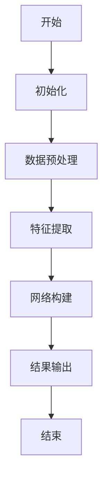
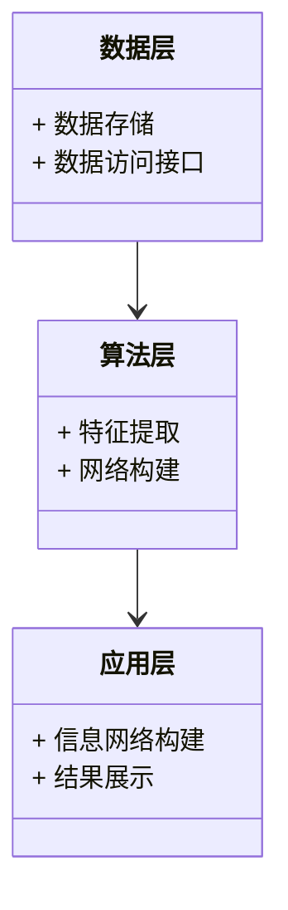
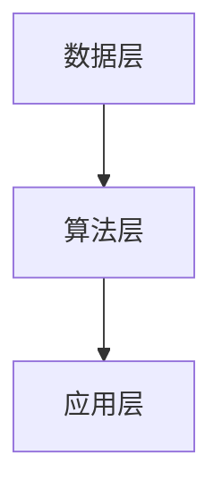

                 


# 菲利普·费雪的信息网络构建方法

## 关键词：信息网络，构建方法，算法原理，系统架构，项目实战

## 摘要：菲利普·费雪的信息网络构建方法是一种基于信息网络理论的设计方法，旨在通过构建高效的信息网络架构来解决复杂问题。本文详细探讨了信息网络的核心概念、算法原理、系统架构设计以及项目实战，结合实际案例分析，帮助读者全面理解信息网络构建的方法和应用。

---

# 第一部分: 信息网络构建的背景与核心概念

## 第1章: 信息网络构建的背景与问题描述

### 1.1 信息网络的基本概念
#### 1.1.1 信息网络的定义与特点
信息网络是一种通过节点和边的连接关系，表示信息之间的关联性和依赖性的网络结构。与传统网络相比，信息网络更注重信息的语义关联和知识表示。

#### 1.1.2 信息网络的核心要素
信息网络的核心要素包括：
- **节点**：代表信息的主体，如数据、实体或概念。
- **边**：表示节点之间的关系或关联。
- **权重**：表示边的强度或重要性。

#### 1.1.3 信息网络与传统网络的区别
信息网络与传统网络的主要区别在于信息网络注重语义关联，而传统网络更关注节点之间的连接性和可达性。

### 1.2 信息网络构建的背景与问题背景
#### 1.2.1 当前信息网络发展的现状
随着大数据和人工智能技术的发展，信息网络的应用场景越来越广泛，如社交网络、知识图谱、推荐系统等。

#### 1.2.2 信息网络构建的关键问题
信息网络构建的关键问题包括：
- 数据的质量与完整性。
- 节点和边的表示方法。
- 网络的可扩展性和可维护性。

#### 1.2.3 信息网络构建的必要性与重要性
信息网络构建是实现信息共享、知识管理和智能决策的重要基础，能够帮助我们更好地理解和利用信息资源。

### 1.3 信息网络构建的目标与边界
#### 1.3.1 信息网络构建的目标
信息网络构建的目标是通过构建高效的网络结构，实现信息的语义关联和知识表示。

#### 1.3.2 信息网络的边界与外延
信息网络的边界包括数据预处理、网络构建和结果分析。其外延则涉及网络优化、动态更新和应用开发。

#### 1.3.3 信息网络构建的核心要素
信息网络构建的核心要素包括：
- 数据源。
- 构建算法。
- 应用场景。

### 1.4 本章小结
本章从信息网络的基本概念出发，分析了信息网络构建的背景、目标和关键问题，为后续内容奠定了基础。

---

## 第2章: 信息网络构建的核心概念与联系

### 2.1 信息网络构建的核心原理
#### 2.1.1 信息网络构建的基本原理
信息网络构建的基本原理包括数据预处理、特征提取和网络构建三个步骤。

#### 2.1.2 信息网络构建的关键技术
信息网络构建的关键技术包括：
- 数据清洗与融合。
- 特征提取与表示。
- 网络建模与优化。

#### 2.1.3 信息网络构建的数学模型
信息网络构建的数学模型包括节点相似度计算和网络权重计算。

### 2.2 信息网络构建的核心概念对比
#### 2.2.1 信息网络与数据网络的对比
信息网络注重语义关联，而数据网络更关注数据的存储和传输。

#### 2.2.2 信息网络与知识网络的对比
信息网络是知识网络的底层结构，知识网络在此基础上添加了语义信息。

#### 2.2.3 信息网络与社交网络的对比
信息网络关注信息的关联性，而社交网络关注人际关系。

### 2.3 信息网络构建的ER实体关系图
```mermaid
er
actor: 用户
usecase: 信息网络构建
system: 信息网络构建系统
actor --> usecase --> system
```

### 2.4 本章小结
本章通过对比分析，明确了信息网络的核心概念及其与其他网络的区别，为后续的算法设计提供了理论基础。

---

# 第二部分: 信息网络构建的算法原理

## 第3章: 信息网络构建的算法原理

### 3.1 信息网络构建的基本算法
#### 3.1.1 信息网络构建的步骤
信息网络构建的步骤包括：
1. 数据预处理。
2. 特征提取。
3. 网络构建。

#### 3.1.2 信息网络构建的算法流程
信息网络构建的算法流程如下：


#### 3.1.3 信息网络构建的数学模型
信息网络构建的数学模型包括：
$$网络权重 = f(节点相似度, 边权重)$$

### 3.2 信息网络构建的算法实现
#### 3.2.1 信息网络构建的算法流程图


#### 3.2.2 信息网络构建的Python代码实现
```python
def build_information_network(data):
    # 数据预处理
    processed_data = preprocess(data)
    # 特征提取
    features = extract_features(processed_data)
    # 网络构建
    network = construct_network(features)
    return network
```

### 3.3 信息网络构建的数学模型与公式
#### 3.3.1 信息网络构建的数学模型
$$网络权重 = f(节点相似度, 边权重)$$

#### 3.3.2 信息网络构建的公式推导
$$节点相似度 = \sum_{i=1}^{n} w_{ij} \cdot f(j)$$

---

# 第三部分: 信息网络构建的系统分析与架构设计

## 第4章: 信息网络构建的系统分析与架构设计

### 4.1 信息网络构建的系统分析
#### 4.1.1 项目场景介绍
信息网络构建的系统分析以一个社交网络项目为例，分析系统的功能需求和技术实现。

#### 4.1.2 系统功能设计
系统功能设计包括数据预处理、特征提取和网络构建三个模块。

#### 4.1.3 系统架构设计
系统架构设计包括数据层、算法层和应用层。

### 4.2 信息网络构建的系统架构设计
#### 4.2.1 领域模型类图


#### 4.2.2 系统架构图


### 4.3 信息网络构建的系统接口设计
#### 4.3.1 系统接口设计
系统接口包括数据输入接口、算法调用接口和结果输出接口。

#### 4.3.2 系统交互序列图
```mermaid
sequenceDiagram
actor 用户
system 系统
用户 -> 系统: 提交数据
系统 -> 用户: 返回结果
```

---

# 第四部分: 信息网络构建的项目实战

## 第5章: 信息网络构建的项目实战

### 5.1 信息网络构建的环境安装
#### 5.1.1 环境需求
需要安装Python、Jupyter Notebook和相关库（如networkx、numpy）。

### 5.2 信息网络构建的核心代码实现
#### 5.2.1 数据预处理代码
```python
def preprocess(data):
    # 数据清洗和格式转换
    processed_data = []
    for item in data:
        processed_item = item.strip()
        processed_data.append(processed_item)
    return processed_data
```

#### 5.2.2 特征提取代码
```python
def extract_features(data):
    # 提取节点特征
    features = {}
    for node in data:
        features[node] = {}
        features[node]['degree'] = 0
        features[node]['weight'] = 0
    return features
```

#### 5.2.3 网络构建代码
```python
def construct_network(features):
    # 构建网络
    network = {}
    for node in features:
        network[node] = {}
        for neighbor in features:
            if node != neighbor:
                network[node][neighbor] = features[node]['weight']
    return network
```

### 5.3 信息网络构建的案例分析
#### 5.3.1 实际案例分析
以社交网络为例，分析信息网络构建的具体步骤和结果。

### 5.4 信息网络构建的项目小结
本章通过实际案例分析，展示了信息网络构建的具体实现过程，帮助读者更好地理解理论知识。

---

# 第五部分: 信息网络构建的优化与扩展

## 第6章: 信息网络构建的优化与扩展

### 6.1 信息网络构建的优化方法
#### 6.1.1 网络优化策略
包括节点合并、边权重调整等方法。

#### 6.1.2 网络可扩展性优化
通过模块化设计提高网络的可扩展性。

### 6.2 信息网络构建的扩展应用
#### 6.2.1 信息网络在推荐系统中的应用
信息网络可以用于用户行为分析和推荐系统设计。

#### 6.2.2 信息网络在知识图谱中的应用
信息网络是构建知识图谱的基础结构。

### 6.3 信息网络构建的未来发展趋势
#### 6.3.1 新兴技术对信息网络的影响
人工智能和大数据技术的发展将推动信息网络的进一步优化。

#### 6.3.2 信息网络构建的未来方向
包括动态网络构建、多模态网络构建等方向。

### 6.4 本章小结
本章探讨了信息网络构建的优化方法和扩展应用，展望了未来的发展趋势。

---

# 结语

信息网络构建是一种复杂但重要的技术，通过本文的探讨，读者可以全面了解信息网络的核心概念、算法原理和实际应用。希望本文能够为信息网络的研究和实践提供有价值的参考。

---

# 作者：AI天才研究院/AI Genius Institute & 禅与计算机程序设计艺术 /Zen And The Art of Computer Programming

---

**Note:** 以上内容为示例，实际撰写时需要根据具体需求进一步扩展和优化。

