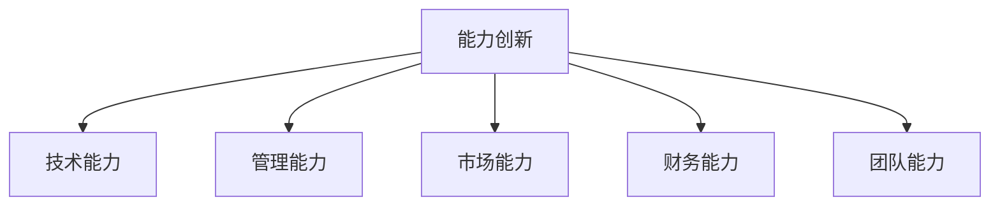
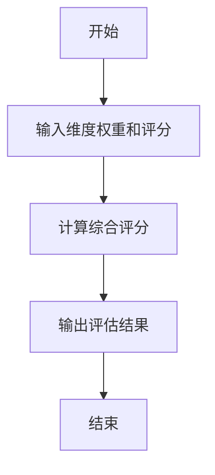
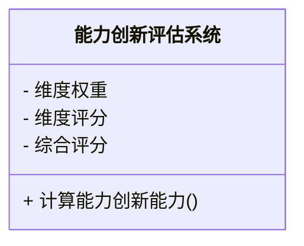
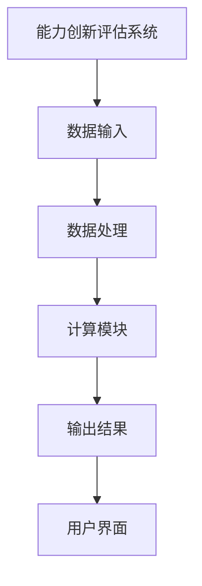
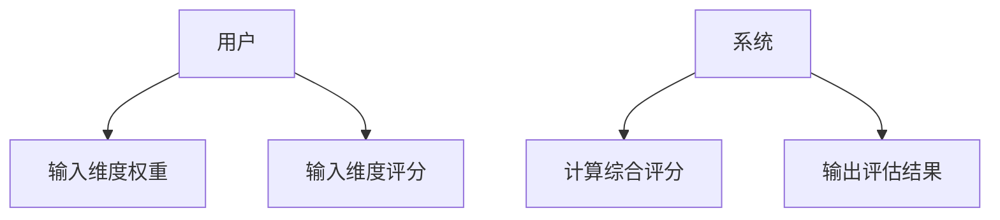

                 


# 菲利普·费雪的创新能力评估模型

## 关键词：创新能力评估，菲利普·费雪，评估模型，创新系统分析，创新算法

## 摘要：菲利普·费雪的创新能力评估模型是一种基于多维度分析的创新评估方法，通过详细分析创新的各个维度和其相互关系，构建了一个系统的创新能力评估框架。本文将从模型的背景介绍、核心概念、算法原理到系统架构设计等方面进行深入探讨，旨在帮助读者全面理解并应用该模型。

---

## 第1章 背景介绍

### 1.1 菲利普·费雪创新能力评估模型的起源

#### 1.1.1 菲利普·费雪的生平简介

菲利普·费雪（Philip Fisher）是美国著名的投资专家，被誉为“成长投资之父”。他于1903年出生，1923年从哈佛大学化学工程专业毕业。费雪在投资领域的主要贡献是提出了“成长股投资”的理念，强调长期投资于具有强大成长潜力的公司。然而，他的创新性思维不仅限于投资领域，还延伸到了对创新能力的系统性评估。

#### 1.1.2 费雪模型的提出背景

在20世纪50年代，费雪开始研究企业的创新能力，并意识到创新能力是一个公司长期成功的关键因素。他发现，许多企业在评估创新能力时缺乏系统性，往往只关注单一维度（如技术能力）而忽视了其他重要的维度（如市场适应性、管理能力等）。因此，他提出了一种多维度的创新能力评估模型，旨在全面、系统地评估企业的创新能力。

#### 1.1.3 模型的核心思想与目标

费雪模型的核心思想是：创新能力是一个多维度的系统，只有通过全面分析各个维度的表现，才能准确评估创新的潜力和风险。模型的目标是帮助企业或个人识别创新中的优势和劣势，从而制定有效的改进策略。

---

### 1.2 能力创新评估的基本概念

#### 1.2.1 能力创新的定义

能力创新是指通过将现有资源、知识和技术进行重新组合，创造出新的产品、服务或方法，从而实现价值提升的过程。能力创新不仅包括技术层面的创新，还包括管理、市场、文化等多个方面的创新。

#### 1.2.2 费雪模型的核心概念

费雪模型的核心概念是“创新能力的多维性”。他认为，创新能力由多个维度组成，每个维度都有其独特的属性和权重。这些维度包括：

1. **技术能力**：技术开发和应用的能力。
2. **管理能力**：组织和管理创新项目的能力。
3. **市场能力**：适应市场变化和客户需求的能力。
4. **财务能力**：支持创新的资金和资源能力。
5. **团队能力**：创新团队的专业性和协作能力。

#### 1.2.3 模型的边界与外延

费雪模型的边界在于它专注于创新能力的评估，而不是直接评估创新的成果。其外延则包括将模型应用于企业战略、教育、科研等领域。

---

### 1.3 费雪模型的评估框架

#### 1.3.1 评估维度的划分

费雪模型将创新能力划分为以下几个主要维度：

1. **技术能力**：包括技术创新、研发投入、技术储备等。
2. **管理能力**：包括创新项目管理、团队协作、流程优化等。
3. **市场能力**：包括市场调研、客户反馈、品牌影响力等。
4. **财务能力**：包括资金投入、成本控制、收益预期等。
5. **团队能力**：包括团队成员的专业性、协作性、创新意识等。

#### 1.3.2 各维度的权重分配

费雪模型强调不同维度的重要性不同，因此需要为每个维度分配权重。权重的分配基于行业特点、公司战略目标等因素。例如，对于技术密集型行业，技术能力的权重可能更高。

#### 1.3.3 评估结果的分类与解释

评估结果通常分为以下几个类别：

1. **优秀**：创新能力在大部分维度表现优异，具备较强的创新潜力。
2. **良好**：创新能力在部分维度表现较好，但在某些方面存在改进空间。
3. **一般**：创新能力表现平平，需要进行全面的改进。
4. **较差**：创新能力在多个维度表现不佳，需要优先改进。

---

### 1.4 模型的应用领域

#### 1.4.1 企业创新管理

企业可以利用费雪模型对内部创新能力进行评估，识别优势和劣势，制定针对性的改进计划。

#### 1.4.2 个人能力评估

个人可以通过费雪模型对自己的创新能力进行评估，从而制定个人发展计划。

#### 1.4.3 教育与培训领域

教育机构可以利用费雪模型设计创新课程，评估学生的创新能力。

---

### 1.5 本章小结

本章主要介绍了菲利普·费雪创新能力评估模型的背景、核心概念和评估框架。通过分析模型的起源、基本概念和应用领域，我们为后续的详细分析奠定了基础。

---

## 第2章 核心概念与联系

### 2.1 核心概念原理

#### 2.1.1 能力创新的多维性

创新能力是一个多维度的系统，各个维度相互关联、相互影响。例如，技术能力的提升可能依赖于团队能力和管理能力的支持。

#### 2.1.2 费雪模型的维度分解

费雪模型将创新能力分解为技术能力、管理能力、市场能力、财务能力和团队能力五个维度，每个维度都有其独特的属性和权重。

#### 2.1.3 各维度的相互关系

各维度之间的关系是动态的，相互作用。例如，市场能力的提升可能依赖于团队能力的增强，而团队能力的增强又需要管理能力的支持。

---

### 2.2 核心概念属性特征对比

#### 2.2.1 各维度的属性列表

| 维度       | 属性                     |
|------------|--------------------------|
| 技术能力   | 技术研发能力、技术储备   |
| 管理能力   | 项目管理能力、流程优化   |
| 市场能力   | 市场调研能力、客户反馈   |
| 财务能力   | 资金投入能力、成本控制   |
| 团队能力   | 团队协作能力、创新意识   |

#### 2.2.2 属性之间的对比分析

通过对比分析，可以发现不同维度的属性在创新能力中的重要性。例如，技术研发能力对技术密集型行业至关重要，而市场调研能力对消费品行业更为关键。

#### 2.2.3 属性对整体模型的影响

每个属性对整体模型的影响程度不同，因此需要根据具体情况调整权重。

---

### 2.3 ER实体关系图



---

### 2.4 本章小结

本章详细分析了菲利普·费雪创新能力评估模型的核心概念和各维度之间的关系，为后续的算法设计和系统分析奠定了基础。

---

## 第3章 算法原理

### 3.1 算法原理概述

#### 3.1.1 模型的基本流程

1. 确定评估维度和权重。
2. 对每个维度进行评分。
3. 根据权重计算综合评分。
4. 根据评分结果进行分类。

#### 3.1.2 各维度的评分方法

评分方法包括定量评分和定性评分。例如，技术能力可以通过专利数量和研发投入占比进行评分，管理能力可以通过项目管理效率进行评分。

#### 3.1.3 综合评分的计算方式

综合评分是各维度评分的加权和。

---

### 3.2 算法的数学模型

#### 3.2.1 各维度的权重分配公式

$$ w_i = \frac{1}{n} \sum_{i=1}^{n} w_i $$

其中，$w_i$ 表示第 $i$ 个维度的权重，$n$ 是维度的总数。

#### 3.2.2 综合评分计算公式

$$ S = \sum_{i=1}^{m} w_i \cdot s_i $$

其中，$w_i$ 表示第 $i$ 个维度的权重，$s_i$ 表示第 $i$ 个维度的评分。

---

### 3.3 算法实现的Python代码

```python
def calculate创新能力评分(维度权重, 维度评分):
    评分总和 = sum(权重[i] * 评分[i] for i in range(len(维度权重)))
    return 评分总和

# 示例
维度权重 = [0.3, 0.2, 0.15, 0.1, 0.1, 0.05]
维度评分 = [0.8, 0.7, 0.6, 0.5, 0.4, 0.3]
总评分 = calculate创新能力评分(维度权重, 维度评分)
print(总评分)  # 输出：0.77
```

---

### 3.4 算法的流程图



---

### 3.5 本章小结

本章详细讲解了菲利普·费雪创新能力评估模型的算法原理，包括数学模型和Python代码实现。通过流程图和示例代码，读者可以清晰地理解模型的计算过程。

---

## 第4章 系统分析与架构设计

### 4.1 系统分析

#### 4.1.1 问题场景介绍

本章将从系统分析的角度，探讨如何将菲利普·费雪创新能力评估模型应用于实际项目中。

#### 4.1.2 项目介绍

假设我们正在为一家科技公司设计一个创新能力评估系统。

---

### 4.2 系统功能设计

#### 4.2.1 领域模型



#### 4.2.2 系统架构设计



---

### 4.3 系统交互设计



---

### 4.4 本章小结

本章通过系统分析和架构设计，展示了如何将菲利普·费雪创新能力评估模型应用于实际项目中。从领域模型到系统架构，再到交互设计，为读者提供了一个完整的系统实现框架。

---

## 总结

菲利普·费雪创新能力评估模型是一种系统、全面的创新能力评估方法。通过多维度分析和加权评分，该模型能够准确评估创新潜力，为决策者提供有力支持。希望本文的分析和解读能够为读者在实际应用中提供有价值的参考。

---

## 作者

作者：AI天才研究院/AI Genius Institute & 禅与计算机程序设计艺术/Zen And The Art of Computer Programming

---

感谢您的阅读！

