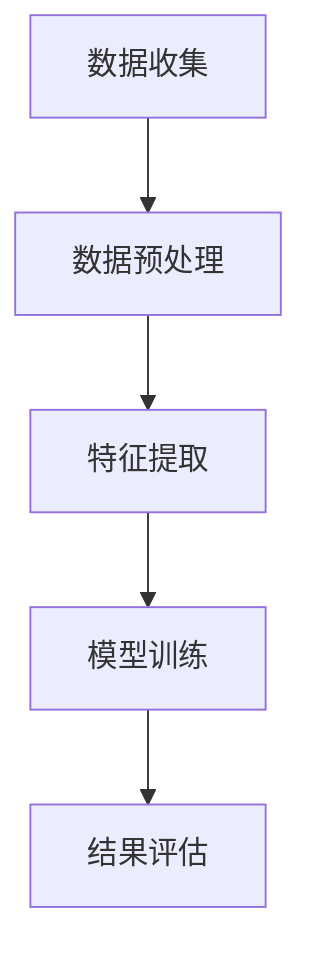
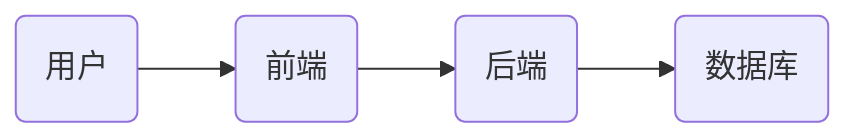
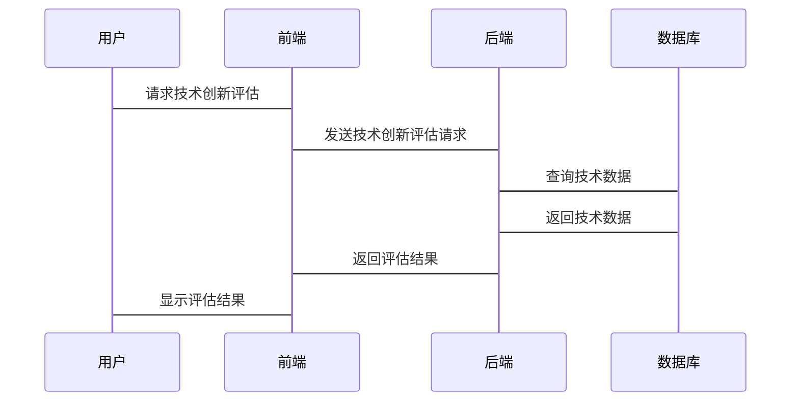

                 


# 菲利普·费雪的技术创新评估方法

> 关键词：技术创新评估，菲利普·费雪，投资策略，技术复杂度，市场适应性

> 摘要：本文详细介绍了菲利普·费雪的技术创新评估方法，从背景、核心概念到算法原理，再到系统架构和项目实战，全面解析了如何通过技术创新评估来实现企业的技术能力分析和投资决策优化。

---

## 第一部分：技术创新评估的背景与核心概念

### 第1章：技术创新评估的背景与问题背景

#### 1.1 技术创新评估的背景
- **技术创新在企业中的重要性**：技术创新是企业核心竞争力的源泉，决定了企业的市场地位和长期发展潜力。
- **菲利普·费雪的技术创新评估方法的提出背景**：菲利普·费雪是投资领域的先驱，他提出的技术创新评估方法为企业技术能力分析和投资决策提供了科学依据。
- **技术创新评估的现状与发展趋势**：随着技术的快速发展，技术创新评估方法也在不断进化，从传统的定性分析向定量分析转变。

#### 1.2 技术创新评估的核心问题
- **技术创新评估的核心问题描述**：如何量化技术复杂度、市场适应性、技术成熟度和技术领先性，从而准确评估企业的技术创新能力。
- **技术创新评估的主要挑战**：数据获取困难、特征提取复杂、模型训练难度大。
- **技术创新评估的目标与意义**：目标是为企业提供技术能力分析和投资决策优化的依据，意义在于提升企业的技术创新能力和市场竞争力。

### 第2章：技术创新评估的核心概念与联系

#### 2.1 技术创新评估的核心概念
- **技术复杂度**：技术实现的难度和所需资源。
- **市场适应性**：技术在市场中的应用前景和用户需求匹配度。
- **技术成熟度**：技术的成熟程度和商业化潜力。
- **技术领先性**：技术在行业中的领先地位和创新程度。

#### 2.2 核心概念的对比分析
- **技术复杂度与市场适应性的对比**：技术复杂度高不一定能适应市场，需要结合市场需求进行评估。
- **技术成熟度与技术领先性的对比**：技术领先性不一定代表技术成熟度，需要综合考虑。

#### 2.3 核心概念的ER实体关系图
```mermaid
er
    entity 技术创新 {
        id
        技术复杂度
        市场适应性
        技术成熟度
        技术领先性
    }
```

---

## 第二部分：技术创新评估的算法原理

### 第3章：技术创新评估的算法原理

#### 3.1 技术创新评估的算法概述
- **数据收集与预处理**：收集技术相关数据，包括专利、论文、市场反馈等，并进行清洗和标准化。
- **特征提取与权重分配**：从数据中提取关键特征，并根据特征的重要性分配权重。
- **模型训练与评估**：使用机器学习模型对数据进行训练，并评估模型的准确性和可靠性。

#### 3.2 技术创新评估的算法流程


#### 3.3 技术创新评估的数学模型
- **技术创新评分公式**：
$$ \text{技术创新评分} = \sum_{i=1}^{n} w_i \cdot x_i $$
其中，\( w_i \) 是第 \( i \) 个特征的权重，\( x_i \) 是第 \( i \) 个特征的值。
- **技术创新预测模型**：
$$ P = \sum_{j=1}^{m} a_j \cdot f_j(x) $$
其中，\( a_j \) 是第 \( j \) 个模型的系数，\( f_j(x) \) 是第 \( j \) 个模型的输出。

### 第4章：技术创新评估的系统分析与架构设计

#### 4.1 问题场景介绍
- **问题场景描述**：企业需要评估自身技术能力，以便优化投资决策。
- **系统功能设计**：
  - 数据采集模块：负责收集技术相关数据。
  - 评估模块：负责数据预处理、特征提取和模型训练。
  - 结果展示模块：负责输出评估结果和可视化分析。

#### 4.2 系统架构设计


#### 4.3 系统接口设计
- **Restful API**：
  - GET /api/technological-assessment：获取技术创新评估结果。
  - POST /api/technological-data：提交技术数据。

#### 4.4 系统交互设计


---

## 第三部分：技术创新评估的项目实战

### 第5章：技术创新评估的项目实战

#### 5.1 环境安装与配置
- **安装Python**：Python 3.8及以上版本。
- **安装依赖库**：numpy、pandas、scikit-learn等。
- **代码示例**：
```python
import numpy as np
import pandas as pd
from sklearn import metrics

# 示例数据
data = pd.DataFrame({
    '技术复杂度': [0.8, 0.6, 0.7],
    '市场适应性': [0.9, 0.5, 0.8],
    '技术成熟度': [0.7, 0.6, 0.9],
    '技术领先性': [0.6, 0.4, 0.7]
})

# 权重分配
weights = [0.3, 0.3, 0.2, 0.2]

# 计算技术创新评分
技术创新评分 = np.dot(data.values, weights)
```

#### 5.2 项目小结
- **案例分析**：以某公司为例，分析其技术创新能力。
- **代码解读**：详细解读上述代码，解释每一步的功能。
- **结果分析**：展示评估结果，并进行详细解读。

#### 5.3 注意事项
- **数据质量**：确保数据的准确性和完整性。
- **模型选择**：根据实际情况选择合适的模型。
- **结果验证**：通过交叉验证等方法验证模型的可靠性。

---

## 第四部分：技术创新评估的最佳实践

### 第6章：技术创新评估的最佳实践

#### 6.1 小结
- **核心内容回顾**：总结技术创新评估的核心概念和算法原理。
- **项目经验总结**：总结项目实施过程中的经验和教训。

#### 6.2 注意事项
- **数据隐私**：注意保护企业的数据隐私。
- **模型优化**：根据实际情况不断优化模型。
- **持续学习**：保持对新技术的学习和应用。

#### 6.3 扩展阅读
- **相关书籍**：推荐几本与技术创新评估相关的书籍。
- **学术论文**：推荐几篇相关的学术论文。

---

## 作者：AI天才研究院/AI Genius Institute & 禅与计算机程序设计艺术 /Zen And The Art of Computer Programming

---

感谢您的耐心阅读！希望这篇文章能为您提供有价值的参考和启发。

