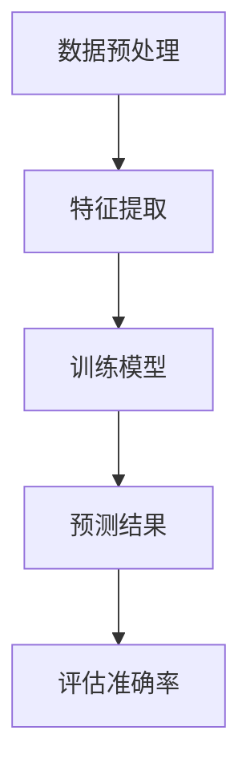
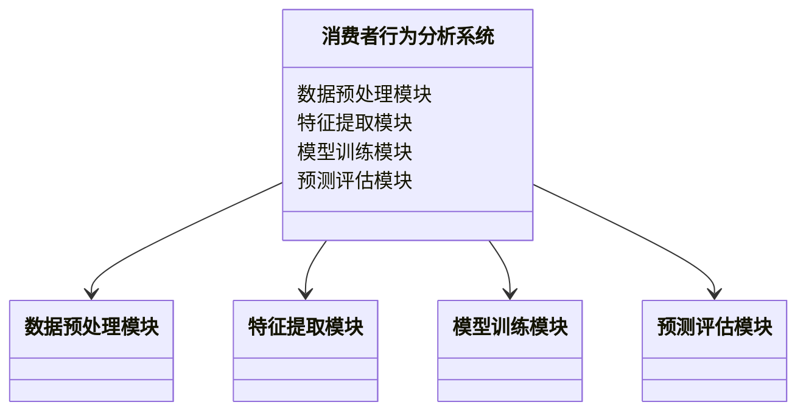
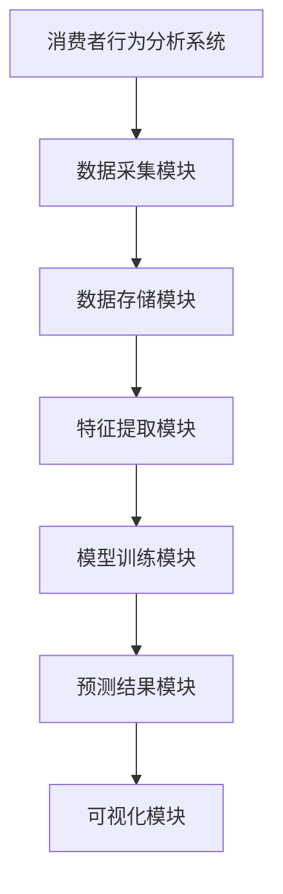
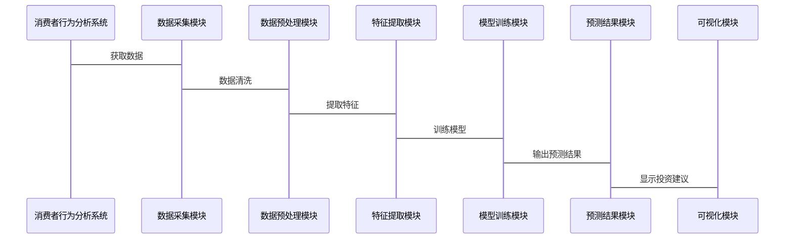

                 


# 菲利普·费雪的消费者行为研究在投资中的应用

> 关键词：消费者行为，投资策略，菲利普·费雪，价值投资，市场预测

> 摘要：菲利普·费雪是价值投资领域的先驱，他的消费者行为研究为投资决策提供了深刻的见解。本文将详细探讨消费者行为的核心概念、其对投资的影响，以及如何通过数学模型和算法进行分析。通过实际案例和系统设计，揭示消费者行为研究在投资中的广泛应用。

---

## 第1章: 背景介绍

### 1.1 消费者行为研究的核心概念

#### 1.1.1 消费者行为的定义
消费者行为是指消费者在购买、使用和处置产品或服务的过程中所表现出的决策和行动。它涉及心理学、社会学和经济学等多个学科，是理解市场需求的重要工具。

#### 1.1.2 消费者行为的核心要素
消费者行为的核心要素包括需求、动机、决策过程、购买行为和品牌忠诚度。这些要素共同影响消费者的购买决策。

#### 1.1.3 消费者行为与投资的关系
消费者行为直接影响市场需求和企业业绩，从而影响投资价值。通过分析消费者行为，投资者可以更好地预测市场趋势和企业表现。

### 1.2 菲利普·费雪的消费者行为研究理论

#### 1.2.1 费雪的价值投资理念
菲利普·费雪强调长期投资和深入研究企业的基本面，特别是企业的市场需求和消费者行为。他认为，成功的投资依赖于对消费者需求的深刻理解。

#### 1.2.2 费雪的消费者行为研究方法
费雪通过分析消费者的购买动机和行为模式，评估企业的市场地位和竞争优势。他关注消费者对企业产品或服务的满意度和忠诚度，认为这是企业长期成功的关键。

#### 1.2.3 费雪理论的现代应用
现代投资者通过大数据和机器学习技术，进一步分析消费者行为数据，优化投资策略。费雪的理论为这些现代方法提供了理论基础。

---

## 第2章: 消费者心理学与行为经济学

### 2.1 消费者心理学基础

#### 2.1.1 消费者决策过程
消费者决策过程包括问题识别、信息收集、评估和选择。每个阶段都受到心理因素的影响。

#### 2.1.2 影响消费者行为的心理因素
心理因素包括认知、情感、态度和记忆。这些因素共同作用，影响消费者的购买决策。

#### 2.1.3 心理定价策略
心理定价策略如锚定效应和损失厌恶，影响消费者对价格的感知，进而影响市场定价和投资决策。

### 2.2 行为经济学的核心概念

#### 2.2.1 行为经济学与传统经济学的差异
行为经济学考虑实际决策中的心理偏差，而传统经济学假设理性决策。

#### 2.2.2 行为偏差与投资决策
常见的行为偏差如过度自信和从众效应，影响投资者的决策，导致非理性投资行为。

#### 2.2.3 行为经济学在投资中的应用
行为经济学帮助投资者识别和纠正认知偏差，优化投资决策，降低风险。

---

## 第3章: 菲利普·费雪的消费者行为研究方法

### 3.1 费雪的消费者行为研究框架

#### 3.1.1 研究目标的确定
费雪的研究目标是识别消费者需求和行为趋势，评估企业的市场潜力。

#### 3.1.2 数据收集与分析方法
费雪采用定性（如访谈）和定量（如问卷调查）方法，分析消费者行为数据。

#### 3.1.3 研究结果的应用
研究结果用于评估企业竞争力，指导投资决策，优化企业营销策略。

### 3.2 费雪消费者行为研究的实践案例

#### 3.2.1 案例一：某行业的消费者行为分析
通过分析某行业的消费者行为，识别市场趋势和竞争格局，评估投资机会。

#### 3.2.2 案例二：消费者行为对投资决策的影响
消费者行为预测企业的收入和利润，影响其股票估值和投资决策。

#### 3.2.3 案例三：消费者行为预测模型的构建
构建基于消费者行为数据的预测模型，评估市场变化对企业的影响。

---

## 第4章: 消费者行为与投资决策的关系

### 4.1 消费者行为对投资决策的影响

#### 4.1.1 消费者需求变化对投资的影响
需求变化直接影响企业收入和利润，进而影响股票价值和投资回报。

#### 4.1.2 消费者行为趋势对投资的指导作用
消费者行为趋势预测市场变化，指导投资者选择具有增长潜力的企业。

#### 4.1.3 消费者行为与市场周期的关系
消费者行为在市场周期中表现出不同的特征，影响投资策略的选择。

### 4.2 费雪理论在投资中的具体应用

#### 4.2.1 费雪的“烟屁股”理论
费雪认为，成功的投资源于对消费者需求的深刻理解，就像烟瘾者离不开香烟一样，某些企业的产品需求具有刚性。

#### 4.2.2 费雪的消费者行为研究对选股策略的影响
通过分析消费者行为，识别具有持续增长潜力的企业，优化选股策略，降低投资风险。

#### 4.2.3 费雪理论在风险控制中的应用
消费者行为分析帮助投资者识别潜在风险，如市场需求下降或品牌忠诚度降低，从而制定有效的风险控制策略。

---

## 第5章: 消费者行为分析的数学模型与算法

### 5.1 消费者行为分析的数学模型

#### 5.1.1 消费者需求函数的构建
需求函数描述消费者对产品的需求量与价格、收入等变量之间的关系。常用需求函数形式包括线性需求函数和非线性需求函数。

$$ Q = a - bP + cI $$
其中，Q为需求量，P为价格，I为收入，a、b、c为参数。

#### 5.1.2 消费者选择模型
消费者选择模型基于效用最大化原则，描述消费者如何选择最优产品组合以最大化效用。

$$ \max U = \sum u_i x_i $$
其中，U为效用，x_i为产品数量，u_i为效用函数。

#### 5.1.3 市场预测模型
市场预测模型基于消费者行为数据，预测未来市场需求和企业业绩。

$$ S_t = \alpha S_{t-1} + \beta D_t + \epsilon_t $$
其中，S_t为t时刻的市场需求，S_{t-1}为前一期需求，D_t为促销变量，α、β为系数，ε_t为误差项。

### 5.2 基于消费者行为数据的算法实现

#### 5.2.1 数据预处理与特征提取
数据预处理包括清洗、标准化和特征选择。特征提取通过主成分分析（PCA）减少数据维度。

#### 5.2.2 机器学习算法在消费者行为分析中的应用
常用的机器学习算法包括逻辑回归、随机森林和神经网络。这些算法用于分类消费者行为模式和预测市场趋势。

#### 5.2.3 算法实现的代码示例

```python
import pandas as pd
from sklearn.ensemble import RandomForestClassifier
from sklearn.metrics import accuracy_score

# 加载数据
data = pd.read_csv('consumer_behavior.csv')

# 分割特征与标签
X = data.drop('target', axis=1)
y = data['target']

# 训练模型
model = RandomForestClassifier()
model.fit(X, y)

# 预测与评估
y_pred = model.predict(X)
print("准确率:", accuracy_score(y, y_pred))
```

#### 5.2.4 算法实现的流程图


### 5.3 消费者行为研究的数学模型和公式

#### 5.3.1 消费者选择模型
$$ \max U = \sum u_i x_i $$

#### 5.3.2 需求函数
$$ Q = a - bP + cI $$

#### 5.3.3 市场预测模型
$$ S_t = \alpha S_{t-1} + \beta D_t + \epsilon_t $$

---

## 第6章: 投资决策中的消费者行为分析

### 6.1 投资决策中的消费者行为分析框架

#### 6.1.1 消费者行为分析的核心步骤
1. 数据收集与清洗
2. 特征提取与选择
3. 模型训练与预测
4. 投资决策优化

#### 6.1.2 分析框架的系统架构


### 6.2 投资决策中的消费者行为分析实现

#### 6.2.1 系统功能设计
- 数据采集与存储
- 特征工程
- 模型训练
- 预测与可视化

#### 6.2.2 系统架构设计


#### 6.2.3 系统接口设计
- 数据输入接口：接收消费者行为数据
- 模型训练接口：训练消费者行为预测模型
- 预测结果接口：输出投资建议

#### 6.2.4 系统交互流程图


---

## 第7章: 项目实战

### 7.1 环境安装与配置

#### 7.1.1 系统环境
- 操作系统：Linux/Windows/MacOS
- 开发工具：Jupyter Notebook
- 数据库：MySQL/SQLite
- 依赖库：Pandas、Scikit-learn、Matplotlib

#### 7.1.2 安装步骤
```bash
pip install pandas scikit-learn matplotlib
```

### 7.2 核心实现代码

#### 7.2.1 数据预处理代码
```python
import pandas as pd
import numpy as np

# 加载数据
data = pd.read_csv('consumer_behavior.csv')

# 去除缺失值
data = data.dropna()

# 标准化处理
from sklearn.preprocessing import StandardScaler
scaler = StandardScaler()
data_normalized = pd.DataFrame(scaler.fit_transform(data), columns=data.columns)
```

#### 7.2.2 特征选择代码
```python
from sklearn.ensemble import RandomForestClassifier
from sklearn.feature_selection import SelectFromModel

model = RandomForestClassifier()
model.fit(data_normalized.drop('target', axis=1), data_normalized['target'])
feature_importances = pd.Series(model.feature_importances_, index=data_normalized.columns.drop('target')).sort_values(ascending=False)

selected_features = feature_importances[feature_importances > np.quantile(feature_importances, 0.25)].index
```

#### 7.2.3 模型训练与预测代码
```python
from sklearn.model_selection import train_test_split
from sklearn.metrics import classification_report

# 分割数据
X_train, X_test, y_train, y_test = train_test_split(data_normalized[selected_features], data_normalized['target'], test_size=0.2)

# 训练模型
model = RandomForestClassifier()
model.fit(X_train, y_train)

# 预测与评估
y_pred = model.predict(X_test)
print(classification_report(y_test, y_pred))
```

### 7.3 项目小结

#### 7.3.1 项目总结
通过项目实战，我们成功构建了基于消费者行为分析的投资决策系统，验证了费雪理论的实践价值。

#### 7.3.2 注意事项
在实际应用中，需注意数据质量和模型泛化能力，避免过拟合和数据偏差。

#### 7.3.3 拓展建议
未来可以结合自然语言处理技术，分析消费者评论，进一步优化投资策略。

---

## 第8章: 总结与最佳实践

### 8.1 总结

#### 8.1.1 核心内容回顾
本文详细探讨了消费者行为研究在投资中的应用，结合理论和实践，揭示了其在投资决策中的重要性。

#### 8.1.2 投资中的注意事项
投资者应深入分析消费者行为，关注市场趋势和企业基本面，避免非理性决策。

### 8.2 最佳实践 tips

#### 8.2.1 投资策略
- 长期投资，避免短期波动
- 关注企业核心竞争力和市场需求

#### 8.2.2 风险控制
- 分散投资，降低风险
- 定期评估投资组合，及时调整

#### 8.2.3 持续学习
- 关注市场动态，更新投资理念
- 学习新知识，提升分析能力

### 8.3 未来研究方向

#### 8.3.1 新技术的应用
- 大数据分析技术
- 人工智能算法

#### 8.3.2 新领域探索
- 新兴行业消费者行为研究
- 全球化市场中的消费者行为分析

---

## 作者

作者：AI天才研究院/AI Genius Institute & 禅与计算机程序设计艺术 /Zen And The Art of Computer Programming

---

这篇文章系统地探讨了菲利普·费雪的消费者行为研究在投资中的应用，通过理论分析和实际案例，揭示了消费者行为对投资决策的重要影响。通过数学模型和算法的实现，展示了如何将消费者行为研究应用于投资实践中，为投资者提供了有价值的参考。

