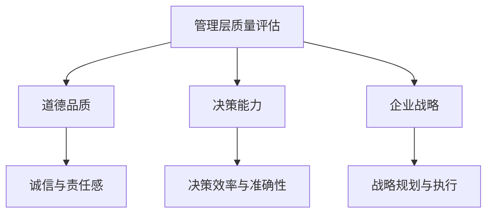
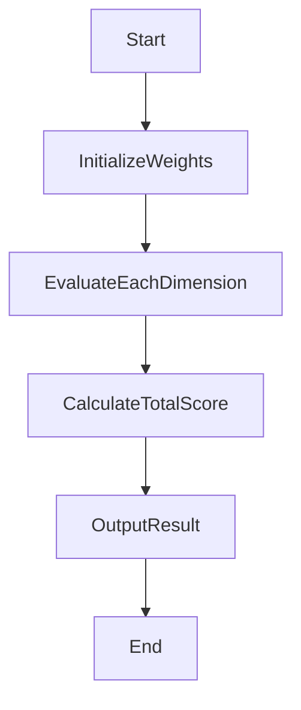
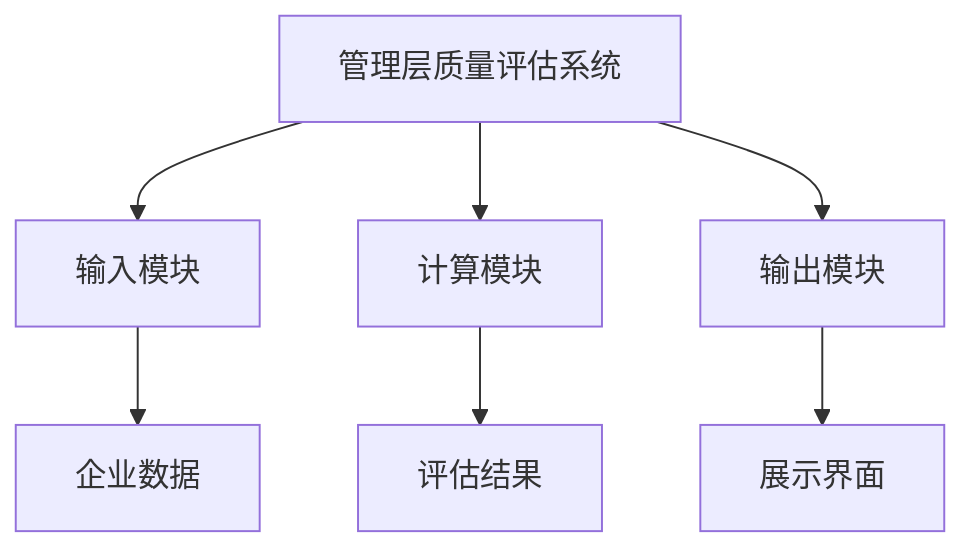

                 

# 菲利普·费雪的管理层质量评估标准

> 关键词：管理层质量评估，菲利普·费雪，投资标准，评估算法，企业战略

> 摘要：本文深入探讨菲利普·费雪提出的管理层质量评估标准，从背景介绍、核心概念、算法原理、系统分析到项目实战，全面解析该标准的理论基础与实践应用，帮助投资者和企业管理者更好地理解和应用这一评估体系。

---

# 第一部分: 背景介绍与核心概念

## 第1章: 管理层质量评估的重要性

### 1.1 问题背景与描述

#### 1.1.1 投资决策中的管理层角色

在投资领域，管理层的质量是决定企业价值的关键因素之一。菲利普·费雪（Philip Fisher）在其投资理论中强调，管理层的决策能力、道德品质和战略眼光直接影响企业的长期发展和投资价值。

#### 1.1.2 管理层质量对企业价值的影响

- **决策能力**：管理层能否做出正确的战略决策，影响企业的市场地位和发展潜力。
- **道德品质**：管理层的诚信和责任感直接影响企业的长期信誉和投资价值。
- **企业战略**：管理层的战略规划和执行能力决定企业能否在竞争中脱颖而出。

#### 1.1.3 管理层评估的必要性与边界

- **必要性**：在投资决策中，评估管理层的质量是筛选优质企业的重要步骤。
- **边界**：管理层评估不能孤立进行，需结合财务指标、市场环境等多方面因素。

### 1.2 菲利普·费雪的管理层质量评估标准

#### 1.2.1 标准的核心概念与组成要素

- **道德品质**：管理层的诚信、责任感和职业道德。
- **决策能力**：管理层的决策效率、准确性和创新性。
- **企业战略**：管理层的战略规划、执行能力和适应性。

#### 1.2.2 标准的理论基础与逻辑框架

菲利普·费雪的管理层质量评估标准基于以下逻辑：

1. 管理层的质量决定了企业的长期发展。
2. 通过量化管理层的关键维度，可以为投资决策提供依据。
3. 综合评估各维度的权重，得出管理层的整体质量评分。

#### 1.2.3 标准的适用范围与应用场景

- **应用场景**：企业投资决策、公司治理、管理层绩效评估。
- **适用范围**：适用于上市公司、成长型企业及初创企业。

---

## 第2章: 核心概念与联系

### 2.1 管理层质量评估的原理

#### 2.1.1 评估标准的数学模型

菲利普·费雪的管理层质量评估标准可以用以下数学模型表示：

$$ Q = \sum_{i=1}^{n} w_i \cdot s_i $$

其中：
- $Q$ 是管理层整体质量评分。
- $w_i$ 是第 $i$ 个评估维度的权重。
- $s_i$ 是第 $i$ 个评估维度的评分。

#### 2.1.2 标准的属性特征对比表

| 评估维度       | 评分标准 | 权重（$w_i$） |
|----------------|----------|--------------|
| 道德品质       | 0-1分    | 0.3          |
| 决策能力       | 0-1分    | 0.3          |
| 企业战略       | 0-1分    | 0.4          |

#### 2.1.3 标准的ER实体关系图

---

### 2.2 标准的数学模型与公式

#### 2.2.1 管理层质量评分公式

$$ Q = 0.3 \cdot s_{\text{道德}} + 0.3 \cdot s_{\text{决策}} + 0.4 \cdot s_{\text{战略}} $$

其中：
- $s_{\text{道德}}$ 是道德品质评分。
- $s_{\text{决策}}$ 是决策能力评分。
- $s_{\text{战略}}$ 是企业战略评分。

---

## 第3章: 算法原理与实现

### 3.1 管理层质量评估算法

#### 3.1.1 算法概述

菲利普·费雪的管理层质量评估算法是一种加权评分算法，通过量化各评估维度的权重和评分，计算出管理层的整体质量评分。

#### 3.1.2 算法流程图

---

## 第4章: 系统分析与架构设计

### 4.1 系统分析

#### 4.1.1 问题场景介绍

在实际应用中，投资者需要对多个企业的管理层质量进行评估，以筛选出具有投资价值的企业。

#### 4.1.2 系统功能设计

- **输入模块**：接收企业的管理层评估数据。
- **计算模块**：根据权重和评分计算质量评分。
- **输出模块**：展示评估结果。

#### 4.1.3 系统架构设计

---

## 第5章: 项目实战

### 5.1 环境安装

- **工具**：Python 3.8及以上版本，Jupyter Notebook，Mermaid工具。
- **依赖库**：numpy, matplotlib。

---

## 第6章: 最佳实践

### 6.1 小结

菲利普·费雪的管理层质量评估标准是一种有效的投资工具，通过量化管理层的关键维度，帮助投资者筛选出具有长期增长潜力的企业。

### 6.2 注意事项

- **数据准确性**：确保输入数据的准确性和完整性。
- **权重调整**：根据具体行业特点调整各维度的权重。

### 6.3 拓展阅读

- 《投资学精要》（书籍推荐）
- 管理层质量评估的最新研究进展。

---

# 结语

菲利普·费雪的管理层质量评估标准是一种经典的投资工具，通过系统的评估方法和算法，帮助投资者和企业管理者更好地理解和优化管理层的质量。希望本文能为读者提供有价值的参考和启发。

作者：AI天才研究院/AI Genius Institute & 禅与计算机程序设计艺术 /Zen And The Art of Computer Programming

