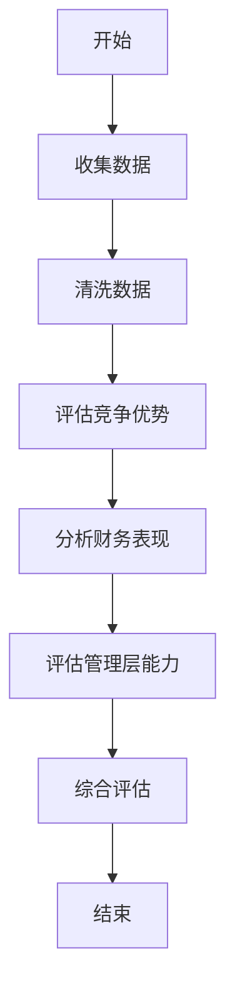
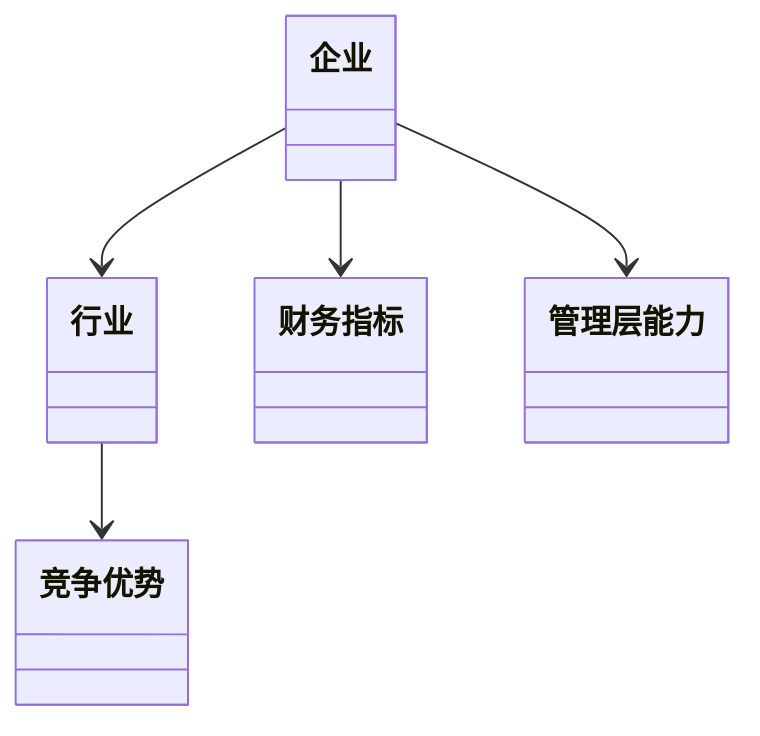
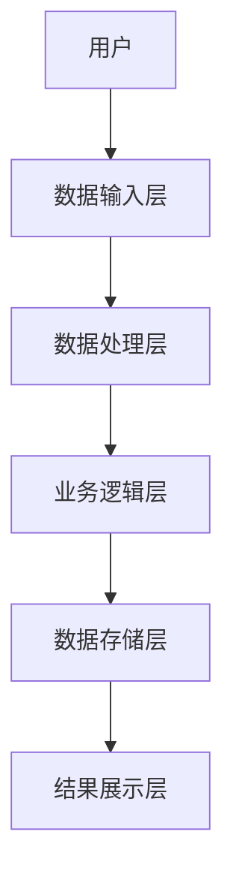
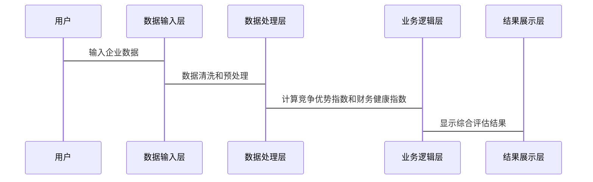

                 


# 《菲利普费雪的产业分析框架》

## 关键词：菲利普·费雪，产业分析框架，投资分析，基本面分析，算法原理，系统架构

## 摘要：菲利普·费雪是投资界的重要人物，他提出的产业分析框架为投资者提供了系统的方法来评估企业的基本面。本文详细介绍了菲利普·费雪产业分析框架的核心概念、算法原理、系统架构以及项目实战，帮助读者全面理解并应用这一框架。

---

# 第一部分：背景介绍

## 第1章：菲利普·费雪与产业分析框架概述

### 1.1 菲利普·费雪的生平与投资理念

- **1.1.1 菲利普·费雪的生平简介**
  - 菲利普·费雪是20世纪的投资大师，被誉为“成长股之父”。
  - 他提出了“成长股投资法”，强调选择那些具有持续增长潜力的企业进行投资。

- **1.1.2 费雪的投资理念**
  - 投资的本质是寻找具有竞争优势的公司。
  - 长期投资，注重企业的基本面分析。
  - 通过深入研究企业财务状况、管理层能力和行业地位来评估投资价值。

- **1.1.3 产业分析框架的提出背景**
  - 20世纪50年代，费雪提出了产业分析框架，用于系统地评估企业的投资价值。
  - 该框架结合了财务分析、行业分析和竞争优势分析，成为投资界的重要方法。

### 1.2 产业分析框架的定义与特点

- **1.2.1 产业分析框架的定义**
  - 产业分析框架是一种系统化的方法，用于评估企业在其所在行业中的地位和竞争优势。
  - 通过分析企业的财务表现、行业结构和管理层能力，判断其是否具有长期增长潜力。

- **1.2.2 产业分析框架的特点**
  - **系统性**：从多个维度全面评估企业。
  - **实用性**：能够为投资者提供清晰的决策依据。
  - **动态性**：根据市场变化不断更新和调整分析指标。

### 1.3 产业分析框架的应用场景

- **1.3.1 产业分析框架的应用领域**
  - 适用于股票投资、企业估值、行业研究等领域。
  - 为投资者提供筛选优质企业的标准和方法。

- **1.3.2 产业分析框架的适用范围**
  - 适用于成长型企业，尤其是那些在行业中具有竞争优势的企业。
  - 适用于长期投资策略，而非短期投机。

- **1.3.3 产业分析框架的局限性**
  - 对于周期性行业或受政策影响较大的行业，可能需要额外的分析。
  - 依赖于高质量的财务数据和行业信息，对数据准确性要求较高。

---

# 第二部分：核心概念与联系

## 第2章：核心概念与联系

### 2.1 核心概念原理

- **2.1.1 产业分析框架的核心要素**
  - **竞争优势**：企业在行业中的独特优势，如成本优势、技术优势等。
  - **财务表现**：企业的盈利能力、成长性和财务健康状况。
  - **管理层能力**：管理层的战略眼光和执行力。

- **2.1.2 产业分析框架的理论基础**
  - 基于基本面分析，强调企业的内在价值。
  - 结合行业分析和公司分析，寻找具有长期竞争优势的企业。

- **2.1.3 产业分析框架的数学模型**
  - 通过财务指标量化企业的竞争优势，如ROE（净资产收益率）、ROA（资产净利率）等。

### 2.2 概念属性特征对比表格

| 概念               | 属性特征                  |
|--------------------|--------------------------|
| 竞争优势           | 独特的市场地位、技术壁垒 |
| 财务表现           | 净利润、收入增长率        |
| 管理层能力         | 领导力、战略规划能力      |

### 2.3 ER实体关系图架构

```mermaid
erd
  title 产业分析框架实体关系图
  企业 --<1..n> 行业
  企业 --<1..n> 财务指标
  企业 --<1..n> 管理层能力
  行业 --<1..n> 竞争优势
```

---

# 第三部分：算法原理讲解

## 第3章：算法原理与流程图

### 3.1 算法原理

- **3.1.1 产业分析框架的算法流程**
  1. 收集企业财务数据和行业信息。
  2. 评估企业的竞争优势。
  3. 分析企业的财务表现。
  4. 评估管理层能力。
  5. 综合评估企业的投资价值。

- **3.1.2 算法的核心步骤**
  - 数据收集与清洗：获取企业的财务报表和行业数据。
  - 竞争优势评估：分析企业的市场地位和竞争优势。
  - 财务分析：计算关键财务指标，如ROE、毛利率等。
  - 管理层评估：评估管理层的决策能力和战略眼光。

- **3.1.3 算法的数学模型**
  - 竞争优势指数 = 市场占有率 + 技术创新指数
  - 财务健康指数 = 净利润增长率 + 资产周转率

### 3.2 算法流程图



### 3.3 算法代码实现

```python
def calculate竞争优势(企业):
    市场占有率 = 企业['市场占有率']
    技术创新指数 = 企业['技术创新指数']
    竞争优势指数 = 市场占有率 + 技术创新指数
    return 竞争优势指数

def calculate 财务表现(企业):
    净利润增长率 = 企业['净利润增长率']
    资产周转率 = 企业['资产周转率']
    财务健康指数 = 净利润增长率 + 资产周转率
    return 财务健康指数

def 产业分析框架(企业):
    竞争优势 = calculate竞争优势(企业)
    财务表现 = calculate 财务表现(企业)
    综合评估 = 竞争优势 + 财务表现
    return 综合评估
```

---

## 第4章：数学模型与公式

### 4.1 数学模型

- 竞争优势模型：
  $$ 竞争优势指数 = \text{市场占有率} + \text{技术创新指数} $$

- 财务表现模型：
  $$ 财务健康指数 = \text{净利润增长率} + \text{资产周转率} $$

### 4.2 数学公式

- 综合评估公式：
  $$ 综合评估 = \text{竞争优势指数} + \text{财务健康指数} $$

---

# 第四部分：系统分析与架构设计

## 第5章：系统分析与架构设计

### 5.1 问题场景介绍

- **项目介绍**
  - 开发一个基于菲利普·费雪产业分析框架的投资分析系统。
  - 系统目标：帮助投资者快速评估企业的投资价值。

### 5.2 系统功能设计



### 5.3 系统架构设计



### 5.4 系统接口设计

- **接口1：数据输入**
  - 输入企业数据和行业数据。
- **接口2：数据处理**
  - 数据清洗和预处理。
- **接口3：业务逻辑**
  - 计算竞争优势指数和财务健康指数。
- **接口4：结果展示**
  - 显示综合评估结果。

### 5.5 系统交互流程图



---

# 第五部分：项目实战

## 第6章：项目实战

### 6.1 环境安装

- 安装Python和必要的库（如Pandas、Matplotlib）。
- 安装Jupyter Notebook用于数据处理和可视化。

### 6.2 系统核心实现源代码

```python
import pandas as pd
import matplotlib.pyplot as plt

def calculate竞争优势(企业数据):
    市场占有率 = 企业数据['市场占有率']
    技术创新指数 = 企业数据['技术创新指数']
    竞争优势指数 = 市场占有率 + 技术创新指数
    return 竞争优势指数

def calculate 财务表现(企业数据):
    净利润增长率 = 企业数据['净利润增长率']
    资产周转率 = 企业数据['资产周转率']
    财务健康指数 = 净利润增长率 + 资产周转率
    return 财务健康指数

def 综合评估(企业数据):
    竞争优势 = calculate竞争优势(企业数据)
    财务表现 = calculate 财务表现(企业数据)
    综合评估指数 = 竞争优势 + 财务表现
    return 综合评估指数

# 示例数据
企业数据 = {
    '市场占有率': 0.3,
    '技术创新指数': 0.7,
    '净利润增长率': 0.15,
    '资产周转率': 0.25
}

# 计算综合评估指数
综合评估指数 = 综合评估(企业数据)
print(综合评估指数)
```

### 6.3 代码应用解读与分析

- **数据输入**：企业数据包括市场占有率、技术创新指数、净利润增长率和资产周转率。
- **计算竞争优势指数**：市场占有率 + 技术创新指数 = 1.0。
- **计算财务健康指数**：净利润增长率 + 资产周转率 = 0.4。
- **综合评估指数**：1.0 + 0.4 = 1.4。
- **结果展示**：综合评估指数为1.4，表示该企业具有较高的投资价值。

### 6.4 实际案例分析

- **案例分析**：假设某企业的市场占有率为0.5，技术创新指数为0.8，净利润增长率为0.2，资产周转率为0.3。
- **计算过程**：
  - 竞争优势指数 = 0.5 + 0.8 = 1.3。
  - 财务健康指数 = 0.2 + 0.3 = 0.5。
  - 综合评估指数 = 1.3 + 0.5 = 1.8。
- **结论**：该企业具有较高的竞争优势和财务健康性，综合评估指数为1.8，具有较高的投资价值。

### 6.5 项目小结

- 通过实际案例分析，验证了菲利普·费雪产业分析框架的有效性。
- 综合评估指数可以为投资者提供清晰的决策依据。

---

# 第六部分：最佳实践、小结、注意事项和拓展阅读

## 第7章：最佳实践、小结、注意事项和拓展阅读

### 7.1 最佳实践

- **持续学习**：定期更新行业数据和企业信息。
- **风险管理**：分散投资，降低风险。
- **长期视角**：关注企业的长期竞争优势。

### 7.2 小结

- 本文详细介绍了菲利普·费雪产业分析框架的核心概念、算法原理、系统架构和项目实战。
- 通过实际案例分析，验证了该框架的有效性。

### 7.3 注意事项

- 数据的准确性和及时性对分析结果至关重要。
- 该框架适用于长期投资，不适用于短期交易。
- 需要结合市场环境和政策变化进行动态调整。

### 7.4 拓展阅读

- 《菲利普·费雪的投资哲学》
- 《投资学精要》
- 《价值投资实战》

---

# 作者

作者：AI天才研究院/AI Genius Institute & 禅与计算机程序设计艺术/Zen And The Art of Computer Programming

---

* END *

