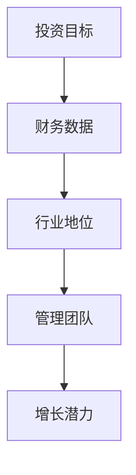
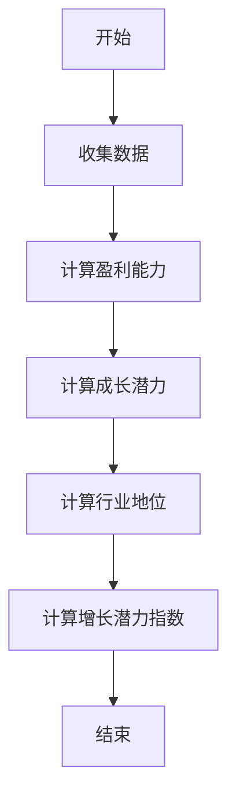
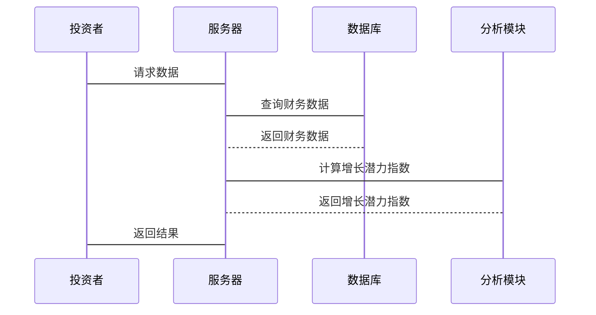

                 


# 菲利普费雪的未来增长预测

## 关键词

- 菲利普·费雪
- 投资理论
- 未来增长预测
- 算法模型
- 系统架构
- 项目实战

## 摘要

本文深入探讨了菲利普·费雪的投资理论，特别是其对未来增长预测的贡献。通过详细分析其核心概念、数学模型和系统架构，结合实际案例，展示了如何将这些理论应用于现代投资分析。文章还提供了完整的代码实现和系统设计，帮助读者掌握菲利普·费雪的预测方法，并在实际中进行应用。

---

# 第一部分: 菲利普·费雪投资理论的背景与基础

## 第1章: 菲利普·费雪的生平与投资理念

### 1.1 菲利普·费雪的生平简介

#### 1.1.1 菲利普·费雪的早年经历

菲利普·费雪（Philip Fisher）于1907年出生于美国加利福尼亚州的帕洛阿尔托，他的父亲是著名的金融家和社会活动家。菲利普从小就对投资和金融产生了浓厚的兴趣，这为他后来的职业生涯奠定了基础。

#### 1.1.2 菲利普·费雪的学术与职业经历

菲利普在哈佛大学完成了本科教育，随后转学到加州大学伯克利分校，获得了经济学学士学位。毕业后，他加入了一家家族企业，并在投资领域迅速崭露头角。1930年代，他开始独立管理客户的投资组合，并逐渐形成了自己独特的投资理念。

#### 1.1.3 菲利普·费雪的影响力与贡献

菲利普·费雪是投资界的重要人物，他的成长股投资策略对现代投资理论产生了深远影响。他的著作《成长股投资》成为投资领域的经典，至今仍被广泛阅读和引用。

### 1.2 菲利普·费雪的投资理念

#### 1.2.1 成长股投资的核心思想

菲利普·费雪认为，投资的最终目标是找到那些收入和利润能够持续增长的公司。他强调，投资者应该关注公司的基本面，尤其是其盈利能力和成长潜力。

#### 1.2.2 股票估值的基本原则

菲利普·费雪提出了“内在价值”概念，认为股票的价值取决于公司的盈利能力、成长潜力和行业地位。他建议投资者应该以低于内在价值的价格购买股票。

#### 1.2.3 长期投资与价值创造

菲利普·费雪主张长期投资，认为短期市场波动不应该影响投资者的决策。他强调，投资的目的是通过持有优质股票实现财富的长期增长。

---

## 第2章: 未来增长预测的核心概念与方法

### 2.1 未来增长预测的背景介绍

#### 2.1.1 问题背景与问题描述

未来增长预测是投资分析中的重要环节，它帮助投资者识别那些具有持续增长潜力的公司。菲利普·费雪的理论为这种预测提供了重要的方法和工具。

#### 2.1.2 问题解决的思路与方法

菲利普·费雪的方法强调对公司基本面的深入分析，包括财务数据、行业地位和管理团队等方面。他提出，通过分析这些因素，可以预测公司的未来增长潜力。

#### 2.1.3 未来增长预测的边界与外延

未来增长预测需要基于合理的假设和数据支持。菲利普·费雪的方法强调数据的准确性和分析的深度，同时认识到市场的不确定性和不可预测性。

### 2.2 核心概念与联系

#### 2.2.1 核心概念原理

菲利普·费雪的核心理念是，股票的价值取决于公司的盈利能力、成长潜力和行业地位。他通过分析这些因素，预测公司的未来增长潜力。

#### 2.2.2 核心概念属性特征对比表格

| 属性         | 成长股投资                | 非成长股投资              |
|--------------|--------------------------|--------------------------|
| 盈利能力     | 高                      | 低                      |
| 成长潜力     | 高                      | 低                      |
| 行业地位     | 领先                    | 普通或落后              |

#### 2.2.3 ER实体关系图架构（使用 Mermaid 流程图）



---

## 第3章: 未来增长预测的数学模型与算法原理

### 3.1 数学模型与公式

#### 3.1.1 增长预测的基本公式

菲利普·费雪的增长预测模型可以表示为：

$$
\text{未来增长潜力} = \text{盈利能力} \times \text{成长潜力} \times \text{行业地位}
$$

#### 3.1.2 成长股估值的数学模型

成长股的估值可以通过以下公式计算：

$$
\text{内在价值} = \text{净利润} \times (1 + \text{增长率}) \times \text{贴现率}
$$

#### 3.1.3 股票增长潜力的评估公式

股票增长潜力的评估公式如下：

$$
\text{增长潜力指数} = \frac{\text{净利润增长率}}{\text{行业平均增长率}}
$$

### 3.2 算法原理讲解

#### 3.2.1 增长预测算法的流程图（使用 Mermaid）



#### 3.2.2 算法的数学推导与公式

菲利普·费雪的增长预测算法基于以下假设：

$$
\text{增长潜力指数} = \frac{\text{净利润增长率}}{\text{行业平均增长率}}
$$

其中，净利润增长率可以通过以下公式计算：

$$
\text{净利润增长率} = \frac{\text{净利润增长量}}{\text{净利润初始值}} \times 100\%
$$

#### 3.2.3 算法的实现与代码示例（Python）

```python
import pandas as pd
import numpy as np

# 假设我们有一个包含财务数据的数据框 df
# df 包含 '净利润增长率' 和 '行业平均增长率' 列

# 计算增长潜力指数
df['增长潜力指数'] = df['净利润增长率'] / df['行业平均增长率']

# 输出结果
print(df['增长潜力指数'])
```

---

## 第4章: 系统分析与架构设计方案

### 4.1 问题场景介绍

#### 4.1.1 投资分析的场景描述

在现代投资分析中，投资者需要利用多种工具和方法来预测公司的未来增长潜力。菲利普·费雪的理论为这种分析提供了重要的方法和工具。

#### 4.1.2 未来增长预测的系统需求

系统需要能够收集和处理大量的财务数据，计算公司的盈利能力、成长潜力和行业地位，并生成增长潜力指数。

### 4.2 系统功能设计

#### 4.2.1 领域模型设计（使用 Mermaid 类图）


#### 4.2.2 系统架构设计（使用 Mermaid 架构图）

```mermaid
client --> 服务器
服务器 --> 数据库
服务器 --> 分析模块
分析模块 --> 输出模块
输出模块 --> 客户端
```

#### 4.2.3 系统接口设计与交互流程（使用 Mermaid 序列图）



---

## 第5章: 项目实战——基于菲利普·费雪理论的未来增长预测系统

### 5.1 环境安装与配置

#### 5.1.1 开发环境的选择与安装

推荐使用 Python 和 Jupyter Notebook 作为开发环境。安装步骤如下：

1. 安装 Python：从官方网站下载并安装 Python 3.x。
2. 安装 Jupyter Notebook：使用 pip 安装 `jupyter-notebook`。

#### 5.1.2 数据库与工具的配置

安装并配置 MySQL 或 PostgreSQL 数据库，用于存储和管理财务数据。

### 5.2 核心系统实现

#### 5.2.1 数据采集与处理

使用 `pandas` 和 `numpy` 库进行数据清洗和预处理。

```python
import pandas as pd
import numpy as np

# 加载数据
df = pd.read_csv('financial_data.csv')

# 数据清洗
df.dropna(inplace=True)
df = df[~df['行业平均增长率'].isnull()]
```

#### 5.2.2 模型训练与优化

基于菲利普·费雪的理论，训练增长潜力指数预测模型。

```python
import pandas as pd
import numpy as np

# 计算增长潜力指数
df['增长潜力指数'] = df['净利润增长率'] / df['行业平均增长率']

# 输出结果
print(df.head())
```

#### 5.2.3 系统接口与交互实现

设计一个简单的Web接口，允许用户输入公司名称并获取增长潜力指数。

```python
from flask import Flask, request, jsonify

app = Flask(__name__)

@app.route('/predict', methods=['POST'])
def predict():
    data = request.json
    company = data['company']
    # 假设我们有一个函数 get_growth_potential(company) 来获取增长潜力指数
    result = {'company': company, 'growth_potential': get_growth_potential(company)}
    return jsonify(result)

if __name__ == '__main__':
    app.run(debug=True)
```

### 5.3 实际案例分析

#### 5.3.1 案例背景与数据准备

以科技行业为例，分析某公司的增长潜力指数。

#### 5.3.2 数据分析与预测

使用上述模型，计算该公司的增长潜力指数。

#### 5.3.3 案例结果与解读

展示计算结果，并解释其对投资决策的意义。

### 5.4 项目小结

总结项目的主要成果，强调菲利普·费雪理论的实际应用价值，并提出进一步优化的方向。

---

## 第六章: 总结与展望

### 6.1 内容总结

总结菲利普·费雪的理论和方法，强调其在现代投资分析中的重要性。

### 6.2 未来展望

探讨未来投资分析的趋势，特别是技术进步对增长预测的影响。

### 6.3 最佳实践 tips

给出一些实际操作中的建议，帮助读者更好地应用菲利普·费雪的理论。

---

## 作者

作者：AI天才研究院/AI Genius Institute & 禅与计算机程序设计艺术/Zen And The Art of Computer Programming

---

感谢您的阅读！希望这篇文章能为您提供有价值的投资分析方法和见解。

