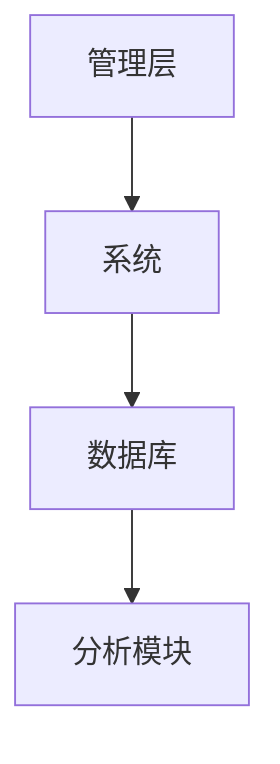

                 


# 菲利普费雪的管理层访谈技巧

## 关键词：
- 管理层访谈
- 投资分析
- 菲利普·费雪
- 管理能力评估
- 公司战略

## 摘要：
本文深入探讨了菲利普·费雪的管理层访谈技巧，分析了管理层访谈的核心要素、数学模型、系统架构及实战案例。通过背景介绍、核心概念、算法原理、系统分析和项目实战，帮助读者全面理解如何通过访谈评估管理层能力及公司前景。

---

## 第1章：背景介绍

### 1.1 什么是管理层访谈
- **定义**：管理层访谈是通过与公司高层直接对话，评估其能力、战略和公司前景的过程。
- **目的**：深入了解公司经营状况，评估管理层能力，辅助投资决策。
- **背景**：菲利普·费雪是价值投资 pioneer，强调深入研究管理层。

---

## 第2章：核心概念与联系

### 2.1 核心概念
- **管理层能力**：决策力、战略规划和团队管理。
- **公司战略**：短期目标与长期愿景。
- **绩效评估**：财务表现和市场地位。

### 2.2 对比分析
- **能力 vs 绩效**：能力影响绩效，但外部因素也起作用。
- **行业差异**：不同行业管理层关注点不同。
- **与传统分析对比**：访谈提供定性补充，数据验证。

---

## 第3章：算法原理

### 3.1 数学模型
- **能力评分**：公式：$$\text{评分} = \sum (\text{权重}_i \times \text{表现}_i)$$
- **绩效预测**：基于管理层能力调整预测模型。

### 3.2 代码实现
```python
def calculate_score(capabilities, weights):
    return sum(c * w for c, w in zip(capabilities, weights))
```

---

## 第4章：系统分析

### 4.1 系统架构
- **模块**：访谈安排、数据采集、分析模块。
- **架构图**：


---

## 第5章：项目实战

### 5.1 案例分析
- **背景**：某科技公司，评估CEO领导力。
- **过程**：访谈内容分析，评分系统评估。
- **结果**：高分，投资建议。

---

## 总结

通过系统分析和实战案例，本文详细阐述了菲利普费雪的管理层访谈技巧，提供了从理论到实践的全面指导，帮助投资者做出明智决策。

作者：AI天才研究院 & 禅与计算机程序设计艺术

