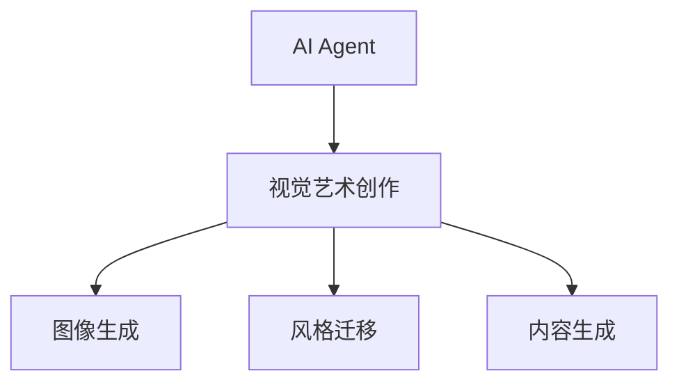
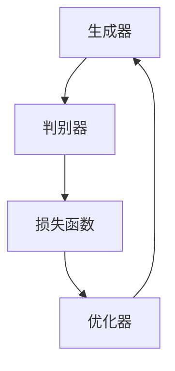
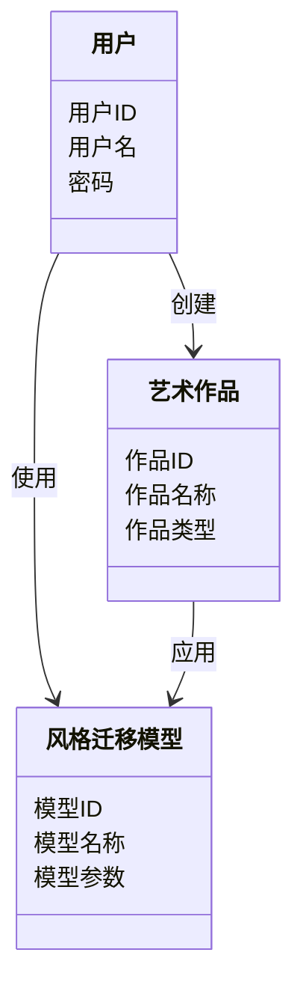
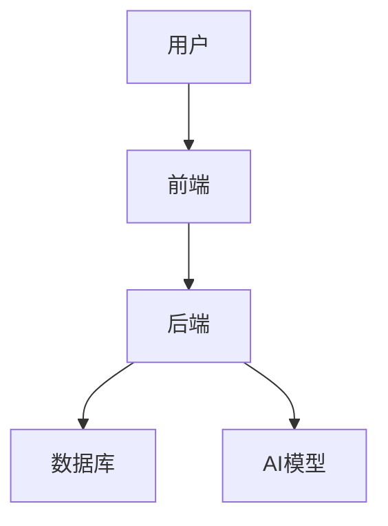
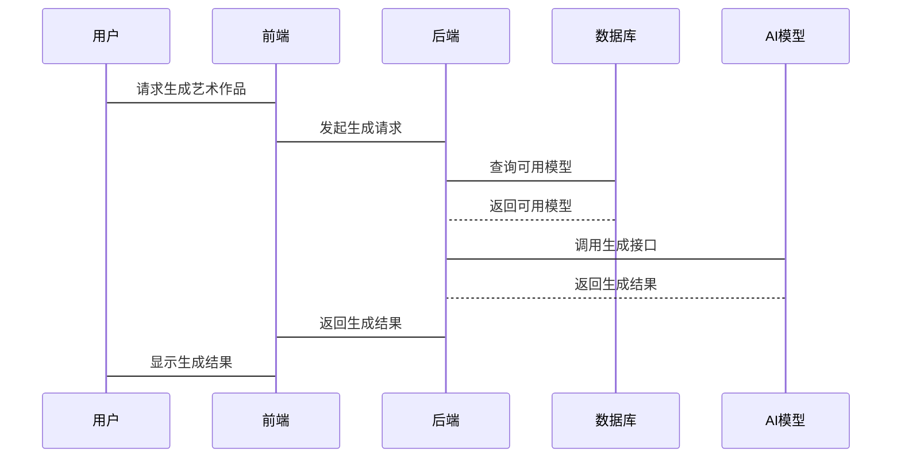

                 


# 视觉艺术领域的AI Agent创作工具

## 关键词：视觉艺术、AI Agent、图像生成、风格迁移、艺术创作

## 摘要：随着人工智能技术的快速发展，AI Agent在视觉艺术领域的应用逐渐成为可能。本文详细探讨了视觉艺术领域的AI Agent创作工具的背景、核心概念、算法原理、系统架构、项目实战、最佳实践等方面，为读者提供了一套完整的解决方案。

---

# 第一章: 视觉艺术领域的AI Agent创作工具概述

## 1.1 问题背景

### 1.1.1 视觉艺术领域的数字化转型

视觉艺术创作正经历一场数字化转型。传统的艺术创作依赖于艺术家的手工创作，而AI Agent的引入为艺术家提供了全新的创作工具，能够在短时间内生成大量高质量的艺术作品，从而提高创作效率。

### 1.1.2 AI技术在艺术创作中的应用现状

AI技术已经在艺术创作领域取得了显著进展。例如，生成对抗网络（GAN）被广泛应用于图像生成，而风格迁移技术则能够将一种艺术风格转移到另一种图像上。然而，现有的工具通常缺乏智能化的创作指导和个性化推荐功能。

### 1.1.3 AI Agent在视觉艺术中的潜力与挑战

AI Agent在视觉艺术领域的潜力巨大。它可以为艺术家提供实时创作建议、风格匹配、自动优化等服务。然而，如何在保持艺术创作的创造性的同时，实现智能化的辅助创作，仍然是一个需要解决的挑战。

## 1.2 问题描述

### 1.2.1 视觉艺术创作中的痛点分析

当前的视觉艺术创作工具存在以下痛点：
1. 创作效率低，尤其是复杂艺术作品的创作周期较长。
2. 缺乏智能化的创作建议和个性化推荐。
3. 艺术风格的多样性不足，难以满足不同用户的需求。

### 1.2.2 AI Agent在艺术创作中的角色定位

AI Agent在视觉艺术创作中的角色可以是：
1. **创作助手**：为艺术家提供实时的创作建议和灵感。
2. **风格迁移工具**：将一种艺术风格转移到另一种图像上。
3. **自动化优化工具**：自动优化艺术作品的色彩、构图等。

### 1.2.3 当前技术的局限性与改进方向

当前技术的局限性包括：
1. AI Agent的创作结果缺乏足够的创意和多样性。
2. 计算资源消耗较大，难以实时处理复杂的艺术创作任务。

改进方向：
1. 提高AI Agent的创作灵活性和多样性。
2. 优化算法效率，降低计算资源消耗。

## 1.3 问题解决

### 1.3.1 AI Agent的核心功能与目标

AI Agent的核心功能包括：
1. 提供实时的创作建议。
2. 支持多种艺术风格的创作。
3. 自动优化艺术作品。

### 1.3.2 技术实现路径与方法

技术实现路径包括：
1. 使用深度学习模型进行图像生成和风格迁移。
2. 结合强化学习进行创作优化。

### 1.3.3 用户需求与功能匹配

用户需求：
1. 高效的创作工具。
2. 多样化的艺术风格选择。
3. 智能化的创作建议。

功能匹配：
1. 提供多种艺术风格的生成选项。
2. 实时生成创作灵感。
3. 自动优化艺术作品。

## 1.4 边界与外延

### 1.4.1 AI Agent的适用范围与限制

适用范围：
1. 个人艺术创作。
2. 教育领域的艺术教学。

限制：
1. 高度依赖计算资源，难以在低配置设备上运行。
2. 创作结果可能缺乏人类艺术家的情感表达。

### 1.4.2 视觉艺术创作的边界条件

边界条件：
1. 艺术风格的多样性。
2. 创作过程的实时性。
3. 创作结果的质量。

### 1.4.3 技术与艺术的平衡点

平衡点：
1. 技术辅助艺术创作，而非替代人类艺术家。
2. 确保创作过程中的创意和多样性。

## 1.5 概念结构与核心要素

### 1.5.1 AI Agent的组成模块

AI Agent的组成模块包括：
1. **感知模块**：负责数据输入和特征提取。
2. **推理模块**：负责关系推理和决策。
3. **执行模块**：负责输出生成和优化。

### 1.5.2 视觉艺术创作的核心要素

视觉艺术创作的核心要素包括：
1. **图像生成**：生成高质量的艺术图像。
2. **风格迁移**：将一种艺术风格转移到另一种图像上。
3. **内容生成**：生成艺术作品的主题和内容。

### 1.5.3 功能模块与核心要素的关系

功能模块与核心要素的关系可以通过以下表格表示：

| 功能模块       | 核心要素           |
|----------------|-------------------|
| 感知模块       | 数据输入和特征提取 |
| 推理模块       | 关系推理和决策     |
| 执行模块       | 输出生成和优化     |

---

# 第二章: 核心概念与联系

## 2.1 AI Agent的原理

### 2.1.1 感知模块

感知模块负责从输入数据中提取特征。例如，图像识别任务中，感知模块需要从输入图像中提取颜色、纹理等特征。

### 2.1.2 推理模块

推理模块负责根据提取的特征进行关系推理和决策。例如，风格迁移任务中，推理模块需要根据目标风格进行图像变换。

### 2.1.3 执行模块

执行模块负责根据推理结果生成最终的输出。例如，图像生成任务中，执行模块需要根据推理结果生成新的图像。

## 2.2 视觉艺术创作的关键技术

### 2.2.1 图像生成技术

图像生成技术包括生成对抗网络（GAN）和变分自编码器（VAE）等。这些技术可以生成高质量的艺术图像。

### 2.2.2 风格迁移技术

风格迁移技术通过将一种艺术风格转移到另一种图像上，生成具有特定风格的艺术作品。

### 2.2.3 内容生成技术

内容生成技术通过生成特定主题和内容的艺术作品，帮助艺术家快速实现创作目标。

## 2.3 核心概念对比表

以下表格对比了不同模型的特点和应用场景：

| 模型类型 | 特点 | 应用场景 |
|----------|------|----------|
| GAN      | 高质量图像生成 | 图像生成、风格迁移 |
| VAE      | 噪声建模能力强 | 图像生成、图像修复 |
| CycleGAN | 无监督学习 | 风格迁移、图像转换 |

## 2.4 实体关系图

以下Mermaid图展示了AI Agent与视觉艺术创作之间的关系：



---

# 第三章: 算法原理讲解

## 3.1 概率图模型

### 3.1.1 贝叶斯网络

贝叶斯网络是一种基于概率的图模型，通过有向无环图（DAG）描述变量之间的依赖关系。例如，在图像生成任务中，贝叶斯网络可以用来建模图像的生成过程。

### 3.1.2 图神经网络

图神经网络（GNN）是一种处理图结构数据的深度学习模型。例如，在图像分割任务中，图神经网络可以用来建模图像的像素之间的关系。

### 3.1.3 概率推断方法

概率推断方法用于在贝叶斯网络中计算后验概率。例如，通过马尔可夫链蒙特卡罗方法（MCMC）进行采样。

## 3.2 强化学习

### 3.2.1 Q-learning算法

Q-learning算法是一种基于值函数的强化学习算法。例如，在风格迁移任务中，Q-learning可以用来优化图像的风格变换。

### 3.2.2 策略梯度方法

策略梯度方法是一种基于梯度的强化学习算法。例如，在图像生成任务中，策略梯度方法可以用来优化生成器的参数。

### 3.2.3 剩余网络与深度强化学习

剩余网络（ResNet）是一种深度残差网络，广泛应用于图像生成任务。例如，使用ResNet作为生成器的架构，可以提高图像生成的质量。

## 3.3 图像生成模型

### 3.3.1 GAN模型

GAN模型包括生成器和判别器两个部分。生成器负责生成新的图像，判别器负责判断图像的真实性。例如，使用GAN模型可以生成高质量的艺术图像。

### 3.3.2 VAE模型

VAE模型通过引入潜变量空间，实现图像的生成。例如，VAE模型可以用来修复图像中的噪声。

## 3.4 算法流程图

以下Mermaid图展示了GAN模型的算法流程：



---

# 第四章: 系统分析与架构设计方案

## 4.1 问题场景介绍

视觉艺术创作需要高效的创作工具和智能化的辅助功能。为了实现这一目标，我们需要设计一个基于AI Agent的创作工具，支持图像生成、风格迁移和内容生成等功能。

## 4.2 项目介绍

### 4.2.1 项目目标

项目目标包括：
1. 提供高效的图像生成工具。
2. 实现风格迁移功能。
3. 支持内容生成服务。

### 4.2.2 项目需求

项目需求包括：
1. 用户友好的界面设计。
2. 高效的算法实现。
3. 支持多种艺术风格。

## 4.3 系统功能设计

### 4.3.1 领域模型类图

以下Mermaid图展示了领域模型类图：



### 4.3.2 系统架构图

以下Mermaid图展示了系统架构图：



### 4.3.3 系统接口设计

系统接口设计包括：
1. 用户登录与注册接口。
2. 艺术作品上传与下载接口。
3. 风格迁移模型调用接口。

### 4.3.4 系统交互流程

以下Mermaid图展示了系统交互流程：



---

# 第五章: 项目实战

## 5.1 环境安装

### 5.1.1 安装Python

安装Python 3.8或更高版本。

### 5.1.2 安装深度学习框架

安装TensorFlow或PyTorch框架。

### 5.1.3 安装其他依赖

安装必要的依赖包，例如numpy、pandas等。

## 5.2 系统核心实现

### 5.2.1 感知模块实现

感知模块实现包括图像特征提取和数据预处理。

```python
import tensorflow as tf
from tensorflow.keras import layers

def perceptual_module(input_image):
    model = tf.keras.Sequential([
        layers.Conv2D(32, (3, 3), activation='relu'),
        layers.MaxPooling2D((2, 2)),
        layers.Conv2D(64, (3, 3), activation='relu'),
        layers.MaxPooling2D((2, 2)),
        layers.Flatten()
    ])
    return model(input_image)
```

### 5.2.2 推理模块实现

推理模块实现包括图像风格迁移和内容生成。

```python
import tensorflow as tf
from tensorflow.keras import layers

def inference_module(input_features):
    model = tf.keras.Sequential([
        layers.Dense(128, activation='relu'),
        layers.Dense(256, activation='relu'),
        layers.Dense(1, activation='sigmoid')
    ])
    return model(input_features)
```

### 5.2.3 执行模块实现

执行模块实现包括图像生成和优化。

```python
import tensorflow as tf
from tensorflow.keras import layers

def execution_module(input_style):
    model = tf.keras.Sequential([
        layers.Conv2DTranspose(64, (3, 3), activation='relu'),
        layers.Conv2DTranspose(3, (3, 3), activation='sigmoid')
    ])
    return model(input_style)
```

## 5.3 案例分析

### 5.3.1 案例背景

案例背景包括艺术作品的创作需求和目标风格。

### 5.3.2 案例实施

案例实施包括图像生成和风格迁移的具体步骤。

### 5.3.3 案例结果

案例结果包括生成的艺术作品和优化后的效果。

## 5.4 项目总结

项目总结包括项目实现的关键点和未来改进方向。

---

# 第六章: 最佳实践与注意事项

## 6.1 最佳实践 tips

### 6.1.1 系统优化建议

系统优化建议包括算法优化和性能调优。

### 6.1.2 用户体验优化

用户体验优化包括界面设计和功能优化。

## 6.2 小结

### 6.2.1 核心内容回顾

核心内容回顾包括AI Agent在视觉艺术领域的应用和算法实现。

### 6.2.2 未来展望

未来展望包括技术发展和应用潜力。

## 6.3 注意事项

### 6.3.1 技术风险

技术风险包括算法的稳定性和计算资源的消耗。

### 6.3.2 用户隐私

用户隐私包括数据的安全和用户信息的保护。

## 6.4 拓展阅读

拓展阅读包括相关领域的书籍和论文推荐。

---

# 作者：AI天才研究院/AI Genius Institute & 禅与计算机程序设计艺术 /Zen And The Art of Computer Programming

---

以上是《视觉艺术领域的AI Agent创作工具》的技术博客文章的详细内容，涵盖了从背景介绍到项目实战的各个方面，为读者提供了一套完整的解决方案。

