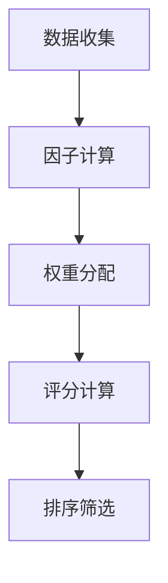
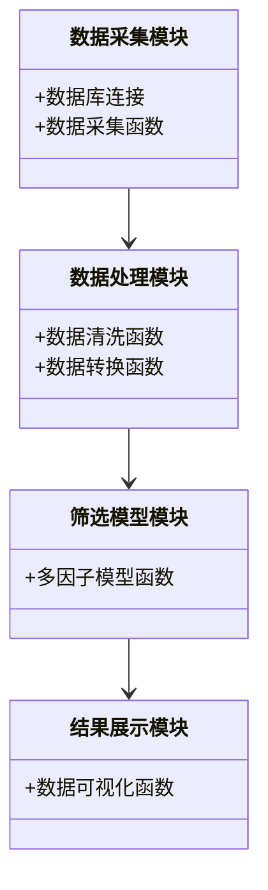

                 


# 詹姆斯·奥肖内西的价值投资者的质量筛选

## 关键词：价值投资、质量筛选、股票分析、投资策略、财务指标、算法模型、系统设计

## 摘要：本文探讨了詹姆斯·奥肖内西的价值投资理念中的质量筛选方法，详细分析了其核心概念、算法原理、系统架构及实际应用，帮助投资者提升决策效率和准确性。

---

## 引言

### 1.1 价值投资的背景与发展

价值投资是一种长期投资策略，起源于20世纪30年代，由本杰明·格雷厄姆和戴维·多德提出。它强调购买被市场低估的股票，通过长期持有实现收益。随着投资理论的发展，价值投资逐渐演变为多种策略，其中质量筛选是关键环节。

### 1.2 质量筛选的定义与作用

质量筛选是通过分析公司的财务状况、行业地位等因素，选出具有投资价值的股票。它帮助投资者识别出那些基本面良好、成长潜力大的公司，从而降低投资风险，提高收益。

---

## 价值投资的核心理念

### 2.1 核心概念与原则

价值投资的核心理念是购买低于其内在价值的股票。内在价值是公司未来现金流的现值，需通过财务分析和行业分析来评估。以下是价值投资的关键原则：

- **安全边际**：购买价格低于内在价值，以降低风险。
- **长期视角**：关注公司的长期盈利能力，而非短期波动。
- **分散投资**：通过投资多个公司降低风险。

### 2.2 质量筛选的关键指标

质量筛选涉及多个财务指标，每个指标衡量公司的不同方面：

- **市盈率（P/E）**：评估公司股价是否合理，计算公式为：市盈率 = 股价 / 每股收益。
- **市净率（P/B）**：衡量股价与账面价值的关系，公式为：市净率 = 股价 / 每股净资产。
- **ROE（净资产收益率）**：反映公司盈利能力，公式为：ROE = 净利润 / 平均净资产。

---

## 质量筛选的标准与方法

### 3.1 财务指标分析

财务指标分析是质量筛选的核心，需结合多个指标评估公司质量。例如，高ROE和低市盈率可能表明公司具有投资价值。以下是关键步骤：

1. 收集目标公司的财务报表，包括利润表、资产负债表和现金流量表。
2. 计算关键财务指标，如ROE、P/E和P/B。
3. 对比行业平均水平，判断公司是否具备竞争优势。

### 3.2 多因子模型的构建

多因子模型综合多个因素筛选股票，提升筛选的准确性和全面性。以下是构建步骤：

1. 选择多个因子，如ROE、P/E、行业地位等。
2. 为每个因子分配权重，反映其重要性。
3. 综合因子评分，筛选出总评分高的公司。

---

## 质量筛选的算法与数学模型

### 4.1 多因子模型的算法原理

多因子模型通过加权平均的方式，综合多个因子评估公司质量。流程如下：

1. **数据收集**：获取目标公司的财务数据。
2. **因子计算**：计算每个因子的值。
3. **权重分配**：根据经验或统计方法确定因子权重。
4. **评分计算**：加权求和，得到每个公司的综合评分。
5. **排序筛选**：根据评分排序，选出评分高的公司。

**流程图：**



### 4.2 数学公式

- **多因子评分公式**：
  $$ \text{评分} = \sum_{i=1}^{n} (w_i \times f_i) $$
  其中，\( w_i \) 是因子 \( i \) 的权重，\( f_i \) 是因子 \( i \) 的值。

- **ROE计算公式**：
  $$ \text{ROE} = \frac{\text{净利润}}{\text{平均净资产}} $$

---

## 系统架构与设计

### 5.1 系统功能设计

系统分为四个模块：

1. **数据采集模块**：从数据库获取公司数据。
2. **数据处理模块**：清洗和转换数据。
3. **筛选模型模块**：应用多因子模型筛选股票。
4. **结果展示模块**：以图表形式展示结果。

**类图：**



### 5.2 系统架构图


---

## 项目实战

### 6.1 环境安装与配置

安装Python和相关库：

```bash
pip install pandas numpy matplotlib
```

### 6.2 核心代码实现

```python
import pandas as pd
import numpy as np

# 示例数据
data = {
    '公司': ['A', 'B', 'C'],
    'ROE': [0.2, 0.3, 0.1],
    'P/E': [15, 20, 10],
    'P/B': [2, 3, 1]
}

df = pd.DataFrame(data)

# 计算多因子评分，假设ROE和P/E权重为0.5，P/B权重为0.5
weights = {'ROE': 0.5, 'P/E': 0.3, 'P/B': 0.2}
df['评分'] = df.apply(lambda row: 
    weights['ROE'] * row['ROE'] + 
    weights['P/E'] * row['P/E'] + 
    weights['P/B'] * row['P/B'], axis=1)

print(df)
```

### 6.3 案例分析

假设我们有三家公司，通过上述代码计算评分：

| 公司 | ROE | P/E | P/B | 评分 |
|------|-----|-----|-----|------|
| A    | 0.2 | 15  | 2   | 0.5*0.2 + 0.3*15 + 0.2*2 = 4.7 |
| B    | 0.3 | 20  | 3   | 0.5*0.3 + 0.3*20 + 0.2*3 = 6.6 |
| C    | 0.1 | 10  | 1   | 0.5*0.1 + 0.3*10 + 0.2*1 = 3.5 |

根据评分，公司B质量最高，适合作为投资目标。

---

## 小结与展望

### 7.1 总结

本文详细探讨了质量筛选在价值投资中的应用，从理论到实践，系统地介绍了筛选方法和系统设计。通过质量筛选，投资者可以更有效地识别优质股票，提升投资回报。

### 7.2 投资策略的未来趋势

随着技术进步，AI和大数据在投资中的应用越来越广泛。未来，质量筛选将更加智能化，算法将更复杂，帮助投资者做出更精准的决策。

---

## 作者：AI天才研究院 & 禅与计算机程序设计艺术

