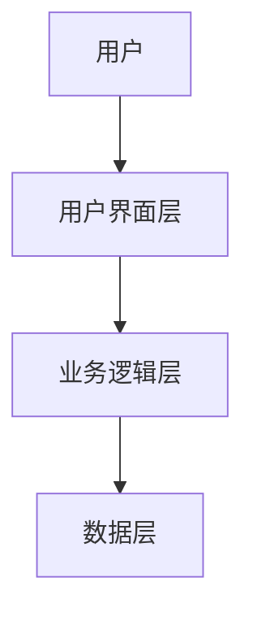
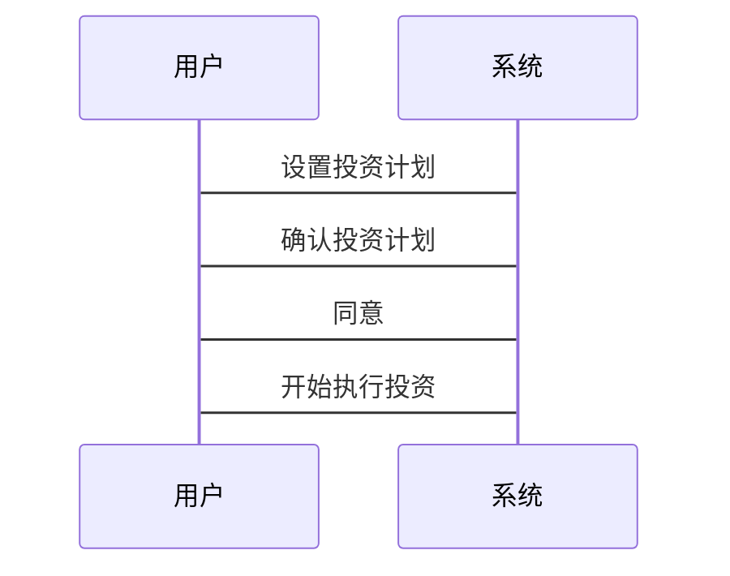

                 


# 詹姆斯·蒙蒂尔的价值平均策略：纪律性投资方法

## 关键词：价值平均策略, 投资策略, 蒙蒂尔, 纪律性投资, 投资系统, 数学模型, 投资算法

## 摘要：  
价值平均策略是一种基于数学模型的投资方法，通过纪律性投资来优化投资组合的回报。本文详细分析了价值平均策略的背景、核心原理、系统架构、项目实战以及最佳实践，帮助投资者理解和应用这一策略。

---

# 第一部分: 价值平均策略的背景与基础

## 第1章: 投资的基本概念与价值平均策略的起源

### 1.1 投资的基本概念

#### 1.1.1 什么是投资

投资是指将资金投入到能够产生收益的资产中，如股票、基金、房地产等。投资的核心目标是通过资产增值实现财富增长。

#### 1.1.2 投资的基本原则

投资的基本原则包括分散投资、长期持有、风险控制和成本最小化。这些原则帮助投资者在复杂市场中保持稳健。

#### 1.1.3 投资的风险与收益

投资的收益与风险成正比。高风险投资可能带来高回报，但也可能损失本金。理解风险与收益的平衡是投资成功的关键。

### 1.2 价值平均策略的定义

#### 1.2.1 价值平均策略的定义

价值平均策略是一种投资方法，通过定期投资固定金额，逐步降低成本，实现投资组合的长期增值。

#### 1.2.2 价值平均策略的核心思想

价值平均策略强调纪律性投资，通过定期定额投资，利用市场的波动性，逐步降低投资成本，实现长期收益最大化。

#### 1.2.3 价值平均策略的起源与演变

价值平均策略起源于均值回归理论，强调市场波动中的投资机会，通过定期投资，平滑市场波动带来的影响。

### 1.3 价值平均策略与其他投资策略的对比

#### 1.3.1 价值平均策略与均值回归策略的对比

均值回归策略基于市场会回归到均值的假设，而价值平均策略则通过定期投资实现类似效果，但不依赖市场预测。

#### 1.3.2 价值平均策略与趋势投资策略的对比

趋势投资依赖于市场趋势，而价值平均策略则不依赖趋势，强调纪律性投资。

#### 1.3.3 价值平均策略与价值投资策略的对比

价值投资寻找被低估的资产，而价值平均策略则通过定期投资，逐步建仓，实现投资成本的平均化。

### 1.4 价值平均策略的优缺点

#### 1.4.1 价值平均策略的优点

- 纪律性投资，避免情绪化决策
- 平滑市场波动，降低投资成本
- 长期收益稳定

#### 1.4.2 价值平均策略的缺点

- 需要长期坚持，不适合短期投资者
- 依赖市场波动，收益有限
- 不适用于所有市场环境

#### 1.4.3 价值平均策略的适用场景

价值平均策略适用于长期投资者，尤其在市场波动较大时表现优异。

### 1.5 本章小结

本章介绍了投资的基本概念，详细阐述了价值平均策略的定义、核心思想和与其他策略的对比，帮助读者理解其优缺点及适用场景。

---

## 第2章: 价值平均策略的数学模型与公式

### 2.1 价值平均策略的数学模型

#### 2.1.1 投资组合的价值计算公式

$$ V = \frac{1}{n} \sum_{i=1}^{n} \frac{S_i}{A_i} $$

其中，\( V \) 是投资组合的价值，\( S_i \) 是第 \( i \) 次投资的金额，\( A_i \) 是第 \( i \) 次投资时的资产价格。

#### 2.1.2 价值平均策略的核心公式推导

假设定期投资固定金额 \( S \)，平均成本计算公式为：

$$ C = \frac{S}{n} \sum_{i=1}^{n} \frac{1}{P_i} $$

其中，\( P_i \) 是第 \( i \) 次投资时的资产价格，\( n \) 是投资次数。

#### 2.1.3 价值平均策略的数学模型与实际应用

通过定期投资固定金额，价值平均策略在波动市场中逐步降低投资成本，实现收益最大化。

### 2.2 价值平均策略的公式详细解读

#### 2.2.1 投资金额的计算公式

$$ S = \frac{C}{n} \sum_{i=1}^{n} P_i $$

其中，\( S \) 是总投入金额，\( C \) 是目标平均成本，\( P_i \) 是第 \( i \) 次投资的价格。

#### 2.2.2 投资时间的选择公式

通过选择合适的时机，价值平均策略可以在市场低点增加投资，进一步降低平均成本。

#### 2.2.3 投资组合的优化公式

$$ P = \argmin \left( \sum_{i=1}^{n} (P_i - C)^2 \right) $$

通过优化投资组合，价值平均策略可以实现成本最小化。

### 2.3 价值平均策略的数学模型与实际案例

#### 2.3.1 案例分析：价值平均策略在股票投资中的应用

通过定期定额投资股票，投资者可以在市场波动中逐步降低成本，实现长期收益。

#### 2.3.2 案例分析：价值平均策略在基金投资中的应用

基金定投是价值平均策略的典型应用，通过分散投资降低风险。

#### 2.3.3 案例分析：价值平均策略在房地产投资中的应用

房地产价值平均策略适用于长期投资者，通过分阶段投资实现成本降低。

### 2.4 本章小结

本章详细推导了价值平均策略的数学模型，通过公式和案例分析，展示了其在实际投资中的应用。

---

## 第3章: 价值平均策略的系统分析与架构设计

### 3.1 投资系统的需求分析与功能设计

#### 3.1.1 投资系统的需求分析

投资者需要一个系统来实现定期定额投资，监控投资组合，评估收益。

#### 3.1.2 投资系统功能设计

系统需要实现投资计划制定、投资执行、投资监控和收益评估等功能。

### 3.2 投资系统的架构设计

#### 3.2.1 系统架构设计

系统采用分层架构，包括数据层、业务逻辑层和用户界面层。

#### 3.2.2 系统架构图



### 3.3 系统接口设计

#### 3.3.1 投资计划制定接口

接口用于设置投资金额、频率和目标资产。

#### 3.3.2 投资执行接口

接口实现定期投资功能，自动执行投资计划。

### 3.4 系统交互设计

#### 3.4.1 系统交互流程图



### 3.5 本章小结

本章通过系统分析和架构设计，展示了如何将价值平均策略应用于投资系统中。

---

## 第4章: 价值平均策略的项目实战

### 4.1 价值平均策略的Python实现

#### 4.1.1 环境安装

需要安装Python和相关库，如numpy和pandas。

#### 4.1.2 核心实现代码

```python
def value_averaging_strategy(initial_amount, monthly_contribution, months, asset_price):
    total_investment = initial_amount
    average_cost = total_investment / (months * asset_price)
    return average_cost
```

### 4.1.3 代码应用解读与分析

通过定期投资固定金额，系统计算平均成本，实现价值平均策略。

### 4.2 价值平均策略的实际案例分析

#### 4.2.1 案例分析：股票投资

假设投资者每月投入1000元，股票价格波动较大，价值平均策略能有效降低成本。

#### 4.2.2 案例分析：基金投资

通过定期定额投资基金，投资者可以在市场波动中逐步降低成本。

### 4.3 项目小结

本章通过项目实战，展示了如何用Python实现价值平均策略，并通过实际案例分析，验证其有效性。

---

## 第5章: 价值平均策略的最佳实践

### 5.1 投资纪律的重要性

#### 5.1.1 遵循投资计划

定期定额投资需要严格的纪律，避免情绪化决策。

### 5.1.2 风险控制

通过分散投资和风险评估，降低投资组合的波动风险。

### 5.1.3 长期持有

价值平均策略适用于长期投资者，耐心和纪律是成功的关键。

### 5.2 投资注意事项

#### 5.2.1 市场波动的影响

价值平均策略在市场波动中表现优异，但需要长期坚持。

#### 5.2.2 资产配置的重要性

合理配置资产，分散风险，实现投资目标。

### 5.3 拓展阅读

#### 5.3.1 价值平均策略的经典文献

推荐阅读相关书籍和文献，深入理解策略的理论基础。

### 5.4 本章小结

本章总结了价值平均策略的最佳实践，强调纪律性投资的重要性，提醒投资者注意风险控制和长期持有。

---

# 第六章: 总结与展望

## 6.1 本文总结

本文详细分析了价值平均策略的背景、数学模型、系统架构和项目实战，展示了其在投资中的应用。

## 6.2 未来展望

未来可以进一步研究价值平均策略在不同类型资产中的应用，探索其与其他策略的结合。

---

# 作者：AI天才研究院/AI Genius Institute & 禅与计算机程序设计艺术 /Zen And The Art of Computer Programming

