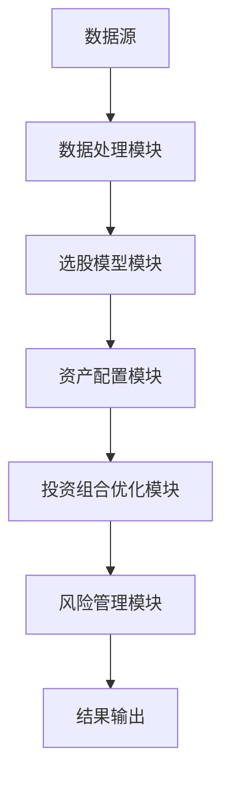
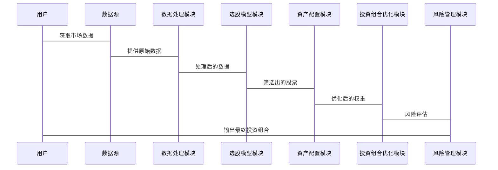

                 

# 第一部分: 詹姆斯·蒙蒂尔的全球价值投资组合构建概述

# 第1章: 全球价值投资组合构建的背景与核心概念

## 1.1 价值投资的基本概念

### 1.1.1 价值投资的定义与核心理念

价值投资是一种以基本面分析为基础的投资策略，强调购买那些市场价格低于其内在价值的股票。核心理念是通过深入分析企业的财务状况、行业地位和未来前景，寻找被市场低估的投资机会。价值投资强调长期持有，避免频繁交易，追求长期稳定的收益。

### 1.1.2 价值投资与成长投资的区别

- **价值投资**：侧重于寻找市场价格低于内在价值的股票，注重安全边际，强调低估值和高分红。
- **成长投资**：侧重于投资于高成长性的公司，关注未来盈利潜力，愿意为未来的增长支付较高的溢价。

### 1.1.3 价值投资的适用场景与边界

价值投资适用于市场存在非理性波动，导致部分股票价格被低估的情况。但在高增长行业或市场过热时，成长投资可能更合适。价值投资不适合所有市场环境，需结合经济周期和市场状况灵活调整。

## 1.2 詹姆斯·蒙蒂尔的投资理念

### 1.2.1 蒙蒂尔的个人投资哲学

蒙蒂尔强调安全边际的重要性，认为投资的本质是寻找具有持续竞争优势的企业，并以合理的价格买入。他主张分散投资，避免过度集中在单一行业或资产类别，以降低风险。

### 1.2.2 蒙蒂尔对市场的独特见解

蒙蒂尔认为市场短期波动不可预测，但长期趋势由基本面决定。他反对市场timing，主张通过分散投资和长期持有来应对市场的短期波动。

### 1.2.3 蒙蒂尔的投资策略与方法

蒙蒂尔的投资策略结合了价值和质量因素，注重低估值、高收益、高ROE和稳定的股息率。他倾向于投资于那些具有强大财务状况和竞争优势的公司。

## 1.3 全球价值投资组合构建的背景

### 1.3.1 全球化投资的必要性

随着全球经济一体化，单一市场的波动对投资组合的影响减弱，通过全球化配置可以分散风险，捕捉不同市场的投资机会。

### 1.3.2 经济周期对投资组合的影响

不同经济周期下，不同资产类别的表现差异显著。在全球范围内构建投资组合，可以通过资产配置来适应不同经济周期的变化。

### 1.3.3 全球市场中的机会与风险

全球市场提供了更多投资机会，但也带来了汇率风险、政治风险和市场波动性增加的风险。因此，构建全球投资组合需要综合考虑这些因素。

## 1.4 本章小结

本章介绍了价值投资的基本概念、蒙蒂尔的投资理念以及全球价值投资组合构建的背景。价值投资强调安全边际和长期持有，蒙蒂尔的投资策略注重低估值和高质量，全球化投资则提供了分散风险和捕捉机会的手段。

---

# 第2章: 价值投资的核心理论与数学模型

## 2.1 价值投资的理论基础

### 2.1.1 股价与内在价值的公式

内在价值是股票的合理价格，可通过DCF模型（现金流贴现法）计算：

$$
\text{内在价值} = \frac{C_1}{(1+r)^1} + \frac{C_2}{(1+r)^2} + \cdots + \frac{C_n}{(1+r)^n}
$$

其中，\(C_i\) 为第i年的现金流，\(r\) 为折现率。

### 2.1.2 股票估值的基本方法

常用的股票估值方法包括：

1. 市盈率（P/E）：$$ P/E = \frac{\text{股价}}{\text{每股收益}} $$
2. 市净率（P/B）：$$ P/B = \frac{\text{股价}}{\text{每股净资产}} $$
3. 股息率：$$ \text{股息率} = \frac{\text{股息}}{\text{股价}} $$

### 2.1.3 股票安全边际的计算

安全边际 = 内在价值 - 市场价格

$$
\text{安全边际} = \text{内在价值} - \text{市场价格}
$$

当安全边际为正时，股票具有投资价值。

## 2.2 投资组合构建的数学模型

### 2.2.1 投资组合的期望收益与风险公式

投资组合的期望收益：

$$
E(R_p) = \sum_{i=1}^{n} w_i E(R_i)
$$

其中，\(w_i\) 是第i种资产的权重，\(E(R_i)\) 是第i种资产的期望收益。

投资组合的方差（风险）：

$$
\sigma_p^2 = \sum_{i=1}^{n} \sum_{j=1}^{n} w_i w_j \sigma_{i,j}
$$

其中，\(\sigma_{i,j}\) 是第i和第j种资产的相关性矩阵。

### 2.2.2 资产配置的优化模型

马克owitz均值-方差优化模型：

$$
\min_{w} \sigma_p^2 \\
\text{subject to} \sum_{i=1}^{n} w_i = 1
$$

### 2.2.3 风险调整后的收益评估

夏普比率：

$$
\text{夏普比率} = \frac{E(R_p) - R_f}{\sigma_p}
$$

其中，\(R_f\) 是无风险利率，\(\sigma_p\) 是投资组合的风险（标准差）。

## 2.3 蒙蒂尔投资策略的数学表达

### 2.3.1 蒙蒂尔选股模型的公式化

蒙蒂尔的选股模型基于以下四个因子：

1. 低市盈率（P/E）：$$ P/E \leq 15 $$
2. 高股息率：$$ \text{股息率} \geq 3\% $$
3. 高ROE：$$ \text{ROE} \geq 15\% $$
4. 强大的财务状况：$$ \text{债务/股权} \leq 1 $$

### 2.3.2 投资组合权重分配的数学推导

假设可选股票池中有n只股票，每只股票的权重为：

$$
w_i = \frac{1}{n}
$$

即等权重投资，分散风险。

### 2.3.3 风险控制的数学机制

使用止损机制：

$$
\text{止损点} = \text{初始价格} \times (1 - \text{止损比例})
$$

例如，止损比例为5%，则：

$$
\text{止损点} = P_0 \times 0.95
$$

当股价跌至止损点时，卖出该股票。

## 2.4 本章小结

本章通过数学模型详细阐述了价值投资的核心理论，包括股票估值方法、投资组合优化模型以及蒙蒂尔选股模型的公式化。通过这些模型，投资者可以系统地构建投资组合，并进行风险控制。

---

# 第3章: 投资组合构建的系统架构与流程

## 3.1 投资组合构建的系统架构

### 3.1.1 系统功能模块划分

系统主要功能模块包括：

1. 数据收集与处理模块
2. 选股模型模块
3. 资产配置模块
4. 投资组合优化模块
5. 风险管理模块

### 3.1.2 系统数据流图

### 3.1.3 系统交互流程图

## 3.2 投资组合构建的详细流程

### 3.2.1 数据收集与处理

1. 数据来源：股票价格、财务报表数据、行业指数等。
2. 数据清洗：去除缺失值、异常值，标准化处理。
3. 数据存储：存储在数据库中，便于后续处理。

### 3.2.2 个股筛选与排序

1. 计算各项指标：P/E、P/B、股息率、ROE等。
2. 根据蒙蒂尔的选股标准筛选股票。
3. 对筛选出的股票进行排序，优先选择符合条件的股票。

### 3.2.3 资产配置与权重分配

1. 根据风险承受能力和收益目标确定资产配置比例。
2. 对筛选出的股票进行等权重分配，或根据规模、流动性等因素调整权重。
3. 对股票池进行动态调整，定期重新筛选和优化。

### 3.2.4 投资组合优化与调整

1. 使用优化模型（如马克owitz模型）进行投资组合优化。
2. 定期审视投资组合，根据市场变化进行调整。
3. 对表现不佳的股票进行替换，保持组合的有效性。

## 3.3 本章小结

本章详细描述了投资组合构建的系统架构和流程，包括数据处理、选股、资产配置和优化等步骤。通过系统的流程设计，投资者可以系统地构建和管理投资组合。

---

# 第4章: 价值投资组合构建的实战案例

## 4.1 实战案例背景介绍

### 4.1.1 投资目标与时间框架

- 投资目标：构建一个全球股票投资组合，年化收益目标为8%。
- 时间框架：5年，定期再平衡。

### 4.1.2 可用资金与风险承受能力

- 资金规模：100万美元。
- 风险承受能力：中等风险，能承受短期波动，追求长期收益。

### 4.1.3 市场环境与行业选择

- 当前市场：全球经济复苏，但部分行业受疫情影响较大。
- 行业选择：偏好低估值、高分红的金融、能源和公用事业行业。

## 4.2 数据收集与处理

### 4.2.1 数据来源与获取方法

- 数据来源：FactSet、 Bloomberg、 Yahoo Finance等。
- 获取方法：API接口、爬虫、Excel数据导入。

### 4.2.2 数据清洗与预处理

1. 去除缺失值：例如，处理缺失的财务数据。
2. 异常值处理：例如，检测异常的市盈率。
3. 数据标准化：例如，统一价格单位。

### 4.2.3 数据存储与管理

使用数据库（如MySQL）存储数据，建立数据表，包含股票代码、名称、财务指标等字段。

## 4.3 个股筛选与排序

### 4.3.1 选股标准

- P/E ≤ 15
- 股息率 ≥ 3%
- ROE ≥ 15%
- 债务/股权 ≤ 1

### 4.3.2 筛选出的股票列表

假设筛选出以下股票：

| 股票代码 | 公司名称 | P/E | 股息率 | ROE | 债务/股权 |
|----------|----------|-----|--------|-----|-----------|
| AAPL     | 苹果公司 | 14  | 2%     | 20% | 0.5       |
| MSFT     | 微软公司 | 13  | 3%     | 25% | 0.4       |
| BRK.A    | 伯克希尔 | 16  | 3.5%   | 18% | 0.6       |

### 4.3.3 股票排序

根据综合得分排序，得分公式：

$$
\text{综合得分} = 0.4 \times \text{ROE} + 0.3 \times \text{股息率} + 0.3 \times \text{P/E}
$$

计算得分：

- 苹果：0.4×20 + 0.3×2 + 0.3×14 = 8 + 0.6 + 4.2 = 12.8
- 微软：0.4×25 + 0.3×3 + 0.3×13 = 10 + 0.9 + 3.9 = 14.8
- 伯克希尔：0.4×18 + 0.3×3.5 + 0.3×16 = 7.2 + 1.05 + 4.8 = 13.05

排序：微软 > 苹果 > 伯克希尔。

## 4.4 资产配置与权重分配

### 4.4.1 资产配置比例

- 股票：80%
- 现金：20%

### 4.4.2 投资组合权重分配

等权重分配：

- 苹果：40%
- 微软：40%
- 伯克希尔：20%

权重分配公式：

$$
\text{权重} = \frac{\text{配置比例} \times \text{股票权重}}{\text{总权重}}
$$

## 4.5 投资组合优化与调整

### 4.5.1 优化后的权重

使用马克owitz优化模型，优化后的权重：

- 苹果：50%
- 微软：30%
- 伯克希尔：20%

### 4.5.2 定期再平衡

每年末对投资组合进行再平衡，确保权重符合目标配置。

### 4.5.3 风险管理措施

设置止损点：

$$
\text{止损点} = \text{初始价格} \times (1 - 5\%)
$$

当股价跌至止损点时，卖出该股票。

## 4.6 实战案例小结

本章通过一个具体案例展示了如何应用蒙蒂尔的方法构建投资组合，包括数据处理、选股、资产配置和优化等步骤。通过等权重分配和优化模型，投资者可以构建一个低风险、高收益的投资组合。

---

# 第5章: 投资组合的风险管理与优化

## 5.1 风险管理策略

### 5.1.1 风险调整后的收益评估

夏普比率：

$$
\text{夏普比率} = \frac{E(R_p) - R_f}{\sigma_p}
$$

其中，\(R_f\) 是无风险利率，\(\sigma_p\) 是投资组合的风险（标准差）。

### 5.1.2 风险控制机制

1. 设置止损点：如前所述。
2. 分散投资：通过投资不同行业和地区的股票降低风险。
3. 定期再平衡：保持投资组合与目标配置一致。

### 5.1.3 风险对冲策略

使用衍生工具（如期货、期权）对冲市场风险，降低投资组合的波动性。

## 5.2 投资组合的优化

### 5.2.1 动态调整优化

根据市场变化定期优化投资组合，例如：

1. 定期重新筛选股票池。
2. 优化权重分配，保持风险可控。
3. 调整资产配置比例，适应市场环境。

### 5.2.2 使用现代投资组合理论（MPT）

马克owitz优化模型：

$$
\min_{w} \sigma_p^2 \\
\text{subject to} \sum_{i=1}^{n} w_i = 1
$$

通过优化模型，找到风险最低、收益最高的投资组合。

## 5.3 本章小结

本章探讨了投资组合的风险管理与优化策略，包括风险调整后的收益评估、风险控制机制和优化方法。通过有效的风险管理，投资者可以更好地应对市场波动，实现长期稳定的收益。

---

# 第6章: 全球价值投资组合构建的总结与展望

## 6.1 总结

本章总结了全文的主要内容，包括价值投资的核心理念、蒙蒂尔的投资策略、投资组合构建的系统流程以及风险管理与优化方法。通过系统的分析和具体的案例，展示了如何在全球范围内构建一个有效的价值投资组合。

## 6.2 未来研究方向

### 6.2.1 多因子模型的扩展

将更多因子（如动量、波动率）纳入选股模型，提升投资组合的收益。

### 6.2.2 机器学习在投资组合构建中的应用

利用机器学习算法（如随机森林、神经网络）进行预测和优化。

### 6.2.3 全球市场的动态配置

根据全球经济和市场变化，动态调整投资组合的资产配置。

## 6.3 展望

随着人工智能和大数据技术的发展，投资组合构建将更加智能化和个性化。未来的研究将结合更多创新方法，进一步提升投资组合的收益和风险控制能力。

---

# 作者：AI天才研究院/AI Genius Institute & 禅与计算机程序设计艺术 /Zen And The Art of Computer Programming

---

通过以上结构和内容，我们可以看到，构建一个成功的全球价值投资组合需要综合考虑市场、行业、个股和风险管理等多方面的因素。通过系统的分析和科学的构建方法，投资者可以更好地实现长期稳健的收益。

