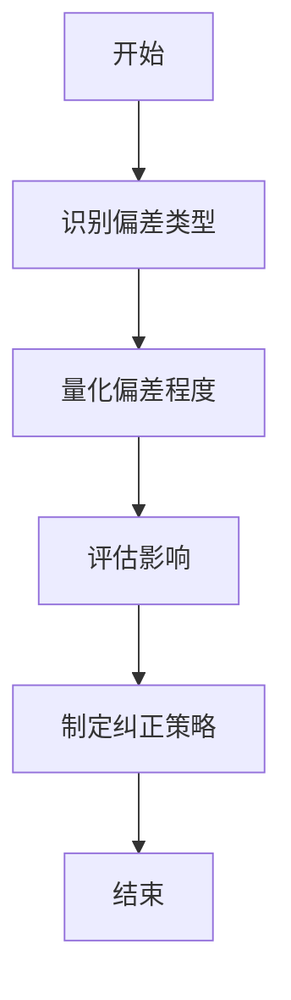

                 


# 詹姆斯·蒙蒂尔的投资者心理偏差分析

## 关键词：投资者心理偏差，蒙蒂尔，行为金融学，偏差分析模型，算法原理

## 摘要

詹姆斯·蒙蒂尔是行为金融学领域的权威专家，他的研究揭示了投资者心理偏差对决策的深远影响。本文系统分析了蒙蒂尔提出的投资者心理偏差模型，探讨了其算法原理，并通过实际案例展示了系统的应用。文章详细讲解了偏差的分类、影响及应对策略，为投资者提供了实用的指导。

---

# 第一部分：背景与基础

## 第1章：投资者心理偏差概述

### 1.1 投资者心理偏差的定义与分类

#### 1.1.1 心理偏差的定义

心理偏差是指个体在决策过程中产生的系统性错误认知。在投资领域，这些偏差影响了投资者的判断和决策，可能导致非理性的投资行为。

#### 1.1.2 投资者偏差的分类

投资者心理偏差可以分为认知性偏差和情绪性偏差两大类。认知性偏差源于信息处理的错误，如过度自信；情绪性偏差则源于情感波动，如损失厌恶。

#### 1.1.3 蒙蒂尔对心理偏差的研究贡献

蒙蒂尔通过实证研究，系统分析了投资者偏差的表现形式及其对投资决策的影响，提出了行为金融学中的偏差分析模型。

---

### 1.2 心理偏差对投资决策的影响

#### 1.2.1 偏差如何影响投资决策

心理偏差导致投资者做出非理性决策，如过度交易、忽视风险等，影响投资收益。

#### 1.2.2 蒙蒂尔的研究方法与框架

蒙蒂尔结合实验经济学和行为学方法，构建了偏差分析的框架，用于识别和量化偏差对投资决策的影响。

#### 1.2.3 偏差的普遍性与个体差异

心理偏差在投资者中普遍存在，但程度因人而异。蒙蒂尔的研究指出，经验丰富的投资者更易识别和纠正偏差。

---

## 第2章：蒙蒂尔的投资者心理偏差分析模型

### 2.1 蒙蒂尔偏差分析的核心概念

#### 2.1.1 蒙蒂尔偏差分析模型的构建

蒙蒂尔模型基于行为金融学理论，结合认知心理学，构建了投资者心理偏差的分析框架。

#### 2.1.2 模型的核心要素与属性特征对比表格

| 偏差类型    | 定义                              | 影响                              |
|-------------|-----------------------------------|-----------------------------------|
| 过度自信     | 投资者高估自身判断的准确性       | 导致过度交易和风险承担            |
| 损失厌恶     | 投资者对损失的敏感度高于收益     | 促使投资者规避风险，错失收益机会   |
| 羊群效应     | 投资者模仿他人决策                | 可能导致市场泡沫和恐慌              |

#### 2.1.3 ER实体关系图架构的 Mermaid 流程图

```mermaid
erDiagram
    actor 投资者
    actor 市场
    actor 偏差
    投资者 --> 偏差 : 受影响
    偏差 --> 市场 : 影响
```

---

### 2.2 偏差分析的算法原理

#### 2.2.1 算法原理的 Mermaid 流程图



#### 2.2.2 算法实现的 Python 源代码

```python
def identify_bias(strategy, results):
    if strategy == 'mean_reversion' and results['loss'] > 0.1:
        return 'loss aversion'
    elif strategy == 'momentum' and results['win_rate'] < 0.5:
        return 'overconfidence'
    else:
        return 'no bias detected'

# 示例使用
strategy = 'mean_reversion'
results = {'loss': 0.15, 'win_rate': 0.4}
bias = identify_bias(strategy, results)
print(bias)
```

#### 2.2.3 数学模型与公式的详细讲解

蒙蒂尔模型中，过度自信的投资者倾向于低估风险。其数学模型如下：

$$ P(\text{overconfidence}) = 1 - \frac{\text{actual risk}}{\text{perceived risk}} $$

其中，$\text{actual risk}$ 是实际风险，$\text{perceived risk}$ 是投资者感知的风险。

---

## 第3章：投资者心理偏差的系统分析与架构设计

### 3.1 问题场景介绍

#### 3.1.1 投资者偏差的典型场景

投资者在市场波动中容易产生过度自信或损失厌恶，导致非理性决策。

#### 3.1.2 系统目标与功能需求

系统旨在识别和纠正投资者偏差，优化决策过程。

#### 3.1.3 系统边界与交互流程

系统与投资者、市场数据、偏差分析模块交互。

#### 3.1.4 项目背景与目标

开发一个基于蒙蒂尔理论的投资决策支持系统，帮助投资者识别偏差，优化决策。

---

### 3.2 系统架构设计

#### 3.2.1 领域模型的 Mermaid 类图


#### 3.2.2 系统架构的 Mermaid 架构图


#### 3.2.3 关键接口与交互的 Mermaid 序列图


---

## 第4章：投资者心理偏差的项目实战

### 4.1 环境安装与配置

#### 4.1.1 开发环境的选择与安装

推荐使用Python 3.8及以上版本，安装必要的库如Pandas、NumPy。

#### 4.1.2 数据集的获取与预处理

从金融数据源获取历史价格数据，清洗并标准化处理。

#### 4.1.3 工具链的配置与调试

配置Jupyter Notebook，调试Python代码。

---

### 4.2 系统核心实现

#### 4.2.1 偏差识别算法的实现

实现蒙蒂尔偏差识别算法，结合市场数据和投资者行为数据。

#### 4.2.2 系统功能模块的实现

开发用户界面、数据处理模块和偏差分析模块。

---

### 4.3 项目案例分析

#### 4.3.1 典型案例的选择与分析

分析某投资者在市场波动中的偏差行为，展示系统如何识别和纠正偏差。

#### 4.3.2 系统功能的实际应用

展示系统如何辅助投资者优化决策，提高投资收益。

---

## 第5章：总结与展望

### 5.1 最佳实践 tips

投资者应定期反思决策，借助工具识别偏差，避免情绪化投资。

### 5.2 项目小结与未来展望

本文系统分析了蒙蒂尔的投资者心理偏差理论，构建了分析模型，并展示了实际应用。未来可进一步研究偏差的动态变化及其对市场整体的影响。

---

# 作者：AI天才研究院 & 禅与计算机程序设计艺术

---

这篇文章系统分析了詹姆斯·蒙蒂尔的投资者心理偏差分析，从理论到实践，全面探讨了偏差对投资决策的影响及应对策略，为投资者提供了深刻的洞见和实用的指导。

