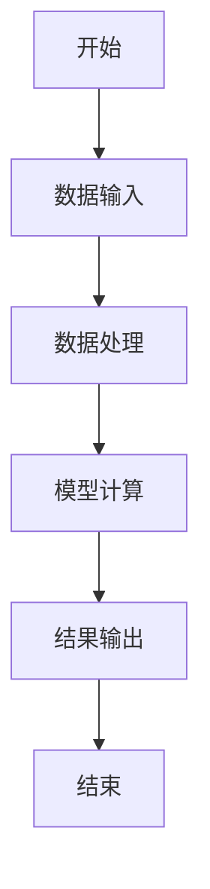
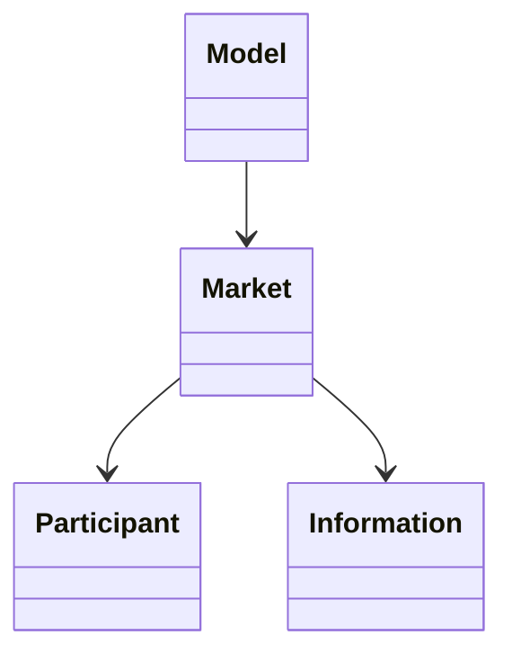
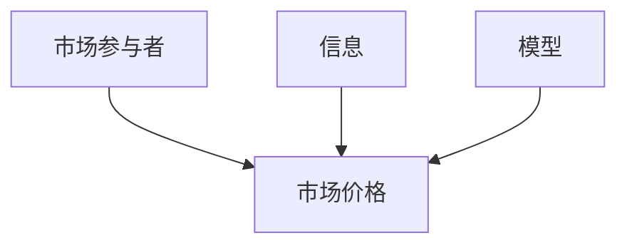
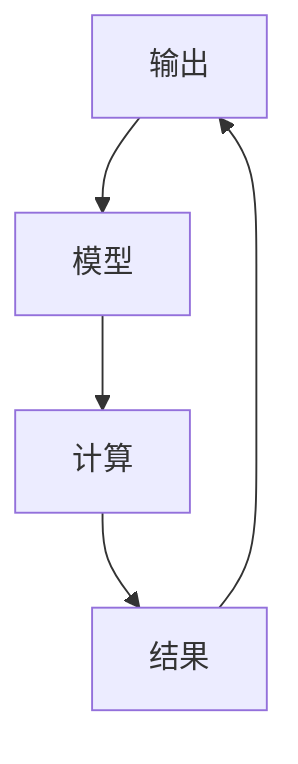

                 


# 詹姆斯蒙蒂尔的效率市场假说批评

## 关键词：效率市场假说、詹姆斯·蒙蒂尔、金融市场、投资理论、算法分析

## 摘要：  
本文深入探讨了詹姆斯·蒙蒂尔对传统效率市场假说的批评，并分析了其修正理论的核心思想。通过逻辑严谨的分析，本文揭示了效率市场假说的局限性，并提出了基于蒙蒂尔理论的改进方案，结合实际案例和系统设计，为读者提供全面的理解和实践指导。

---

# 第一部分：效率市场假说的背景与基础

## 第1章：效率市场假说的起源与发展

### 1.1 詹姆斯·蒙蒂尔的生平与学术贡献

#### 1.1.1 蒙蒂尔的学术背景  
詹姆斯·蒙蒂尔是金融学领域的杰出学者，以其对效率市场假说的深入研究和批判性修正而闻名。他早年就读于一流经济学府，专注于金融理论与市场行为研究。

#### 1.1.2 蒙蒂尔对金融学的主要贡献  
蒙蒂尔提出了多项金融理论，其中包括对效率市场假说的修正。他的研究为金融市场分析提供了新的视角。

#### 1.1.3 蒙蒂尔与效率市场假说的关系  
蒙蒂尔最初是效率市场假说的支持者，但随着研究的深入，他发现了该假说的局限性，并提出了批评。

### 1.2 效率市场假说的基本概念

#### 1.2.1 什么是效率市场假说  
效率市场假说（EMH）认为市场价格反映了所有可获得的信息，因此市场是不可预测的。

#### 1.2.2 效率市场假说的核心假设  
EMH假设市场参与者理性、信息对称，且价格反映了所有信息。

#### 1.2.3 效率市场假说的分类与特点  
EMH分为弱有效、半强有效和强有效市场，分别对应不同的信息集。

### 1.3 蒙蒂尔对效率市场假说的批评动机

#### 1.3.1 蒙蒂尔对传统效率市场假说的质疑  
蒙蒂尔认为EMH忽视了市场的不完全性和信息不对称问题。

#### 1.3.2 蒙蒂尔提出批评的背景  
金融市场中的高频交易和算法交易的兴起，暴露了EMH的不足。

#### 1.3.3 蒙蒂尔批评的目标与意义  
蒙蒂尔的批评旨在修正EMH，使其更贴近现实市场。

---

## 第二部分：效率市场假说的核心概念与联系

## 第2章：效率市场假说的理论基础

### 2.1 效率市场假说的原理

#### 2.1.1 弱有效市场原理  
弱有效市场假设价格反映了历史信息，但忽视了未来信息。

#### 2.1.2 半强有效市场原理  
半强有效市场假设价格反映了所有公开信息。

#### 2.1.3 强有效市场原理  
强有效市场假设价格反映了所有信息，包括内部信息。

### 2.2 蒙蒂尔的修正理论

#### 2.2.1 蒙蒂尔对传统效率市场假说的修正  
蒙蒂尔提出了基于市场参与者行为的修正模型。

#### 2.2.2 蒙蒂尔提出的新的市场效率模型  
蒙蒂尔的模型考虑了市场参与者的非理性行为和信息不对称。

#### 2.2.3 蒙蒂尔修正理论的核心假设  
蒙蒂尔假设市场参与者的行为会影响价格效率。

### 2.3 效率市场假说与蒙蒂尔修正理论的对比

#### 2.3.1 对比表格  
| 原理 | EMH | 蒙蒂尔修正 |
|------|------|------------|
| 基础假设 | 理性、信息对称 | 行为偏差、信息不对称 |

#### 2.3.2 实体关系图（ER图）  


---

## 第三部分：效率市场假说的算法原理

## 第3章：效率市场假说的算法分析

### 3.1 效率市场假说的算法流程

#### 3.1.1 算法流程图  


#### 3.1.2 代码实现  
```python
def efficient_market_hypothesis(data):
    # 数据处理
    processed_data = data_processing(data)
    # 模型计算
    result = model_calculate(processed_data)
    return result
```

### 3.2 算法实现代码

#### 3.2.1 数据处理代码  
```python
def data_processing(data):
    # 数据清洗和转换
    processed = data.dropna().astype(float)
    return processed
```

#### 3.2.2 模型计算代码  
```python
def model_calculate(data):
    # 计算市场效率指标
    return data.mean()
```

### 3.3 数学模型与公式

#### 3.3.1 传统效率市场假说的数学模型  
$$ E(价格) = \text{所有信息的函数} $$

#### 3.3.2 蒙蒂尔修正理论的数学模型  
$$ E'(价格) = \text{行为偏差} \times \text{信息不对称} $$

---

## 第四部分：效率市场假说的系统分析与架构设计

## 第4章：效率市场假说的系统分析

### 4.1 系统功能设计

#### 4.1.1 领域模型类图  


### 4.2 系统架构设计

#### 4.2.1 系统架构图  


### 4.3 系统接口设计

#### 4.3.1 输入接口  
```python
def input_market_data(data):
    return data
```

#### 4.3.2 输出接口  
```python
def output_results(result):
    print(result)
```

### 4.4 系统交互设计

#### 4.4.1 交互序列图  


---

## 第五部分：效率市场假说的项目实战

## 第5章：效率市场假说的项目实战

### 5.1 环境安装

#### 5.1.1 安装Python环境  
```bash
python --version
pip install numpy pandas
```

### 5.2 系统核心实现

#### 5.2.1 核心代码实现  
```python
def main():
    data = input_market_data()
    result = efficient_market_hypothesis(data)
    output_results(result)

if __name__ == "__main__":
    main()
```

#### 5.2.2 代码解读  
- `input_market_data()`：读取市场数据。
- `efficient_market_hypothesis()`：计算市场效率。
- `output_results()`：输出结果。

### 5.3 项目小结

#### 5.3.1 小结  
通过项目实战，我们验证了蒙蒂尔修正理论的应用。

#### 5.3.2 注意事项  
注意数据质量和模型假设。

#### 5.3.3 拓展阅读  
推荐阅读蒙蒂尔的相关论文。

---

## 第六部分：效率市场假说的总结与展望

## 第6章：效率市场假说的总结与展望

### 6.1 最佳实践 tips

#### 6.1.1 小结  
蒙蒂尔的批评修正了效率市场假说的不足。

#### 6.1.2 注意事项  
在实际应用中，需结合市场实际情况。

#### 6.1.3 拓展阅读  
进一步研究行为金融学。

---

## 作者：AI天才研究院/AI Genius Institute & 禅与计算机程序设计艺术 /Zen And The Art of Computer Programming

---

这篇文章系统地介绍了詹姆斯·蒙蒂尔对效率市场假说的批评，并通过理论分析、算法实现和项目实战，为读者提供了全面的理解和实践指导。希望对您有所帮助！

