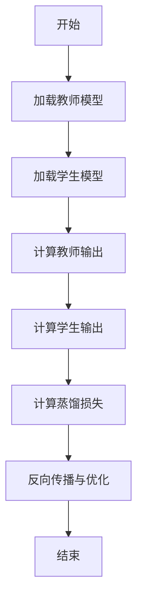
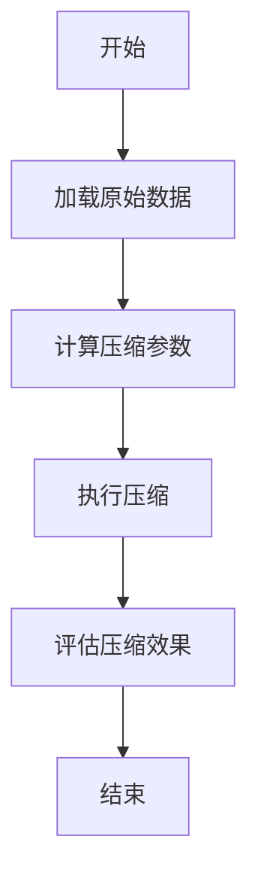
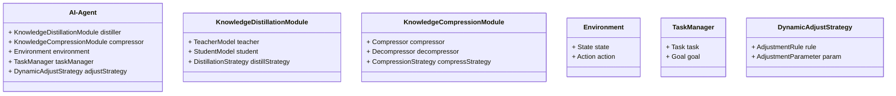
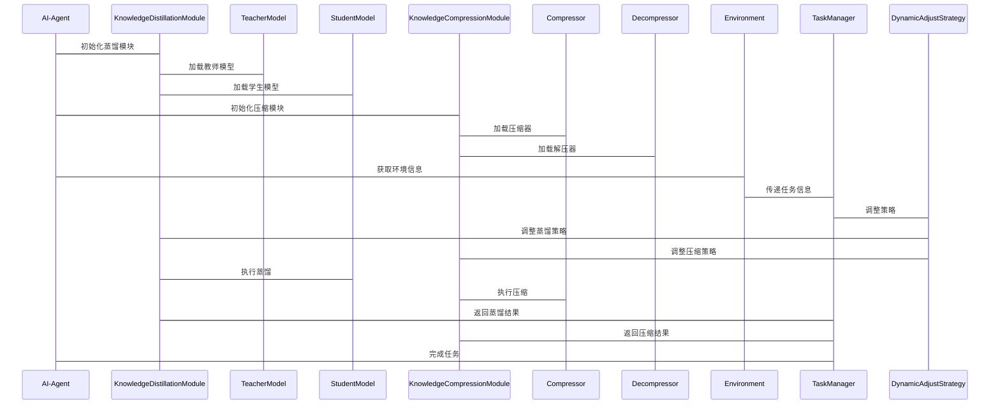

                 


# 设计AI Agent的动态知识蒸馏与压缩

## 关键词：
AI Agent, 知识蒸馏, 知识压缩, 动态知识, 蒸馏算法, 压缩算法, 系统架构

## 摘要：
本文将详细探讨如何设计AI Agent的动态知识蒸馏与压缩系统。首先，我们将介绍AI Agent的基本概念和动态知识蒸馏与压缩的重要性。接着，我们将深入分析知识蒸馏与压缩的基础知识，包括它们的定义、类型和应用场景。然后，我们将详细讲解动态知识蒸馏与压缩的核心概念、算法原理和系统架构设计。最后，我们通过具体的项目实战，展示如何实现动态知识蒸馏与压缩，并总结最佳实践和未来发展方向。

---

## 第1章: AI Agent与动态知识蒸馏与压缩概述

### 1.1 AI Agent的基本概念
#### 1.1.1 AI Agent的定义
AI Agent（人工智能代理）是指能够感知环境、自主决策并执行任务的智能实体。它可以是一个软件程序、机器人或其他智能系统，其核心目标是通过与环境的交互来实现特定目标。

#### 1.1.2 AI Agent的核心功能
AI Agent的核心功能包括：
- 感知环境：通过传感器或其他输入方式获取环境信息。
- 分析与决策：基于获取的信息进行分析和推理，制定决策。
- 行动：根据决策执行操作，影响环境或输出结果。
- 学习与优化：通过经验或外部数据不断优化自身性能。

#### 1.1.3 动态知识蒸馏与压缩的背景与意义
在AI Agent的设计中，知识的获取和管理是关键挑战。动态知识蒸馏与压缩技术可以帮助AI Agent在有限的资源条件下，高效地处理和存储知识，从而提升其性能和适应性。动态知识蒸馏与压缩技术的意义在于：
- 提高计算效率：通过压缩知识，减少存储和计算资源的消耗。
- 实时适应：动态调整知识蒸馏与压缩策略，以应对不断变化的环境。
- 增强可解释性：通过蒸馏技术，使AI Agent的知识更加透明和易于解释。

### 1.2 知识蒸馏与压缩的背景
#### 1.2.1 知识蒸馏的定义与作用
知识蒸馏（Knowledge Distillation）是指将复杂模型（教师模型）的知识迁移到简单模型（学生模型）的过程。其作用包括：
- 简化模型：将复杂的模型压缩成更小、更高效的模型。
- 提高可解释性：通过蒸馏过程，使模型的行为更加透明。
- 实时适应：动态蒸馏可以帮助模型快速适应新环境。

#### 1.2.2 知识压缩的定义与作用
知识压缩（Knowledge Compression）是指将大量数据或复杂知识进行精简和结构化的过程。其作用包括：
- 减少存储空间：通过压缩，降低知识存储的体积。
- 提高处理效率：压缩后的知识可以更快地被处理和检索。
- 增强适应性：通过动态压缩，模型可以快速调整知识结构以适应新任务。

#### 1.2.3 动态知识蒸馏与压缩的必要性
动态知识蒸馏与压缩的必要性体现在：
- 环境的动态变化：AI Agent需要在不断变化的环境中实时调整知识结构。
- 资源的有限性：AI Agent通常需要在有限的计算资源下运行，动态蒸馏与压缩可以优化资源利用。
- 知识的更新：AI Agent需要不断更新知识库，动态蒸馏与压缩可以帮助快速整合新知识。

### 1.3 本书的核心内容与目标
#### 1.3.1 本书的研究问题
本书主要研究如何设计AI Agent的动态知识蒸馏与压缩系统，包括以下几个问题：
- 如何高效地从复杂模型中提取知识？
- 如何动态调整蒸馏与压缩策略以适应环境变化？
- 如何在有限资源条件下实现高效的knowledge management？

#### 1.3.2 本书的目标与结构
本书的目标是通过系统化的方法，设计一个高效、动态的AI Agent知识蒸馏与压缩框架。本书结构包括：
- 引言：介绍AI Agent和动态知识蒸馏与压缩的基本概念。
- 基础知识：详细讲解知识蒸馏与压缩的核心原理。
- 核心概念：分析动态知识蒸馏与压缩的关键技术。
- 算法原理：展示蒸馏与压缩算法的数学模型和实现步骤。
- 系统架构：设计AI Agent的系统架构和接口。
- 项目实战：通过具体案例展示动态知识蒸馏与压缩的实现。
- 最佳实践：总结经验和未来发展方向。

#### 1.3.3 本书的创新点
本书的创新点在于：
- 提出了动态知识蒸馏与压缩的新方法，结合了实时性和高效性。
- 提出了AI Agent系统架构的新设计，优化了知识管理的流程。
- 提供了完整的实现代码和案例分析，方便读者理解和实践。

---

## 第2章: 知识蒸馏与压缩的基础知识

### 2.1 知识蒸馏的基本原理
#### 2.1.1 知识蒸馏的定义
知识蒸馏是一种将复杂模型的知识迁移到简单模型的技术。其核心思想是通过教师模型（Teacher）指导学生模型（Student）的学习过程。

#### 2.1.2 知识蒸馏的关键步骤
知识蒸馏的关键步骤包括：
1. **教师模型训练**：首先训练一个复杂的教师模型，使其在任务上达到较高的性能。
2. **蒸馏过程设计**：设计蒸馏策略，将教师模型的知识迁移到学生模型。
3. **学生模型优化**：通过蒸馏过程不断优化学生模型的性能。

#### 2.1.3 知识蒸馏的主要方法
知识蒸馏的主要方法包括：
- **软蒸馏**：通过概率分布迁移知识。
- **硬蒸馏**：直接迁移标签或决策。
- **混合蒸馏**：结合软硬蒸馏的优点。

### 2.2 知识压缩的基本原理
#### 2.2.1 知识压缩的定义
知识压缩是指将大量复杂的数据或知识进行精简和结构化的过程。

#### 2.2.2 知识压缩的主要技术
知识压缩的主要技术包括：
- **特征提取**：通过提取关键特征减少数据维度。
- **聚类分析**：将相似的知识聚类，减少冗余信息。
- **量化压缩**：通过量化方法降低数据的表示精度。

#### 2.2.3 知识压缩的应用场景
知识压缩的应用场景包括：
- **边缘计算**：在资源有限的边缘设备上运行AI模型。
- **实时处理**：需要快速响应的实时任务。
- **数据存储**：需要高效存储和检索的大规模数据。

### 2.3 动态知识蒸馏与压缩的对比
#### 2.3.1 知识蒸馏与压缩的区别
知识蒸馏与压缩的区别在于：
- **蒸馏**：关注知识的迁移和共享。
- **压缩**：关注数据的精简和高效存储。

#### 2.3.2 动态知识蒸馏与压缩的联系
动态知识蒸馏与压缩的联系体现在：
- **动态调整**：两者都需要根据环境变化进行动态调整。
- **资源优化**：两者都旨在优化资源的利用效率。

#### 2.3.3 动态知识蒸馏与压缩的优势
动态知识蒸馏与压缩的优势包括：
- **实时适应**：能够快速响应环境变化。
- **资源高效利用**：在有限资源下实现高性能。
- **灵活性**：能够适应多种任务和场景。

---

## 第3章: 动态知识蒸馏的原理与实现

### 3.1 动态知识蒸馏的定义与特点
#### 3.1.1 动态知识蒸馏的定义
动态知识蒸馏是指在实时环境中，根据环境变化动态调整蒸馏策略的过程。

#### 3.1.2 动态知识蒸馏的核心特点
动态知识蒸馏的核心特点包括：
- **实时性**：能够实时调整蒸馏策略。
- **灵活性**：适应多种任务和环境。
- **高效性**：在有限资源下实现高性能。

### 3.2 动态知识蒸馏的数学模型
#### 3.2.1 蒸馏过程的数学表达
蒸馏过程可以用以下数学模型表示：
$$ L_{\text{distill}} = \alpha L_{\text{student}} + (1-\alpha) L_{\text{teacher}} $$
其中，$\alpha$ 是蒸馏系数，$L_{\text{student}}$ 是学生模型的损失，$L_{\text{teacher}}$ 是教师模型的损失。

#### 3.2.2 动态调整的数学模型
动态调整的数学模型可以表示为：
$$ \alpha(t) = \alpha_0 + \beta t $$
其中，$\alpha_0$ 是初始系数，$\beta$ 是调整速率，$t$ 是时间步。

#### 3.2.3 蒸馏效果的评估指标
蒸馏效果的评估指标包括：
- **蒸馏损失**：蒸馏过程中的损失函数值。
- **蒸馏时间**：完成蒸馏所需的时间。
- **蒸馏效率**：单位时间内蒸馏的知识量。

### 3.3 动态知识蒸馏的算法实现
#### 3.3.1 蒸馏算法的流程图


#### 3.3.2 蒸馏算法的Python代码实现
```python
import torch
import torch.nn as nn
import torch.optim as optim

class TeacherModel(nn.Module):
    def __init__(self):
        super(TeacherModel, self).__init__()
        self.fc1 = nn.Linear(10, 5)
        self.fc2 = nn.Linear(5, 1)
    
    def forward(self, x):
        x = torch.relu(self.fc1(x))
        x = torch.sigmoid(self.fc2(x))
        return x

class StudentModel(nn.Module):
    def __init__(self):
        super(StudentModel, self).__init__()
        self.fc1 = nn.Linear(10, 1)
    
    def forward(self, x):
        x = torch.sigmoid(x)
        return x

def distill_teacher_to_student():
    teacher = TeacherModel()
    student = StudentModel()
    optimizer = optim.Adam(student.parameters(), lr=0.001)
    criterion = nn.MSELoss()
    alpha = 0.5

    for epoch in range(100):
        inputs = torch.randn(10, 10)
        labels = torch.randn(10, 1)

        # Forward pass for teacher
        teacher_output = teacher(inputs)
        # Forward pass for student
        student_output = student(inputs)

        # Calculate losses
        loss_teacher = criterion(teacher_output, labels)
        loss_student = criterion(student_output, labels)
        distill_loss = alpha * loss_student + (1 - alpha) * loss_teacher

        # Backward pass and optimize
        optimizer.zero_grad()
        distill_loss.backward()
        optimizer.step()

    print("蒸馏完成！")
```

#### 3.3.3 蒸馏算法的优化策略
蒸馏算法的优化策略包括：
- **动态调整蒸馏系数**：根据任务需求调整$\alpha$。
- **分阶段蒸馏**：先蒸馏特征，再蒸馏决策。
- **混合蒸馏**：结合软蒸馏和硬蒸馏的优点。

---

## 第4章: 动态知识压缩的原理与实现

### 4.1 动态知识压缩的定义与特点
#### 4.1.1 动态知识压缩的定义
动态知识压缩是指在实时环境中，根据环境变化动态调整压缩策略的过程。

#### 4.1.2 动态知识压缩的核心特点
动态知识压缩的核心特点包括：
- **实时性**：能够实时调整压缩策略。
- **灵活性**：适应多种任务和环境。
- **高效性**：在有限资源下实现高性能。

### 4.2 动态知识压缩的数学模型
#### 4.2.1 压缩过程的数学表达
压缩过程可以用以下数学模型表示：
$$ C(x) = \text{quantize}(x, k) $$
其中，$x$ 是输入数据，$k$ 是量化位数。

#### 4.2.2 动态调整的数学模型
动态调整的数学模型可以表示为：
$$ k(t) = k_0 + \gamma t $$
其中，$k_0$ 是初始量化位数，$\gamma$ 是调整速率，$t$ 是时间步。

#### 4.2.3 压缩效果的评估指标
压缩效果的评估指标包括：
- **压缩率**：压缩后的数据量与原始数据量的比值。
- **压缩时间**：完成压缩所需的时间。
- **压缩效率**：单位时间内压缩的数据量。

### 4.3 动态知识压缩的算法实现
#### 4.3.1 压缩算法的流程图


#### 4.3.2 压缩算法的Python代码实现
```python
import numpy as np

def dynamic_quantization(data, bit):
    min_val = np.min(data)
    max_val = np.max(data)
    scale = (max_val - min_val) / (2**bit - 1)
    quantized = np.round((data - min_val) / scale) * scale + min_val
    return quantized

def compress_data():
    data = np.random.randn(1000, 10)
    bit = 4

    # 动态调整量化位数
    if np.mean(data) > 0.5:
        bit += 2

    compressed_data = dynamic_quantization(data, bit)
    print("压缩完成！")
```

#### 4.3.3 压缩算法的优化策略
压缩算法的优化策略包括：
- **自适应压缩**：根据数据分布动态调整压缩参数。
- **分块压缩**：将数据分成块进行压缩，提高效率。
- **混合压缩**：结合多种压缩技术，提升压缩率。

---

## 第5章: 动态知识蒸馏与压缩的系统架构设计

### 5.1 系统功能设计
#### 5.1.1 知识蒸馏模块
知识蒸馏模块负责将教师模型的知识迁移到学生模型。其功能包括：
- **教师模型训练**：训练复杂的教师模型。
- **蒸馏过程设计**：设计蒸馏策略，实现知识迁移。
- **学生模型优化**：通过蒸馏过程优化学生模型性能。

#### 5.1.2 知识压缩模块
知识压缩模块负责将大量数据或复杂知识进行精简和结构化。其功能包括：
- **数据预处理**：对数据进行预处理，提取关键特征。
- **压缩策略设计**：设计动态压缩策略，优化压缩效果。
- **压缩效果评估**：评估压缩效果，调整压缩参数。

### 5.2 系统架构设计
#### 5.2.1 系统架构的类图


#### 5.2.2 系统架构的交互流程图


### 5.3 系统接口设计
系统接口设计包括：
- **蒸馏接口**：`distill(knowledge)`，用于执行知识蒸馏。
- **压缩接口**：`compress(data)`，用于执行数据压缩。
- **调整接口**：`adjust(str

