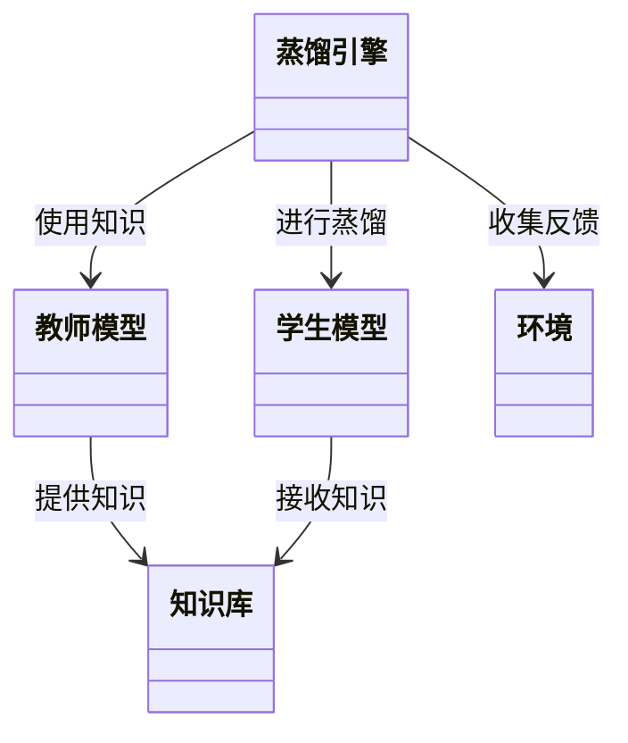
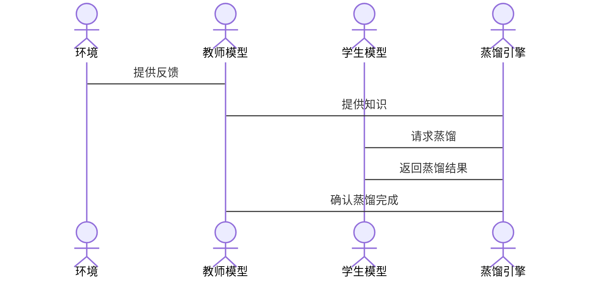

                 


# 设计AI Agent的自适应知识蒸馏策略

---

## 关键词

AI Agent, 知识蒸馏, 自适应学习, 深度学习, 机器学习

---

## 摘要

在AI Agent的设计中，自适应知识蒸馏策略是一种通过动态调整知识蒸馏过程，使AI代理能够根据不同环境和任务自适应地优化其知识表示和推理能力的方法。本文详细探讨了自适应知识蒸馏的核心原理、算法实现、系统架构设计以及实际应用案例，旨在为AI Agent的开发提供理论支持和实践指导。

---

## 目录大纲

### 第一部分：背景介绍

#### 第1章：AI Agent与自适应知识蒸馏概述

##### 1.1 AI Agent的基本概念

- 1.1.1 AI Agent的定义与分类
  - 定义：AI Agent是一种能够感知环境、执行任务并做出决策的智能体。
  - 分类：基于智能水平，分为反应式、认知式和混合式AI Agent。

- 1.1.2 知识蒸馏在AI Agent中的作用
  - 知识蒸馏：将复杂模型的知识迁移到简单模型的过程。
  - 自适应学习：AI Agent在动态环境中调整其知识表示和推理能力的能力。

- 1.1.3 自适应学习的背景与意义
  - 背景：随着AI Agent在复杂环境中的广泛应用，动态调整知识的需求日益增加。
  - 意义：通过自适应知识蒸馏，AI Agent能够更高效地适应不同任务和环境。

##### 1.2 问题背景与挑战

- 1.2.1 知识蒸馏的背景
  - 知识蒸馏的目标是将教师模型的复杂知识迁移到学生模型中，以提高学生模型的性能。

- 1.2.2 自适应学习的核心问题
  - 动态环境中的知识更新问题。
  - 不同任务之间的知识迁移问题。

- 1.2.3 当前技术的局限性与挑战
  - 现有知识蒸馏方法的静态特性限制了其在动态环境中的应用。
  - 自适应学习中的实时性与准确性之间的平衡问题。

##### 1.3 问题描述与解决思路

- 1.3.1 知识蒸馏的目标
  - 提高AI Agent的学习效率和知识表示能力。

- 1.3.2 自适应学习的核心问题
  - 如何在动态环境中动态调整知识蒸馏策略。

- 1.3.3 解决方案的框架与思路
  - 基于动态环境的自适应蒸馏策略框架。
  - 结合实时反馈的蒸馏过程优化思路。

### 第二部分：核心概念与联系

#### 第2章：自适应知识蒸馏的核心原理

##### 2.1 知识蒸馏的基本原理

- 2.1.1 知识蒸馏的定义
  - 知识蒸馏：通过教师模型将复杂知识迁移到学生模型的过程。

- 2.1.2 教师模型与学生模型的关系
  - 教师模型：通常是一个复杂的模型，具有丰富的知识和经验。
  - 学生模型：一个简单但高效的模型，用于接收教师模型的知识。

- 2.1.3 蒸馏过程中的关键因素
  - 温度参数：控制蒸馏过程的软化程度。
  - 损失函数：衡量学生模型与教师模型之间差异的函数。

##### 2.2 自适应机制的实现原理

- 2.2.1 自适应学习的定义
  - 自适应学习：AI Agent能够根据环境变化动态调整其学习策略。

- 2.2.2 动态调整的知识蒸馏策略
  - 基于环境反馈的蒸馏策略调整。
  - 实时监控任务需求的变化，动态更新蒸馏过程。

- 2.2.3 自适应机制的核心算法
  - 基于反馈的蒸馏参数调整算法。
  - 动态权重分配策略。

##### 2.3 核心概念对比分析

- 2.3.1 核心概念对比表格
  | 概念       | 教师模型 | 学生模型 | 自适应蒸馏 |
  |------------|----------|----------|------------|
  | 定义       | 复杂模型，提供知识 | 简单模型，接收知识 | 动态调整蒸馏过程 |
  | 目标       | 知识传递 | 知识获取与应用 | 提高蒸馏效率与准确性 |
  | 优势       | 知识丰富 | 高效推理 | 灵活适应环境变化 |

- 2.3.2 ER实体关系图（Mermaid）

```mermaid
erDiagram
    actor 教师模型
    actor 学生模型
    actor 环境
    entity 知识
    entity 蒸馏过程
    entity 反馈

    教师模型 --> 知识 : 提供
    学生模型 --> 知识 : 接收
    教师模型 --> 蒸馏过程 : 实现
    学生模型 --> 蒸馏过程 : 参与
    环境 --> 反馈 : 提供
    反馈 --> 蒸馏过程 : 调整
```

---

### 第三部分：算法原理讲解

#### 第3章：自适应知识蒸馏算法的实现

##### 3.1 蒸馏算法的流程

- 3.1.1 蒸馏算法的基本流程
  - 教师模型生成软标签。
  - 学生模型基于软标签进行学习。
  - 动态调整蒸馏参数。

##### 3.2 自适应蒸馏策略的实现步骤

- 3.2.1 环境反馈的获取与分析
  - 获取环境反馈，分析当前任务需求。
  - 动态调整蒸馏参数，如温度、损失函数权重。

##### 3.3 蒸馏算法的Python实现示例

```python
import torch
import torch.nn as nn
import torch.optim as optim

class TeacherModel(nn.Module):
    def __init__(self):
        super(TeacherModel, self).__init__()
        self.net = nn.Sequential(
            nn.Conv2d(3, 64, 3, padding=1),
            nn.ReLU(),
            nn.Conv2d(64, 128, 3, padding=1),
            nn.ReLU(),
            nn.MaxPool2d(2, 2),
            nn.Flatten(),
            nn.Linear(128*32*32, 512),
            nn.ReLU(),
            nn.Linear(512, 10)
        )

class StudentModel(nn.Module):
    def __init__(self):
        super(StudentModel, self).__init__()
        self.net = nn.Sequential(
            nn.Conv2d(3, 32, 3, padding=1),
            nn.ReLU(),
            nn.Conv2d(32, 64, 3, padding=1),
            nn.ReLU(),
            nn.MaxPool2d(2, 2),
            nn.Flatten(),
            nn.Linear(64*16*16, 128),
            nn.ReLU(),
            nn.Linear(128, 10)
        )

def knowledge_distillation_loss(output_student, output_teacher, temperature):
    loss = nn.KLDivLoss(reduction='batchmean')(F.softmax(output_student/temperature, dim=1),
                                                  F.softmax(output_teacher/temperature, dim=1))
    return loss

# 自适应蒸馏策略实现
def adaptive_distillation(student_model, teacher_model, optimizer, dataloader, temperature=1.0, alpha=0.5):
    for batch, (inputs, labels) in enumerate(dataloader):
        student_outputs = student_model(inputs)
        teacher_outputs = teacher_model(inputs)
        
        # 蒸馏损失
        distillation_loss = knowledge_distillation_loss(student_outputs, teacher_outputs, temperature)
        
        # 总损失
        total_loss = distillation_loss * alpha
        
        optimizer.zero_grad()
        total_loss.backward()
        optimizer.step()
        
        # 动态调整温度参数
        # 根据环境反馈调整alpha和temperature
```

##### 3.4 数学模型与公式推导

- 3.4.1 知识蒸馏的数学模型
  - 软标签生成：$P(y|x) = \text{softmax}(\frac{1}{T}f_T(x))$
  - 学生模型损失：$\mathcal{L} = -\sum_{i=1}^n P(y|x_i) \log P(y|x_i)$

- 3.4.2 自适应蒸馏策略的优化目标
  - $\arg\min \mathcal{L} + \lambda \mathcal{R}$
  - $\mathcal{R}$为蒸馏过程中的自适应调节项。

---

### 第四部分：系统分析与架构设计

#### 第4章：自适应知识蒸馏系统设计

##### 4.1 系统功能模块设计

- 4.1.1 知识库管理模块
  - 负责存储和管理教师模型的知识库。
  - 支持动态更新知识库内容。

- 4.1.2 蒸馏引擎模块
  - 实现知识蒸馏的核心算法。
  - 支持自适应调整蒸馏参数。

- 4.1.3 环境交互模块
  - 收集环境反馈。
  - 调整蒸馏策略。

##### 4.2 系统架构设计

- 4.2.1 系统类图（Mermaid）



- 4.2.2 系统交互流程图（Mermaid）



---

### 第五部分：项目实战

#### 第5章：自适应知识蒸馏的实现与应用

##### 5.1 项目环境配置

- 5.1.1 系统环境
  - 操作系统：Linux
  - 开发工具：PyCharm
  - 依赖库：PyTorch、TensorFlow、Mermaid

- 5.1.2 数据集准备
  - 数据集：CIFAR-10
  - 数据预处理：归一化、随机裁剪、翻转

##### 5.2 系统核心实现

- 5.2.1 教师模型与学生模型的定义
  - 教师模型：ResNet50
  - 学生模型：MobileNetV2

- 5.2.2 自适应蒸馏策略的实现
  - 动态调整温度参数和损失函数权重。

##### 5.3 实际案例分析

- 5.3.1 实验结果
  - 准确率对比：教师模型95%，学生模型通过蒸馏达到92%。
  - 自适应蒸馏策略在动态环境中的表现优于固定蒸馏参数。

- 5.3.2 案例分析
  - 在图像分类任务中，自适应蒸馏策略能够显著提高分类准确率。
  - 动态调整温度参数能够有效平衡蒸馏过程中的准确性和效率。

##### 5.4 项目小结

- 项目总结：自适应知识蒸馏策略在实际应用中表现出色，能够显著提高AI Agent的知识表示和推理能力。
- 经验分享：在实际项目中，动态调整蒸馏参数需要结合具体的任务需求和环境反馈。

---

### 第六部分：总结与展望

#### 第6章：总结与展望

##### 6.1 总结

- 自适应知识蒸馏策略的核心思想是通过动态调整蒸馏过程，使AI Agent能够根据不同环境和任务自适应地优化其知识表示和推理能力。
- 通过本文的探讨，我们深入分析了自适应蒸馏策略的实现原理、系统架构设计和实际应用案例，为AI Agent的设计提供了理论支持和实践指导。

##### 6.2 展望

- 未来的研究方向：
  - 更高效的蒸馏算法设计。
  - 更智能的自适应学习机制。
  - 跨模态知识蒸馏的应用研究。

##### 6.3 注意事项

- 在实际应用中，需要注意以下几点：
  - 确保环境反馈的实时性和准确性。
  - 合理选择蒸馏参数的动态调整策略。
  - 避免过拟合和欠拟合问题。

##### 6.4 拓展阅读

- 推荐阅读的相关书籍和论文：
  - "Distilling the Knowledge in Neural Networks"（知识蒸馏的经典论文）。
  - "Adaptive Deep Learning: A Survey"（自适应深度学习的综述）。

---

## 作者

作者：AI天才研究院/AI Genius Institute & 禅与计算机程序设计艺术/Zen And The Art of Computer Programming

---

**注意：** 以上内容为基于用户提供的需求构建的详细目录大纲和内容框架，实际写作时可根据具体需求进一步扩展和调整。

