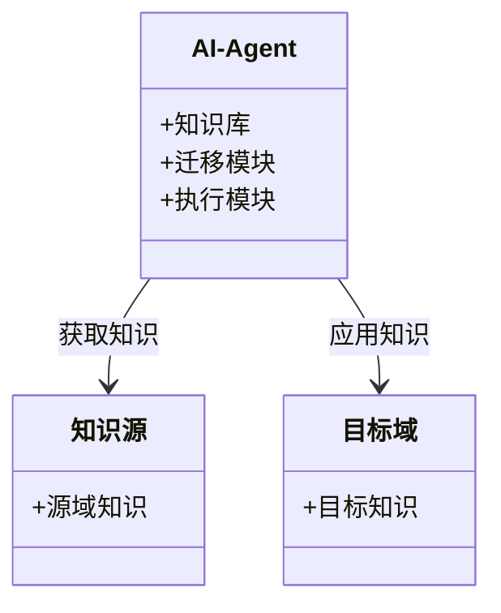
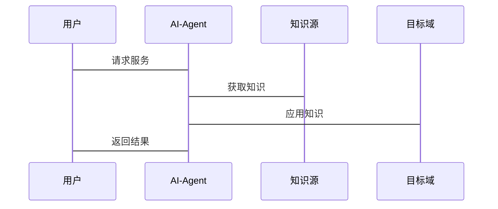

                 


# 设计AI Agent的自适应知识迁移策略

**关键词**：AI Agent，知识迁移，自适应，迁移学习，机器学习

**摘要**：  
本文详细探讨了设计AI Agent的自适应知识迁移策略的关键原理、算法实现和系统架构。通过分析知识迁移的核心概念，结合实际应用场景，提出了一种动态优化的知识迁移框架，旨在提升AI Agent在复杂动态环境中的适应能力和性能。文章从背景介绍、核心概念、算法原理、系统架构到项目实战，层层深入，为读者提供了全面的技术指导。

---

## 第一部分：AI Agent与自适应知识迁移的背景介绍

### 第1章：AI Agent的基本概念与应用场景

#### 1.1 AI Agent的定义与核心特征  
AI Agent（人工智能代理）是一种能够感知环境、执行任务并做出决策的智能系统。其核心特征包括：  
- **智能性**：能够理解、推理和学习。  
- **反应性**：能够实时感知环境并做出响应。  
- **主动性**：能够在没有外部干预的情况下自主行动。  

AI Agent广泛应用于智能助手、推荐系统、自动驾驶、机器人控制等领域。

#### 1.2 知识迁移的基本概念  
知识迁移是指将一个领域中的知识和经验应用到另一个领域的能力。其核心在于发现不同任务之间的共性和差异，并利用这些特性进行跨任务的学习和优化。

#### 1.3 自适应知识迁移的背景与问题描述  
在动态复杂的环境中，AI Agent需要能够快速适应新任务和新场景。传统的固定知识迁移策略难以应对环境的不确定性，因此，自适应知识迁移成为提升AI Agent性能的关键技术。

#### 1.4 问题解决与边界分析  
自适应知识迁移的核心问题在于如何动态调整迁移策略，以最大化目标任务的性能。其边界包括：  
- 知识迁移的适用范围。  
- 知识迁移的计算复杂度。  
- 知识迁移的适应速度。  

#### 1.5 核心概念结构与要素组成  
自适应知识迁移系统由以下几个核心要素组成：  
1. **知识源**：提供原始知识的任务或领域。  
2. **目标域**：需要知识迁移的目标任务或领域。  
3. **迁移策略**：定义知识迁移的具体方法和规则。  
4. **自适应机制**：动态调整迁移策略的模块。  

---

## 第二部分：自适应知识迁移的核心概念与联系

### 第2章：自适应知识迁移的原理与模型

#### 2.1 自适应知识迁移的原理  
自适应知识迁移通过以下步骤实现：  
1. **知识表示**：将知识转化为可计算的形式（如向量、概率分布等）。  
2. **知识适应**：根据目标域的需求调整知识表示。  
3. **迁移策略优化**：通过反馈机制动态调整迁移策略。  

#### 2.2 核心概念对比分析  

| 对比维度         | 知识迁移           | 自适应知识迁移         |
|------------------|------------------|-----------------------|
| 是否动态调整     | 静态             | 动态                   |
| 适应速度         | 较慢             | 较快                   |
| 适用场景         | 固定场景           | 动态变化场景             |

#### 2.3 ER实体关系图  
```mermaid
er
actor: 用户
migration_strategy: 迁移策略
knowledge_source: 知识源
target_domain: 目标域
```

---

## 第三部分：自适应知识迁移的算法原理

### 第3章：自适应知识迁移的算法模型

#### 3.1 迁移损失函数  
迁移损失函数用于衡量迁移过程中的信息损失。其数学表达式为：  
$$ L_{\text{迁移}} = \alpha L_{\text{源域}} + \beta L_{\text{目标域}} $$  
其中，$\alpha$ 和 $\beta$ 是权重系数，$L_{\text{源域}}$ 和 $L_{\text{目标域}}$ 分别是源域和目标域的损失函数。

#### 3.2 迁移策略选择算法  

```mermaid
graph TD
    A[开始] -> B[选择源域任务]
    B -> C[选择目标域任务]
    C -> D[计算迁移损失]
    D -> E[调整迁移策略]
    E -> F[结束]
```

---

## 第四部分：系统架构与实现

### 第4章：系统架构设计

#### 4.1 问题场景介绍  
以智能助手为例，目标是在不同用户之间动态迁移知识，提升个性化服务的效率。

#### 4.2 系统功能设计  



#### 4.3 接口设计与交互  



---

## 第五部分：项目实战

### 第5章：环境安装与核心实现

#### 5.1 环境安装  
- 安装Python 3.8+  
- 安装深度学习框架（如TensorFlow、PyTorch）  

#### 5.2 核心代码实现  

```python
def adaptive_knowledge_migration(source_task, target_task):
    # 计算迁移损失
    loss = compute_loss(source_task, target_task)
    # 调整迁移策略
    update_strategy(loss)
    # 返回优化后的知识
    return optimized_knowledge
```

---

## 第六部分：总结与展望

### 第6章：总结与最佳实践

#### 6.1 核心小结  
自适应知识迁移通过动态调整策略，显著提升了AI Agent的适应能力和性能。其关键在于知识表示、迁移损失计算和策略优化。

#### 6.2 最佳实践Tips  
- 确保知识表示的可迁移性。  
- 定期评估迁移效果并优化策略。  

#### 6.3 注意事项  
- 避免过度优化导致的计算开销过大。  
- 注意目标域的分布偏移问题。  

#### 6.4 拓展阅读  
推荐阅读《迁移学习》（《Transfer Learning》）相关书籍和论文。

---

**作者**：AI天才研究院/AI Genius Institute & 禅与计算机程序设计艺术/Zen And The Art of Computer Programming

