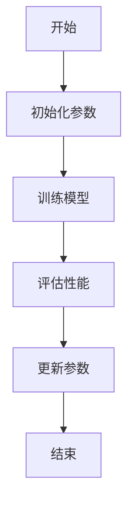
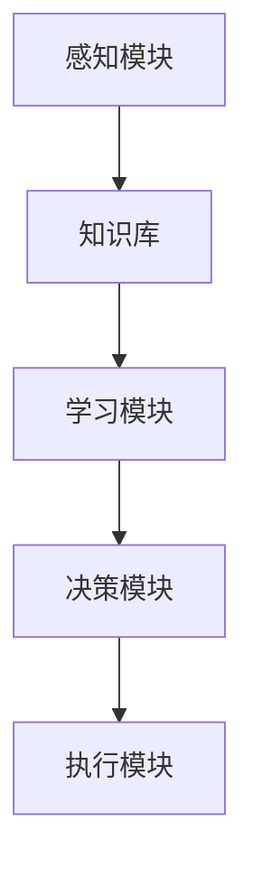

                 


# 设计AI Agent的自适应终身学习策略

## 关键词
AI Agent, 自适应学习, 终身学习, 强化学习, 知识图谱

## 摘要
随着人工智能技术的快速发展，AI Agent需要具备在动态环境中持续学习和适应新任务的能力。本文探讨了设计AI Agent自适应终身学习策略的核心概念、算法原理、系统架构及项目实战，通过详细分析和案例展示，为AI Agent的持续进化提供可行的解决方案。

---

# 第一部分: AI Agent的自适应终身学习背景与基础

## 第1章: AI Agent与自适应学习概述

### 1.1 AI Agent的基本概念
#### 1.1.1 AI Agent的定义
AI Agent是一种智能实体，能够感知环境、自主决策并执行任务，具备学习、推理和自适应能力。

#### 1.1.2 AI Agent的核心特征
- **自主性**：无需外部干预，自主决策。
- **反应性**：能实时感知环境变化并做出响应。
- **学习能力**：通过经验改进性能。

#### 1.1.3 自适应学习的必要性
AI Agent需要在动态环境中不断更新知识和策略，以应对新任务和挑战。

### 1.2 终身学习的背景与意义
#### 1.2.1 知识更新的挑战
知识的有效期缩短，AI Agent需要持续学习以保持竞争力。

#### 1.2.2 环境动态变化的应对
环境的不确定性要求AI Agent具备灵活的学习和适应能力。

#### 1.2.3 终身学习的定义与目标
终身学习指AI Agent在执行任务过程中，不断优化知识和策略，以应对复杂变化。

### 1.3 自适应学习的核心要素
#### 1.3.1 知识表示与推理
知识图谱构建与推理是自适应学习的基础，通过图结构表示知识，并支持推理。

#### 1.3.2 动态环境感知
AI Agent需要实时感知环境变化，如新的数据流或任务需求。

#### 1.3.3 学习策略优化
通过强化学习优化学习策略，提升学习效率和效果。

### 1.4 本章小结
本章介绍了AI Agent的基本概念，自适应学习的重要性，并提出了终身学习的核心要素。

---

## 第2章: 自适应学习机制

### 2.1 知识表示与更新机制
#### 2.1.1 知识图谱的构建
知识图谱是一种结构化的知识表示方式，通过节点和边表示实体及其关系。

#### 2.1.2 知识的动态更新
在动态环境中，知识图谱需要实时更新，以反映最新信息。

#### 2.1.3 知识表示的可解释性
知识图谱的可解释性是自适应学习的重要特性，便于人类理解和干预。

### 2.2 基于强化学习的自适应策略
#### 2.2.1 强化学习的基本原理
强化学习通过试错机制，学习最优策略，适用于动态环境中的决策问题。

#### 2.2.2 自适应策略的构建
结合知识图谱和强化学习，构建动态环境中的自适应策略。

#### 2.2.3 策略优化的数学模型
策略优化的目标函数如下：
$$ J(\theta) = \mathbb{E}_{\tau \sim \pi_\theta} [\sum_{t} r_t] $$
其中，$\theta$是策略参数，$\tau$是轨迹，$r_t$是奖励。

### 2.3 元学习与迁移学习
#### 2.3.1 元学习的定义与特点
元学习通过快速适应新任务，适用于小样本学习场景。

#### 2.3.2 迁移学习的原理
迁移学习将已知任务的知识迁移到新任务，提升学习效率。

#### 2.3.3 元学习与迁移学习的结合
结合元学习和迁移学习，提升AI Agent在新任务中的适应能力。

### 2.4 算法流程图


### 2.5 本章小结
本章详细介绍了自适应学习的机制，包括知识表示、强化学习策略和元学习的应用。

---

## 第3章: 自适应学习的数学模型与公式

### 3.1 知识更新的数学模型
#### 3.1.1 知识表示的向量空间模型
向量空间模型用于表示知识图谱中的实体和关系，如下：
$$ v_i = [w_1, w_2, ..., w_n] $$
其中，$v_i$表示第$i$个实体的向量。

#### 3.1.2 知识更新的公式
知识更新通过增量学习实现：
$$ v_i^{new} = v_i^{old} + \Delta v_i $$

### 3.2 基于强化学习

#### 3.2.1 强化学习的目标函数
强化学习的目标是最大化累积奖励：
$$ J(\theta) = \mathbb{E}_{\tau \sim \pi_\theta} [\sum_{t} r_t] $$

#### 3.2.2 策略更新的数学表达
策略梯度方法用于更新参数：
$$ \theta_{t+1} = \theta_t + \alpha \nabla_\theta J(\theta_t) $$

---

# 第四部分: 项目实战与案例分析

## 第4章: 项目实战

### 4.1 项目背景与需求分析
项目目标是设计一个具备自适应终身学习能力的AI Agent，应用于智能客服领域。

### 4.2 系统架构设计

#### 4.2.1 系统功能设计
系统包括感知模块、学习模块和决策模块。

#### 4.2.2 系统架构图


### 4.3 核心代码实现
#### 4.3.1 知识图谱构建
使用图嵌入方法构建知识图谱：
```python
import networkx as nx
G = nx.DiGraph()
G.add_nodes_from(["User", "Query", "Response"])
G.add_edges_from([("User", "Query"), ("Query", "Response")])
```

#### 4.3.2 策略优化
实现强化学习算法：
```python
import numpy as np
class Agent:
    def __init__(self, state_space, action_space):
        self.theta = np.random.randn(state_space, action_space)
    
    def act(self, state):
        return np.argmax(state.dot(self.theta))
    
    def update(self, state, action, reward):
        self.theta[state] += reward * action
```

### 4.4 项目小结
本章通过项目实战，展示了如何设计和实现具备自适应终身学习能力的AI Agent。

---

## 第五部分: 最佳实践与总结

## 第5章: 最佳实践

### 5.1 设计原则
- **模块化设计**：确保系统各模块独立可扩展。
- **持续优化**：定期更新模型和策略。
- **可解释性**：便于调试和改进。

### 5.2 实现技巧
- 使用高效的图嵌入方法构建知识图谱。
- 结合强化学习和迁移学习提升适应能力。

### 5.3 性能优化
- 通过分布式计算加速模型训练。
- 优化算法复杂度，降低计算成本。

### 5.4 安全性与伦理
- 避免模型滥用，确保数据隐私。
- 设计公平的奖励机制，防止策略偏差。

### 5.5 未来趋势
- 结合大语言模型提升学习能力。
- 在多模态环境下应用自适应学习。

### 5.6 本章小结
本章总结了设计AI Agent自适应终身学习策略的最佳实践，并展望了未来的发展方向。

---

# 作者
作者：AI天才研究院 & 禅与计算机程序设计艺术

---

通过以上内容，文章详细探讨了设计AI Agent自适应终身学习策略的各个方面，从理论到实践，为读者提供了全面的指导和深入的分析。

