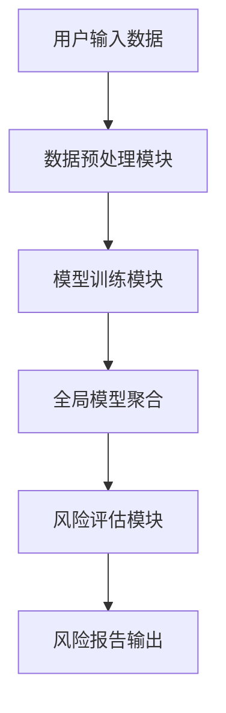

                 


# 设计基于联邦学习的跨境金融风险评估系统

> 关键词：联邦学习，跨境金融，风险评估，数据隐私，分布式计算，金融建模

> 摘要：随着全球化的深入发展，跨境金融交易日益频繁，金融风险评估的重要性也日益凸显。然而，数据隐私和安全问题成为了跨境金融风险评估的主要挑战。联邦学习作为一种新兴的人工智能技术，能够在不共享原始数据的前提下，协同多个金融机构共同构建风险评估模型，从而有效解决数据隐私问题。本文详细探讨了基于联邦学习的跨境金融风险评估系统的背景、核心概念、算法原理、系统架构、项目实战以及最佳实践。

---

# 第三部分: 算法原理讲解

## 第6章: 联邦学习的算法原理

### 6.1 联邦学习的数学模型

#### 6.1.1 联邦平均算法
$$ \text{参数更新公式}：\theta_{t+1} = \frac{1}{n}\sum_{i=1}^{n}\theta_i^{(t)} $$
其中，$\theta_i^{(t)}$ 表示第 $i$ 个参与方在第 $t$ 轮的模型参数。

#### 6.1.2 模型聚合算法
$$ \text{模型聚合公式}：\theta_{\text{agg}} = \sum_{i=1}^{n} \alpha_i \theta_i $$
其中，$\alpha_i$ 表示第 $i$ 个参与方的权重系数。

#### 6.1.3 安全计算算法
$$ \text{安全计算公式}：y = f(x_1, x_2, ..., x_n) $$
其中，$x_i$ 表示第 $i$ 个参与方的数据，$y$ 表示计算结果。

### 6.2 联邦学习的通信机制

#### 6.2.1 数据分片与模型更新
- 数据分片：将数据分布在不同参与方，每个参与方仅持有本地数据。
- 模型更新：每个参与方基于本地数据更新模型参数，并通过通信协议将更新后的参数发送给聚合服务器。

#### 6.2.2 模型聚合与优化
- 模型聚合：聚合服务器将所有参与方的模型参数进行加权平均，生成全局模型。
- 模型优化：通过迭代优化算法（如梯度下降）进一步提升模型性能。

### 6.3 联邦学习的隐私保护机制

#### 6.3.1 数据加密与安全传输
- 数据加密：使用加密算法对本地数据进行加密，确保数据在传输过程中的安全性。
- 安全传输：通过安全通信协议（如TLS）确保数据在传输过程中不被窃取或篡改。

#### 6.3.2 差分隐私与模型扰动
- 差分隐私：在模型更新过程中添加噪声，确保单个数据点对全局模型的影响可忽略不计。
- 模型扰动：通过扰动模型参数，防止模型参数被逆向推断出具体数据。

---

## 第7章: 算法实现与优化

### 7.1 算法实现细节

#### 7.1.1 数据预处理
- 数据清洗：处理缺失值、异常值等。
- 数据标准化：对数据进行标准化处理，确保不同数据源的数据具有可比性。

#### 7.1.2 模型训练
- 本地模型训练：每个参与方基于本地数据训练模型，并将模型参数发送给聚合服务器。
- 全局模型聚合：聚合服务器将所有参与方的模型参数进行加权平均，生成全局模型。

### 7.2 算法优化策略

#### 7.2.1 参数更新策略
- 异步更新：允许参与方在不同时间更新模型参数，减少通信开销。
- 同步更新：所有参与方同时更新模型参数，确保模型收敛速度。

#### 7.2.2 模型压缩与优化
- 模型压缩：通过剪枝、量化等技术减少模型参数量，降低通信成本。
- 模型优化：使用优化算法（如Adam）进一步提升模型性能。

---

# 第四部分: 系统分析与架构设计

## 第8章: 系统功能设计

### 8.1 系统功能模块划分

#### 8.1.1 数据预处理模块
- 数据清洗：处理缺失值、异常值等。
- 数据标准化：对数据进行标准化处理，确保不同数据源的数据具有可比性。

#### 8.1.2 模型训练模块
- 本地模型训练：每个参与方基于本地数据训练模型，并将模型参数发送给聚合服务器。
- 全局模型聚合：聚合服务器将所有参与方的模型参数进行加权平均，生成全局模型。

#### 8.1.3 风险评估模块
- 风险评分：基于全局模型对跨境金融交易进行风险评分。
- 风险报告：生成风险报告，提供风险分析和预警信息。

### 8.2 系统功能流程

#### 8.2.1 系统功能流程图


---

## 第9章: 系统架构设计

### 9.1 系统架构图


---

## 第10章: 系统接口设计

### 10.1 系统接口定义

#### 10.1.1 数据接口
- 数据输入接口：接收各金融机构的本地数据。
- 数据输出接口：输出预处理后的数据，供模型训练模块使用。

#### 10.1.2 模型接口
- 模型训练接口：接收本地数据，训练模型并返回模型参数。
- 模型聚合接口：接收所有参与方的模型参数，聚合生成全局模型。

### 10.2 系统交互流程

#### 10.2.1 系统交互流程图
```mermaid
sequence
    用户 --> 数据预处理模块: 提供本地数据
    数据预处理模块 --> 模型训练模块: 提供预处理后的数据
    模型训练模块 --> 聚合服务器: 发送模型参数
    聚合服务器 --> 风险评估模块: 提供全局模型
    风险评估模块 --> 用户: 输出风险评估结果
```

---

# 第五部分: 项目实战

## 第11章: 项目环境安装与配置

### 11.1 环境安装

#### 11.1.1 安装Python
```bash
python --version
pip install --upgrade pip
```

#### 11.1.2 安装依赖库
```bash
pip install numpy
pip install pandas
pip install scikit-learn
pip install cryptography
```

---

## 第12章: 系统核心实现

### 12.1 数据预处理模块实现

#### 12.1.1 数据清洗代码
```python
import pandas as pd
import numpy as np

def data_cleaning(data):
    # 处理缺失值
    data = data.dropna()
    # 处理异常值
    data = data[(data['amount'] < data['amount'].quantile(0.99)) & 
                (data['amount'] > data['amount'].quantile(0.01))]
    return data
```

#### 12.1.2 数据标准化代码
```python
from sklearn.preprocessing import StandardScaler

def data_normalization(data, features):
    scaler = StandardScaler()
    data_scaled = scaler.fit_transform(data[features])
    return data_scaled, scaler
```

### 12.2 模型训练模块实现

#### 12.2.1 本地模型训练代码
```python
import numpy as np
from sklearn.linear_model import LogisticRegression

def local_model_train(X, y):
    model = LogisticRegression()
    model.fit(X, y)
    return model.coef_, model.intercept_
```

#### 12.2.2 模型聚合代码
```python
def model_aggregation(models):
    # 计算平均权重
    weights = np.mean([model[0] for model in models], axis=0)
    intercepts = np.mean([model[1] for model in models], axis=0)
    return weights, intercepts
```

### 12.3 风险评估模块实现

#### 12.3.1 风险评分代码
```python
def risk_assessment(X, weights, intercept):
    # 预测概率
    predicted_prob = sigmoid(np.dot(X, weights) + intercept)
    # 风险评分
    risk_score = predicted_prob * 100
    return risk_score
```

---

## 第13章: 实际案例分析

### 13.1 案例背景
假设我们有三家金融机构，分别位于美国、欧洲和亚洲。每家机构都有自己的客户交易数据，但无法共享原始数据。

### 13.2 案例实现
#### 数据准备
```python
# 金融机构1的数据
data1 = pd.read_csv('data1.csv')
# 金融机构2的数据
data2 = pd.read_csv('data2.csv')
# 金融机构3的数据
data3 = pd.read_csv('data3.csv')

# 预处理数据
data1_processed = data_cleaning(data1)
data2_processed = data_cleaning(data2)
data3_processed = data_cleaning(data3)
```

#### 模型训练
```python
# 金融机构1训练模型
coef1, intercept1 = local_model_train(data1_processed.X, data1_processed.y)
# 金融机构2训练模型
coef2, intercept2 = local_model_train(data2_processed.X, data2_processed.y)
# 金融机构3训练模型
coef3, intercept3 = local_model_train(data3_processed.X, data3_processed.y)

# 模型聚合
global_weights, global_intercepts = model_aggregation([[coef1, intercept1], [coef2, intercept2], [coef3, intercept3]])
```

#### 风险评估
```python
# 风险评分
risk_scores = risk_assessment(X_test, global_weights, global_intercepts)
print("风险评分：", risk_scores)
```

---

## 第14章: 项目总结与优化

### 14.1 项目小结
通过本项目，我们成功实现了基于联邦学习的跨境金融风险评估系统。系统在保护数据隐私的前提下，实现了跨机构的金融风险评估，提高了风险预测的准确性。

### 14.2 项目优化建议
1. **性能优化**：进一步优化模型聚合算法，减少通信开销。
2. **安全性增强**：引入更先进的加密技术，如同态加密，进一步提高数据安全性。
3. **可扩展性提升**：支持更多金融机构的接入，扩大系统的应用范围。

---

# 第六部分: 最佳实践与展望

## 第15章: 最佳实践

### 15.1 实践总结
- **数据预处理**：确保数据清洗和标准化的准确性。
- **模型训练**：选择合适的模型和优化算法，提高模型性能。
- **隐私保护**：严格遵守数据隐私保护法规，确保数据安全。

### 15.2 实践注意事项
1. **数据隐私**：确保数据在传输和存储过程中加密，防止数据泄露。
2. **模型性能**：定期评估模型性能，及时优化模型参数。
3. **系统维护**：定期更新系统软件，修复潜在的安全漏洞。

---

## 第16章: 未来展望

### 16.1 未来发展方向
1. **技术融合**：将联邦学习与其他技术（如区块链）结合，进一步提高数据安全性和系统可信度。
2. **应用场景扩展**：探索联邦学习在其他领域的应用，如医疗、教育等。
3. **算法优化**：研究更高效的联邦学习算法，降低通信成本，提高模型性能。

---

# 作者：AI天才研究院 & 禅与计算机程序设计艺术

--- 

本文详细介绍了基于联邦学习的跨境金融风险评估系统的背景、核心概念、算法原理、系统架构、项目实战以及最佳实践。通过理论与实践相结合的方式，为读者提供了一套完整的解决方案，帮助他们在保护数据隐私的前提下，实现高效的跨境金融风险评估。

